??? "কেনা বেচা"
    
    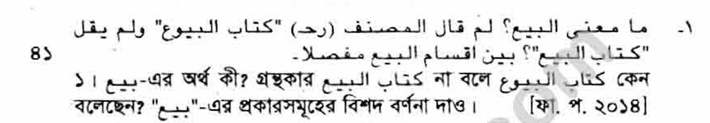
    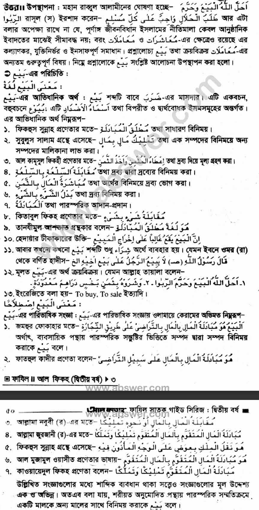
    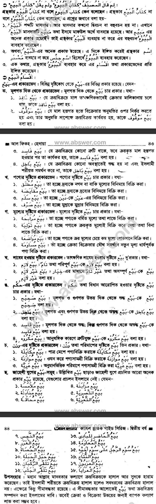
    
    ### 📝 সংক্ষিপ্ত বিবরণী (Short Meanings)

    আপনার আপলোড করা ছবির তথ্যের ভিত্তিতে প্রতিটি প্রকারের **এক কথায় অর্থ** নিচে দেওয়া হলো:

    #### ১. মূলগত দিক থেকে (Validity)

    | নাম | অর্থ |
    | :--- | :--- |
    | **বাইয়ে নাফিজ** | যা সাথে সাথে কার্যকর হয়। |
    | **বাইয়ে মওকুফ** | যা অন্যের অনুমতির অপেক্ষায় থাকে (Pending)। |
    | **বাইয়ে ফাসিদ** | যা ত্রুটিপূর্ণ, তবে পণ্য হাতে পেলে কার্যকর হয়। |
    | **বাইয়ে বাতিল** | যা ইসলামী দৃষ্টিতে সম্পূর্ণ বাতিল বা অগ্রহণযোগ্য। |

    #### ২. পণ্যের দৃষ্টিতে (Subject Matter)

    | নাম | অর্থ |
    | :--- | :--- |
    | **বাইয়ে মুতলাক** | টাকার বিনিময়ে সাধারণ পণ্য কেনা। |
    | **বাইয়ে মুকাইয়াদা** | পণ্যের বিনিময়ে পণ্য (বিনিময় প্রথা)। |
    | **বাইয়ে সালাম** | অগ্রিম টাকা দিয়ে পরে পণ্য নেওয়া (অর্ডার)। |
    | **বাইয়ে সারফ** | টাকার বিনিময়ে টাকা/ডলার কেনা (Currency Exchange)। |

    #### ৩. মূল্যের দৃষ্টিতে (Price/Profit)

    | নাম | অর্থ |
    | :--- | :--- |
    | **বাইয়ে মুরাবাহা** | কেনা দাম জানিয়ে নির্দিষ্ট লাভে বিক্রি করা। |
    | **বাইয়ে তাউলিয়া** | লাভ ছাড়া কেনা দামেই বিক্রি করা। |
    | **বাইয়ে ওয়াদিয়া** | কেনা দামের চেয়ে কমে (লস দিয়ে) বিক্রি করা। |
    | **বাইয়ে মুসাওয়ামা** | কেনা দাম গোপন রেখে দরাদরি করে বিক্রি করা। |

    #### ৪. লাযেম ও হুকুমের দৃষ্টিতে (Binding & Legal)

    | নাম | অর্থ |
    | :--- | :--- |
    | **বাইয়ে লাযিম** | চূড়ান্ত বিক্রি, ফেরত দেওয়ার সুযোগ নেই। |
    | **বাইয়ে গাইরে লাযিম** | ফেরত দেওয়ার সুযোগ আছে (Option থাকে)। |
    | **বাইয়ে সহীহ** | সব দিক থেকে সঠিক ও শুদ্ধ। |
    | **বাইয়ে মাকরূহ** | যা জায়েজ কিন্তু অপছন্দনীয়। |

    #### ৫. ওজন/পরিমাপের দৃষ্টিতে (Measurement)

    | নাম | অর্থ |
    | :--- | :--- |
    | **বাইয়ে মুকাইয়ালা** | পাত্র দিয়ে মেপে বিক্রি করা। |
    | **বাইয়ে মুওয়াজানা** | পাল্লায় ওজন করে বিক্রি করা। |
    | **বাইয়ে জুজাফ (আরিয়া)** | না মেপে অনুমানে বিক্রি করা। |

    -----

    #### 🚫 ৬. জাহেলী যুগের বাই-সমূহ (Forbidden Sales)

    বইয়ের শেষের তালিকা ও ইসলামি ফিকহ অনুযায়ী এগুলোর সংক্ষিপ্ত অর্থ:

    | নাম | সংক্ষিপ্ত অর্থ |
    | :--- | :--- |
    | **বাইয়ে মুলামাসা** (مُلَامَسَة) | ক্রেতা কাপড় **স্পর্শ করলেই** বিক্রি চূড়ান্ত বলে ধরা হতো (দেখে নেওয়ার সুযোগ দেওয়া হতো না)। |
    | **বাইয়ে মুনাবাযা** (مُنَابَذَة) | বিক্রেতা কাপড়টি ক্রেতার দিকে **ছুড়ে মারলেই** বিক্রি চূড়ান্ত বলে ধরা হতো। |
    | **বাইয়ে হাসাত** (حَصَاة) | **পাথর নিক্ষেপ** করে যা নির্দিষ্ট করা হতো, তা-ই বিক্রি বলে গণ্য হতো (লটারির মতো)। |
    | **বাইয়ে মুযাবানা** (مُزَابَنَة) | গাছে থাকা তাজা খেজুরের সাথে শুকনো খেজুরের **অনুমানভিত্তিক** বিনিময়। |
    | **বাইয়ে মুহাকালা** (مُحَاقَلَة) | শস্যক্ষেতে থাকা শস্যের সাথে পরিষ্কার শস্যের অনুমানভিত্তিক বিনিময়। |
    | **বাইয়ে নাজাস** (نَجْش) | কেনার ইচ্ছা নেই, কিন্তু অন্যকে ঠকানোর জন্য কৃত্রিমভাবে **দাম বাড়িয়ে দেওয়া** (দালালি)। |
    | **বাইয়ে হাবালুল হাবালা** | উটের পেটের বাচ্চা যখন বাচ্চা দেবে, সেই **কাল্পনিক বাচ্চার** অগ্রিম বিক্রি। |
    | **বাইয়ে তাসরিয়া** (تَصْرِيَة) | পশুকে কয়েকদিন দোহন না করে ওলান ফুলিয়ে দেখিয়ে বেশি দামে বিক্রি করা (ধোঁকাবাজি)। |
    | **বাইয়ে গারার** (غَرَر) | অনিশ্চিত কোনো কিছু বিক্রি করা (যেমন: পানির নিচের মাছ বা আকাশের পাখি)। |

??? "কেনা বেচা -02"
    
    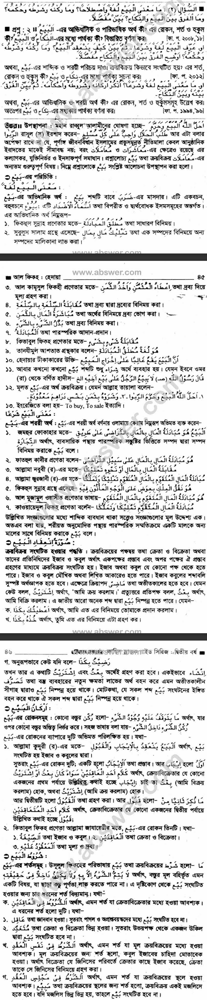
    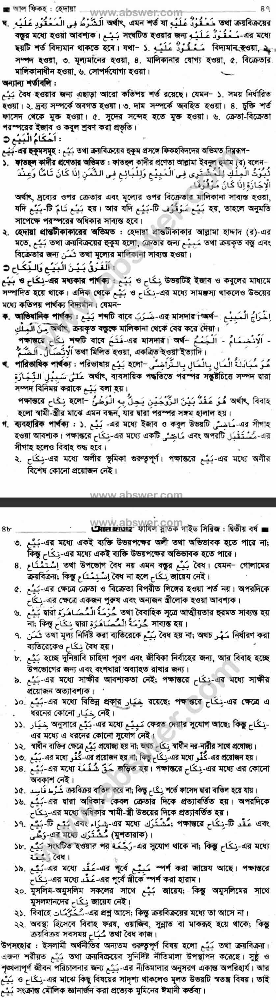
??? "কেনা বেচা -03"
    
    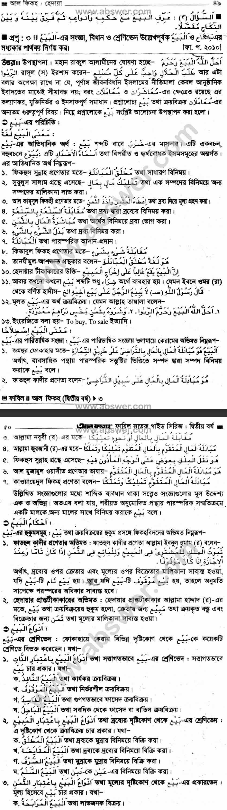
    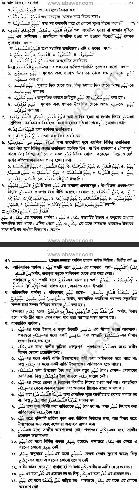
    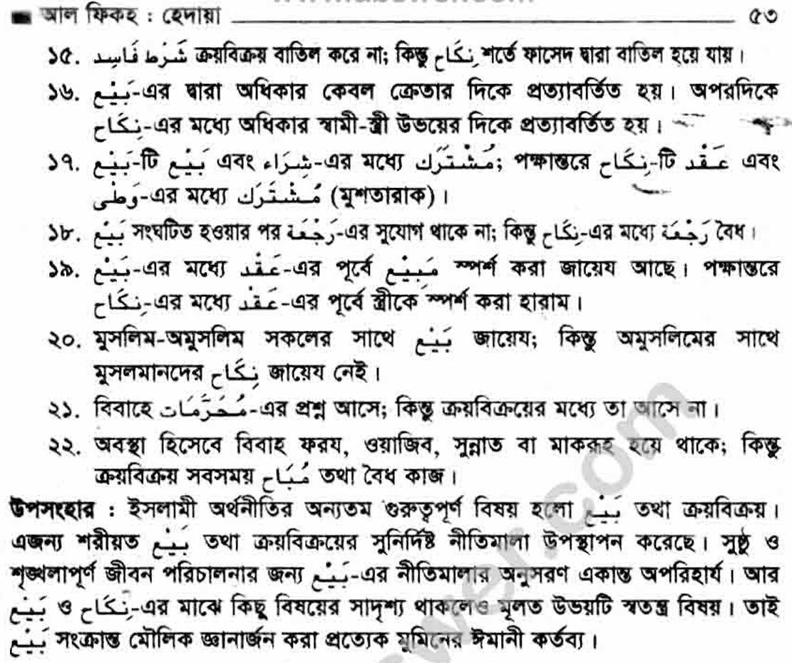

??? "খিয়ার"
    
    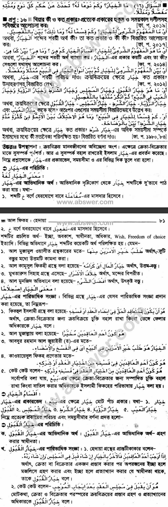
    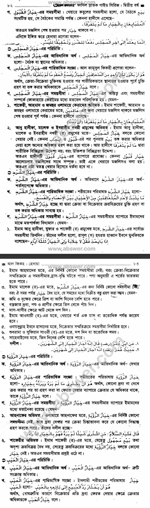
    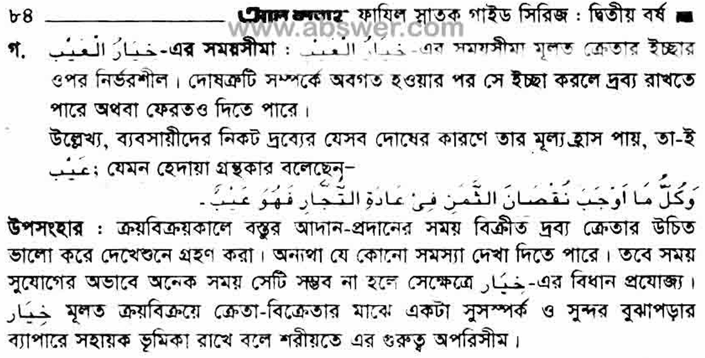

??? "বিভিন্ন প্রকার বাই"
    
    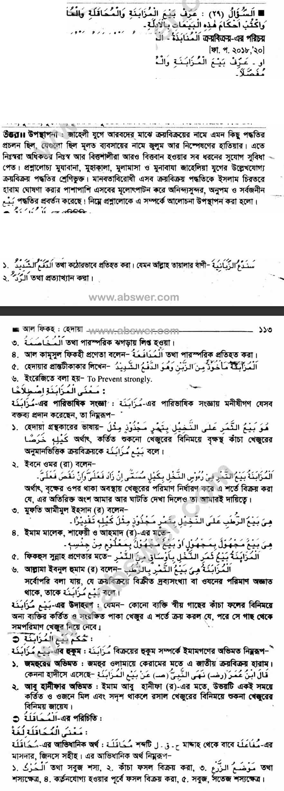
    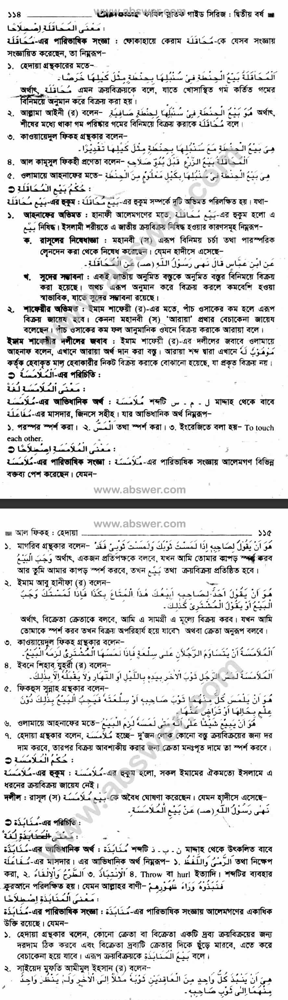
    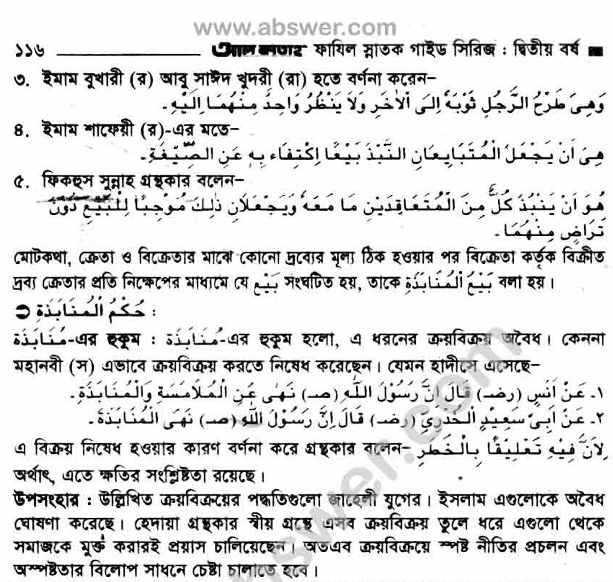

??? "Fiqh"
    
    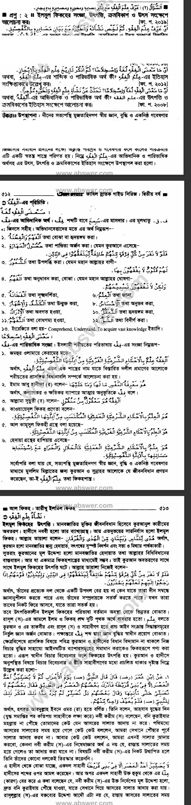
    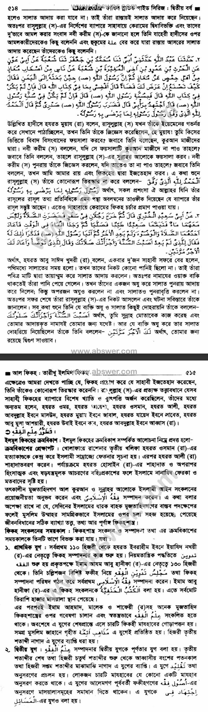
    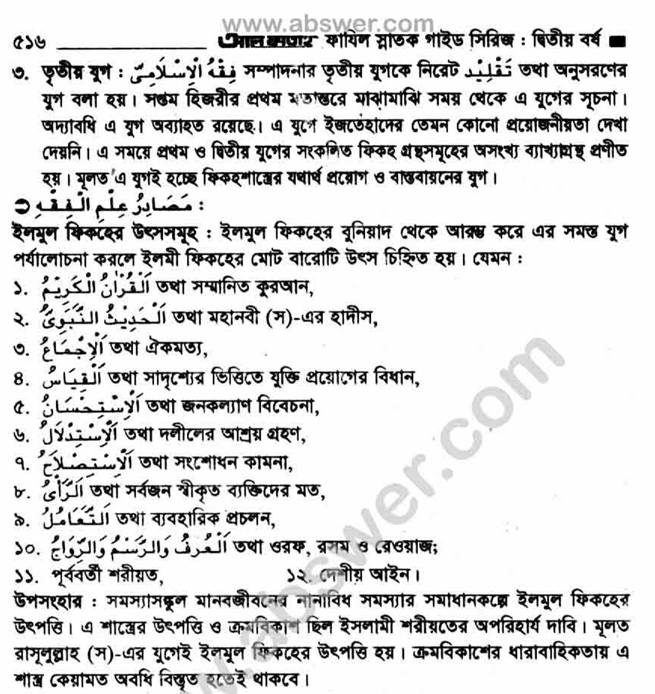
