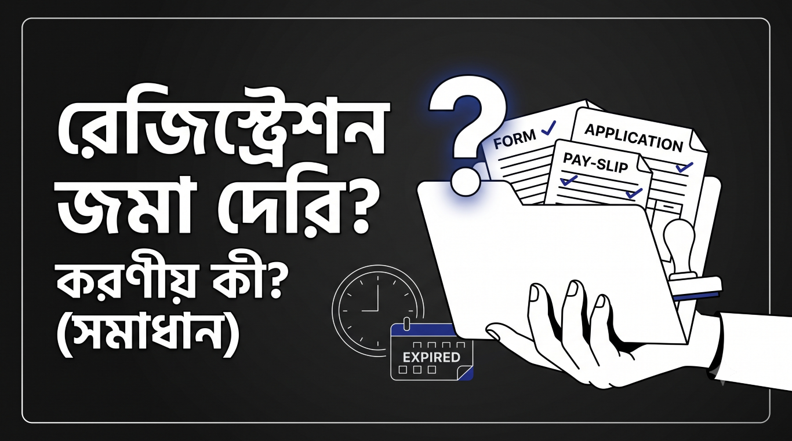

# নির্ধারিত সময়ের মধ্যে রেজিস্ট্রেশনের কাগজপত্র জমা দিতে না পারলে কী করবেন?

<!-- more -->

ধরুন, কোনো দুর্ঘটনা, শারীরিক অসুস্থতা, পারিবারিক সমস্যা বা অনিবার্য কোনো কারণে আপনি নির্ধারিত সময়ের মধ্যে রেজিস্ট্রেশনের প্রয়োজনীয় কাগজপত্র জমা দিতে পারেননি। হয়তো আপনি রেজিস্ট্রেশন ফি সময়মতো পরিশোধ করেছেন, কিন্তু রেজিস্ট্রেশন কার্ডসহ অন্যান্য প্রয়োজনীয় কাগজপত্র অফিসে জমা দেওয়া সম্ভব হয়নি।

এমন পরিস্থিতিতে কী করতে হবে, তা নিয়ে অনেক শিক্ষার্থীই বিভ্রান্ত হয়ে পড়েন। অফিসে গিয়ে বিভিন্ন ধরনের জটিলতার মুখোমুখি হওয়ার পর আমি যতটুকু বুঝতে পেরেছি, নিজের সেই অভিজ্ঞতার আলোকে পুরো প্রক্রিয়াটি বিস্তারিতভাবে তুলে ধরছি।

## প্রথমে রেজিস্ট্রেশন-সংক্রান্ত নোটিশটি ভালোভাবে পড়ুন

প্রথমেই আপনাকে রেজিস্ট্রেশন ফি জমা দেওয়ার জন্য প্রকাশিত নোটিশটি ভালোভাবে দেখতে হবে। রেজিস্ট্রেশন ফি জমা দেওয়ার আগে সাধারণত একটি ফর্ম পূরণ করতে হয়।

আমাদের ওয়েবসাইটে রেজিস্ট্রেশন ফি কীভাবে জমা দিতে হবে এবং এর আগে প্রয়োজনীয় ফর্মটি কীভাবে পূরণ করতে হবে, সে বিষয়ে বিস্তারিত নির্দেশনা দেওয়া হয়েছে। প্রয়োজন হলে সেই নির্দেশনাটি দেখে নিতে পারেন।

ফর্মটি পূরণ করার পর এর নিচে অবশ্যই আপনার স্বাক্ষর থাকতে হবে। আপনি DUET অথবা DRC—যে ক্যাম্পাসের শিক্ষার্থীই হয়ে থাকুন না কেন, প্রয়োজনীয় স্বাক্ষরসহ ফর্মটি জমা দিতে হবে। তবে তার আগে অবশ্যই নির্ধারিত রেজিস্ট্রেশন ফি পরিশোধ করে পে-স্লিপ বা অর্থ জমা দেওয়ার প্রমাণ সংগ্রহ করে রাখবেন।

## সময় পার হয়ে গেলে প্রথমে ফি পরিশোধের বিষয়টি নিশ্চিত করুন

আপনি যদি নির্ধারিত সময়ের মধ্যে অফিসে যেতে না পারেন বা কাগজপত্র জমা দিতে দেরি হয়ে যায়, তাহলে প্রথমেই রেজিস্ট্রেশন ফি পরিশোধের কাজটি সম্পন্ন করার চেষ্টা করুন।

এরপর কোর্স কো-অর্ডিনেটরের স্বাক্ষর ও সিলসহ পূরণ করা ফর্মটি নিয়ে অফিসে জমা দেওয়ার চেষ্টা করবেন। অফিস যদি সরাসরি আপনার কাগজপত্র গ্রহণ করে, তাহলে সেখানেই প্রক্রিয়াটি শেষ হতে পারে।

তবে অফিস যদি নির্ধারিত সময় পার হয়ে যাওয়ার কারণে কাগজপত্র গ্রহণ করতে অস্বীকৃতি জানায়, তাহলে আপনাকে ডীন বরাবর একটি আবেদন বা দরখাস্ত লিখতে হতে পারে।

## ডীন বরাবর আবেদন করার প্রক্রিয়া

আমাদের ডীন সাধারণত গাজীপুরের অফিসে বসেন। তাই প্রয়োজনীয় আবেদনপত্র ও কাগজপত্র নিয়ে আপনাকে সেখানে যেতে হতে পারে।

নিজে যাওয়া সম্ভব না হলে, বিকল্পভাবে আপনার পরিচিত কোনো বন্ধু বা সহপাঠীর মাধ্যমে আবেদনপত্রটি প্রিন্ট করে প্রয়োজনীয় কাগজপত্রসহ পাঠিয়ে দিতে পারেন। আবেদনের সঙ্গে সাধারণত নিচের কাগজগুলো সংযুক্ত রাখা ভালো—

* রেজিস্ট্রেশন ফি জমা দেওয়ার পে-স্লিপের ফটোকপি
* পূরণ করা রেজিস্ট্রেশন ফর্মের ফটোকপি
* প্রয়োজন হলে রেজিস্ট্রেশন কার্ড বা শিক্ষার্থী পরিচয়পত্রের ফটোকপি
* দেরির কারণ ব্যাখ্যা করে লেখা আবেদনপত্র
* সমস্যার সমর্থনে কোনো প্রমাণপত্র থাকলে তার ফটোকপি

ডীনের অফিসে আবেদনপত্র নিয়ে গেলে আপনাকে আবারও বলা হতে পারে যে, নির্ধারিত সময়ের মধ্যে কাগজপত্র জমা দিতে না পারার কারণ উল্লেখ করা আবেদনটিতে কোর্স কো-অর্ডিনেটরের সুপারিশ প্রয়োজন।

সে ক্ষেত্রে আবেদনপত্রটি আবার কোর্স কো-অর্ডিনেটরের কাছে নিয়ে যেতে হবে। তাঁর সিল ও স্বাক্ষর নেওয়ার পর আবেদনটি পুনরায় ডীনের অফিসে জমা দিতে হবে।

ডীনের অনুমোদন, সিল ও স্বাক্ষর পাওয়ার পর আবেদনপত্রটি সংগ্রহ করে অন্যান্য প্রয়োজনীয় কাগজপত্রের সঙ্গে সংশ্লিষ্ট অফিসে জমা দিতে হবে।

## প্রতিটি কাগজের কপি ও ছবি সংরক্ষণ করুন

পুরো প্রক্রিয়ার সবচেয়ে গুরুত্বপূর্ণ বিষয়গুলোর একটি হলো—আপনি যে কাগজই সংগ্রহ বা জমা দেন না কেন, তার অন্তত একটি ফটোকপি নিজের কাছে রাখবেন।

সম্ভব হলে প্রতিটি কাগজের পরিষ্কার ছবি মোবাইলে তুলে রাখবেন। আরও নিরাপদ থাকার জন্য ছবি এবং ফটোকপি—দুইভাবেই প্রমাণ সংরক্ষণ করা ভালো।

কারণ পরবর্তীতে অফিস থেকে আপনাকে বলা হতে পারে—

“আপনি কাগজপত্র জমা দিয়েছিলেন, তার প্রমাণ কোথায়?”

তখন আপনার কাছে যদি জমা দেওয়া ফর্ম, আবেদনপত্র, পে-স্লিপ এবং অনুমোদিত কাগজপত্রের কপি থাকে, তাহলে নিজের বক্তব্য প্রমাণ করা অনেক সহজ হবে।

কাগজ জমা দেওয়ার সময় অফিস থেকে কোনো রিসিভ কপি, স্বাক্ষর বা গ্রহণের প্রমাণ পাওয়া গেলে সেটিও অবশ্যই সংগ্রহ করে রাখবেন।

## আমার নিজের অভিজ্ঞতা

নিচে আমি আমার লেখা দরখাস্তের একটি নমুনা যুক্ত করছি। আমার একটি গ্রুপ-সংক্রান্ত সমস্যা হওয়ার কারণে নির্ধারিত সময়ের মধ্যে প্রয়োজনীয় কাগজপত্র জমা দেওয়া সম্ভব হয়নি। সেই পরিস্থিতিতে আমি যে আবেদনটি লিখেছিলাম, সেটি এখানে দিচ্ছি, যাতে একই ধরনের সমস্যায় পড়লে অন্য শিক্ষার্থীরা অন্তত একটি ধারণা নিতে পারেন।

তবে আবেদনটি হুবহু কপি না করে নিজের সমস্যা, তারিখ, শিক্ষার্থী পরিচিতি এবং দেরির প্রকৃত কারণ অনুযায়ী পরিবর্তন করে নেওয়া উচিত।

## শেষ কথা

পুরো প্রক্রিয়াটি একজন শিক্ষার্থীর জন্য সময়সাপেক্ষ ও মানসিকভাবে কষ্টকর হতে পারে। একই কাগজ নিয়ে এক অফিস থেকে অন্য অফিসে যাওয়া, বারবার স্বাক্ষর সংগ্রহ করা এবং জমা দেওয়ার প্রমাণ দেখানোর মতো বিষয়গুলো শিক্ষার্থীদের পড়াশোনার ওপর বাড়তি চাপ সৃষ্টি করে।

সরকারি অফিসগুলোর এ ধরনের প্রশাসনিক হয়রানি ও অপ্রয়োজনীয় জটিলতা কমানো গেলে শিক্ষার্থীদের জন্য পড়াশোনার পরিবেশ আরও সহজ ও সহায়ক হতো।

আশা করি, আমার এই অভিজ্ঞতা একই ধরনের সমস্যায় পড়া অন্য শিক্ষার্থীদের কিছুটা হলেও সাহায্য করবে।

ধন্যবাদ সবাইকে।

