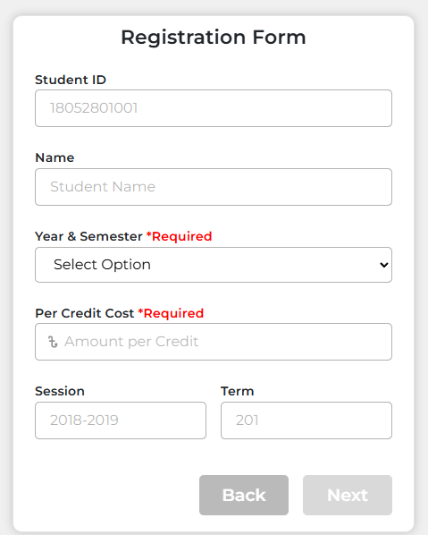
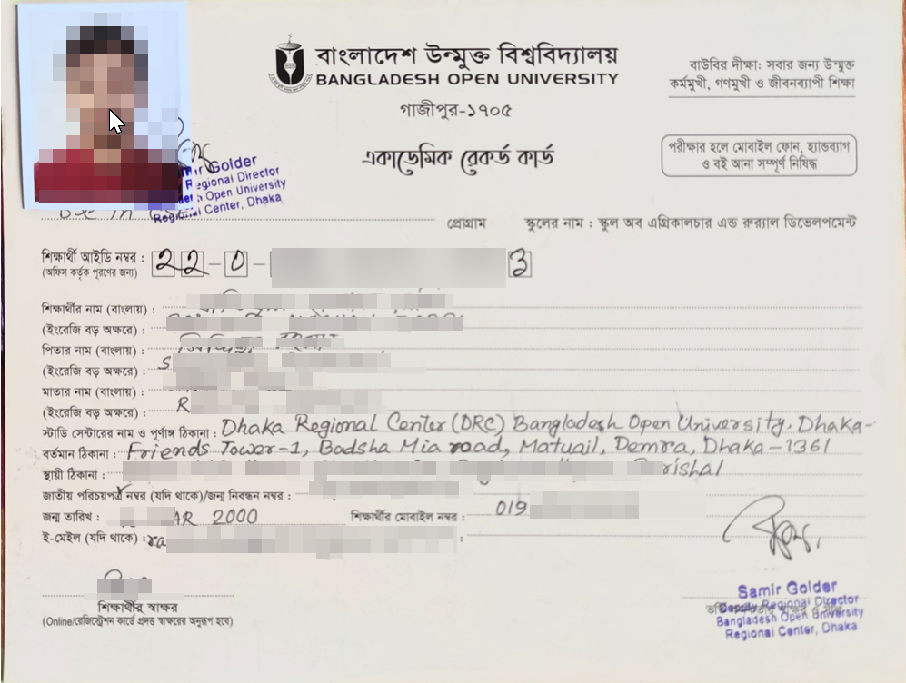
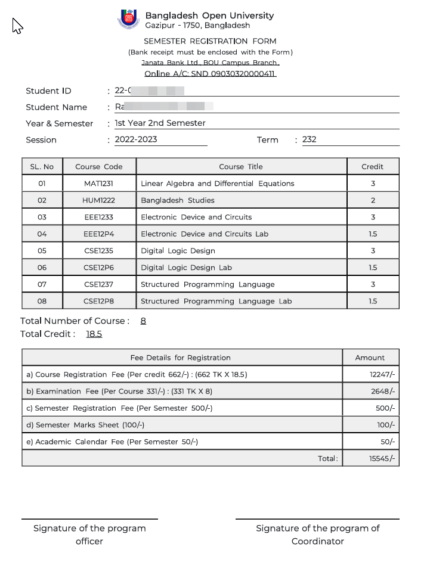
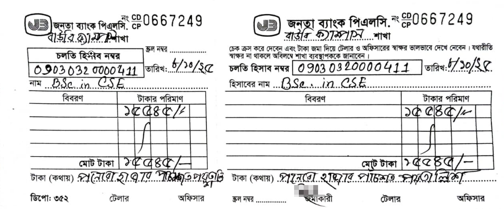
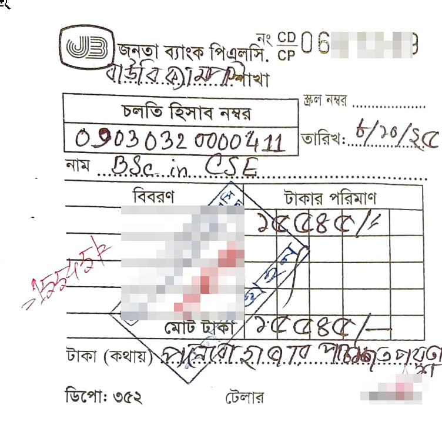

# 🎓 CSE ডিপার্টমেন্টের সেমিস্টার ফি দেওয়ার সম্পূর্ণ প্রক্রিয়া

আজকে আমরা আলোচনা করব কিভাবে আপনি **CSC (CSE) ডিপার্টমেন্টের সেমিস্টার ফি** জমা দিতে পারেন।
এই প্রক্রিয়ায় কয়েকটি ধাপ অনুসরণ করতে হয় এবং কিছু প্রয়োজনীয় ডকুমেন্ট আগে থেকেই প্রস্তুত রাখতে হয়।

---

### 🧾 ধাপ ১: ফর্ম পূরণ করা

1. [BOU SST SEMSTER FEE FORM](https://bousst.netlify.app/form) এই লিংক থেকে **Semester Enrollment Form** পূরণ করে এরপর ডাউনলোড করুন।
2. ফর্মে নিচের তথ্যগুলো সঠিকভাবে দিনঃ
    - পূর্ণ রোল নম্বর
    - সেশন
    - সেমিস্টারের টার্ম (যেমন: ৩য়, ৪র্থ ইত্যাদি)
    - সেমিস্টারের বছর (যেমন: ২০২৫)
{:height="auto" width="250px"}
3. যদি আপনি আগের সেমিস্টারে সব সাবজেক্টে পরীক্ষা দিয়ে থাকেন, তাহলে পরবর্তী সেমিস্টারে সব কোর্সে এনরোল করতে পারবেন।
4. তবে যদি কোনো কোর্সের **prerequisite** কোর্স আপনি না করে থাকেন বা পরীক্ষা না দিয়ে থাকেন, তাহলে সেই কোর্সে এনরোল করা যাবে না।

   - সেক্ষেত্রে সেই কোর্স বাদ দিয়ে বাকি অংশ পূরণ করে ফর্মটি সাবমিট করুন।

---

### 🖨️ ধাপ ২: ফর্ম প্রিন্ট ও স্বাক্ষর সংগ্রহ

1. ফর্মটি পূরণ শেষে প্রিন্ট করুন।
2. ফর্মের এক পাশে আপনার **Course Coordinator** (DUET বা DRC সেন্টার অনুযায়ী) এর সিল ও স্বাক্ষর নিতে হবে।
3. যখন ফর্মটি অন্যান্য ডকুমেন্টসহ জমা দেবেন, তখন গ্রহীতার স্বাক্ষরসহ ফর্মটি অফিসে রেখে আসবেন।

---

### 🏦 ধাপ ৩: ব্যাংকে ফি জমা দেওয়া

1. জনতা ব্যাংকের **নিউমার্কেট/ঢাকা কলেজ শাখা (College Gate Branch)** এ যান।
2. ব্যাংকে তিন রঙের চেক পাতা পাবেন — লাল, নীল ও কালো (সাদাকালো)। অবশ্যই সাদা-কালোটি ব্যবহার করতে হবে।
3. চেকের ফরম পূরণের নিয়মঃ

   - **নাম:** BSc. in CSE
   - **অ্যাকাউন্ট নম্বর:** আপনার ফর্ম বা নোটিশে উল্লেখিত অ্যাকাউন্ট নম্বরটি দিন
   - **টাকার অংক:** নোটিশে উল্লেখিত টাকার পরিমাণ লিখুন
   - সংখ্যায় টাকার অংক লেখার পর নিচে কথায় টাকার পরিমাণ লিখুন
   - শেষে স্বাক্ষর দিন

4. চেক ও টাকা ব্যাংকের “নগদ গ্রহণ” কাউন্টারে জমা দিন।
5. জমা দেওয়ার পর আপনাকে সিল ও স্বাক্ষরসহ একটি রিসিট অংশ ফেরত দেওয়া হবে।
6. চেক পাতার **একটি ফটোকপি বা ছবি** নিজের কাছে সংরক্ষণ করুন।
7. **চেকের পেছনে আপনার ফোন নম্বর ও আইডি নম্বর লিখতে ভুলবেন না।**

---

### 🪪 ধাপ ৪: একাডেমিক কার্ড ও অন্যান্য ডকুমেন্ট জমা

#### 🔹 নতুন শিক্ষার্থীদের জন্য:

1. যদি আপনি **প্রথম বর্ষ প্রথম সেমিস্টারে ভর্তি** হন —

   - অফিস থেকে আপনার **Academic Card** সংগ্রহ করতে হবে।
   - সাথে রাখবেন:

     - সব সার্টিফিকেটের **মূল কপি ও ফটোকপি**
     - এডমিট কার্ডের ছবির মতো **কয়েক কপি পাসপোর্ট সাইজ ছবি**
     - **রঙিন এডমিট কার্ড কপি**
     - নোটিশে উল্লেখিত অন্যান্য প্রয়োজনীয় কাগজপত্র

2. সাধারণত CSE ডিপার্টমেন্টের ভর্তি কার্যক্রম **দ্বিতীয় তলায়** সম্পন্ন হয়।

#### 🔹 পুরোনো শিক্ষার্থীদের জন্য:

1. যদি আপনি ইতিমধ্যে কিছু সেমিস্টার শেষ করে থাকেন —

   - আপনার **Academic Card-এর ফটোকপি**
   - ব্যাংকের চেকের কপি (পেছনে ফোন নম্বর ও আইডি নম্বরসহ)
   - প্রিন্ট করা **Enrollment Form** (ক্রেডিটসহ)
   - সবকিছু একত্রে জমা দিন

2. জমাদান স্থান সাধারণত **DRC ভবনের দ্বিতীয় তলায়**।

<kbd></kbd>

<kbd></kbd>

<kbd>{:height="auto" width="800px"}</kbd>

<kbd>{:height="auto" width="500px"}</kbd>

---

### 📞 সহায়তা

যদি কোনো বিষয়ে আপনার প্রশ্ন থাকে, তাহলে আমাদের **গ্রুপে বা সরাসরি মেসেজে** জানাতে পারেন।

---

!!! info "আমি যদি Academic Card হারিয়ে ফেলি তাহলে কী করণীয়?"

    অনেক ধরনের unofficial process আছে। তবে  official process হচ্ছে, আপনি নিকটস্থ থানায় একটা General Diary (GD) করবেন। সেটার ফটোকপি সহ অন্যান্য কাজপত্র সহ অফিসে জমা দিবেন।

!!! info "Course Coordinator এর স্বাক্ষর কীভাবে নিবো?"

    আপনি DRC বা DUET যেখানেই থাকুন না কেন। কোর্স কোঅর্ডিনেটর কোনদিন কোন ক্যাম্পাসে থাকে সেটা CR বা অফিসের কারও থেকে অথবা সরাসরি ঐ স্যারকে ফোন করে জেনে নিন। তার সীল মোহর ও স্বাক্ষর দরকার হবে।
