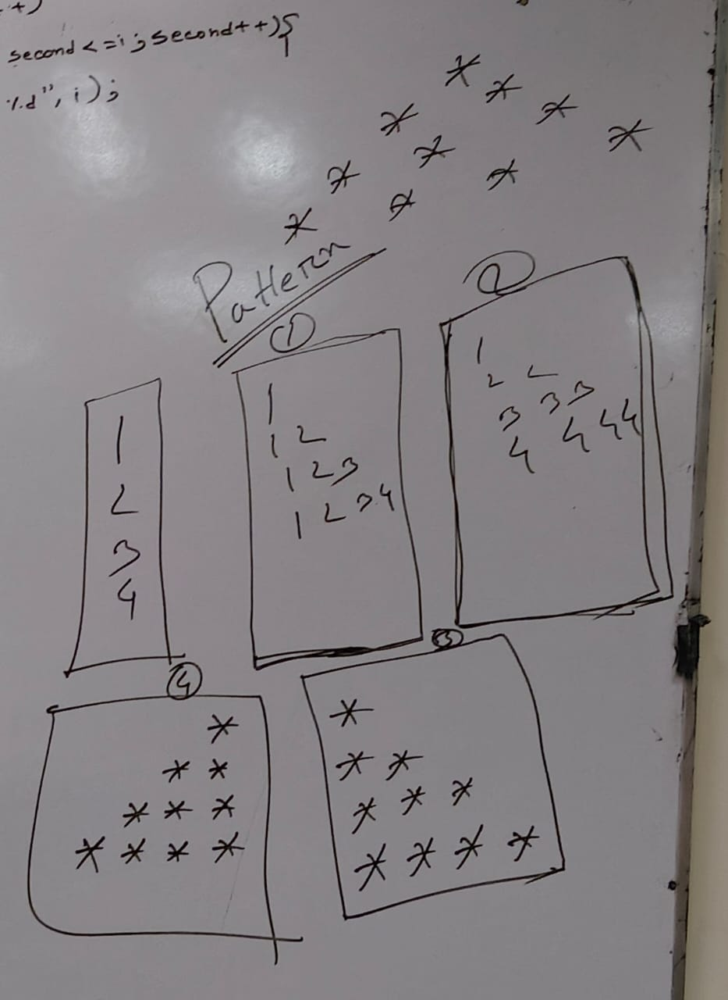

# 12 Semester Diary:

??? info "10-11 NOV  2025"

    ## **Digital Logic Design Laboratory (DLD Lab)**

    ### **Lab Examination**

    * **Date:** 14 November 2025 (Friday)
    * **Syllabus:** All laboratory experiments **except the Seven-Segment Display**
    * **Experiments to be covered:**

    1. Realization of logic gates

        * NAND → NOT, OR, AND
        * NOR → NOT, OR, AND
        * NAND → XNOR, XOR
        * NOR → XNOR, XOR
    2. Circuit design using **K-Map simplification** (Minterms and Maxterms)
    3. **Arithmetic circuits:** Half Adder, Half Subtractor, Full Adder, Full Subtractor
    4. **Combinational circuits:** 2-to-4 Decoder, 3-to-8 Decoder, Encoder

    ---

    ## **Electronic Device and Circuits Laboratory (EEE 12P4)**

    ### **Assignment 02**

    * **Submission deadline:** Mid-November 2025
    * **Topic:** *NPN-type transistor and common-base configuration*
    * **Instructions:**

    1. Draw and explain the circuit diagram of an npn-type BJT in common-base configuration.
    2. Define and discuss the input and output characteristics of a BJT.
    3. Plot the corresponding input and output characteristic curves.

    ### **Assignment 03**

    * **Submission deadline:** 29 November 2025
    * **Topic:** *Analysis of BJT operation and active region*
    * **Instructions:**

    1. Comment on why a BJT does not conduct if the emitter–base junction is not forward-biased.
    2. Identify the active region from the output characteristics and explain with an example showing signal amplification.
    3. Illustrate the **two-diode analogy** of a BJT.

    ### **Laboratory Reports**

    All students must complete and prepare **all EEE Laboratory Reports** for submission within the department’s specified timeline.

    ---

    ## **Electronic Device and Circuits Theory (EEE Theory)**

    ### **Assignment 02**

    * **Submission deadline:** Mid-November 2025
    * **Topic:** *Transistor configurations and performance comparison*
    * **Instructions:**

    1. Discuss common-emitter and common-base configurations of an npn transistor.
    2. Explain transistor operation, current gain, and voltage gain.
        Include discussion on input resistance, output resistance, and the role of the load resistor in a common-emitter amplifier.
    3. Compare the characteristics of **CB**, **CE**, and **CC** configurations.

    ---

    ## **Mathematics**

    ### **Assignment 02**

    * **Submission date:** 14 November 2025

    ### **Class Test 02**

    * **Date:** 14 November 2025

    ---

    ## **Bangladesh Studies**

    ### **Assignment 02**
    **Topic:** *Bangladesh*
    Students must write concise analytical answers covering the following aspects:
    a. Historical Background
    b. Geographical Importance
    c. Society and Its Characteristics
    d. Culture
    e. Development Aspirations

    **Submission Deadline:** Before the class test on **22 November 2025**

    ---

    ### **Assignment 03**

    **Topic:** *Economy of Bangladesh*
    Focus on:
    * Major and Key Economic Sectors
    * Government Economic Strategies and Policies

    **Submission Deadline:** Before the class test on **22 November 2025**

    ---

    ### **Class Test**
    **Date:** **22 November 2025 (Saturday)**

    **Syllabus:**
    The class test will include both **Assignment topics** and selected **historical and political events**.

    **Included Chapters:**

    1. Bangladesh (Assignments 02 and 03)
    * Historical Background
    * Geographical Importance
    * Society and Culture
    * Development Aspirations
    * Economy: Key Sectors and Government Strategy
    2. The First Independence Movement of India (1857)
    3. The Political Partition of India
    4. *Bongobhongo* (Partition of Bengal, 1905)
    5. The Partition of 1947

??? info "17-18 OCT  2025"

    🟢 EEE Theory:
    ⭐ আগামী ক্লাসে পরীক্ষা। ২ টা প্রশ্ন থাকবেঃ
    ১ম প্রশ্নের topics: (Norton's Theorem, Thevenin's Theorem, Maximum Power Transfer Theorem)
    ২য় প্রশ্নের topics: Diode থেকে - (Half Wave Rectifier, Full Wave Rectifier, Bridge Rectifier, Ripple Factor )
    প্রতিটারই Equation + Math related প্রশ্ন থাকবে।

    🟢 Math
    Linear Algebra থেকে শেষ কয়েকটা math করানো হয়েছে এবং Matrix basic আলোচনা করা হয়েছে। নোট দেয়া হয়েছে।

    🟢 DLD Lab:
    7.1: 2-4 Decoder
    7.2: 3-8 Decoder (Using two 2-4 decoder)
    এটা আগামী সপ্তাহের জন্যঃ 7.3: Encoder

    🟢 EEE Lab:
    Lab 05: Determination of Bipolar Junction Transistor (BJT) Characteristics
    https://drive.google.com/file/d/1WhcfwJOveMRmxDER7VTCHg8-jEBgNvog/view?usp=drive_link

    🟢 SPL Theory:
    For Loop দিয়ে গুণের নামতা।

    🟢 DLD Theory:
    Encoder, Multiplexer, 2-1 MUX, 8-1 MUX, 4-1 MUX, 
    1. Implementation of a 4 input multiplexer using only 2-input multiplexer, 
    2. Design a combinational circuit to implement a 4-bit Full adder-subtractor  u sing Full adder and multiplexer
    3. Design a combinational circuit that accept 3-inputs and  generates an output binary number equal to the input number plus one output. 

    🟢Bangladesh Studies:
    ব্রিটিশ শাসন শুরু থেকে শেষ করার কিছুটা বাকী।

    🟢 SPL Lab
    Loop use করে:
    Number righ-angle-triangle,
    Number  reversed righ-angle-triangle,
    Reversed righ-angle-triangle showing asterisk (*),
    { width=300px }

??? info "OCT 10-11 2025"

    🟢 এ সপ্তাহে এক্সাম হয়েছে। আগামী সপ্তাহে (18 OCT 2025) আবারও এক্সাম নেয়া হবে SPL Lab এর। সিলেবাস আগের গুলোই।

    🟢 যারা DLD Theory Assignment জমা দেননি দিয়ে দেবেন।

    🟢 এ সপ্তাহে Math assignment - 02 দেয় হয়েছে। শেষ তারিখ পরে জানিয়ে দেয়া হবে।
    [12 Math Assignment 02 232 term](https://drive.google.com/file/d/1_vHzRg_GTQTioui50UYLFbtX_5n14VMk/view?usp=drive_link)

    🟢 Bangladesh Studies স্যার এই week এ আসেননি। যারা assignment দেননি, নেক্সট সপ্তাহ পর্যন্ত জমা দিতে পারবেন।

    🟢 DLD Lab:
    ✅ 6.1: Full Adder দিয়ে circuit করে TinkerCad এ submit করতে হবে।
    ✅ 6.2: Full Subtractor দিয়ে circuit করে TinkerCad এ submit করতে হবে।

    [সকল ফাইল পেতে এই ফোল্ডার চেক করুনঃ ](https://drive.google.com/drive/folders/1-ABloqvQU3iL-2pNmk-6sPc235sZbqiB?usp=drive_link)

??? info "20 SEPT 2025"

    - ## DLD Lab:
        ✅ 5.1: Half Adder দিয়ে circuit করে TinkerCad এ submit করতে হবে।
        ✅ 5.2: Half Subtractor দিয়ে circuit করে TinkerCad এ submit করতে হবে।
    - ## DLD Theory:
        Lecture: Design of a conditional Circuit, এখানে Truth Table, KMap দিয়ে 2 টা math করানো হয়েছে  circuit সহ।
        * HW: Digital watch এর 0-9 digits গুলোর জন্য circuit একে তা simulate করতে হবে।
        - যারা DLD theory assignment জমা এখনও দেননি, আগামী সপ্তাহের মধ্যেই দিয়ে দিবেন।
    - ## EEE Lab:
        স্যার আসেননি ক্লাস হয়নি। Robin ভাই এসে rectifier দিয়ে experiment করার চেষ্টা করেছেন, যান্ত্রিক ত্রুটির কারণে সেটাও ঠিকঠাক হয়নি।
        **EEE Lab Exam**: সবাইকে বলবেন সামনের ক্লাসে ল্যাব পরীক্ষা হবে এবং full wave rectifier ভাল করে পড়াশুনা করে আসবেন এবং youtube এ oscilloscope ব্যাবহার বিধি ভাল করে শিখে আসবেন।
    - ## EEE Theory:
        * Zener diode, PNP and NPN Junction, Emitter, Collector, Base.
        * Assignment Reminder: যারা এখনও আগের assignment দেননি তারা দিয়ে দিবেন।
    - ## Bangladesh Studies:
        ### Subject: Assignment Submission
        **Topic:** *The Ancient Trade of India with Rome*
        **Length:** 2000 – 2500 words
        **Date:** 20th September
        **Deadline:** 26th September
        ### Assignment instructions:
        1. **Introduction (ভূমিকা)**
        * Topic-এর সংক্ষিপ্ত পরিচয় ও গুরুত্ব
        2. **Historical Background (ঐতিহাসিক প্রেক্ষাপট)**
        * Political context of India and Rome
        * সমসাময়িক রাজনীতি, শাসন ব্যবস্থা ও ঐতিহাসিক ঘটনা
        3. **Ancient Trade (প্রাচীন বাণিজ্য সম্পর্ক)**
        * Nature of trade (land route & sea route)
        * প্রধান বাণিজ্য কেন্দ্র ও বন্দর
        * Trade theories and historical evidence
        4. **Economical Context (অর্থনৈতিক প্রেক্ষাপট)**
        * Indo-Roman trade এর অর্থনৈতিক প্রভাব
        5. **Import–Export Analysis (আমদানি–রপ্তানি বিশ্লেষণ)**
        * **Exports from India** → Spices, textiles, pearls, ivory, silk
        * **Imports from Rome** → Wine, coral, olive oil, luxury items
        * Balance of trade discussion
        6. **Conclusion (উপসংহার)**
        **Note:** হাতে লিখতে হবে।

        !!! info "Bangladesh Studies Exam"

            **Exam Topics (Short Questions):**
            1. **History – Necessity of History**
            2. **State – Characteristics of Modern State**
            3. **Pal Era**
            4. **Sen Era**
            5. **Context of Muslim Expedition in India**
            6. **Independent Sultanate of Bengal**
            7. **Expedition of Bengal by Bakhtiar Khilji**

            📌 **Note:**
            * পরীক্ষায় শুধুমাত্র **অল্প নম্বরের Short Questions** থাকবে।
            * উপরোক্ত বিষয়গুলো থেকে প্রশ্ন করা হবে।

??? question "26-27 SEPT 2025"

    🔴আগামী ১১তারিখ SPL Exam হবে।
    Exam Topic:শুরু থেকে Loop পর্যন্ত স্যার যা পড়িয়েছেন।

    🔴SPL Theory Assignment:
    স্যার এই পর্যন্ত যা পড়িয়েছেন তার মধ্যে থেকে ১০টা Question নিজের মতো করে বানিয়ে সেগুলোর Answer তৈরি করতে হবে।
    Deadline:11 October

    🔴SPL Lab Assignment:
    এই পর্যন্ত যত টপিকের উপর ল্যাব হয়েছে তার মধ্য থেকে ১০টা প্রোগ্রাম বানিয়ে PowerPoint এ পেস্ট করতে হবে।যে প্রোগ্রাম করেছেন সেখানে যা কিছু ইউজ করেছেন তার সম্পর্কে লিখবেন(যেমন: একটা প্রোগ্রাম এ ইউজ করেছেন for loop. প্রোগ্রাম এর নিচে for loop কি কেনো ইউস করতে হয়। এছাড়া int, main যাকিছু প্রোগ্রাম এ ইউজ করবেন তার সম্পর্কে লিখবেন)। Presentation এর মতো করে করতে হবে।
    Deadline:11 October.

    🔴১১ তারিখ SPL Lab এক্সাম হবে।
    Lab Exam Topic:শুরু থেকে Loop পর্যন্ত যত টপিকের উপর ল্যাব ক্লাস হয়েছে।

---

??? "All DLD Lab Lists:"

    সবগুলো circuit solve করে TinkerCad এ submit করতে হবে।
    1.1: OR Gate
    1.2: AND Gate
    1.3: NOT Gate
    3.1: NAND -> NOT, OR, AND দিয়ে
    3.2: NOR -> NOT, OR, AND দিয়ে
    3.3: NAND -> XNOR, XOR দিয়ে
    3.3: NOR -> XNOR, XOR দিয়ে
    4 (Circuit Design with K-Map solution )
    4.1: Minterms: ∑M(1, 2, 4, 5, 7)
    4.2: Minterms: ∑M(2,3,6,7,8,10,13,15)
    4.3: Maxterms: ΠM(1, 2, 4, 5, 7)
    4.4: Maxterms: ΠM(2,3,6,7,8,10,13,15)
    5.1: Half Adder দিয়ে circuit করে TinkerCad এ submit করতে হবে।
    5.2: Half Subtractor দিয়ে circuit করে TinkerCad এ submit করতে হবে।
    6.1: Full Adder দিয়ে circuit করে TinkerCad এ submit করতে হবে।
    6.2: Full Subtractor দিয়ে circuit করে TinkerCad এ submit করতে হবে।
    7.1: 2-4 Decoder
    7.2: 3-8 Decoder (Using two 2-4 decoder)
    7.3: Encoder
