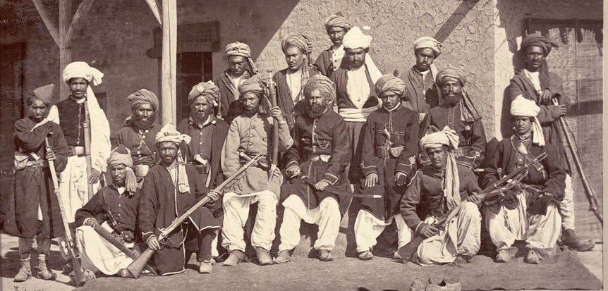
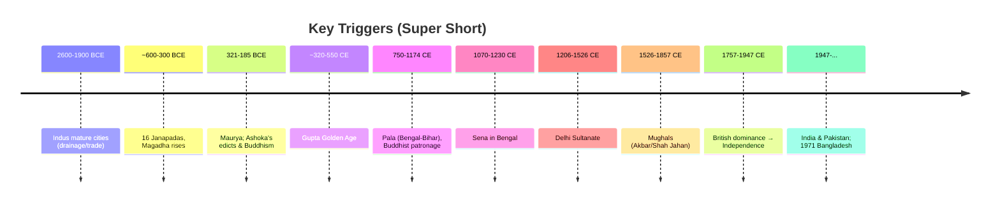
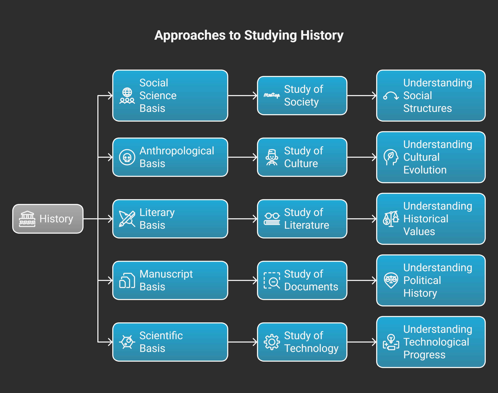

# BS - Class 01:
---


### Introduction

History is one of the oldest and most important branches of human knowledge. The word **History** comes from the Greek term *Historia*, which literally means *“inquiry” or “search for truth.”* It is the medium through which human beings investigate the past in order to gain knowledge and understanding of how societies evolved. Thus, history is not only a record of events, but also a **systematic study of truth derived from past experiences.**

In Bangla, the word **ইতিহাস** is interpreted as **ইতি + অ + আস**, which together conveys the meaning of *“that which has certainly happened and come to pass.”* Therefore, ইতিহাস refers to the **authentic, written description of social events arranged in order.**

---

### The Meaning of History

At its core, history seeks to discover:

* **Truth** → what really happened in the past.
* **Knowledge** → lessons and understanding from those events.
* **Continuity** → the link between past, present, and future.

Thus, history can be defined as:

> *“A systematic and truthful description of past human activities—social, political, economic, and cultural—arranged in chronological order, and verified through evidence.”*

---

### The Three Major Parts of History

For academic study, history is often divided into **three main dimensions**: **Politics, Economics, and Development.**

#### 1. History and Politics

Political history examines the growth of states, governments, and systems of power. Every political change arises from historical circumstances.

* For example, the **French Revolution (1789)** introduced modern ideas of democracy, liberty, and equality, reshaping European politics.
* In South Asia, the **Partition of India in 1947** created new nations, identities, and political systems that still influence today’s geopolitics.

Studying political history allows us to understand the struggles for power, freedom, justice, and governance.

---

#### 2. History and Economics

Economic life is deeply connected to history. Economic history studies production, trade, agriculture, and industrial changes over time.

* The **Industrial Revolution** in Europe transformed traditional economies into industrial ones, leading to urbanization and new social classes.
* In Bengal, colonial policies such as the **Permanent Settlement (1793)** had long-lasting effects on land ownership and rural poverty.

By studying economic history, we understand wealth distribution, labor systems, inequality, and the roots of globalization.

---

#### 3. History and Development

Development history explores how societies progress in education, health, science, and technology. It shows us how nations transform from traditional to modern structures.

* After **World War II**, Japan rebuilt itself into a modern industrial power through determined development policies.
* In Bangladesh, the **Liberation War of 1971** opened the path for independent national development, focusing on self-reliance and rebuilding society.

Thus, development history connects **past struggles** with **present progress** and guides us towards the future.

---

### Importance of Studying History

1. **Truth-Seeking:** History provides authentic and evidence-based knowledge.
2. **Guidance:** It helps societies avoid past mistakes and repeat past successes.
3. **Social Understanding:** Explains how politics, economics, and development are interconnected.
4. **Identity:** Preserves national culture, heritage, and collective memory.
5. **Future Planning:** Informs decision-makers with lessons from the past.

---

### Conclusion

In conclusion, history (*Historia / ইতিহাস*) is more than just stories of the past—it is the **systematic study of truth** about human society. The Bangla breakdown (*ইতি + অ + আস*) emphasizes that history records **what has certainly happened.** For proper understanding, history must be studied in its **three main parts: Politics, Economics, and Development.**

Politics explains power and governance, economics reveals material life and trade, and development shows long-term social progress. Together, these aspects make history a **comprehensive and living subject** that connects the past with the present and guides humanity toward the future.

---


**ইতিহাসের কাল** →
  * প্রাগৈতিহাসিক কাল
  * প্রাচীন ঐতিহাসিক কাল
  * ঐতিহাসিক কাল (খ্রিষ্ট পূর্ব ও খ্রিষ্ট পরবর্তী)

**BC = Before Christ**
**AD = Anno Domini** (Latin: *In the year of the Lord*)

---


### Historical Periods (ইতিহাসের কাল)

The study of history is divided into different **periods (কাল)** in order to understand human progress step by step. Broadly, historians classify history into three major stages:

1. **প্রাগৈতিহাসিক কাল (Prehistoric Age):**

   * The time before written records were available.
   * Knowledge comes from archaeology, fossils, cave paintings, tools, and artifacts.
   * Example: The Stone Age (Paleolithic, Mesolithic, Neolithic).

2. **প্রাচীন ঐতিহাসিক কাল (Proto-Historic Age / Early Historic Age):**

   * A transitional stage when humans began to develop scripts and records.
   * Some writings exist but are incomplete or undeciphered.
   * Example: Indus Valley Civilization, early inscriptions.

3. **ঐতিহাসিক কাল (Historic Age):**

   * The period for which **written records** exist and can be studied systematically.
   * Divided into two parts:

     * **BC (Before Christ):** All years counted backward before the birth of Jesus Christ.
     * **AD (Anno Domini):** Latin for *“In the year of the Lord”* — years counted forward after Christ’s birth.

---

### Importance of Periodization

Dividing history into these periods helps scholars and students:

* Understand the **chronological order** of human civilization.
* Study social, political, and economic changes with proper context.
* Compare the **differences between primitive, ancient, and modern societies.**

---

# 📖 The Pathans: Their Historical and Social Character

### 1. Who are the Pathans?

The **Pathans (Pashtuns)** are an ethnic group primarily inhabiting Afghanistan and the north-western regions of Pakistan. For centuries, they have been known for their strong tribal identity, warrior spirit, and resilience in the face of challenges. Historically, they entered India through the **Khyber Pass** and played important roles in the Delhi Sultanate and Mughal periods.


---

### 2. Historical Characteristics

* Pathans were often described as **fierce warriors**, resistant to outside control.
* Even during the Delhi Sultanate and Mughal rule, Afghan/Pathan chiefs were seen as difficult to govern because of their **independent tribal structure**.
* Many times, rulers tried to incorporate Pathans into administration, but their strong sense of pride and autonomy often made them resist central authority.
* Example: The **Lodi dynasty** and **Sher Shah Suri** were Afghan/Pathan rulers who showed both their capability as administrators and their toughness as fighters.

---

### 3. Social and Cultural Traits

* Pathans follow a code called **Pashtunwali**, which emphasizes honor, hospitality, and revenge.
* They are known to be **brave, proud, and straightforward** in their dealings.
* Their society is **tribal** in nature, meaning that loyalty to clan and tribe often outweighs loyalty to any central government.
* This is why even in modern times, Pathan-dominated areas (like the Afghanistan–Pakistan border) are considered very difficult to fully control.

---

### 4. Modern Examples

* Even today, Pathans carry this reputation for toughness and pride. For example:

  * **Shahid Afridi**, the famous Pakistani cricketer, is often highlighted as a Pathan—known for his bold, aggressive style of play, which reflects the fearless Pathan spirit.
  * Many other celebrities and leaders in Pakistan belong to Pathan backgrounds and are admired for their courage and straightforwardness.
* In popular imagination across South Asia, Pathans are still seen as **hard-working, strong, and sometimes stubborn**, but always **resilient**.

---

### 5. Why are they “hard to govern”?

* Because of their **tribal independence** and strong identity.
* Their history shows resistance to outsiders—whether Persians, Mughals, British, Soviets, or even modern governments.
* This independence is both their strength and a reason why ruling over them has always been a challenge.

---

### Conclusion

The Pathans are not only a part of India’s medieval history but also a living ethnic community with a distinct identity. They have been **warriors, rulers, and reformers**, but also **tribal, proud, and independent-minded people**. From Sher Shah Suri in history to Shahid Afridi in cricket, Pathans symbolize a community that is admired for its strength and resilience—yet recognized as a people who are never easy to dominate.

## Indian History: Routes of Entry and the Name “Hindustan”

The history of India has been shaped not only by its internal developments but also by the entry of people from outside. Geography (ভূগোল) played a decisive (নির্ণায়ক) role in this process. Certain natural passes (পাহাড়ি গিরিপথ) acted as gateways (প্রবেশদ্বার) through which traders, migrants (অভিবাসী), and conquerors (বিজেতা) entered the subcontinent (উপমহাদেশ). Among them, the most important were the **Khyber Pass** in the northwest and the **Rangoon/Arakan route** in the east.

The **Khyber Pass**, located between present-day Afghanistan and Pakistan, was the classic (প্রচলিত/প্রচীনকালের পরিচিত) route for invaders (আক্রমণকারী). From the Aryans to the Greeks, from the Shakas and Huns to the Turks, Afghans, and finally the Mughals—all used this entry. This pass was like the “main door” of the subcontinent, through which outsiders could enter the house of India. By contrast (বিপরীতে), the **Rangoon or Arakan route** connected Bengal with Burma (Myanmar) and Southeast Asia. This was not mainly an invasion route but more like a “side door” that enabled cultural (সাংস্কৃতিক) and commercial (বাণিজ্যিক) exchanges (আদান-প্রদান), allowing ideas, art forms, and communities from the east to interact with Bengal.

Through the Khyber Pass, the **Pathans (Pashtuns/Afghans)** became an important part of Indian history. They were known for their courage (সাহস), independence (স্বাধীনতা), and toughness (কঠোরতা/দৃঢ়তা). Even in medieval (মধ্যযুগীয়) times, chroniclers (ইতিহাসলেখকরা) often said that Afghans were “difficult to govern (শাসন করা কঠিন)” because of their strong tribal (গোত্রভিত্তিক) identity. An analogy (উপমা) may help: trying to rule the Pathans was like trying to keep fire inside your hand—its energy is strong but also untamable (নিয়ন্ত্রণহীন). In political history, the Pathans established the Lodi dynasty in Delhi and gave India one of its greatest rulers, Sher Shah Suri, who introduced reforms (সংস্কার) such as the Rupiya coin, the Grand Trunk Road, and efficient (কার্যকর) land revenue systems. In modern times, their reputation (খ্যাতি/ভাবমূর্তি) continues. For example, the Pakistani cricketer Shahid Afridi is often cited as embodying (অভিব্যক্ত/প্রকাশ করছে) the boldness (দুঃসাহস) and fearless (নির্ভীক) spirit associated with Pathan identity. Thus, the community’s toughness remains both a cultural trait (গুণ/বৈশিষ্ট্য) and a historical reality (বাস্তবতা).

Equally significant (সমান গুরুত্বপূর্ণ) is the origin (উৎপত্তি) of the name **Hindustan**. The word derives (উদ্ভূত) from the **Sindhu River** (the Indus). In Sanskrit, it was called Sindhu, but when Persians and Arabs came into contact (যোগাযোগে) with it, they could not pronounce (উচ্চারণ করা) the “s” sound at the beginning. Instead, they said “Hindu.” Over time, the land beyond the Sindhu became “Hind,” and its people were called “Hindus.” With the addition of the Persian suffix (প্রত্যয়) *-stan* (meaning “land”), the country became known as **Hindustan**. Writers like **Al-Biruni** in the 11th century, **Amir Khusrau** in the 13th–14th century, and **Babur** in his memoir *Baburnama* all used the term. Later, European travelers also adopted (গ্রহণ করে) it. During the Mughal period, Hindustan was in common political and cultural usage, and under the British the Latinized (ল্যাটিন-ভিত্তিক) form “India” became more widespread (বিস্তৃতভাবে প্রচলিত).

An analogy may help here: imagine a neighbor cannot pronounce your real name and keeps calling you something slightly different. With time, that nickname spreads so widely that it becomes the official name others use for you. The same happened with “Sindhu” becoming “Hindu” and then “Hindustan.”

In short, India’s history cannot be understood without these two aspects: the geographical routes that opened it to external influences and the evolving names that reflected how others perceived (দেখেছে/ভাবেছে) it. The **Khyber Pass and the Pathans** symbolize (প্রতীকী) the human movements that reshaped (পুনর্গঠন করেছে) Indian politics, while the **Sindhu River and the term Hindustan** symbolize how language and culture transformed identity. Together, they show that India’s history is not only about what happened inside the subcontinent but also about how outsiders entered, interacted, and gave new names and meanings to the land.


---

# 1) Explanation 

## Overview 

Indian Civilization timeline basically বলে দেয়—**কখন কে শাসন করলো** আর **কী পরিবর্তন হলো**। এটা জানলে পরের deep topics (culture, economy, religion, art) বুঝতে সহজ হয়। আমরা একেবারে শুরু থেকে Independence পর্যন্ত **step‑by‑step** যাবো, একদম noob‑friendly ভাবে. ✅

---

## Before We Start

!!! note

    **Goal:** Clear timeline build করা + exam‑style দ্রুত মনে রাখা।
    **Region:** “Indian subcontinent” = আজকের India + Pakistan + Bangladesh (sometimes Nepal/Sri Lanka context wise).
    **Year System:**
    - **BCE** = Before Common Era (পুরনো), **CE** = Common Era (নতুন)।
    - Approx বছর ব্যবহার করবো (± কয়েক বছর acceptable in school/college answers).
    **Boundaries (we’ll use):**
    - **Pre‑Muslim (Ancient/Classical)**: Indus → Janapadas → Maurya → Gupta → Pala → Sena (till **1204/1206 CE**).
    - **Muslim Era**: **1204/1206–1757 CE** (Delhi Sultanate + Mughals).
    - **Colonial Era**: **1757–1947 CE** (British dominance).
    - **Post‑Colonial**: **1947–present** (Partition → India & Pakistan; **1971** → Bangladesh).

    **Quick numeric picture (just to feel the scale):**

    * Indus mature phase \~ **2600–1900 BCE** ≈ **700 years**
    * Maurya **321–185 BCE** ≈ **136 years**
    * Gupta **\~320–550 CE** ≈ **230 years**
    * Mughals **1526–1857 CE** ≈ **331 years**
    * British dominance **1757–1947 CE** ≈ **190 years**

---

## 🗺️ One‑Screen Quick Summary (Table)

| Era / Dynasty           |                      Rough Years | Capital/Center (typical) | 2–3 Keywords (exam memory)              |
| ----------------------- | -------------------------------: | ------------------------ | --------------------------------------- |
| **Indus (Sindhu) Civ.** | 3300–1300 BCE (mature 2600–1900) | Harappa, Mohenjo‑Daro    | Planned city, drainage, trade           |
| **Maha Janapadas**      |                    \~600–300 BCE | Magadha strong           | 16 states, republics/monarchies         |
| **Maurya**              |                      321–185 BCE | Pataliputra              | Chandragupta, Ashoka, edicts, Buddhism  |
| **Gupta (Golden Age)**  |                     \~320–550 CE | Pataliputra/Ujjain       | Zero, decimal, Sanskrit lit., art       |
| **Pala**                |                      750–1174 CE | Bengal–Bihar             | Buddhism patrons, Nalanda/Vikramashila  |
| **Sena**                |                     1070–1230 CE | Bengal                   | Hindu revival, after Pala               |
| **Delhi Sultanate**     |                     1206–1526 CE | Delhi                    | Turko‑Afghan sultans, administration    |
| **Mughals**             |                     1526–1857 CE | Agra/Delhi               | Akbar, Persianate culture, architecture |
| **Colonial (British)**  |                     1757–1947 CE | Calcutta/Delhi           | EIC→Crown, railways, drain of wealth    |
| **Post‑Colonial**       |                     1947–present | —                        | India & Pakistan; 1971 Bangladesh       |

> ⚠️ Years are approximate, but safe for most exams.

---


## 🔀 Big Picture Flowchart (with years)

??? info "Click to view the timeline"

    ```mermaid
    flowchart TB
    A["Indus Civilization<br>3300–1300 BCE<br>Mature 2600–1900"] --> B["Maha Janapadas\n~600–300 BCE"]
    B --> C["Maurya Empire <br> 321–185 BCE"]
    C --> D["Gupta Empire<br>~320–550 CE"]
    D --> E["Pala Empire<br>750–1174 CE"]
    E --> F["Sena Dynasty<br>1070–1230 CE"]
    F --> G["Delhi Sultanate<br>1206–1526"]
    G --> H["Mughal Empire<br>1526–1857"]
    H --> I["British Colonial Rule<br>1757–1947"]
    I --> J["Post-Colonial<br>1947– <br>India • Pakistan → 1971 Bangladesh"]
    ```

**ASCII fallback:**

```
Indus → Janapadas → Maurya → Gupta → Pala → Sena → Delhi Sultanate → Mughal → British → Post‑Colonial
(3300–1300)  (~600–300)  (321–185)  (~320–550)  (750–1174)  (1070–1230)  (1206–1526)   (1526–1857) (1757–1947)  (1947– )
```

---
## Era‑by‑Era

### 1) Indus (Sindhu) Valley Civilization

* **Nature:** Highly **urban**—street grid, drainage, baked bricks.
* **Think modern example:** আজকের planned শহর (like Gulshan/Bashundhara planned roads) — Indus লোকেরা already করত! ✅
* **Two big sites:** **Harappa** & **Mohenjo‑Daro** (exam favourite).
* **Trade:** Mesopotamia পর্যন্ত trade evidence।
* **Script:** Undeciphered (still)।
* **Why it matters:** South Asia‑র earliest big urbanization।

!!! tip
    
    **Memory hack:** “H‑M‑D” → **H**arappa–**M**ohenjo‑**D**aro; **D** = **Drainage** (planned drainage মনে রাখো) 💡

---

### 2) Maha Janapadas (\~600–300 BCE)

* **Meaning:** বড় বড় **states** (monarchy + republic), মোটামুটি **16**।
* **Magadha** became strongest → later Maurya base।
* **Everyday analogy:** Bangladesh‑এ divisions/districts যেমন—multiple powerful regions ছিল।
* **Why it matters:** State formation, later empire‑building এর foundation।

---

### 3) Maurya (321–185 BCE)

* **Founders/Key:** **Chandragupta Maurya**, later **Ashoka**।
* **Ashoka:** Kalinga war পর **Buddhism** support, **rock edicts** (policy লেখা পাথরে)।
* **Admin:** Centralized bureaucracy।
* **Analogy:** Corporate HQ থেকে পুরো দেশের branch control করছে—central rules, governors।
* **Exam keyword:** “**Ashokan edicts**”, “**spread of Buddhism**”.

---

### 4) Gupta (\~320–550 CE) — **Golden Age**

* **Why ‘Golden’?** **Math:** zero, decimal; **Science/Astronomy**; **Literature** (Kalidasa); **Art**।
* **Analogy:** Smartphone era‑র মতো একটা **innovation boom**—সবখানে উন্নতি।
* **Exam line:** “Gupta period = classical achievements in science & culture.” ✅

---

### 5) Pala (750–1174 CE) → Bengal focus

* **Patronage:** **Buddhism**; universities **Nalanda, Vikramashila**।
* **Geo‑feel:** Bengal–Bihar base → trade routes, monasteries।
* **Why important:** Later **Tibetan Buddhism**‑এ impact, regional power।

---

### 6) Sena (1070–1230 CE)

* **Came after Pala** in Bengal; **Hindu revival**।
* **Transition note:** এই সময়ের শেষে **Muslim rule** শুরু (Delhi Sultanate)।

---

### 7) Muslim Era (1204/1206–1757 CE)

* **Phase‑1: Delhi Sultanate (1206–1526)**

  * Turko‑Afghan rulers (Mamluk, Khilji, Tughlaq, Sayyid, Lodi)।
  * **Admin:** iqta, land‑revenue systems; cities grow.
* **Phase‑2: Mughals (1526–1857)**

  * **Akbar** (admin/religious policy), **Shah Jahan** (Taj Mahal), **Aurangzeb**।
  * **Culture:** Persianate court culture, architecture, miniature painting।
* **Everyday analogy:** Long‑term tenants—বাড়ির decoration, rules, tax system change করেছে; নতুন fusion culture তৈরি হয়েছে।

---

### 8) Colonial Era (1757–1947 CE)

* **Start marker:** **Battle of Plassey (1757)** → British East India Company dominance।
* **Later:** 1858 থেকে **Crown rule** (after 1857 revolt)।
* **What changed:** Railways, telegraph, English education—**but** ⚠️ economic **drain of wealth**।
* **Analogy:** বাইরে থেকে আসা company first business নেয়, পরে **house rules** নিজের মতো করে—local economy suffer।

---

### 9) Post‑Colonial (1947–present)

* **1947:** Partition → **India** & **Pakistan**।
* **1971:** **Bangladesh** স্বাধীনতা (from Pakistan)।
* **Focus now:** nation‑building, constitution, development.

---

## 🧭 Micro‑Timeline (Years with key triggers)



---

## 🧯 Common Mistakes & Quick Fixes

* ❌ **Indus = Hindu civilization** বলা → **Wrong**.
  ✅ বলো: “Indus ছিল early urban culture; later Vedic‑Hindu ধারা আলাদা development।”

* ❌ **Muslim era start** ভুল (1210/1192 confused).
  ✅ Safe exam line: “**1204/1206 CE** থেকে Delhi Sultanate → Muslim era begins.”

* ❌ **Colonial = শুধু British** ভাবা।
  ✅ বলো: “Multiple European powers ছিল; **British dominated** (Plassey 1757 থেকে)।”

* ❌ **Gupta = only literature** ভাবা।
  ✅ যোগ করো: “Math (zero, decimal), astronomy, art—so it’s ‘Golden Age’।”

* ❌ **Bangladesh timeline ignore**।
  ✅ লিখো: “**1971** Bangladesh স্বাধীনতা”—Post‑Colonial sectionে add করো। ✅

---

## 🧪 Mini Examples (Easy → Medium)

**Example‑1 (Easy):**
**Q:** “Taj Mahal কোন era?”
**A:** **Mughal era** (Shah Jahan, 17th c.). ✅

**Example‑2 (Easy):**
**Q:** “‘Drainage system’ শুনলে কোন era মনে পড়বে?”
**A:** **Indus Valley** (Mohenjo‑Daro/Harappa)। ✅

**Example‑3 (Medium):**
**Q:** “Magadha dominance থেকে বড় empire কে গড়ে?”
**A:** **Maurya** (Chandragupta → Ashoka)। ✅

**Example‑4 (Medium):**
**Q:** “Railway + English education growth কিন্তু wealth drain—এটা কোন era?”
**A:** **Colonial (British)**। ✅

---

## 🧠 Memory Trick (1‑line chain)

**Si‑Ja‑Ma‑Gu‑Pa‑Se‑Su‑Mu‑Co‑Po**
(Sindhu → Janapada → Maurya → Gupta → Pala → Sena → Sultanate → Mughal → Colonial → Post‑colonial)

---

# 2) Just English — Concise, Textbook‑Style

## Overview

The Indian subcontinent’s history moves from early urban settlements to empires, Islamic polities, European colonial rule, and modern nation states. Approximate dates suffice for most exams.

## Assumptions

* Region ≈ India + Pakistan + Bangladesh.
* Boundaries: Pre‑Muslim (till 1204/1206 CE), Muslim (1204/1206–1757), Colonial (1757–1947), Post‑Colonial (1947–present; Bangladesh 1971).
* Dates are approximate.

## Snapshot Table

| Era                |                            Years | Core                                        |
| ------------------ | -------------------------------: | ------------------------------------------- |
| Indus              | 3300–1300 BCE (mature 2600–1900) | Urban planning, drainage, trade             |
| Janapadas          |                    \~600–300 BCE | 16 states; Magadha                          |
| Maurya             |                      321–185 BCE | Chandragupta; Ashoka; Buddhism; edicts      |
| Gupta              |                     \~320–550 CE | “Golden Age”: zero/decimal, literature, art |
| Pala               |                      750–1174 CE | Buddhist patronage; Nalanda                 |
| Sena               |                     1070–1230 CE | Hindu revival (Bengal)                      |
| Delhi Sultanate    |                        1206–1526 | Turko‑Afghan rule, administration           |
| Mughal             |                        1526–1857 | Akbar; architecture; Persianate culture     |
| Colonial (British) |                        1757–1947 | EIC→Crown; railways; economic drain         |
| Post‑Colonial      |                     1947–present | India & Pakistan; Bangladesh 1971           |

## Decision Flow

* **Year < 1204/1206:** Pre‑Muslim (Indus→…→Sena)
* **1204/1206–1757:** Muslim (Sultanate+Mughals)
* **1757–1947:** Colonial (British)
* **After 1947:** Post‑Colonial (India/Pakistan; Bangladesh 1971)

## Notes

* Do not equate Indus with “Hindu civilization.”
* 1757 (Plassey) is a clean colonial start marker.
* Gupta = classical achievements across math, science, literature, art.

---

# 3) Practice Set (with brief answers)

??? example "Try yourself (open to see answers)"

    **Q1.** Name two Indus cities and one signature feature.
    **A:** Harappa, Mohenjo‑Daro; planned **drainage** ✅


    **Q2.** Which era is called the “Golden Age” and why (1–2 points)?  
    **A:** **Gupta**; innovations in **mathematics** (zero/decimal), **literature** and **art** ✅

    **Q3.** Put these in order: Mughal, Maurya, British, Gupta.  
    **A:** Maurya → Gupta → Mughal → British ✅

    **Q4.** From which event do we mark British dominance?  
    **A:** **Battle of Plassey, 1757** ✅

    **Q5.** If the year is 1600 CE, which era? Give one keyword.  
    **A:** **Mughal era**; e.g., **Akbar/Jahangir**, architecture ✅

    **Q6.** Bangladesh became independent in which year, and under which broad era?  
    **A:** **1971**, **Post‑Colonial** ✅


---

## ⚠️ Final Quick Recap (Exam‑mode)

* Chain: **Indus → Janapada → Maurya → Gupta → Pala → Sena → Sultanate → Mughal → Colonial → Post‑Colonial**.
* Boundaries to memorize: **1204/1206**, **1757**, **1947**, **1971**.
* Don’t call Indus “Hindu”; Gupta = Golden Age; Plassey = British start.


---

!!! info "How is history written or collected?"


    On what basis can history be divided? Explain the different approaches of studying history (such as social, anthropological, literary, manuscript-based, and scientific) with suitable examples
    ---
    
    
    ## Answer
    History is the record of human experiences across time. To study it properly, scholars often divide it into different branches or approaches. This division is not arbitrary; it is based on the nature of sources, the method of analysis, and the kind of questions historians wish to answer. Each approach provides a unique way of understanding the past, and together they help create a fuller picture of human life and development.
    History is often divided according to time, such as ancient, medieval and modern. But time is not the only way to classify the past. Historians also divide history on the **basis of study and approach**. This means that depending on which aspect of human life we want to emphasize, history can be read and written in different ways. Such divisions make the subject richer and more comprehensive. Broadly, history can be studied from five main bases: the social science basis, the anthropological basis, the literary basis, the manuscript basis, and the scientific or technological basis.

    ### Social Science Basis
    This approach studies how people lived in groups, how society was organized, and how institutions like family, caste, class, and religion shaped daily life. Instead of focusing only on kings and battles, it looks at the conditions of ordinary people. For example, the Bhakti and Sufi movements in medieval India are studied not only as religious developments but also as social changes that challenged rigid caste divisions and brought communities closer.
    In this approach, history is considered as a branch of the social sciences. Just as sociology studies society, economics studies wealth, and political science studies power, history studied in this way examines how these aspects evolved over time. Social science history looks at the organization of family, caste, class, economy, and political institutions. For instance, the history of the caste system in India, the agrarian structure of Bengal villages, or the economic policies of the Mughal emperors are all examples of this approach. This basis helps us understand how societies were built, how they functioned, and how they changed. It shows history not merely as a series of kings and battles but as a living account of society itself.
    

    ### Anthropological Basis

    The anthropological approach borrows methods from anthropology, such as fieldwork, study of customs, rituals, and material culture, to understand ancient societies. It helps explain how human communities evolved before written records existed. For example, the study of tribal groups in central India gives clues about hunting practices, kinship systems, and oral traditions that resemble the way early humans lived thousands of years ago.
    The anthropological basis focuses on the human being as the center of study. Anthropology deals with the origin, evolution, and culture of mankind. When historians adopt this perspective, they ask: how did early humans live, what tools did they use, what customs and traditions shaped their communities, and how did cultural practices evolve across generations? This is similar to looking at a family photo album where each generation reveals changes in dress, food habits, rituals, and lifestyles. The study of prehistoric humans, the Indus Valley Civilization, tribal societies, and Aryan cultural practices fall within this division. This approach gives importance to the human story behind historical change, making it more personal and relatable.

    ### Literary Basis

    Literary works, both religious and secular, are also valuable sources for history. Texts such as the Vedas, the Ramayana, the Mahabharata, or Kalidasa’s plays reveal the beliefs, values, and cultural environment of their times. Even though they may include myths or exaggerations, historians carefully compare them with other evidence to extract historical truths. For instance, Sangam literature from Tamil Nadu provides detailed accounts of trade, agriculture, and warfare in early South Indian society.
    Another important division is the literary basis of history. In many cases, written documents are not available, but literature—such as epics, poetry, drama, and religious texts—preserves valuable information. These works reflect the society, values, and struggles of their time. Literature acts like a diary of a civilization, recording its hopes, fears, and beliefs. For example, the *Ramayana* and *Mahabharata* provide information about ancient Indian life and ideals, while Sangam literature gives a detailed picture of social, political, and cultural conditions in ancient South India. Through literary sources, we can understand how people of different ages thought about morality, duty, war, and social life. Thus, literature complements formal records by offering a cultural and emotional picture of history.

    ### Manuscript and Archaeological Basis
    Manuscripts are handwritten documents that preserve information from earlier centuries. They may include chronicles, royal decrees, biographies, or travel accounts. For example, the Persian chronicles of Mughal court historians like Abul Fazl (author of Ain-i-Akbari) describe administration, revenue policies, and cultural achievements of Akbar’s reign. Such manuscripts help reconstruct political and economic history in detail.

    The manuscript or archaeological basis is considered more concrete and verifiable because it depends on direct evidence. In this division, history is reconstructed from inscriptions, coins, copper plates, stone carvings, ancient documents, and official orders. These materials are like legal papers or property deeds that a detective might use to solve a case: they provide hard proof rather than imagination. For example, Ashoka’s inscriptions inform us about his policy of Dhamma, the Gupta copper plate inscriptions reveal land grants, and Mughal farmans show administrative practices. Such sources make it possible to reconstruct political, economic, and administrative history with accuracy. Without them, our understanding of the past would remain incomplete and uncertain.

    ### Scientific and Technological Basis

    Modern historians also use scientific techniques to test and support historical findings. Archaeology, carbon dating, satellite imaging, and DNA analysis have transformed our knowledge of the past. The discovery of the Indus Valley Civilization through excavation at Harappa and Mohenjo-Daro is a classic case where science advanced our understanding of early urban life in South Asia. Similarly, scientific study of coins, inscriptions, and pottery helps fix dates and confirm events.
    Finally, history can also be divided on the basis of science and technology. This approach studies the role of inventions, discoveries, and scientific progress in shaping civilization. Just as we can trace the evolution of mobile phones from simple models to today’s smartphones, historians trace how human life changed with every major invention. The Industrial Revolution in Europe transformed agriculture and industry, the invention of the printing press changed the spread of knowledge, and the Information Technology revolution has reshaped communication and globalization in modern times. This division shows that history is not only about kings and wars but also about human ingenuity and progress.

    ### Importance of These Divisions

    The importance of these divisions is very significant. They make history more manageable and systematic by allowing scholars to focus on one dimension at a time. A political historian may look at kings and governance, while a social historian will study people’s daily lives. An anthropological historian may trace the evolution of culture, while a scientific historian will connect human progress to technology. Together, these approaches give us a balanced and multi-layered understanding of human civilization. Without such divisions, history would remain a scattered collection of events rather than a structured narrative of human development.

    ### Conclusion

    In conclusion, history is not confined to simple chronological periods like ancient, medieval, and modern. On the basis of study, it can also be divided into social science, anthropological, literary, manuscript, and scientific categories. Each basis offers a unique perspective: society, human culture, literature, documentary evidence, and technological growth. When combined, they create a complete picture of our past. Just as different camera angles together make a film more engaging, these different approaches together make history a more meaningful and comprehensive subject.


    # 📘 Quick Recap: Bases of History

    History isn’t only divided by time (Ancient–Medieval–Modern). It can also be divided by **approach** depending on what aspect we want to study.

    The **five bases** are:

    1. **Social Science** → society, family, caste, class, economy.
    2. **Anthropological** → customs, rituals, early humans, tribal life.
    3. **Literary** → epics, poetry, plays, religious texts as cultural records.
    4. **Manuscript/Archaeological** → inscriptions, coins, chronicles, decrees.
    5. **Scientific/Technological** → archaeology, carbon dating, inventions, industrial & IT revolutions.

    ---

    # 📊 Table for Quick Summary

    | Basis                           | Focus                                               | Key Sources / Methods                                    | Example                                                                     |
    | ------------------------------- | --------------------------------------------------- | -------------------------------------------------------- | --------------------------------------------------------------------------- |
    | **Social Science**              | Society, institutions, daily life                   | Family, caste, class, economy, religion                  | Bhakti–Sufi movement as social change; Mughal agrarian policies             |
    | **Anthropological**             | Human evolution, customs, rituals, material culture | Fieldwork, tribal studies, tools, oral traditions        | Study of tribal life in Central India; Indus Valley Civilization            |
    | **Literary**                    | Culture, beliefs, values, emotions                  | Epics, poems, plays, religious texts                     | Ramayana, Mahabharata, Sangam literature                                    |
    | **Manuscript / Archaeological** | Verified political & economic history               | Manuscripts, inscriptions, coins, farmans, copper plates | Abul Fazl’s *Ain-i-Akbari*; Ashoka’s inscriptions; Gupta copper plates      |
    | **Scientific / Technological**  | Progress through inventions, discoveries            | Carbon dating, DNA, excavations, satellite imaging       | Indus Valley (Harappa, Mohenjo-Daro); Industrial Revolution; Printing press |

    ---

    # 📝 Key Takeaways

    * Each basis = different “camera angle” on the past.
    * Together they create a **complete film** of human history.
    * Social = society, Anthro = human evolution, Literary = culture, Manuscript = hard evidence, Scientific = progress & tech.

