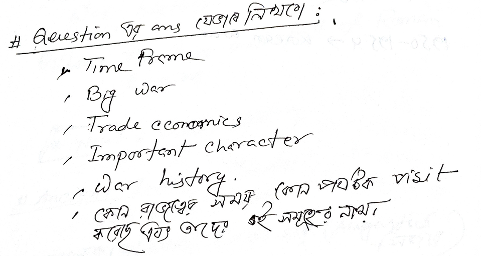
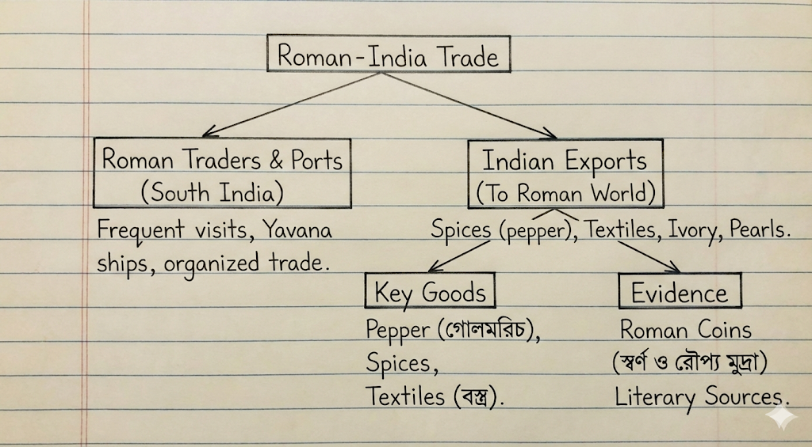
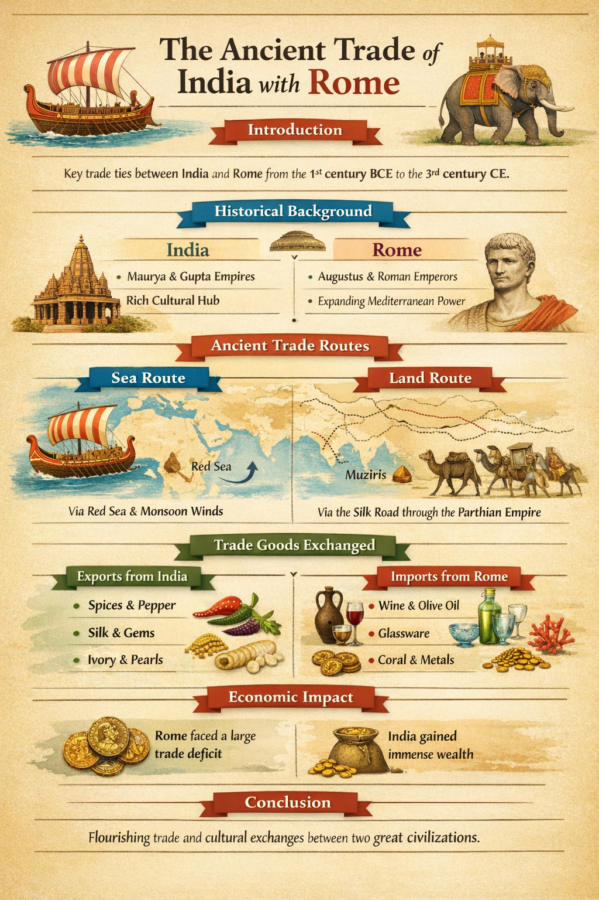
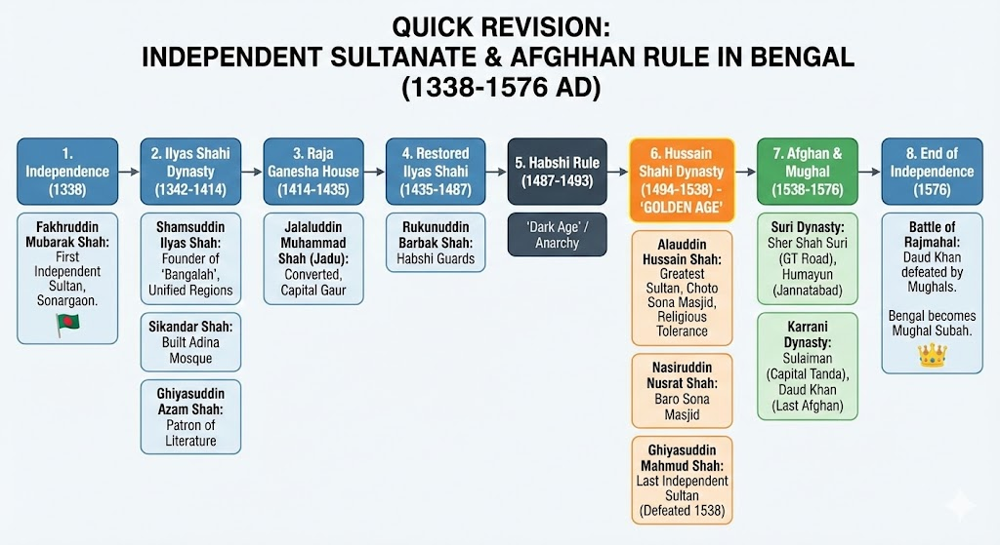

??? "The ancient Trade of Rome with India"

    
    

    **Assignment on The Ancient Trade of India with Rome**

    **Introduction (ভূমিকা)**
    The ancient trade between India and Rome was one of the most significant commercial relationships of antiquity. The economic and diplomatic ties established between the Roman Empire and various Indian kingdoms contributed to a flourishing exchange of goods, ideas, and cultural practices. This trade relationship began in the first century BCE and continued until the Roman economic crisis in the third century CE. The significance of this trade lies not only in the economic impact on both civilizations but also in the lasting cultural exchanges between them. This paper explores the historical, political, and economic contexts of the trade between India and Rome, focusing on the goods exchanged, the trade routes, and the broader implications of this exchange.

    **Historical Background (ঐতিহাসিক প্রেক্ষাপট)**

    * **Political Context of India and Rome**
    During the first century BCE, the political environment in India was dominated by powerful empires such as the Mauryas and the Guptas, whose political stability allowed for the development of robust trade networks. In contrast, the Roman Empire, under the reign of Augustus and his successors, sought to expand its influence and secure trade routes across the Mediterranean and Asia. This period marked the establishment of key diplomatic and economic ties between Rome and India, leading to the flourishing of trade.

    * **Contemporary Politics, Governance, and Historical Events**
    The Roman Empire, after consolidating power in the Mediterranean, turned its attention eastward, reaching as far as the Indian subcontinent. The relationship between Rome and India was characterized by the exchange of diplomatic envoys and mutual respect for each other's cultures. While Rome’s political and military activities focused on maintaining control over the Mediterranean, India’s key role was as a supplier of valuable goods, such as spices, textiles, and luxury items, which were highly sought after in Rome.

    **Ancient Trade (প্রাচীন বাণিজ্য সম্পর্ক)**

    * **Nature of Trade: Land and Sea Routes**
    The trade between India and Rome occurred through both land and sea routes. Roman merchants primarily utilized the sea route, traveling across the Red Sea and the Persian Gulf to reach India. The seasonal monsoon winds played a crucial role in facilitating the regular voyages between the two regions. Roman merchant ships would set sail from the Egyptian port of Berenice, passing through the Red Sea, the Gulf of Aden, and finally reaching the Indian subcontinent. The land route, which passed through the Parthian Empire, was also crucial for the transport of goods such as silk and precious stones.

    * **Major Trade Centers and Ports**
    The most important Indian ports for trade with Rome were Muziris, Barbarikon, and Barygaza. Muziris, located in Kerala, was one of the busiest trade hubs, handling large quantities of Roman goods in exchange for Indian spices and textiles. Barbarikon, near modern-day Karachi, and Barygaza, now known as Bharuch, were other key ports that connected the Roman and Indian worlds. These ports served as crucial entry points for the exchange of luxury goods, with Roman coins and other artifacts found in these regions.

    * **Trade Theories and Historical Evidence**
    Archaeological evidence of the trade between India and Rome can be found in the form of Roman coins discovered in Indian ports, as well as Indian pottery and artifacts found in Roman ruins. Additionally, ancient texts such as the *Periplus of the Erythraean Sea* provide detailed descriptions of the trade routes and the goods exchanged between the two civilizations. This document, written by an anonymous Greek merchant in the first century CE, outlines the conditions of trade, the types of goods available in various regions, and the challenges faced by traders.

    **Economic Context (অর্থনৈতিক প্রেক্ষাপট)**

    * **Economic Impact of Indo-Roman Trade**
    The trade between India and Rome had profound economic implications for both civilizations. For India, the trade facilitated the export of valuable goods such as silk, spices, gemstones, and textiles, leading to significant wealth for Indian merchants and rulers. The import of Roman goods, such as wine, olive oil, and glassware, further enriched the Indian elite, who greatly valued these luxury items. On the Roman side, the insatiable demand for Indian products drained the Roman economy of precious metals, with estimates indicating an annual trade deficit of 100 million sesterces, as reported by the Roman historian Pliny the Elder.

    * **Import-Export Analysis**

    * **Exports from India**: India exported a wide range of goods to Rome, including black pepper, spices (such as betel, ginger, and turmeric), textiles (such as silk and cotton), pearls, ivory, and precious gemstones like sapphire, ruby, and beryl. These goods were highly prized in the Roman Empire, particularly by the Roman elite, who used them for both personal consumption and display.
    * **Imports from Rome**: India, in turn, imported luxury items such as Roman wine, olive oil, glassware, metals (tin, copper, and lead), horses, and amber. Roman glassware, in particular, became a status symbol in India, adorning the palaces of the upper classes. Additionally, exotic animals, including elephants and tigers, were imported from India to the Roman Empire, as were aromatic plants like nard and malabathron.

    * **Balance of Trade Discussion**
    The trade balance between India and Rome was heavily skewed in favor of India. While India exported far more goods to Rome than it imported, this trade imbalance had significant financial consequences for the Roman Empire. The Roman historian Pliny the Elder highlighted this trade deficit, emphasizing the high cost of luxury items and the drain of gold and silver from the Roman treasury. Despite this, the demand for Indian goods remained strong, and the Romans continued to engage in this profitable trade.

    **Conclusion (উপসংহার)**
    In conclusion, the ancient trade between India and Rome was a key factor in shaping the economies and cultures of both civilizations. The exchange of goods such as spices, textiles, and luxury items fostered economic prosperity in both India and Rome. The trade also facilitated the exchange of ideas, with cultural, religious, and philosophical influences being shared between the two regions. The diplomatic exchanges and cultural interactions between India and Rome laid the foundation for a rich and enduring relationship that transcended mere trade and contributed to the broader history of the ancient world.

    This version merges the content from the article into the original assignment format while maintaining a formal, academic tone. Feel free to modify or expand on specific points based on your requirements.

???  "Bangla Saltanat"

    === "Bangla (Exam Style Notes)"

        ### **বিষয়: স্বাধীন সুলতানি আমল ও বাংলায় আফগান শাসন (১৩৩৮ - ১৫৭৬ খ্রি.)**

        **পটভূমি (Background):**

        * **১২০৪ - ১৩৩৮:** দিল্লীর শাসন। এই সময়ে বাংলাকে বলা হতো **"বুলগাকপুর"** (বিদ্রোহের নগরী)।
        * **১৩৩৮:** ফখরুদ্দিন মোবারক শাহের মাধ্যমে স্বাধীনতার সূচনা।

        ---

        ### **১. স্বাধীনতা ও ইলিয়াস শাহী বংশ (১৩৩৮ - ১৪১৪)**

        **ক) ফখরুদ্দিন মোবারক শাহ (১৩৩৮ - ১৩৪৯)**

        * সোনারগাঁয়ে স্বাধীনতা ঘোষণা করেন।
        * তিনিই বাংলার **প্রথম স্বাধীন সুলতান**।
        * মরক্কোর পরিব্রাজক **ইবনে বতুতা** তাঁর সময়ে বাংলায় আসেন (১৩৪৬)। তিনি বাংলাকে বলেন "দোযখ-পুর নিয়ামত" (ধনসম্পদে পূর্ণ নরক)।

        **খ) শামসুদ্দিন ইলিয়াস শাহ (১৩৪২ - ১৩৫৮)**

        * **প্রতিষ্ঠাতা:** তিনি লখনৌতি, সাতগাঁও ও সোনারগাঁও—এই তিন জনপদ একত্র করে **"বাঙ্গালাহ"** নাম দেন।
        * **উপাধি:** শাহ-ই-বাঙ্গালাহ, শাহ-ই-বাঙালিয়ান।
        * ফিরোজ শাহ তুঘলকের সাথে দ্বন্দ্ব হয়।

        **গ) সিকান্দার শাহ (১৩৫৮ - ১৩৯১)**

        * পান্ডুয়ায় বিখ্যাত **আদিনা মসজিদ** নির্মাণ করেন।

        **ঘ) গিয়াসউদ্দিন আজম শাহ (১৩৯১ - ১৪১১)**

        * সাহিত্যের পৃষ্ঠপোষক এবং ন্যায়পরায়ণ শাসক।
        * পারস্যের কবি **হাফেজের** সাথে পত্রালাপ ছিল।
        * চীনা পরিব্রাজক **মা-হুয়ান** তাঁর সময়ে আসেন।

        ---

        ### **২. রাজা গণেশ ও তাঁর বংশ (১৪১৪ - ১৪৩৫)**

        * ইলিয়াস শাহী বংশের দুর্বলতার সুযোগে হিন্দু রাজা গণেশ ক্ষমতা দখল করেন।
        * **জালালউদ্দিন মুহাম্মদ শাহ (যদু):** রাজা গণেশর ছেলে, যিনি ইসলাম ধর্ম গ্রহণ করে সিংহাসনে বসেন।
        * তিনি রাজধানী পাণ্ডুয়া থেকে গৌড়ে স্থানান্তর করেন।

        ---

        ### **৩. পরবর্তী ইলিয়াস শাহী বংশ (১৪৩৫ - ১৪৮৭)**

        * নাসিরউদ্দিন মাহমুদ শাহ ও রুকনউদ্দিন বারবক শাহ এই সময়ের উল্লেখযোগ্য শাসক।
        * **রুকনউদ্দিন বারবক শাহ:** শ্রীকৃষ্ণবিজয় কাব্যের রচয়িতা মালাধর বসুকে 'গুণরাজ খান' উপাধি দেন।

        ---

        ### **৪. হাবশি শাসন (১৪৮৭ - ১৪৯৩)**

        * এটি বাংলার ইতিহাসের **অরাজকতার সময়** বা কালো অধ্যায়।
        * চারজন হাবশি সুলতান প্রায় ৬ বছর শাসন করেন।

        ---

        ### **৫. হোসেন শাহী বংশ (১৪৯৪ - ১৫৩৮) — "বাংলার স্বর্ণযুগ"**

        **ক) আলাউদ্দিন হোসেন শাহ (১৪৯৪ - ১৫১৯)**

        * **শ্রেষ্ঠ সুলতান:** এই বংশের এবং মধ্যযুগের বাংলার শ্রেষ্ঠ সুলতান।
        * **উপাধি:** নৃপতি তিলক, জগৎভূষণ, খলিফাতুল্লাহ।
        * **অবদান:** ধর্মীয় সম্প্রীতি বজায় রাখেন। ছোট সোনা মসজিদ নির্মাণ করেন।
        * **সাহিত্য:** মহাভারতের বাংলা অনুবাদক কবীন্দ্র পরমেশ্বর এবং শ্রীকৃষ্ণবিজয় রচয়িতা মালাধর বসু তাঁর পৃষ্ঠপোষকতা পান।

        **খ) নাসিরউদ্দিন নুসরাত শাহ (১৫১৯ - ১৫৩২)**

        * গৌড়ের **বড় সোনা মসজিদ** ও কদম রসুল ভবন নির্মাণ করেন।
        * বাবরের আক্রমণের সময় নিরপেক্ষ থাকেন।

        **গ) গিয়াসউদ্দিন মাহমুদ শাহ (১৫৩৩ - ১৫৩৮)**

        * স্বাধীন সুলতানি আমলের **শেষ সুলতান**।
        * ১৫৩৮ সালে শের শাহের কাছে পরাজিত হন।

        ---

        ### **৬. আফগান শাসন ও মুঘল আগমন (১৫৩৮ - ১৫৭৬)**

        **ক) শূর বংশ (১৫৩৮ - ১৫৬৩)**

        * **শের শাহ শুরি:** হুমায়ুনকে পরাজিত করে বাংলা ও দিল্লী দখল করেন।
        * তিনি গ্র্যান্ড ট্রাঙ্ক রোড (সড়ক-ই-আজম) নির্মাণ করেন।
        * সম্রাট হুমায়ুন এই সময়ে বাংলার (গৌড়) নাম দেন **"জান্নাতাবাদ"**।

        **খ) কররানী বংশ (১৫৬৩ - ১৫৭৬)**

        * তাজ খান কররানী এই বংশ প্রতিষ্ঠা করেন।
        * **সুলাইমান খান কররানী:** রাজধানী তান্ডায় স্থানান্তর করেন।
        * **দাউদ খান কররানী:** বাংলার শেষ স্বাধীন আফগান শাসক।

        **গ) রাজমহলের যুদ্ধ (১৫৭৬)**

        * **দ্বন্দ্ব:** দাউদ খান কররানী বনাম মুঘল সেনাপতি খান জাহান (আকবরের সময়)।
        * **ফলাফল:** দাউদ খান পরাজিত ও নিহত হন। বাংলায় মুঘল শাসন শুরু হয়।

        ---

        ### **একনজরে গুরুত্বপূর্ণ তথ্য (Exam Refresher):**

        * **বুলগাকপুর:** বিদ্রোহের নগরী (দিল্লী শাসনামলে)।
        * **জান্নাতাবাদ:** হুমায়ুন গৌড়ের এই নাম দেন।
        * **তিনটি কেন্দ্র:** লখনৌতি (রাজনীতি), সাতগাঁও (বাণিজ্য), সোনারগাঁও (খাবার ও মসলিন)।
        * **স্বর্ণযুগ:** আলাউদ্দিন হোসেন শাহের আমল।

    === "English (Exam Style Notes)"

        ### **Topic: Independent Sultanate & Afghan Rule in Bengal (1338 - 1576 AD)**

        **Background:**

        * **1204 - 1338:** Rule of Delhi Sultanate via Governors. Bengal was known as **"Bulgakpur"** (City of Rebellion) due to constant revolts.
        * **1338:** Start of independence by Fakhruddin Mubarak Shah.

        ---

        ### **1. Establishment & Ilyas Shahi Dynasty (1338 - 1414)**

        **A) Fakhruddin Mubarak Shah (1338 - 1349)**

        * Declared independence in **Sonargaon**.
        * The **first independent Sultan** of Bengal.
        * Famous traveler **Ibn Battuta** visited Bengal (1346) during his reign (Described Bengal as "A hell full of blessings").

        **B) Shamsuddin Ilyas Shah (1342 - 1358)**

        * **Founder:** Unified the three regions (Lakhnauti, Satgaon, Sonargaon) into one nation named **"Bangalah"**.
        * **Title:** Shah-i-Bangalah, Shah-i-Bangaliyan.
        * Resisted attacks from Delhi Sultan Firoz Shah Tughlaq.

        **C) Sikandar Shah (1358 - 1391)**

        * Built the famous **Adina Mosque** in Pandua.

        **D) Ghiyasuddin Azam Shah (1391 - 1411)**

        * Known for justice and patronage of literature.
        * Exchanged letters with the Persian poet **Hafez**.
        * Chinese envoy **Ma Huan** visited during his time.

        ---

        ### **2. House of Raja Ganesha (1414 - 1435)**

        * A brief Hindu rule interrupting the Ilyas Shahi dynasty.
        * **Jalaluddin Muhammad Shah (Jadu):** Son of Raja Ganesha, converted to Islam.
        * Shifted capital from Pandua back to **Gaur**.

        ---

        ### **3. Restored Ilyas Shahi Dynasty (1435 - 1487)**

        * Notable Rulers: Nasiruddin Mahmud Shah, Rukunuddin Barbak Shah.
        * **Barbak Shah:** Hired Abyssinian (Habshi) slaves for the army, which later led to their takeover. Patronized Maladhar Basu.

        ---

        ### **4. Habshi Rule (1487 - 1493)**

        * Known as the **Dark Age** or Period of Anarchy in Bengal.
        * ruled by Abyssinian palace guards for about 6 years.

        ---

        ### **5. Hussain Shahi Dynasty (1494 - 1538) — "The Golden Age"**

        **A) Alauddin Hussain Shah (1494 - 1519)**

        * **Greatest Sultan:** Considered the best ruler of medieval Bengal.
        * **Titles:** Nripati Tilak, Jagat Bhusan.
        * **Achievements:** Era of religious tolerance and cultural boom. Built **Choto Sona Masjid**.
        * **Literature:** Patronized the translation of Mahabharata (by Kavindra Parameshwar).

        **B) Nasiruddin Nusrat Shah (1519 - 1532)**

        * Built the **Baro Sona Masjid** (Large Golden Mosque) and Qadam Rasul.
        * Maintained neutrality during Babur’s invasion of India (1526).

        **C) Ghiyasuddin Mahmud Shah (1533 - 1538)**

        * The **Last Sultan** of the independent Sultanate period.
        * Defeated by Sher Shah Suri in 1538.

        ---

        ### **6. Afghan Rule & Mughal Conquest (1538 - 1576)**

        **A) Suri Dynasty (1538 - 1563)**

        * **Sher Shah Suri:** Defeated Mughal Emperor Humayun (Battle of Chausa & Kannauj).
        * Introduced the Kabuliya & Patta system; Built the Grand Trunk Road.
        * **Note:** Humayun stayed in Gaur for 6 months and renamed it **"Jannatabad"** (City of Paradise).

        **B) Karrani Dynasty (1563 - 1576)**

        * Founded by Taj Khan Karrani.
        * **Sulaiman Karrani:** Shifted capital to Tanda.
        * **Daud Khan Karrani:** The last independent Afghan ruler.

        **C) Battle of Rajmahal (1576)**

        * **Conflict:** Daud Khan Karrani vs. Mughal General Khan Jahan (Sent by Akbar).
        * **Result:** Daud Khan was defeated and executed. This marked the end of independent Bengal and the beginning of **Mughal Province (Subah-i-Bangalah)**.

??? "Background and Formation of Muslim League"

    **Introduction**
    The formation (গঠন) of the All India Muslim League in 1906 is a major event in the history of the Indian subcontinent. During the British rule, the Muslims of India gradually realized the need for a separate political organization (রাজনৈতিক সংগঠন) to protect their rights and interests (স্বার্থ). It was not a sudden event but the result of various social, political, and economic factors that developed over the 19th century.

    **Background Factors Leading to the Formation**

    **1. The Aftermath of the 1857 Revolt**
    After the Sepoy Mutiny of 1857, the British government was very harsh towards the Muslims. They considered Muslims as the main conspirators (ষড়যন্ত্রকারী) of the revolt. As a result, the Muslims faced severe suppression (দমন) and lost their positions in administration and the army. This created a sense of backwardness (পশ্চাৎপদতা) among the community compared to the Hindus, who were adapting to Western education.

    **2. The Aligarh Movement**
    Sir Syed Ahmed Khan played a vital role in the awakening (জাগরণ) of the Muslims. He understood that without modern education, Muslims could not progress. He started the Aligarh Movement and established the MAO College. He advised Muslims to stay away from active politics initially and focus on education. However, his movement created a conscious educated class (শিক্ষিত শ্রেণী) who later felt the need for political involvement.

    **3. Formation of Indian National Congress (1885)**
    The Indian National Congress was formed in 1885 to represent Indians. However, many Muslim leaders felt that the Congress was dominated by Hindu interests. Leaders like Sir Syed Ahmed Khan feared that in a democratic system (গণতান্ত্রিক ব্যবস্থা), the Muslim minority would be permanently suppressed by the Hindu majority. This suspicion (সন্দেহ) laid the foundation for a separate party.

    **4. The Urdu-Hindi Controversy**
    In the late 19th century, there was a movement to replace Urdu with Hindi in official courts and offices. Since Urdu was closely linked to Muslim culture (সংস্কৃতি), the Muslims saw this as an attack on their identity. This controversy united the Muslims to defend their language and heritage.

    **5. Partition of Bengal (1905)**
    The most immediate cause (প্রত্যক্ষ কারণ) was the Partition of Bengal in 1905 by Lord Curzon. The partition created a separate province of Eastern Bengal and Assam with a Muslim majority. Muslims welcomed this as it brought economic opportunities. However, the Congress and Hindu leaders launched the Swadeshi Movement to annul (বাতিল করা) the partition. This strong opposition from the Congress convinced the Muslim leaders that they needed their own political platform to save their interests.

    **The Simla Deputation (1906)**
    Before the actual formation of the league, a significant event took place. On October 1, 1906, a delegation of 35 prominent Muslim leaders led by the Aga Khan met the Viceroy Lord Minto at Simla. This is known as the Simla Deputation. They presented two main demands

    * Separate Electorates (পৃথক নির্বাচন ব্যবস্থা) for Muslims.
    * Weightage in representation based on their political importance, not just population.

    Lord Minto gave a sympathetic response, which encouraged the leaders to form a permanent political organization.

    **Formation of the Muslim League (1906)**

    **The Dhaka Session**
    In December 1906, the All India Muhammadan Educational Conference held its annual session in Dhaka. After the conference, on **30th December 1906**, a special meeting was held at Shahbag distributed by **Nawab Salimullah** of Dhaka.

    In this meeting, Nawab Salimullah proposed the formation of a political party to look after the interests of Muslims. The proposal was supported by leaders like Hakim Ajmal Khan, Maulana Zafar Ali Khan, and others. Thus, the **All India Muslim League** was officially established.

    **Key Leaders**

    * **Nawab Salimullah:** He was the main organizer and host.
    * **Aga Khan III:** He was appointed as the first Honorary President (সভাপতি).
    * **Nawab Viqar-ul-Mulk and Nawab Mohsin-ul-Mulk:** They were appointed as Joint Secretaries.

    **Objectives of the Muslim League**
    The constitution of the League was framed in 1907 at Karachi. The main objectives (উদ্দেশ্য) were

    1. **Loyalty:** To promote feelings of loyalty (আনুগত্য) towards the British Government among the Muslims.
    2. **Protection of Rights:** To protect and advance the political rights and interests of the Muslims of India and to represent their needs to the government.
    3. **Prevention of Hostility:** To prevent the rise of prejudice (বিদ্বেষ) or hostility towards other communities in India.

    **Significance**
    The formation of the Muslim League was a turning point. It ended the era of political isolation for Muslims. For the first time, Muslims had a platform to speak to the government directly. While it started as a loyalist party, it eventually evolved to demand self-rule and later, a separate homeland.

    **Conclusion**
    To conclude, the birth of the Muslim League was a logical outcome of the political circumstances (পরিস্থিতি) of that time. The fear of Hindu domination and the need for a separate identity drove the Muslims to unite. Starting from the Aligarh movement to the Partition of Bengal, every event contributed to this. The establishment of the League in Dhaka in 1906 ultimately changed the course of Indian history.
    