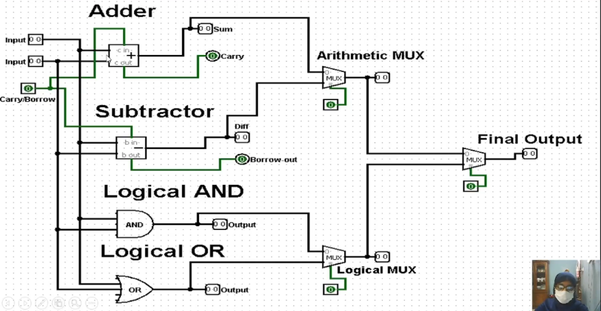

=== "ALU Theory" 

    # ALU Design Guide:

    ALU (Arithmetic Logic Unit) ডিজাইন করার জন্য মূল ধারণা হলো এটি দুটি প্রধান কাজ করে: **Arithmetic Operations** (যোগ, বিয়োগ) এবং **Logical Operations** (AND, OR, NOT, etc.)।

    নিচে ১-বিট, ২-বিট এবং ৪-বিট ALU ডিজাইনের জন্য কী কী কম্পোনেন্ট (Component) বা লজিক সার্কিট প্রয়োজন, তার একটি তালিকা দেওয়া হলো।

    ### ১. মূল উপকরণ (Basic Components needed for all sizes)

    যেকোনো সাইজের ALU বানাতে এই বেসিক এলিমেন্টগুলো লাগবেই:

    * **Logic Gates:** AND, OR, XOR, NOT গেইট (লজিক্যাল অপারেশনের জন্য)।
    * **Full Adder:** গাণিতিক যোগ ও বিয়োগের জন্য।
    * **Multiplexer (MUX):** এটি সবচেয়ে গুরুত্বপূর্ণ। MUX ঠিক করে আউটপুটটি লজিক্যাল অপারেশন থেকে আসবে নাকি অ্যারিথমেটিক অপারেশন থেকে আসবে।

    ---

    ### ২. ১-বিট ALU (1-bit ALU) ডিজাইন

    ১-বিট ALU হলো সবচেয়ে মৌলিক বা Basic building block। এটি একটি মাত্র বিটের (যেমন:  এবং ) ওপর অপারেশন করে।

    **যা যা লাগবে:**

    * **১টি Full Adder:** যোগ (Add) এবং ক্যারি (Carry) হ্যান্ডেল করার জন্য।
    * **Logic Gates:** ১টি AND gate, ১টি OR gate (প্রয়োজনে XOR/NOT)।
    * **১টি Multiplexer (4:1 MUX):** সাধারণত ৪টি অপারেশন (যেমন: AND, OR, ADD, SUB) সিলেক্ট করার জন্য একটি ৪-টু-১ মাল্টিপ্লেক্সার ব্যবহার করা হয়।
    * **Selection Lines:** MUX-কে কন্ট্রোল করার জন্য ২টি সিলেকশন লাইন ()।

    **কাজ করার পদ্ধতি:**
    ইনপুট  এবং  একই সাথে লজিক গেইট এবং Full Adder-এর মধ্য দিয়ে যায়। MUX-এর সিলেকশন পিন ঠিক করে কোনটি ফাইনাল আউটপুট হিসেবে বের হবে।

    ---

    ### ৩. ২-বিট এবং ৪-বিট ALU ডিজাইন

    ২-বিট বা ৪-বিট ALU মূলত একাধিক ১-বিট ALU-এর সমষ্টি। একে বলা হয় **Cascading**। অর্থাৎ, একটার পর একটা ১-বিট ALU জোড়া লাগিয়ে বড় ALU তৈরি করা হয়।

    #### ২-বিট ALU-এর জন্য যা লাগবে:

    * **২টি ১-বিট ALU:** একে অপরের সাথে যুক্ত থাকবে।
    * **সংযোগ (Connection):** প্রথম ১-বিট ALU-এর **Carry Out ()** দ্বিতীয় ১-বিট ALU-এর **Carry In ()** হিসেবে ঢুকবে।

    #### ৪-বিট ALU-এর জন্য যা লাগবে:

    * **৪টি ১-বিট ALU:** পর পর সাজানো থাকবে।
    * **Carry Propagation:** একেবারে ডানদিকের (LSB - Least Significant Bit)  তার পরেরটির  হিসেবে যাবে। এভাবে একদম বামদিকের (MSB) পর্যন্ত ক্যারি পাস হতে থাকবে। একে **Ripple Carry** পদ্ধতি বলা হয়।

    **সহজ হিসাব:**

    * ৪টি Full Adder
    * ৪টি AND Gate
    * ৪টি OR Gate
    * ৪টি Multiplexer (4:1 MUX)

    ### এক নজরে তুলনা

    | ALU সাইজ | Full Adder | MUX (4:1) | Logic Gates (প্রতি সেটে) | মূল কনসেপ্ট |
    | --- | --- | --- | --- | --- |
    | **১-বিট** | ১টি | ১টি | ১ সেট (AND, OR, etc.) | Basic Block |
    | **২-বিট** | ২টি | ২টি | ২ সেট | Cascade (Ripple Carry) |
    | **৪-বিট** | ৪টি | ৪টি | ৪ সেট | Cascade (Ripple Carry) |

    **গুরুত্বপূর্ণ নোট:** ৪-বিট বা তার বেশি ডিজাইনের ক্ষেত্রে "Ripple Carry Adder" ব্যবহার করলে স্পিড কমে যায় (কারণ ক্যারির জন্য অপেক্ষা করতে হয়)। তাই আধুনিক ডিজাইনে **Carry Lookahead Adder (CLA)** লজিক ব্যবহার করা হয়, যা একটু বেশি জটিল কিন্তু দ্রুত কাজ করে।

    [text](https://youtu.be/GD-oRlrnJ1k)

=== "ALU Design Guide"

    
   

    নিচে **ALU বানানোর জন্য Logisim Evolution-এ দরকারি সব গুরুত্বপূর্ণ Info / Properties একটাই টেবিলে** সাজিয়ে দিলাম।
    এটা দেখে সরাসরি কাজ করা যাবে।

    ---

    ## Logisim Evolution – ALU Component Properties (All in One Table)

    | Component                        | Property         | Value       | কেন দরকার / ব্যবহার            |
    | -------------------------------- | ---------------- | ----------- | ------------------------------ |
    | **Input Pin (A, B)**             | Data Bits        | 1           | 1-bit ALU বানানোর জন্য         |
    |                                  | Facing           | East        | Wire বাম থেকে ডানে সুন্দর হয়   |
    |                                  | Output Value     | 0/1         | Binary input দেখার জন্য        |
    |                                  | Label            | A / B       | Input চেনার জন্য               |
    | **Input Pin (CarryBorrow)**      | Data Bits        | 1           | Carry / Borrow control         |
    |                                  | Label            | CarryBorrow | Adder ও Subtractor দুটোতেই যায় |
    | **Adder (Full Adder)**           | Data Bits        | 1           | 1-bit addition                 |
    |                                  | Cin Enabled      | Yes         | Carry-in ব্যবহার               |
    |                                  | Cout Enabled     | Yes         | Carry-out দেখার জন্য           |
    |                                  | Facing           | East        | Wire flow ঠিক রাখতে            |
    | **Subtractor (Full Subtractor)** | Data Bits        | 1           | 1-bit subtraction              |
    |                                  | Bin Enabled      | Yes         | Borrow-in                      |
    |                                  | Bout Enabled     | Yes         | Borrow-out                     |
    |                                  | Facing           | East        | Wire সহজ রাখতে                 |
    | **AND Gate**                     | Number of Inputs | 2           | A AND B                        |
    |                                  | Data Bits        | 1           | 1-bit logic                    |
    |                                  | Gate Size        | Medium      | পরিষ্কার দেখা যায়              |
    | **OR Gate**                      | Number of Inputs | 2           | A OR B                         |
    |                                  | Data Bits        | 1           | 1-bit logic                    |
    |                                  | Gate Size        | Medium      | Clean diagram                  |
    | **Arithmetic MUX**               | Data Bits        | 1           | Adder/Subtractor output        |
    |                                  | Number of Inputs | 2           | Sum ও Diff                     |
    |                                  | Select Bits      | 1           | Add বা Sub select              |
    |                                  | Facing           | East        | Output right side              |
    | **Logical MUX**                  | Data Bits        | 1           | AND/OR output                  |
    |                                  | Number of Inputs | 2           | AND ও OR                       |
    |                                  | Select Bits      | 1           | AND বা OR select               |
    | **Final MUX**                    | Data Bits        | 1           | Final ALU output               |
    |                                  | Number of Inputs | 2           | Arithmetic / Logical           |
    |                                  | Select Bits      | 1           | Mode select                    |
    | **Output Pin**                   | Data Bits        | 1           | Final result                   |
    |                                  | Output Value     | 0/1         | Result দেখার জন্য              |
    |                                  | Label            | Output      | Examiner বোঝার জন্য            |
    | **All Gates / MUX**              | Negate Inputs    | No          | Extra NOT দরকার নেই            |
    | **All Components**               | FPGA Supported   | Supported   | Standard component             |
    | **All Components**               | Gate Size        | Medium      | Diagram readable               |

    ---

    ## Control Signal Summary (Short Table)

    | Signal      | কাজ                         |
    | ----------- | --------------------------- |
    | A           | First input bit             |
    | B           | Second input bit            |
    | CarryBorrow | Carry-in / Borrow-in        |
    | S1          | Add / Sub select            |
    | S2          | AND / OR select             |
    | S3          | Arithmetic / Logical select |

    ---

    ## One-Line Exam Note

    > All components are configured with identical data bits, and multiplexers are used to select arithmetic or logical operations using control signals.

    চাও তো পরের ধাপে

    * **৪-bit ALU বানানোর জন্য আলাদা table**,
    * বা **Viva-ready short table**,
    * বা **Logisim menu path সহ table**
    দিয়ে দেব।

=== "Clear your confusion"

    এই ছবিটি একটি **1-bit ALU (Arithmetic Logic Unit)**-এর সার্কিট ডায়াগ্রাম। ALU হলো কম্পিউটারের প্রসেসরের সেই অংশ যা সব ধরণের গাণিতিক (Math) এবং যৌক্তিক (Logical) কাজ করে।

    এই সার্কিটে ঠিক কী হচ্ছে এবং বর্তমানে ইনপুট অনুযায়ী আউটপুট কেন এমন আসছে, তা আমি একদম "স্টেপ বাই স্টেপ" বা পাই-টু-পাই বুঝিয়ে বলছি।

    ---

    ### ১. ইনপুট (Inputs) - শুরুতে আমাদের হাতে কী আছে?

    বাম পাশে তাকালে আমরা ৩টি মেইন ইনপুট দেখতে পাচ্ছি:

    * **A = 1** (উজ্জ্বল সবুজ মানে অন বা ১)
    * **B = 1** (উজ্জ্বল সবুজ মানে অন বা ১)
    * **Cin (Carry In) = 0** (গাঢ় সবুজ মানে অফ বা ০)

    এছাড়াও মাঝখানে একটি **Selector (S)** আছে যার মান দেওয়া আছে **10** (বাইনারিতে ১-০, যা ডেসিমেলে ২)। এটি ঠিক করে দেয় যে ALU এখন যোগ করবে, নাকি AND করবে, নাকি OR করবে।

    ---

    ### ২. প্রসেসিং (Processing) - ভেতরে কী কাজ হচ্ছে?

    ALU-এর ভেতরে তিনটি প্রধান অপারেশন বা কাজ সবসময়ই একসাথে চলতে থাকে (যদিও আমরা রেজাল্ট হিসেবে শুধু একটিই নিব)। আসুন দেখি A=1 এবং B=1 এর জন্য তিনটি গেট কী আউটপুট দিচ্ছে:

    **ধাপ ১: AND অপারেশন (সবার উপরের অংশ)**

    * উপরের গেটটি হলো **AND Gate**।
    * ইনপুট: A=1, B=1.
    * AND গেটের নিয়ম: দুটিই ১ হলে আউটপুট ১ হবে।
    * **ফলাফল:** এই গেটের আউটপুট **1** হয়ে বসে আছে এবং MUX-এর ০ নাম্বার পিনে যাচ্ছে।

    **ধাপ ২: OR অপারেশন (মাঝখানের অংশ)**

    * মাঝখানের গেটটি হলো **OR Gate**।
    * ইনপুট: A=1, B=1.
    * OR গেটের নিয়ম: যেকোনো একটি ১ হলেই আউটপুট ১ হয়।
    * **ফলাফল:** এই গেটের আউটপুট **1** হয়ে MUX-এর ১ নাম্বার পিনে যাচ্ছে।

    **ধাপ ৩: যোগ বা Adder অপারেশন (নিচের অংশ)**

    * নিচে যে বক্সটিতে `+` চিহ্ন আছে, সেটি হলো **Full Adder**।
    * এটি গাণিতিক যোগ করে: 
    * এখানে: ।
    * বাইনারিতে ২ মানে হলো **10**।
    * এর ডানপাশের অংকটি হলো **Sum = 0** (যা MUX-এর ২ নাম্বার পিনে যাচ্ছে)।
    * বামপাশের অংকটি হলো **Carry = 1** (যা সোজা Cout বা Carry Out-এ যাচ্ছে)।

    ---

    ### ৩. সিদ্ধান্ত গ্রহণ (Multiplexer বা MUX) - কোনটি রেজাল্ট হিসেবে যাবে?

    ডানদিকের বড় ট্রাপিজিয়াম আকৃতির বক্সটি হলো **Multiplexer (MUX)**। এটিকে একটি ট্রাফিক পুলিশের মতো ভাবতে পারেন। এর কাজ হলো অনেকগুলো ইনপুট থেকে সিলেক্টর অনুযায়ী মাত্র একটিকে আউটপুটে পাঠানো।

    * এখানে **Selection Line (S)** এর মান দেওয়া আছে **10** (বাইনারি), যার মানে হলো ডেসিমেল **2**।
    * তাই MUX তার **২ নাম্বার ইনপুটটি** বেছে নেবে।
    * আমরা ধাপ-৩ এ দেখেছি, MUX-এর ২ নাম্বার ইনপুটটি আসছে **Full Adder-এর Sum** থেকে।

    ---

    ### ৪. ফাইনাল রেজাল্ট (Output) - শেষমেশ কী পেলাম?

    যেহেতু সিলেক্টর (S) 'যোগ' বা 'ADD' অপারেশনটি বেছে নিয়েছে:

    1. **Result:** Adder থেকে আসা **Sum** এর মান আউটপুটে যাবে। আমরা জানি  (বাইনারি), তাই Sum হলো **0**। ছবিতে দেখুন `Result` পিনে **0** দেখাচ্ছে।
    2. **Cout (Carry Out):** যোগফলের হাতে থাকা ১ বা Carry টি `Cout` পিনে চলে গেছে। ছবিতে দেখুন `Cout` পিনটি উজ্জ্বল সবুজ, অর্থাৎ **1**।

    ### সারসংক্ষেপ (Summary)

    সহজ কথায়, আপনি ALU-কে বলেছেন A(1) এবং B(1) কে **যোগ** করতে (সিলেক্টর ২ দিয়ে)। তাই সে  হিসাব করেছে। ফলে **Result** দেখাচ্ছে **0** এবং হাতে থাকা **Carry (Cout)** দেখাচ্ছে **1**।

    !!! info "why the adder says 1 bit while it's taking 3 inputs?"
            