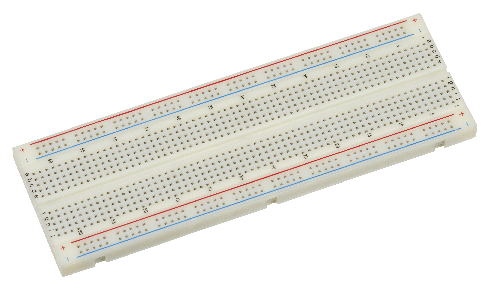
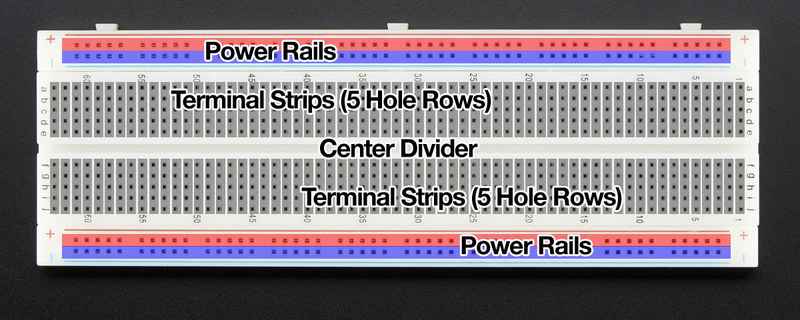
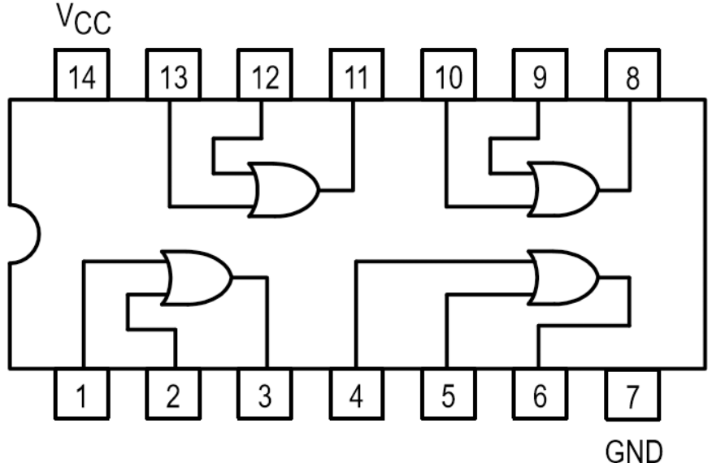

<!-- prettier-ignore-start -->

# DLD - Lab Basics
---
=== "Bangla Version"
    !!! info "Breadboard"
        


        ## 🌱 Part-1: Breadboard কী?

        Breadboard হলো একটা **plastic board** যেটার মধ্যে অনেকগুলো ছোট ছোট **hole (গর্ত)** থাকে।
        এই hole-গুলোর ভিতরে **metal clips/strips** লুকানো থাকে → এগুলোই নির্দিষ্টভাবে একে অপরের সাথে **connected**।

        👉 আপনি একটা তার (wire) যদি একটা hole-এ ঢুকাও আর একই row-এর অন্য hole-এ ঢোকাও, সেটা **একই বৈদ্যুতিক লাইন** (electrical connection) হবে।

        !!! example "Analogy"
            Breadboard = স্কুলের বেঞ্চ
            - বেঞ্চে পাঁচজন বাচ্চা পাশাপাশি বসলে তারা সবাই এক বেঞ্চে (connected)।
            - কিন্তু পাশের বেঞ্চে বসা বাচ্চাদের সাথে তাদের direct connection নেই ❌।
        ---

        ## 🧩 Part-2: ভিতরের Connection Secret

        ### ⚡ Breadboard আসলে ভিতরে কীভাবে connected?
        
        Breadboard এর **holes গুলো সব আলাদা না**। ভেতরে hidden metal strips আছে।

        * **মাঝখানে:**

        * এক row-এর A–E **একসাথে connected** ✅
        * একই row-এর F–J **একসাথে connected** ✅
        * কিন্তু A–E আর F–J একে অপরের সাথে **connected না** ❌
        * মাঝখানের gap টা আসলে **IC বসানোর জায়গা**।

        * **পাশে:** লম্বা দুইটা line থাকে (Power rail)

        * লাল ( + ) → Vcc (+5V)
        * নীল/কালো ( – ) → GND (0V)

        ---

        ## 📊 Quick Table (Who connects to whom?)

        | Section      | Connection Rule                                       |
        | ------------ | ----------------------------------------------------- |
        | A–E row      | একে অপরের সাথে shorted (internal metal strip) ✅       |
        | F–J row      | একে অপরের সাথে shorted ✅                              |
        | Gap          | Left vs Right side NOT connected ❌                    |
        | Power Rail + | সব লাল hole সাধারণত connected (কখনো মাঝখানে break ⚠️) |
        | Power Rail – | সব নীল hole সাধারণত connected                         |

        ## Part-4: Breadboard এর Evolution / Timeline
        - 1940s: Wooden breadboard-এ actual nails দিয়ে circuit বানানো হতো।
        - 1970s: Plastic solderless breadboard উদ্ভাবিত হয়।
        - Now: আধুনিক breadboard comes in বিভিন্ন size (170 tie-points mini, 400, 830 standard, বড় size)।
    
    !!! info "বিভিন্ন ধরনের IC"
        ssss

=== "English Version"
    will be added soon.

---

# 🧠 IC (Integrated Circuit) — Beginner theke Advanced (DLD Lab)

=== "Bangla"

    ## 👀 Overview: IC আসলে কী, কেন দরকার, কোথায় লাগে
    IC মানে **Integrated Circuit**—একটা ছোট কালো chip, ভেতরে অনেক **transistor, resistor, capacitor** একসাথে কাজ করে।  
    **কেন দরকার:** একই কাজের discrete parts আলাদা আলাদা জোড়া লাগানোর ঝামেলা কমে, size ছোট হয়, speed বড়ে, reliability বাড়ে।  
    **কোথায় লাগে:** Digital Logic Lab (74xx gates), calculator, remote, toys, smartphone—প্রায় সর্বত্র।

    !!! note "Analogy"
        **IC = ছোট একটা শহর** 🏙️  
        ভিতরে road, building, মানুষ—সব আছে; বাইরে আপনি শুধু boundary (package) আর gate (pins) দেখো।  
        আপনি pins দিয়ে শহরের ভেতরের অংশে message পাঠাও/নাও—এটাই input/output।

    ---

    ## 🔤 Key Terms & Symbols 
    - **Package:** IC-এর বাহিরের কভার (যেমন DIP, SOIC, QFP, BGA)  
    - **Pin / Lead:** বাহিরের ধাতব পা, যেগুলো দিয়ে connect করা হয়  
    - **Dot/Notch:** Package-এ ছোট দাগ/খাঁজ → **Pin‑1** চেনার চিহ্ন  
    - **Vcc/Vdd:** Positive supply (DLD TTL-এ সাধারণত **+5V**)  
    - **GND/Vss:** Ground/0V  
    - **TTL Family (74xx):** সাধারণত +5V-এ চলে  
    - **CMOS Family (40xx / 74HCxx):** সাধারণত **3–15V** compatible (model অনুযায়ী)

    ---

    ## 🧩 Default / Initial Values (Lab Context)
    **Given/Assume (DLD lab-e prochur ব্যবহৃত):**

    - Supply (TTL 74LS/74HC): **+5 V**  
    - Logic thresholds (TTL rough guide): LOW ≤ **0.8 V**, HIGH ≥ **2.0 V**  
    - Decoupling capacitor: প্রতিটা IC-এর supply pins-এর কাছে **0.1 µF** (noise কমাতে)  
    - Input bias: **floating input নিষেধ** ❌ → pull-up/pull-down লাগবে (≈ **10 kΩ** সাধারণ রুল)

    !!! tip "ছোট numeric উদাহরণ (decoupling কেন)"
        Supply line এ ছোটখাটো voltage dip/spike হলে IC glitch করতে পারে।  
        **0.1 µF cap** মিনিটখানেকের জন্য না, কিন্তু microsecond-level spike smooth করে।  
        বাস্তবে: Vcc–GND across 0.1 µF দিলে random reset/garbage কমে ✅

    ---

    ## 🧱 Package & Pin Numbering (DIP উদাহরণ)
    
    - Notch/dot ওপরে ধরলে **বাম দিকের উপরের পা = Pin‑1**  
    - Anti‑clockwise ঘুরে নম্বর বাড়ে; **14‑pin**-এ সাধারণত **Pin‑14 = Vcc**, **Pin‑7 = GND**

    !!! warning "Orientation ভুল হলে?"
        IC উল্টো করলে Vcc/GND পাল্টে গিয়ে **chip damage** হতে পারে ❌  
        Power দেবার আগে **পিন‑১** চিহ্ন **ডাবল‑চেক** করো।

    ---

    ## ⚡ Logic Family Quick Summary (TTL vs CMOS)
    | Family       | Typical Vcc | Pros                               | Caution                        |
    |--------------|-------------|------------------------------------|--------------------------------|
    | 74LS/74HC    | 5 V         | Lab‑friendly, easy availability    | Floating input এ ভুল আচরণ ⚠️  |
    | 4000‑series  | 3–15 V      | Wide voltage, low power            | ধীর হতে পারে, model‑wise vary |

    !!! note "Beginners’ Rule"
        DLD‑এ **74xx (5 V)** ধরেই শুরু করো। পরে datasheet দেখে exceptions শিখবে।

    ---

    ## 🧪 Inside the IC 
    ভিতরে অনেক **transistor** gate বানায়; gates মিলে **functions** (adder, counter) বানায়; সব এক চিপে packed = **integration**।  
    VLSI হলে **millions/billions** transistor—যেমন smartphone SoC।

    ---

    ## 🗺️ Tiny Timeline (Scale evolution)
    - **SSI (1960s):** কয়েকটা gate  
    - **MSI (1970s):** adder/counter‑type blocks  
    - **LSI (1980s):** memory/controller  
    - **VLSI (1990s→):** microprocessor/SoC (today’s billions)
    
    !!! tip "Pin-1 সনাক্তকরণ"
        - IC-তে সবসময় ছোট **খাঁজ (notch)** বা **ডট** থাকে Pin-1 বোঝার জন্য।  
        - খাঁজ/ডট উপরে রাখলে, **বাম দিকের প্রথম পিনই Pin-1** ✅  
        - পিন গোনা হয় **counter-clockwise** দিকে।  
        - ভুলভাবে ধরলে VCC/GND উল্টে গিয়ে IC নষ্ট হতে পারে ⚠️

    ---

    ## 🔄 Flowchart: “নতুন IC হাতে পেলে কীভাবে শুরু করবো?”

    ```mermaid
    flowchart TD
        A["নতুন IC"] --> B["Pin-1 খুঁজুন (ডট/নচ)"]
        B --> C["প্যাকেজ/পিন সংখ্যা যাচাই করুন"]
        C --> D["ডাটাশিটে VCC রেঞ্জ যাচাই করুন"]
        D --> E["পাওয়ার পিনগুলো চিহ্নিত করুন (VCC/GND)"]
        E --> F["0.1 uF ডিকাপলিং বসান"]
        F --> G["I/O টাইপ নির্ধারণ করুন (TTL/CMOS)"]
        G --> H{"কোনো ইনপুট ফ্লোটিং আছে?"}
        H -- হ্যাঁ --> H1["~10k পুল রেজিস্টর যোগ করুন"]
        H -- না --> I["অগ্রসর হোন"]
        H1 --> I

    ```

    ---

    ## 🧾 Quick Summary Table
    | Topic                     | Quick Note |
    |--------------------------|------------|
    | Pin‑1 mark               | Dot/Notch |
    | Counting direction       | Anti‑clockwise (top view) |
    | Common power pins (DIP14)| Pin‑14=Vcc, Pin‑7=GND |
    | Floating inputs          | Avoid; use ~10 kΩ pull |
    | Decoupling               | 0.1 µF across Vcc–GND |
    | Family default           | 74xx → 5 V (lab) |

    ---

    ## ⚠️ Common Mistakes & Quick Fix
    - ❌ **Pin‑1 ভুল ধরা** → ✅ Notch/dot confirm করো  
    - ❌ **Vcc/GND মিস‑ওয়্যার** → ✅ Power map লিখে নাও, তারপর connect  
    - ❌ **Floating input** → ✅ Pull‑up/pull‑down (~10 kΩ)  
    - ❌ **Decoupling না দেয়া** → ✅ 0.1 µF দিয়েই শুরু করো  
    - ❌ **Mixed voltage family** → ✅ এক voltage family maintain করো/level shift ব্যবহার করো

    ---

    ## 🔁 Recap
    IC = ছোট বক্স, ভেতরে বিশাল সার্কিট। শুরুতে যা মনে রাখবে: **Pin‑1, Vcc/GND, family voltage, inputs fixed, decoupling**—এইগুলো ঠিক থাকলে ৯০% ঝামেলা বন্ধ ✅

    ---

    ## 🧩 Practice (ছোট প্রশ্ন, ঝটপট উত্তর)
    1) **Pin‑1 চেনার সহজ উপায় কী?**  
    → Dot/Notch দেখো।

    2) **14‑pin 74xx‑এ Vcc/GND কোথায় থাকে?**  
    → Pin‑14 = Vcc, Pin‑7 = GND.

    3) **Floating input কেন খারাপ?**  
    → Random noise তুলে unpredictable আচরণ করে।

    4) **Decoupling capacitor-এর common value কত রাখবে?**  
    → 0.1 µF (প্রতি IC‑এর supply pinsের কাছে)।

    5) **TTL vs CMOS—শুরুতে কোনটা সহজ?**  
    → Lab‑এ 74xx (TTL/HC) 5 V দিয়ে শুরু করা সহজ।

=== "Just English (concise textbook style)"

    # 🧠 IC (Integrated Circuit) — DLD Lab Notes

    ## Overview
    An **Integrated Circuit** is a compact chip containing many transistors/resistors/capacitors forming complete functions.  
    **Why:** smaller, faster, more reliable than discrete builds.  
    **Where:** 74xx logic labs, calculators, toys, phones, etc.

    ## Key Terms
    - **Package:** external form (DIP, SOIC, QFP, BGA)  
    - **Pin/Lead:** metal terminals to connect I/O and power  
    - **Dot/Notch:** marks **Pin‑1**  
    - **Vcc/Vdd:** positive supply (TTL lab: **+5 V**)  
    - **GND/Vss:** ground/0 V  
    - **TTL (74xx):** typically 5 V; **CMOS (40xx/74HCxx):** ~3–15 V (model‑dependent)

    ## Defaults (Lab)
    - Supply: **+5 V** (74LS/74HC)  
    - Logic thresholds (TTL guide): LOW ≤ **0.8 V**, HIGH ≥ **2.0 V**  
    - **Decoupling:** **0.1 µF** across Vcc–GND near each IC  
    - Avoid **floating inputs**; use ~**10 kΩ** pull‑ups/downs

    ## Package & Pin Numbering (DIP)
    - With dot/notch on top: **top‑left = Pin‑1**; count anti‑clockwise  
    - 14‑pin common map: **Pin‑14 = Vcc**, **Pin‑7 = GND**

    ## Family Snapshot
    | Family     | Vcc    | Pros               | Caution                  |
    |------------|--------|--------------------|--------------------------|
    | 74LS/74HC  | 5 V    | Lab‑friendly       | Define inputs; no float  |
    | 4000 series| 3–15 V | Wide range, low power | Slower; model dependent |

    ## Inside the IC (Idea)
    Gates built from transistors; gates form functions; VLSI packs millions/billions (modern SoCs).

    ## Timeline
    SSI → MSI → LSI → VLSI (1960s → now).

    ## Flowchart: First‑time IC Setup
    
    ```mermaid
    flowchart TD
        A["New IC"] --> B["Find Pin-1 (dot/notch)"]
        B --> C["Check package/pin count"]
        C --> D["Verify VCC range in datasheet"]
        D --> E["Identify power pins (VCC/GND)"]
        E --> F["Place 0.1 uF decoupling"]
        F --> G["Classify I/O type (TTL/CMOS)"]
        G --> H{Any floating inputs?}
        H -- Yes --> H1["Add ~10k pull resistors"]
        H -- No --> I["Proceed"]
        H1 --> I
    ```

    ## Quick Summary
    | Topic              | Note                   |
    |--------------------|------------------------|
    | Pin‑1 marker       | Dot/Notch              |
    | Count direction    | Anti‑clockwise (top)   |
    | DIP‑14 power pins  | 14=Vcc, 7=GND          |
    | Floating inputs    | Avoid; add ~10 kΩ pull |
    | Decoupling         | 0.1 µF near supply     |
    | Beginner family    | 74xx at 5 V            |

    ## Common Mistakes
    Wrong orientation, miswired Vcc/GND, floating inputs, no decoupling, mixing families without level matching.

    ## Recap
    Learn the essentials first: **Pin‑1, power pins, family voltage, stable inputs, decoupling**. These remove most lab issues.

    ## Practice (Short Answers)
    1) **How to find Pin‑1?** Dot/Notch.  
    2) **DIP‑14 power pins?** 14=Vcc, 7=GND.  
    3) **Why avoid floating inputs?** Unpredictable behavior.  
    4) **Typical decoupling value?** 0.1 µF.  
    5) **Beginner‑friendly family?** 74xx at 5 V.


<!-- prettier-ignore-end-->
