<!-- prettier-ignore-start -->
# DLD - Class 04

!!! info "NAND Gate"

    ### NAND Gate Pin Diagram

    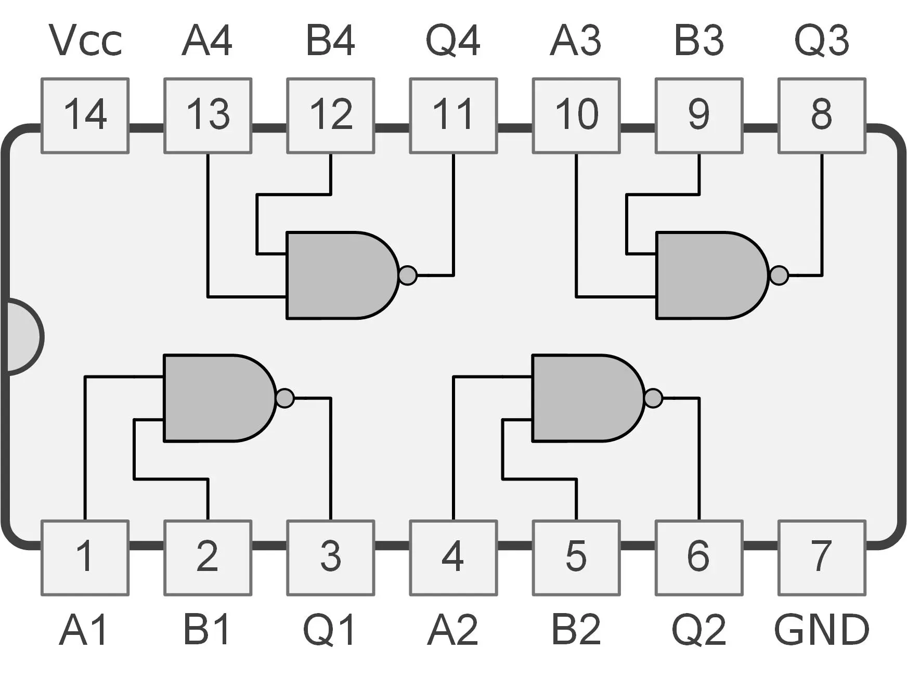

    ### NAND Gate Simplified Diagram
    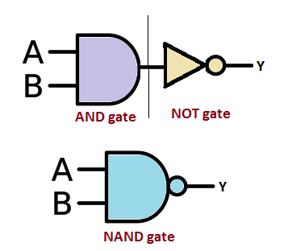

    ### NAND কে connection দেয়ার পরে এমন দেখাবেঃ
    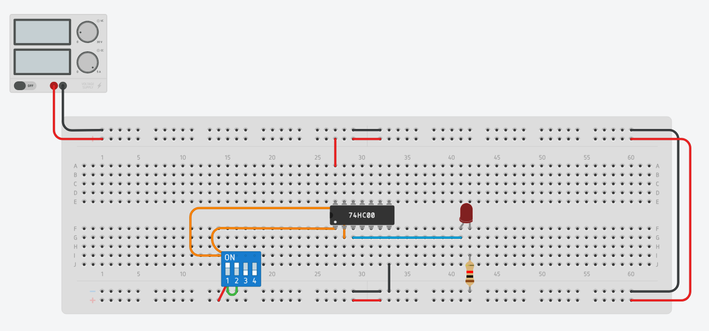
    

    

    ### Try yourself:
    <iframe width="725" height="453" src="https://www.tinkercad.com/embed/2CnOx9jzeqi?editbtn=1" frameborder="0" marginwidth="0" marginheight="0" scrolling="no"></iframe>

---

!!! info "XOR Gate"

    ### XOR Gate Pin Diagram
    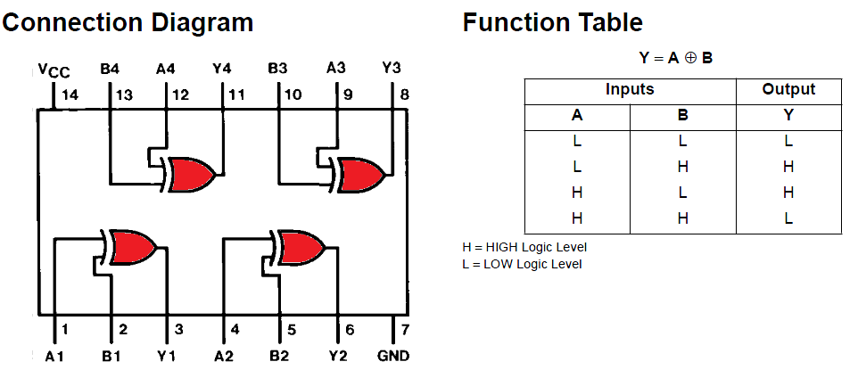
    
    ### XOR কে connection দেয়ার পরে এমন দেখাবেঃ  
    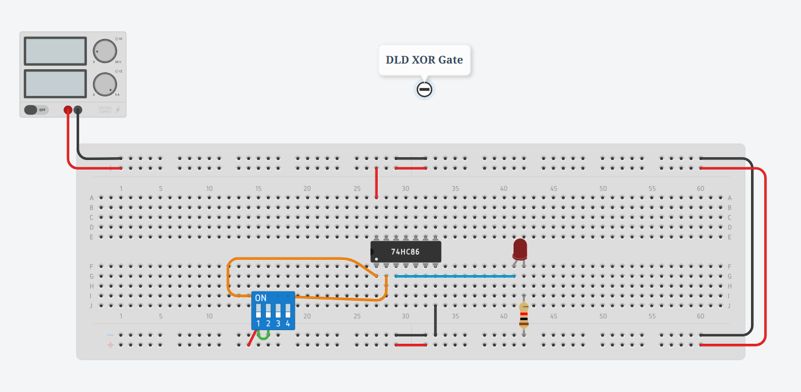

    ###XOR কে connection দেয়ার পরে এমন দেখাবেঃ
    .gif>)

    ### Try yourself:
    <iframe width="725" height="453" src="https://www.tinkercad.com/embed/bm5oKxONhz0" frameborder="0" marginwidth="0" marginheight="0" scrolling="no"></iframe>
---
!!! info "NOR Gate"

    ### NOR Gate Pin Diagram
    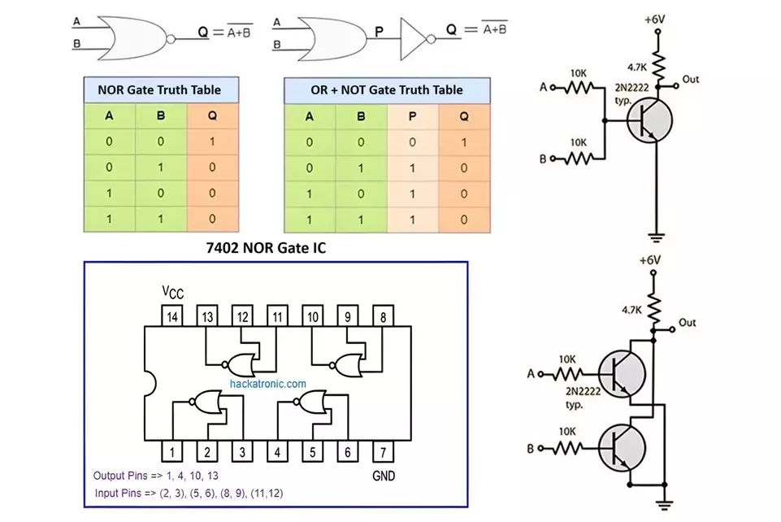
    
    ### NOR কে connection দেয়ার পরে এমন দেখাবেঃ  
    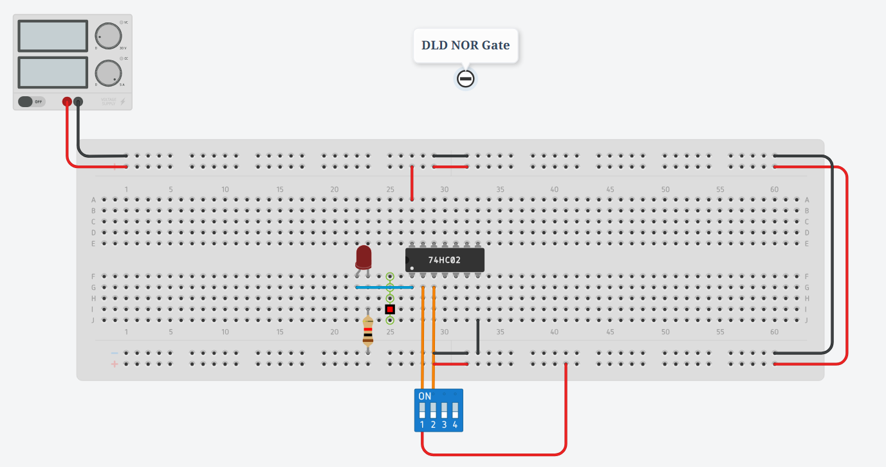
    
    ### NOR কে testing করলে শুধু মাত্র 00 তে LED জ্বলবেঃ  
    
    !!! link "Link to TinkerCad"
        [Link to TinkerCad](https://www.tinkercad.com/things/lN9gnj2TQYg-dld-nor-gate)

    ## Try it yourself:
    <iframe width="725" height="453" src="https://www.tinkercad.com/embed/lN9gnj2TQYg?editbtn=1" frameborder="0" marginwidth="0" marginheight="0" scrolling="no"></iframe>

!!! info "XNOR Gate"

    ### XNOR Gate with Truth table
    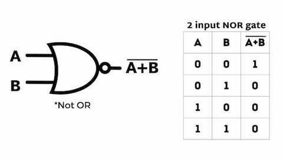

    ## XNOR এর Simplified representation: 
    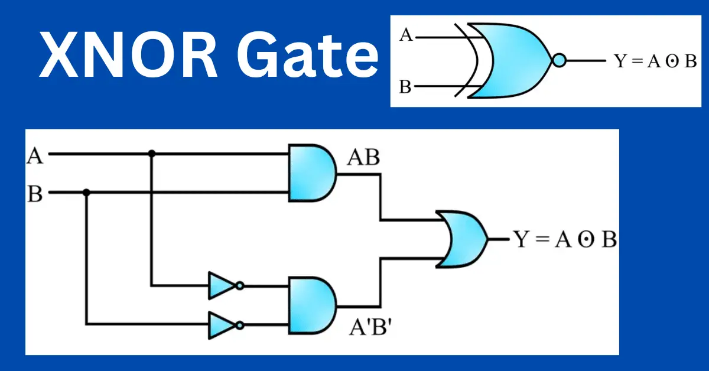
    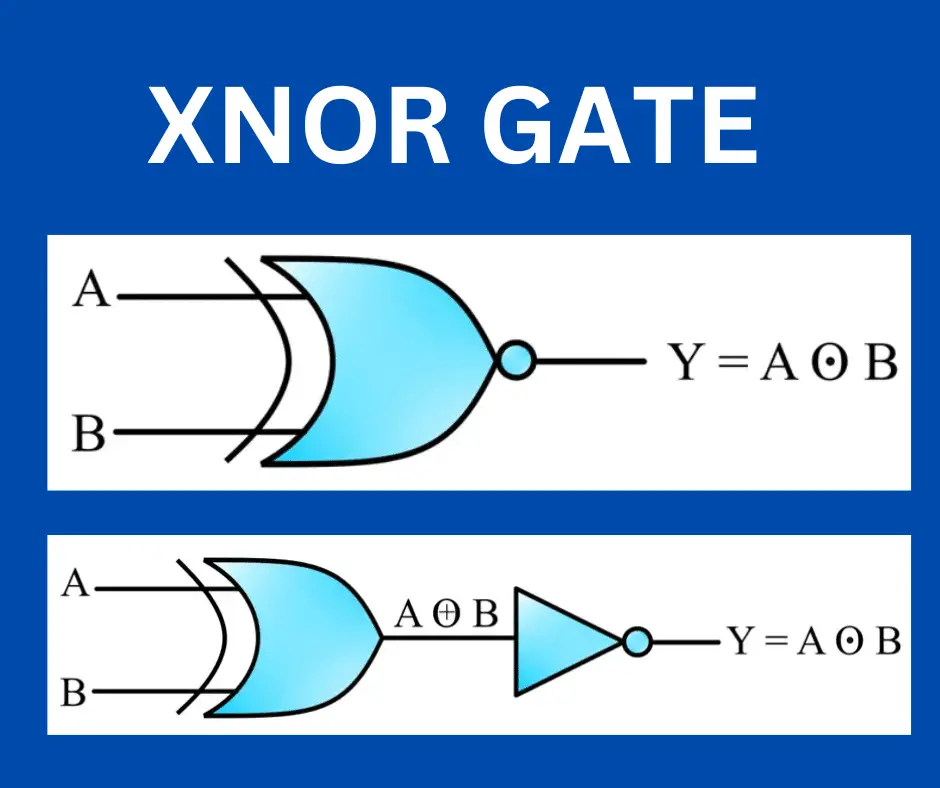
    
    ## XNOR Gate Connection: 
    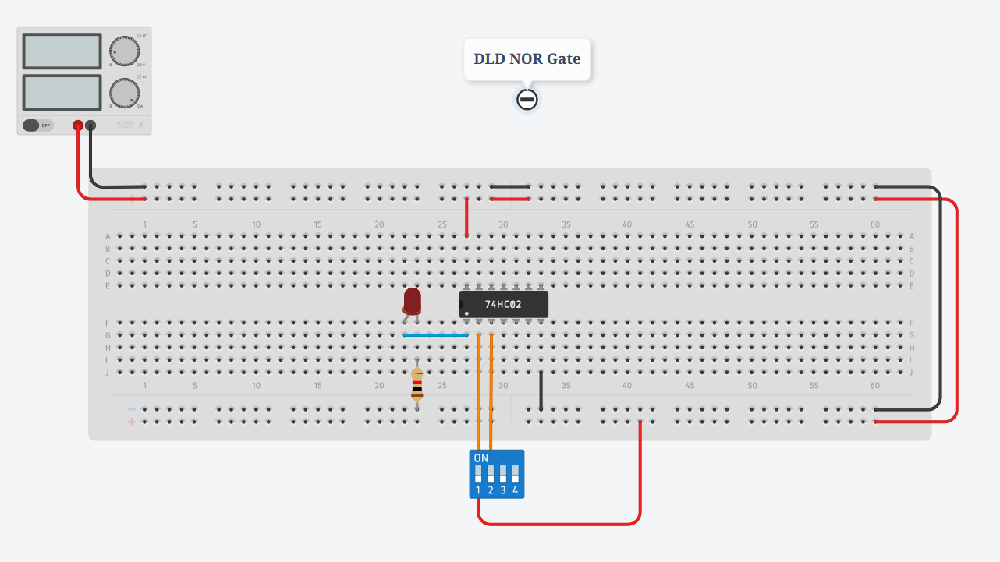
    ### XNOR কে connection দেয়ার পরে এমন দেখাবেঃ
    
    
    
   
    !!! link "Link to TinkerCad"
        [Link to TinkerCad](https://www.tinkercad.com/things/lN9gnj2TQYg-dld-nor-gate)

    

<!-- prettier-ignore-end-->
