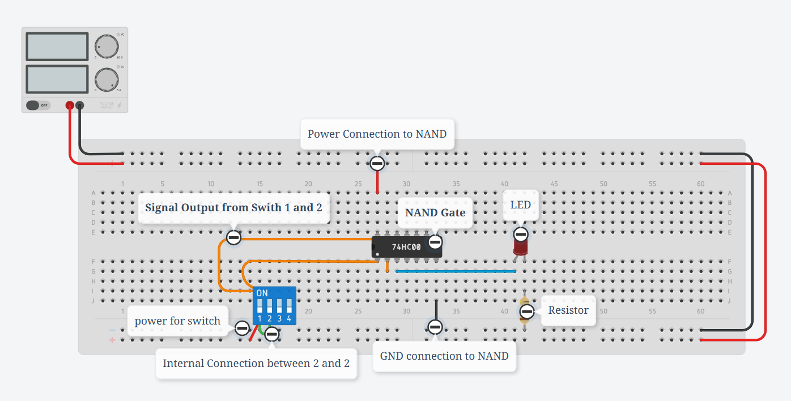
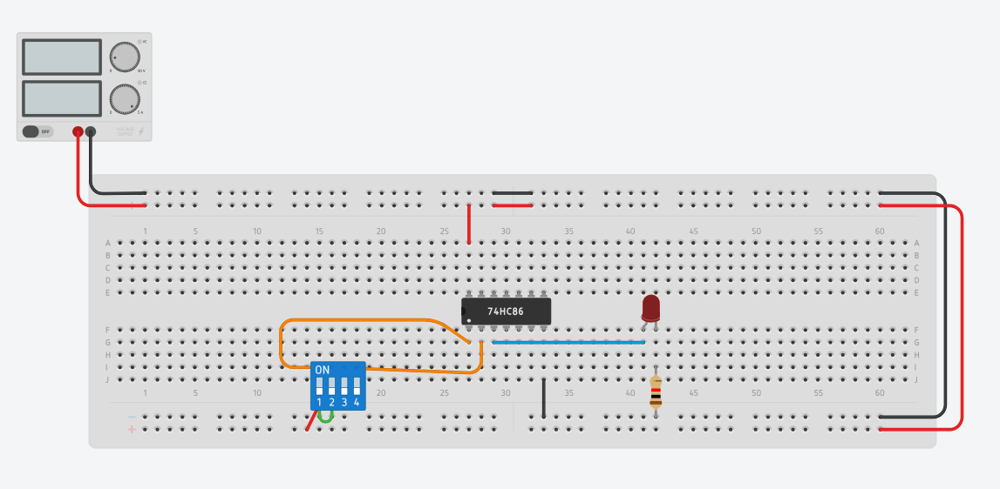

# DLD - Class 04

!!! info "NAND Gate"

    ### NAND Gate Pin Diagram

    

    ### NAND Gate Simplified Diagram
    

    ### NAND কে connection দেয়ার পরে এমন দেখাবেঃ
    

---

!!! info "XOR Gate"

    ### XOR Gate Pin Diagram
    

    

    ###XOR কে connection দেয়ার পরে এমন দেখাবেঃ
    
