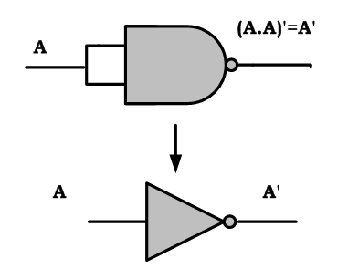

<!-- prettier-ignore-start -->
# Universal Gate implementation

# 🔑 Universal Logic Gates

ডিজিটাল সার্কিটে **NAND Gate** আর **NOR Gate** কে বলা হয় **Universal Logic Gate**।
👉 কারণ শুধু এই দুই ধরনের Gate দিয়েই সব Basic Logic Gate (AND, OR, NOT, XOR, XNOR) তৈরি করা সম্ভব।

---

## 🟩 NAND Universal Logic Gate

!!! note "NOT Gate using NAND"

    <u>
    ## NAND গেট কী?
    </u>

    **NAND গেট** হলো এক ধরনের **Universal Logic Gate**। এটার দুই বা তার বেশি ইনপুট থাকতে পারে এবং আউটপুট থাকে সবসময় একটিই।

    👉 যখন **সব ইনপুট = 1**, তখন আউটপুট হবে **0**।
    👉 অন্য যেকোনো ইনপুট কম্বিনেশনে আউটপুট হবে **1**।

    
    **NAND গেটের প্রতীক (Symbol)**

    দুই ইনপুট NAND গেটের **Truth Table** নিচে দেওয়া হলো:

    | ইনপুট A | ইনপুট B | আউটপুট Y |
    | ------- | ------- | -------- |
    | 0       | 0       | 1        |
    | 0       | 1       | 1        |
    | 1       | 0       | 1        |
    | 1       | 1       | 0        |

    Boolean Function:

    $$
    Y = \overline{AB}
    $$

    এখানে $AB$-এর উপর বার চিহ্নটি নির্দেশ করছে AND এর উল্টো মান বা **NOT operation**।

!!! note "NAND gate as NOT"

    <u>
    ## NAND গেট দিয়ে NOT গেট তৈরি:
    </u>

    এখন দেখা যাক, কিভাবে শুধু NAND গেট ব্যবহার করে **NOT Gate** বানানো যায়।

    NOT গেটের আউটপুট ফাংশন হলো:

    $$
    Y = \overline{A}
    $$

    অন্যদিকে, NAND গেটের আউটপুট হলো:

    $$
    Y = \overline{A \cdot B}
    $$

    👉 যদি আমরা NAND গেটের দুই ইনপুটকে একই সিগন্যাল দিই, অর্থাৎ $A = B = A$, তাহলে:

    $$
    Y = \overline{A \cdot A} = \overline{A}
    $$

    এটাই হচ্ছে **NOT Gate-এর সমান আউটপুট**।

    ## Circuit Diagram

    NOT গেট NAND গেট দিয়ে বানাতে হলে:
    
    * উভয় ইনপুটকে একসাথে শর্ট করে একই ইনপুট দিতে হবে।
    * আউটপুট লাইনে পাওয়া যাবে **উল্টানো মান (Inverter Output)**।

    অন্যভাবে, যদি এক ইনপুটকে Logic 1 দেওয়া হয় এবং অন্য ইনপুটে $A$ দেওয়া হয়, তাহলেও আউটপুট হবে:

    $$
    Y = \overline{A \cdot 1} = \overline{A}
    $$

    ## Conclusion

    আমরা দেখলাম কীভাবে একটি **NAND Gate** ব্যবহার করে **NOT Gate** তৈরি করা যায়। সার্কিট ডায়াগ্রামের সাহায্যে বিষয়টি আরও পরিষ্কার হয়েছে।

### ✅ AND Gate Using NAND Gate

* দরকার হবে 2টা NAND gate |
* 1ম NAND Gate → আউটপুট = $\overline{A \cdot B}$ |
* 2য় NAND Gate → আউটপুট = $\overline{\overline{A \cdot B}} = A \cdot B$ |
* চূড়ান্ত আউটপুট = AND Gate |

---

### ✅ OR Gate Using NAND Gate

* দরকার হবে 3টা NAND gate |
* 1ম NAND Gate → আউটপুট = $\overline{A}$ |
* 2য় NAND Gate → আউটপুট = $\overline{B}$ |
* 3য় NAND Gate → আউটপুট = $\overline{\overline{A} \cdot \overline{B}} = A + B$ |
* চূড়ান্ত আউটপুট = OR Gate |

![[OR-Gate-Using-NAND-Gate.png|OR Gate Using NAND Gate]]
---

### ✅ NOR Gate Using NAND Gate

* দরকার হবে 3টা NAND gate |
* 1ম NAND Gate → আউটপুট = $\overline{A \cdot B}$ |
* 2য় NAND Gate → আউটপুট = $\overline{\overline{A \cdot B}} = A \cdot B$ |
* 3য় NAND Gate → আউটপুট = $\overline{(A \cdot B) \cdot (A \cdot B)} = \overline{A \cdot B}$ |
* চূড়ান্ত আউটপুট = NOR Gate |

![[NOR-Gate-Using-NAND-Gate.png|NOR Gate Using NAND Gate]]

### ✅ XNOR Gate Using NAND Gate

* ধাপে ধাপে NAND ব্যবহার করে আউটপুট = $\overline{A \oplus B}$ |
* চূড়ান্ত আউটপুট = XNOR Gate |

---

### ✅ XOR Gate Using NAND Gate

* দরকার হবে 4টা NAND gate |
* ধাপে ধাপে শেষে আউটপুট = $A \oplus B$ |
* চূড়ান্ত আউটপুট = XOR Gate |

---

## 🟥 NOR Universal Logic Gate

### ✅ AND Gate Using NOR Gate

* দরকার হবে 3টা NOR gate |
* 1ম NOR Gate → আউটপুট = $\overline{A + B}$ |
* 2য় NOR Gate → আউটপুট = $\overline{\overline{A + B}} = A + B$ |
* 3য় NOR Gate → আউটপুট = $\overline{(A + B)} = A \cdot B$ (De Morgan’s Law) |
* চূড়ান্ত আউটপুট = AND Gate |

---

### ✅ OR Gate Using NOR Gate

* দরকার হবে 2টা NOR gate |
* 1ম NOR Gate → আউটপুট = $\overline{A}$, $\overline{B}$ |
* 2য় NOR Gate → আউটপুট = $\overline{\overline{A} + \overline{B}} = A + B$ |
* চূড়ান্ত আউটপুট = OR Gate |

---

### ✅ NAND Gate Using NOR Gate

* দরকার হবে 3টা NOR gate |
* 1ম NOR Gate → আউটপুট = $\overline{A}$ |
* 2য় NOR Gate → আউটপুট = $\overline{B}$ |
* 3য় NOR Gate → আউটপুট = $\overline{\overline{A} + \overline{B}} = A \cdot B$ |
* চূড়ান্ত আউটপুট = NAND Gate |

---

### ✅ XNOR Gate Using NOR Gate

* ধাপে ধাপে NOR ব্যবহার করে আউটপুট = $\overline{A \oplus B}$ |
* চূড়ান্ত আউটপুট = XNOR Gate |

---

### ✅ XOR Gate Using NOR Gate

* দরকার হবে 3টা NOR gate |
* ধাপে ধাপে শেষে আউটপুট = $A \oplus B$ |
* চূড়ান্ত আউটপুট = XOR Gate |

---

📌 **Final Note:**
👉 শুধু NAND Gate অথবা শুধু NOR Gate দিয়েই অন্য সব Logic Gate তৈরি করা যায় | এজন্য এগুলোকে বলা হয় **Universal Logic Gate** |

<!-- prettier-ignore-end-->
