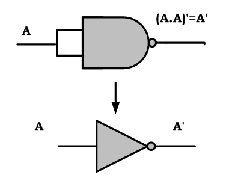
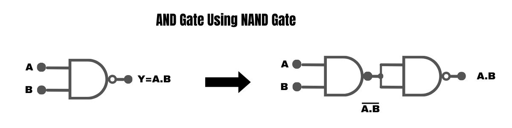
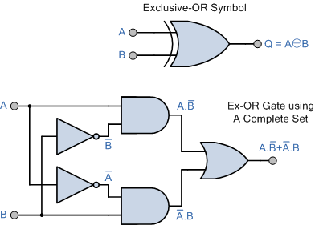
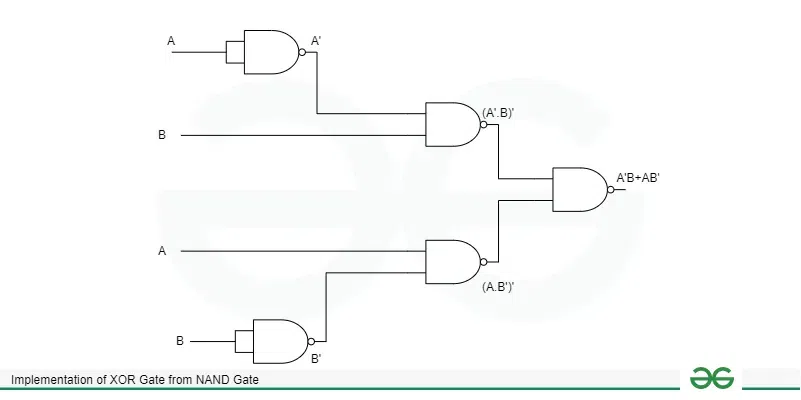
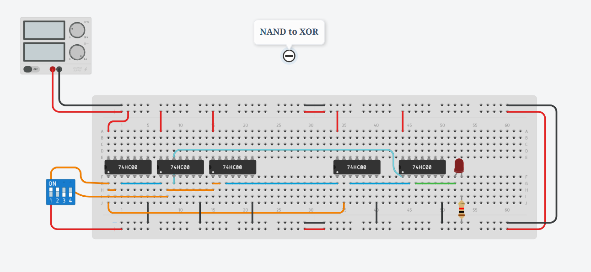
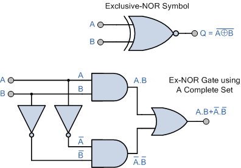
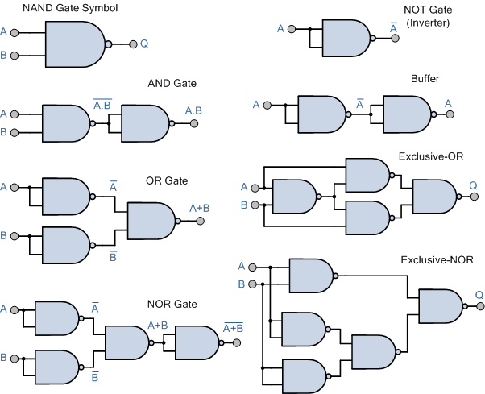
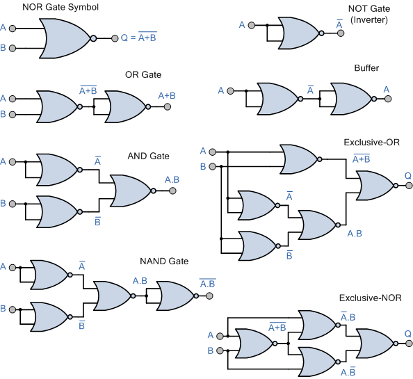

<!-- prettier-ignore-start -->
# Universal Gate implementation

# 🔑 Universal Logic Gates

ডিজিটাল সার্কিটে **NAND Gate** আর **NOR Gate** কে বলা হয় **Universal Logic Gate**।
👉 কারণ শুধু এই দুই ধরনের Gate দিয়েই সব Basic Logic Gate (AND, OR, NOT, XOR, XNOR) তৈরি করা সম্ভব।

---

## 🟩 NAND Universal Logic Gate

!!! note "Explanation of NAND"

    <u>
    ## NAND গেট কী?
    </u>

    **NAND গেট** হলো এক ধরনের **Universal Logic Gate**। এটার দুই বা তার বেশি ইনপুট থাকতে পারে এবং আউটপুট থাকে সবসময় একটিই।

    👉 যখন **সব ইনপুট = 1**, তখন আউটপুট হবে **0**।
    👉 অন্য যেকোনো ইনপুট কম্বিনেশনে আউটপুট হবে **1**।

    
    **NAND গেটের প্রতীক (Symbol)**

    দুই ইনপুট NAND গেটের **Truth Table** নিচে দেওয়া হলো:

    | ইনপুট A | ইনপুট B | আউটপুট Y |
    | ------- | ------- | -------- |
    | 0       | 0       | 1        |
    | 0       | 1       | 1        |
    | 1       | 0       | 1        |
    | 1       | 1       | 0        |

    Boolean Function:

    $$
    Y = \overline{AB}
    $$

    এখানে $AB$-এর উপর বার চিহ্নটি নির্দেশ করছে AND এর উল্টো মান বা **NOT operation**।

!!! note "NAND gate as NOT"

    <u>
    ## NAND গেট দিয়ে NOT গেট তৈরি:
    </u>

    এখন দেখা যাক, কিভাবে শুধু NAND গেট ব্যবহার করে **NOT Gate** বানানো যায়।

    NOT গেটের আউটপুট ফাংশন হলো:

    $$
    Y = \overline{A}
    $$

    অন্যদিকে, NAND গেটের আউটপুট হলো:

    $$
    Y = \overline{A \cdot B}
    $$

    👉 যদি আমরা NAND গেটের দুই ইনপুটকে একই সিগন্যাল দিই, অর্থাৎ $A = B = A$, তাহলে:

    $$
    Y = \overline{A \cdot A} = \overline{A}
    $$

    এটাই হচ্ছে **NOT Gate-এর সমান আউটপুট**।

    ## Circuit Diagram

    NOT গেট NAND গেট দিয়ে বানাতে হলে:
   
    
    * উভয় ইনপুটকে একসাথে শর্ট করে একই ইনপুট দিতে হবে।
    * আউটপুট লাইনে পাওয়া যাবে **উল্টানো মান (Inverter Output)**।

    অন্যভাবে, যদি এক ইনপুটকে Logic 1 দেওয়া হয় এবং অন্য ইনপুটে $A$ দেওয়া হয়, তাহলেও আউটপুট হবে:

    $$
    Y = \overline{A \cdot 1} = \overline{A}
    $$

    ## Conclusion

    আমরা দেখলাম কীভাবে একটি **NAND Gate** ব্যবহার করে **NOT Gate** তৈরি করা যায়। সার্কিট ডায়াগ্রামের সাহায্যে বিষয়টি আরও পরিষ্কার হয়েছে।

### ✅ AND Gate Using NAND Gate

* দরকার হবে 2টা NAND gate |
* 1ম NAND Gate → আউটপুট = $\overline{A \cdot B}$ |
* 2য় NAND Gate → আউটপুট = $\overline{\overline{A \cdot B}} = A \cdot B$ |
* চূড়ান্ত আউটপুট = AND Gate |

---

### ✅ OR Gate Using NAND Gate

((AA)'(BB)')'= (A'B')'   (By Idempotent Law)
= A''+B''   (By De Morgan’s Law)
= A+B     ( By involution Law)

* দরকার হবে 3টা NAND gate |
* 1ম NAND Gate → আউটপুট = $\overline{A}$ |
* 2য় NAND Gate → আউটপুট = $\overline{B}$ |
* 3য় NAND Gate → আউটপুট = $\overline{\overline{A} \cdot \overline{B}} = A + B$ |
* চূড়ান্ত আউটপুট = OR Gate |

---

### ✅ NOR Gate Using NAND Gate

* দরকার হবে 3টা NAND gate |
* 1ম NAND Gate → আউটপুট = $\overline{A \cdot B}$ |
* 2য় NAND Gate → আউটপুট = $\overline{\overline{A \cdot B}} = A \cdot B$ |
* 3য় NAND Gate → আউটপুট = $\overline{(A \cdot B) \cdot (A \cdot B)} = \overline{A \cdot B}$ |
* চূড়ান্ত আউটপুট = NOR Gate |

!!! note "XOR Gate Using NAND Gate"
        
    * দরকার হবে 4টা NAND gate.
    * ধাপে ধাপে শেষে আউটপুট = $A \oplus B$ .
    * চূড়ান্ত আউটপুট = XOR Gate.

    
    **FULL Implementation:**
    

    # What is a XOR Gate?

    XOR (Exclusive-OR) Gate হলো এক ধরনের derived logic gate। XOR gate-এর দুটি ইনপুট এবং একটি আউটপুট থাকে। যখন দুটি ইনপুটের মধ্যে একটিমাত্র ইনপুট HIGH (Logic 1) হয়, তখনই আউটপুট HIGH (Logic 1) হবে। কিন্তু যখন উভয় ইনপুট HIGH (Logic 1) অথবা উভয় ইনপুট LOW (Logic 0), তখন XOR gate-এর আউটপুট LOW (Logic 0) হবে। Figure-1 এ XOR gate-এর লজিক সিম্বল দেখানো হয়েছে।

    ### Implementation of XOR Gate From NAND Gate 1

    সুতরাং, XOR gate শুধুমাত্র তখনই HIGH আউটপুট দেয় যখন এর ইনপুটগুলো সমান না হয়। এজন্য XOR gate-কে "anti-coincidence gate" বা "inequality detector" ও বলা হয়।

    ### Output Equation of XOR Gate

    XOR gate-এর আউটপুট হলো ইনপুটের modulo sum, অর্থাৎ

    $$
    Y = A \oplus B = A\overline{B} + \overline{A}B
    $$

    এখানে, A এবং B হলো XOR gate-এর দুটি ইনপুট ভ্যারিয়েবল, আর Y হলো আউটপুট ভ্যারিয়েবল। আউটপুট সমীকরণটি পড়া যায় এভাবে: **Y = A ex-or B**।

    ### Truth Table of XOR Gate

    নিচে XOR gate-এর truth table দেওয়া হলো যেখানে ইনপুট ও আউটপুটের সম্পর্ক দেখানো হয়েছে।

    | A | B | Output (Y = A·B̅ + A̅·B) |
    |---|---|-------------------------|
    | 0 | 0 | 0 |
    | 0 | 1 | 1 |
    | 1 | 0 | 1 |
    | 1 | 1 | 0 |

    # What is a NAND Gate?

    NAND Gate হলো এক ধরনের **universal logic gate**, যেটি ব্যবহার করে যেকোনো ধরনের লজিক্যাল এক্সপ্রেশন বা অন্য যেকোনো logic gate বাস্তবায়ন করা যায়। একটি NAND gate মূলত AND gate এবং NOT gate-এর সমন্বয়। অর্থাৎ,

    $$
    \text{NAND Logic} = \text{AND Logic} + \text{NOT Logic}
    $$

    NAND gate-এর আউটপুট LOW (Logic 0) হবে শুধুমাত্র তখনই যখন সব ইনপুট HIGH থাকবে। অন্য যেকোনো অবস্থায় এর আউটপুট HIGH (Logic 1) হবে। তাই NAND gate-এর কার্যপ্রণালী AND gate-এর উল্টো। Figure-2 তে একটি two-input NAND gate-এর লজিক সিম্বল দেখানো হয়েছে।

    ### Implementation of XOR Gate From NAND Gate 2

    ### Output Equation of NAND Gate

    যদি A এবং B ইনপুট ভ্যারিয়েবল হয় এবং Y আউটপুট ভ্যারিয়েবল হয়, তাহলে আউটপুট হবে:

    $$
    Y = \overline{(A \cdot B)}
    $$

    এটি পড়া যায়: **Y = A·B whole bar**।

    ### Truth Table of NAND Gate

    নিচে NAND gate-এর truth table দেখানো হলো:

    | A | B | Output ($Y = \overline{(A \cdot B)}$) |
    |---|---|--------------------------------------|
    | 0 | 0 | 1 |
    | 0 | 1 | 1 |
    | 1 | 0 | 1 |
    | 1 | 1 | 0 |

    ---

    # Implementation of XOR Gate from NAND Gate

    উপরে যেমন আলোচনা করা হয়েছে, NAND gate একটি universal logic। অর্থাৎ এটি ব্যবহার করে অন্য যেকোনো logic gate তৈরি করা সম্ভব। Figure-3 তে দেখানো হয়েছে কীভাবে শুধুমাত্র NAND gate ব্যবহার করে একটি XOR gate বাস্তবায়ন করা যায়।

    ### Implementation of XOR Gate From NAND Gate 3

    Logic circuit diagram থেকে দেখা যাচ্ছে XOR gate তৈরি করতে মোট **৪টি NAND gate** প্রয়োজন।

    এখন দেখি এই NAND logic circuit কীভাবে কাজ করে এবং XOR gate-এর সমান আউটপুট দেয়।

    প্রথম NAND gate-এর আউটপুট:

    $$
    Y_1 = \overline{(A \cdot B)}
    $$

    দ্বিতীয় এবং তৃতীয় NAND gate-এর আউটপুট:

    $$
    Y_2 = \overline{(A \cdot Y_1)} = \overline{(A \cdot \overline{(A \cdot B)})}
    $$

    $$
    Y_3 = \overline{(B \cdot Y_1)} = \overline{(B \cdot \overline{(A \cdot B)})}
    $$

    শেষে, এই দুইটি আউটপুট (Y2 এবং Y3) চতুর্থ NAND gate-এ দেওয়া হলে আউটপুট হবে:

    $$
    Y = \overline{(Y_2 \cdot Y_3)}
    $$

    ⇒ $$ Y = A\overline{B} + \overline{A}B $$  

    ⇒ $$ Y = A \oplus B $$

    !!! Success "আরেকটু details এ"

        
        1. **XOR Gate Expression:**

        $$
        Y = \overline{A}B + A\overline{B}
        $$

        2. **Double complement form:**

        $$
        \big[\,( \overline{A}B + A\overline{B} )'\,\big]'
        $$

        3. **Internal complement:**

        $$
        \big[\,(\overline{A}B)' \cdot (A\overline{B})'\,\big]'
        $$

        4. **Final NAND form (De-Morgan’s Law):**

        $$
        Y = \big((\overline{A}B)' \cdot (A\overline{B})'\big)' \;=\; \overline{A}B + A\overline{B}
        $$

        

    
    এটাই হলো XOR gate-এর আউটপুট। সুতরাং, শুধুমাত্র NAND gate ব্যবহার করেও XOR gate বাস্তবায়ন করা সম্ভব।

### ✅ XNOR Gate Using NAND Gate
!!! info "XNOR"

        
    * ধাপে ধাপে NAND ব্যবহার করে আউটপুট = $\overline{A \oplus B}$ |
    * চূড়ান্ত আউটপুট = XNOR Gate |

    

    
    ---

    # What is a XNOR Gate?

    XNOR (Exclusive-NOR) Gate হলো এক ধরনের derived logic gate। XNOR gate-এর দুটি ইনপুট এবং একটি আউটপুট থাকে। যখন দুটি ইনপুট সমান হয় (উভয়ই HIGH বা উভয়ই LOW), তখন আউটপুট HIGH (Logic 1) হয়। আর ইনপুট আলাদা হলে আউটপুট LOW (Logic 0) হয়। Figure-1 এ XNOR gate-এর লজিক সিম্বল দেখানো হয়েছে।

    ### Output Equation of XNOR Gate

    $$
    Y = \overline{(A \oplus B)} = AB + \overline{A}\,\overline{B}
    $$

    ---

    ### Truth Table of XNOR Gate

    | A | B | Output ($Y = \overline{(A \oplus B)}$) |
    | - | - | ---------------------------------------- |
    | 0 | 0 | 1                                        |
    | 0 | 1 | 0                                        |
    | 1 | 0 | 0                                        |
    | 1 | 1 | 1                                        |

    ---

    # What is a NAND Gate?

    NAND Gate হলো এক ধরনের **universal logic gate**। এটি ব্যবহার করে যেকোনো logic gate তৈরি করা যায়। NAND gate মূলত AND + NOT এর সমন্বয়।

    ### Output Equation of NAND Gate

    $$
    Y = \overline{(A \cdot B)}
    $$

    ---

    ### Truth Table of NAND Gate

    | A | B | Output ($Y = \overline{(A \cdot B)}$) |
    | - | - | --------------------------------------- |
    | 0 | 0 | 1                                       |
    | 0 | 1 | 1                                       |
    | 1 | 0 | 1                                       |
    | 1 | 1 | 0                                       |

    ---

    # Implementation of XNOR Gate from NAND Gate

    NAND gate একটি **universal logic gate**, তাই এটি ব্যবহার করে XNOR gate তৈরি করা যায়। নিচের লজিক সার্কিটে ৫টি NAND gate ব্যবহার করে একটি XNOR gate বাস্তবায়ন দেখানো হয়েছে (Figure-3)।

    ### ধাপে ধাপে আউটপুট নির্ণয়

    প্রথম NAND gate-এর আউটপুট:

    $$
    Y_1 = \overline{(A \cdot B)}
    $$

    দ্বিতীয় NAND gate-এর আউটপুট:

    $$
    Y_2 = \overline{(A \cdot Y_1)} = \overline{(A \cdot \overline{(A \cdot B)})}
    $$

    তৃতীয় NAND gate-এর আউটপুট:

    $$
    Y_3 = \overline{(B \cdot Y_1)} = \overline{(B \cdot \overline{(A \cdot B)})}
    $$

    চতুর্থ NAND gate-এর আউটপুট:

    $$
    Y_4 = \overline{(Y_2 \cdot Y_3)}
    $$

    শেষে, পঞ্চম NAND gate-এ \$Y\_1\$ এবং \$Y\_4\$ দিলে পাওয়া যায়:

    $$
    Y = \overline{(Y_1 \cdot Y_4)}
    $$

    এখন expand করলে:

    ⇒ $Y = AB + \overline{A}\,\overline{B}$
    ⇒ $Y = \overline{(A \oplus B)}$

    ---

    ✅ এইভাবেই শুধুমাত্র NAND gate ব্যবহার করে XNOR gate তৈরি করা সম্ভব।

#### Try yourself:
<iframe width="725" height="453" src="https://www.tinkercad.com/embed/j8jAf8DulsT?editbtn=1" frameborder="0" marginwidth="0" marginheight="0" scrolling="no"></iframe>

---
## Universal Logic Gates using only NAND Gates

---

## 🟥 NOR Universal Logic Gate

### ✅ AND Gate Using NOR Gate

* দরকার হবে 3টা NOR gate |
* 1ম NOR Gate → আউটপুট = $\overline{A + B}$ |
* 2য় NOR Gate → আউটপুট = $\overline{\overline{A + B}} = A + B$ |
* 3য় NOR Gate → আউটপুট = $\overline{(A + B)} = A \cdot B$ (De Morgan’s Law) |
* চূড়ান্ত আউটপুট = AND Gate |

---

### ✅ OR Gate Using NOR Gate

* দরকার হবে 2টা NOR gate |
* 1ম NOR Gate → আউটপুট = $\overline{A}$, $\overline{B}$ |
* 2য় NOR Gate → আউটপুট = $\overline{\overline{A} + \overline{B}} = A + B$ |
* চূড়ান্ত আউটপুট = OR Gate |

---

### ✅ NAND Gate Using NOR Gate

* দরকার হবে 3টা NOR gate |
* 1ম NOR Gate → আউটপুট = $\overline{A}$ |
* 2য় NOR Gate → আউটপুট = $\overline{B}$ |
* 3য় NOR Gate → আউটপুট = $\overline{\overline{A} + \overline{B}} = A \cdot B$ |
* চূড়ান্ত আউটপুট = NAND Gate |

---

### ✅ XNOR Gate Using NOR Gate

* ধাপে ধাপে NOR ব্যবহার করে আউটপুট = $\overline{A \oplus B}$ |
* চূড়ান্ত আউটপুট = XNOR Gate |

---

### ✅ XOR Gate Using NOR Gate

* দরকার হবে 3টা NOR gate |
* ধাপে ধাপে শেষে আউটপুট = $A \oplus B$ |
* চূড়ান্ত আউটপুট = XOR Gate |

# Universal Logic Gates using only NOR Gates

---

📌 **Final Note:**
👉 শুধু NAND Gate অথবা শুধু NOR Gate দিয়েই অন্য সব Logic Gate তৈরি করা যায় | এজন্য এগুলোকে বলা হয় **Universal Logic Gate** |

<!-- prettier-ignore-end-->
