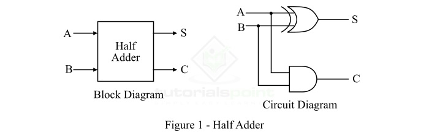
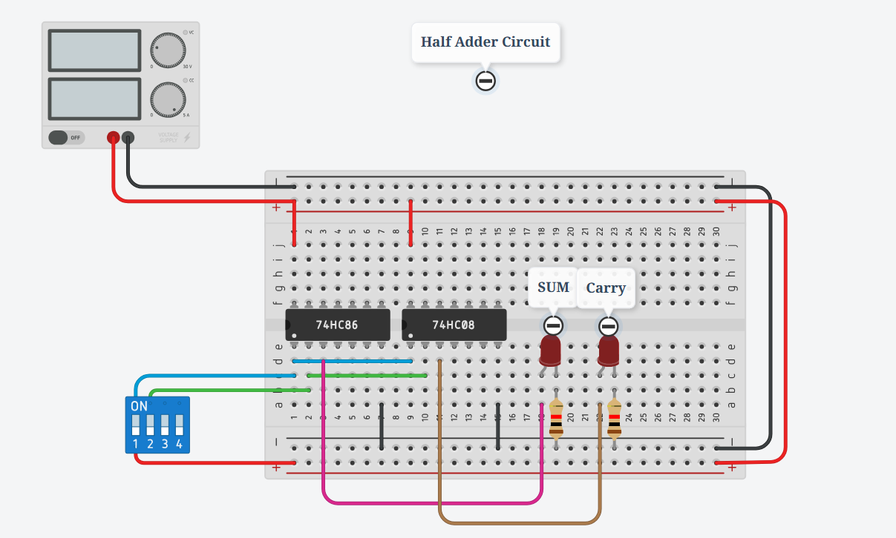
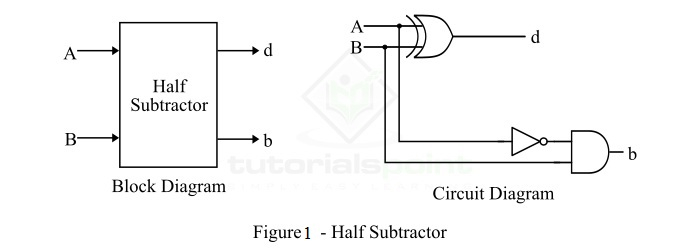
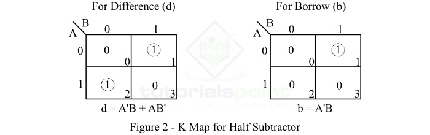
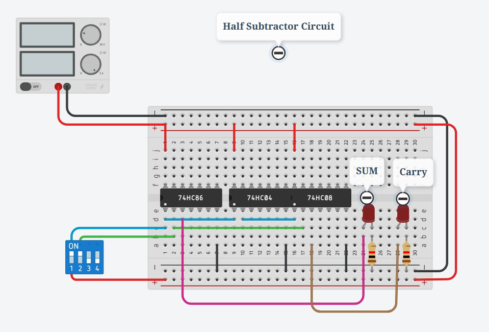

# Half Adder in Digital Electronics

Addition is one of the most fundamental arithmetic operations performed by electronic devices such as computers and calculators. In digital electronics, the circuit that performs the addition of binary numbers is known as an **Adder**. Since these circuits operate on binary numbers, they are specifically referred to as **Binary Adders**.

Depending on the number of bits they can process, adders are classified into two main types:

- **Half Adder**
- **Full Adder**

In this article, we will focus on the **Half Adder**, its definition, working principle, circuit diagrams, truth table, K-Map simplification, characteristic equations, and applications.

## What is a Half Adder?

A **Half Adder** is a combinational logic circuit designed to add two single-bit binary numbers. It produces two outputs:

- **Sum (S)** – the result of the binary addition
- **Carry (C)** – the overflow from the addition

The circuit of a half adder is built using:

- **XOR Gate** (for the Sum)
- **AND Gate** (for the Carry)

It has **two input terminals** (A, B) and **two output terminals** (S, C).

## Circuit Representation

- **Block Diagram** – Abstract representation showing inputs and outputs.
- **Logic Circuit Diagram** – Practical realization using an XOR and an AND gate.

Here,

- `A` and `B` are the inputs,
- `S` is the sum, and
- `C` is the carry output.

## Operation of Half Adder

The half adder performs binary addition based on the following rules:

- 0 + 0 = 0
- 0 + 1 = 1
- 1 + 0 = 1
- 1 + 1 = 10 → (Sum = 0, Carry = 1)

From these rules:

- For three cases, the result fits in a single bit.
- When both inputs are `1`, the result requires two bits: a **Sum = 0** and a **Carry = 1**.

## Truth Table of Half Adder

| Input A | Input B | Sum (S) | Carry (C) |
| ------- | ------- | ------- | --------- |
| 0       | 0       | 0       | 0         |
| 0       | 1       | 1       | 0         |
| 1       | 0       | 1       | 0         |
| 1       | 1       | 0       | 1         |

## K-Map Simplification

Using Karnaugh Maps (K-Maps), the Boolean expressions for the outputs are simplified as:

- **Sum (S)** = A ⊕ B = A′B + AB′
- **Carry (C)** = A · B

## Characteristic Equations

- **Sum Equation**:

$$
S = A \oplus B = A'B + AB'
$$

- **Carry Equation**:

$$
C = A \cdot B
$$

#### Simulation on TinkerCad: 

<iframe width="1258" height="619" src="https://www.youtube.com/embed/V-__-oLekYM" title="Half Adder TinkerCad Truth table check | TinkerCad | Halal Coder" frameborder="0" allow="accelerometer; autoplay; clipboard-write; encrypted-media; gyroscope; picture-in-picture; web-share" referrerpolicy="strict-origin-when-cross-origin" allowfullscreen></iframe>

## Applications of Half Adder

- Used in **Arithmetic Logic Units (ALUs)** of processors.
- Building block for designing a **Full Adder**.
- Found in **calculators** for basic binary addition.
- Useful in **address generation** and **table computations**.

## Conclusion

The Half Adder is one of the simplest arithmetic circuits in digital electronics. It adds two binary digits and produces both sum and carry outputs. However, its **limitation** is that it cannot handle the carry generated from a previous addition stage. To overcome this, **Full Adders** are used in complex digital systems.

---

# Half Subtractor in Digital Electronics

In digital electronics, a **subtractor** is a combinational logic circuit that can perform the subtraction of two numbers (binary numbers) and produce the difference between them. It is a combinational circuit, which means its output depends on its present inputs only. Although, in practice, the subtraction of two binary numbers is accomplished by taking the 1's or 2's complement of the subtrahend and adding it to the minuend.

In this way, the subtraction operation of binary numbers can be converted into a simple addition operation, which makes hardware construction simple and less expensive. There are two types of subtractors namely:

* Half Subtractor
* Full Subtractor

In this article, we will discuss the **half subtractor**, its basic definition, circuit diagram, truth table, characteristic equation, etc.

---

## What is a Half-Subtractor?

A **half subtractor** is a combinational logic circuit that has two inputs and two outputs (i.e., difference and borrow). The half subtractor produces the difference between the two binary bits at the input and also produces a borrow output (if any).

In the subtraction (A − B):

* **A** is called the *Minuend bit*
* **B** is called the *Subtrahend bit*

The block diagram and logic circuit diagram of the half subtractor is shown in **Figure 1**.

### Half Subtractor Block Diagram & Circuit Diagram

* From the logic circuit diagram, it is clear that a half subtractor can be realized using an **XOR gate** together with a **NOT gate** and an **AND gate**.
* In the half subtractor (Figure-1), A and B are the inputs, d and b are the outputs.
* Here, **d** indicates the *difference* and **b** indicates the *borrow*.
* The borrow output (b) is the signal that tells the next stage that a 1 has been borrowed.

---

## Operation of Half Subtractor

The half subtractor finds the difference of two binary digits according to the rules of binary subtraction:

* 0 − 0 = 0 (Difference = 0, Borrow = 0)

* 0 − 1 = 1 (Difference = 1, Borrow = 1)

* 1 − 0 = 1 (Difference = 1, Borrow = 0)

* 1 − 1 = 0 (Difference = 0, Borrow = 0)

* The output borrow (b) is **0** as long as the minuend bit (A) is greater than or equal to the subtrahend bit (B).

* The output borrow is **1** when A = 0 and B = 1.

From the logic diagram:

* **Difference (d)** is obtained by the XOR operation of A and B.
* **Borrow (b)** is obtained by the AND operation of the complement of A (A′) with B.

---

## Truth Table of Half Subtractor

| A (Input) | B (Input) | D (Difference) | B (Borrow) |
| --------- | --------- | -------------- | ---------- |
| 0         | 0         | 0              | 0          |
| 0         | 1         | 1              | 1          |
| 1         | 0         | 1              | 0          |
| 1         | 1         | 0              | 0          |

## K-Map for Half Subtractor

We can use the **K-Map (Karnaugh Map)** method to simplify the Boolean equations of the difference bit (d) and the borrow bit (b).

The K-Map simplification for the half subtractor is shown in **Figure 2**.

## Characteristic Equations of Half Subtractor

The characteristic equations of the half subtractor are:

* **Difference (d):**

$$
d = A \oplus B = A′B + AB′
$$

* **Borrow (b):**

$$
b = A′B
$$

<iframe width="1258" height="619" src="https://www.youtube.com/embed/uZz0RJ-BHnM" title="Half Subtractor TinkerCad Truth table check" frameborder="0" allow="accelerometer; autoplay; clipboard-write; encrypted-media; gyroscope; picture-in-picture; web-share" referrerpolicy="strict-origin-when-cross-origin" allowfullscreen></iframe>

## Applications of Half Subtractor

* Used in **ALUs (Arithmetic Logic Units)** of processors.
* Can be used in **amplifiers** to compensate sound distortion.
* Used to decrease the strength of **radio or audio signals**.
* Applied in **increment/decrement operations**.

---

## Conclusion

From the above discussion, we can conclude that a **half subtractor** is a combinational logic circuit that calculates the difference of two binary digits.

However, it can only subtract the **Least Significant Bit (LSB)** of the subtrahend from the LSB of the minuend when one binary number is subtracted from another. For multi-bit subtraction, a **Full Subtractor** is required.

---

