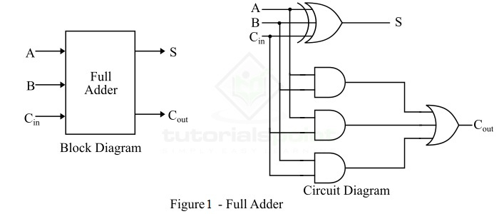
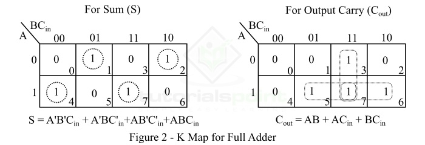
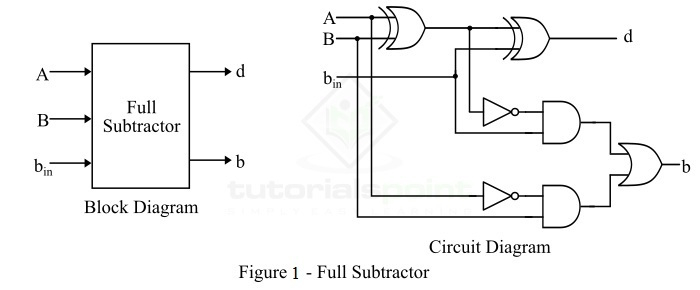
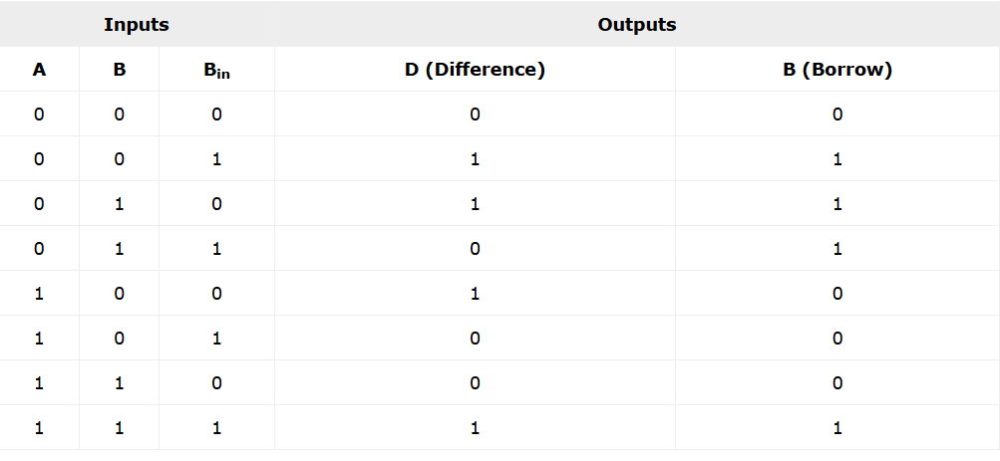
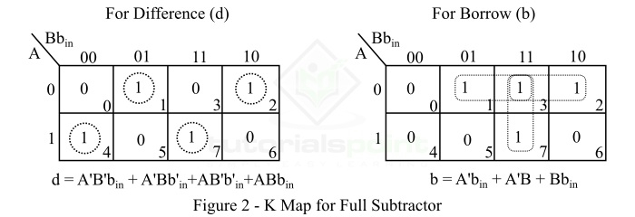

## ✅ **6.1: Full Adder দিয়ে circuit করে TinkerCad এ submit করতে হবে।**

### What is a Full Adder?

A combinational logic circuit that can add two binary digits (bits) and a carry bit, and produces a sum bit and a carry bit as output is known as a **full-adder**.

In other words, a combinational circuit which is designed to add three binary digits and produces two outputs (sum and carry) is known as a full adder. Thus, a full adder circuit adds three binary digits, where two are the inputs and one is the carry forwarded from the previous addition. The block diagram and circuit diagram of the full adder are shown in Figure-1.

Hence, the circuit of the full adder consists of one EX-OR gate, three AND gates and one OR gate, which are connected together as shown in the full adder circuit in Figure-1.

### Operation of Full Adder

Full adder takes three inputs namely A, B, and ( $C_{in}$ ). Where, A and B are the two binary digits, and ( $C_{in}$ ) is the carry bit from the previous stage of binary addition.

The sum output of the full adder is obtained by XORing the bits A, B, and ( $C_{in}$ ).
While the carry output bit (( $C_{out}$ )) is obtained using AND and OR operations.

### Truth Table of Full Adder

| **A** | **B** | **Cₙ (Cin)** | **S (Sum)** | **Cout (Carry)** |
| :---: | :---: | :----------: | :---------: | :--------------: |
|   0   |   0   |       0      |      0      |         0        |
|   0   |   0   |       1      |      1      |         0        |
|   0   |   1   |       0      |      1      |         0        |
|   0   |   1   |       1      |      0      |         1        |
|   1   |   0   |       0      |      1      |         0        |
|   1   |   0   |       1      |      0      |         1        |
|   1   |   1   |       0      |      0      |         1        |
|   1   |   1   |       1      |      1      |         1        |

Hence, from the truth table, it is clear that the sum output of the full adder is equal to 1 when only 1 input is equal to 1 or when all the inputs are equal to 1.
While the carry output has a carry of 1 if two or three inputs are equal to 1.

### K-Map for Full Adder

K-Map (Karnaugh Map) is a tool for simplifying binary complex Boolean algebraic expressions.
The K-Map for full adder is shown in Figure-2.

\[
S = A'B'C_{in} + A'BC'*{in} + AB'C'*{in} + ABC_{in}
\]

\[
C_{out} = AB + AC_{in} + BC_{in}
\]

### Characteristic Equations of Full Adder

The characteristic equations of the full adder, i.e. equations of sum (S) and carry output (( C_{out} )) are obtained according to the rules of binary addition.
These equations are given below −

The sum (S) of the full-adder is the XOR of A, B, and ( C_{in} ). Therefore,

\[
S = A \oplus B \oplus C_{in} = A'B'C_{in} + A'BC'*{in} + AB'C'*{in} + ABC_{in}
\]

The carry (C) of the full-adder is the AND of A and B. Therefore,

\[
C_{out} = AB + AC_{in} + BC_{in}
\]

### Advantages of Full Adder

The following are the important advantages of full adder over half adder −

* Full adder provides facility to add the carry from the previous stage.
* The power consumed by the full adder is relatively less as compared to half adder.
* Full adder can be easily converted into a half subtractor just by adding a NOT gate in the circuit.
* Full adder produces higher output than half adder.
* Full adder is one of the essential parts of critical digital circuits like multiplexers.
* Full adder performs operation at higher speed.

Given Equation:

\[
S=\overline{A}.\overline{B}.C_{in}+\overline{A}.B.\overline{C_{in}}+A.\overline{B}.\overline{C_{in}}+A.B.C_{in}
\]

**১) (A) অনুযায়ী গ্রুপ করি**

\[S=\overline{A}.(\overline{B}.C_{in}+B.\overline{C_{in}});+;A.(\overline{B}.\overline{C_{in}}+B,C_{in})\]

**২) ভেতরের টার্ম দুটো চিনো**

* $(\overline{B}.C_{in}+B.\overline{C_{in}}=B\oplus C_{in})$
  (কারণ $(X\oplus Y=\overline{X}Y+X\overline{Y}))$
* $(\overline{B}.\overline{C_{in}}+B.C_{in}=B\odot C_{in}=(B\oplus C_{in})^{\overline{\phantom{a}}})$

তাই,

$$
[
S=\overline{A}.(B\oplus C_{in});+;A.(B\oplus C_{in})^{\overline{\phantom{a}}}
]
$$

**৩) পরিচয় ব্যবহার করি:** $(\overline{A},Y+A,\overline{Y}=A\oplus Y) যেখানে (Y=B\oplus C_{in})$

\[
S=A \oplus (B\oplus C_{in})
\]

**৪) XOR অ্যাসোসিয়েটিভ ⇒**

$$
\boxed{S=A\oplus B\oplus C_{in}}
$$

### Applications of Full Adder

The following are the important applications of full adder −

* Full adders are used in **ALUs (Arithmetic Logic Units)** of CPUs of computers.
* Full adders are used in calculators.
* Full adders also help in carrying out multiplication of binary numbers.
* Full adders are also used to realize critical digital circuits like multiplexers.
* Full adders are used to generate memory addresses.
* Full adders are also used in generation of program counter points.
* Full adders are also used in **GPU (Graphical Processing Unit)**.

### Conclusion

In this tutorial, we discussed all the key concepts related to full adders in digital electronics.
Full adders play an important role in many digital electronic circuits because a full adder can be used to realize several other critical digital circuits.

---

##  ✅ 6.2: Full Subtractor দিয়ে circuit করে TinkerCad এ submit করতে হবে।

### What is a Full-Subtractor?

A full-subtractor is a combinational circuit that has three inputs A, B, bin and two outputs d and b. Where, A is the minuend (বিয়োজ্য), B is subtrahend, bin is borrow produced by the previous stage, d is the difference output and b is the borrow output.

As we know that the half-subtractor can only be used for subtraction of LSB (least significant bit) of binary numbers. If there is any borrow during the subtraction of the LSBs of two binary numbers, then it will affect the subtraction of next stages. Therefore, the subtraction with borrow are performed by a full subtractor.

The block diagram and circuit diagram of a full-subtractor is shown in Figure-1.

Therefore, we can realize the full-subtractor using two XOR gates, two NOT gates, two AND gates, and one OR gate.

---

### Operation of Full Subtractor

Now, let us understand the operation of the full subtractor. Full subtractor performs its operation to find the difference of two binary numbers according to the rules of binary subtraction, which are as follows −

In the case of full subtractor, the 1s and 0s for the output variables (difference and borrow) are determined from the subtraction of A B bin.

From the logic circuit diagram of the full subtractor, it is clear that the difference bit (d) is obtained by the XOR operation of the two inputs A, B, and bin, and the output borrow bit (b) is obtained by NOT, AND, and OR operations of variable A, B, and bin.

---

### Truth Table of Full-Subtractor

The truth table is one that gives relationship between input and output of a logic circuit. The following is the truth table of the full-subtractor −

---

### K-Map for Full Subtractor

We can use the K-Map (or Karnaugh Map), a method for simplifying Boolean algebra, to determine equations of the difference bit (d) and the output borrow bit (b).

The K-Map simplification for half subtractor is shown in Figure-2.

---

### Characteristic Equations of Full Subtractor

The characteristic equations of the full subtractor, i.e. equations of the difference (d) and borrow output (b) are obtained by following the rules of binary subtraction. These equations are given below −

The difference (d) of the full subtractor is the XOR of A, B, and (B_{in}). Therefore,

\[d = A \oplus B \oplus B_{\mathrm{in}} =
\overline{A},\overline{B},B_{\mathrm{in}} +
A,\overline{B},\overline{B_{\mathrm{in}}} +
\overline{A},B,\overline{B_{\mathrm{in}}} +
A,B,B_{\mathrm{in}}\]

The borrow (b) of the full subtractor is given by,

From the logic circuit diagram and K-map −

\[b = \overline{A}B + \overline{(A \oplus B)},B_{\mathrm{in}}\]

From Truth Table

\[b = \overline{A},\overline{B},B_{\mathrm{in}} +
\overline{A},B,\overline{B_{\mathrm{in}}} +
\overline{A},B,B_{\mathrm{in}} +
A,B,B_{\mathrm{in}}\]

Or

\[b = \overline{A}B,(B_{\mathrm{in}} + \overline{B_{\mathrm{in}}}) + (A,B + \overline{A},\overline{B}),B_{\mathrm{in}} = \overline{A}B + \overline{(A \oplus B)},B_{\mathrm{in}}\]

### Applications of Full Subtractor

The following are some important applications of full subtractor −

* Full subtractors are used in ALU (Arithmetic Logic Unit) in computers CPUs.
* Full subtractors are extensively used to perform arithmetical operations like subtraction in electronic calculators and many other digital devices.
* Full subtractors are used in different microcontrollers for arithmetic subtraction.
* They are used in timers and program counters (PC).
* Full subtractors are also used in processors to compute addresses, tables, etc.
* Full subtractors are also used in DSP (Digital Signal Processing) and networking based systems.

---

### Conclusion

From the above discussion, we can conclude that a full-subtractor is a combinational logic circuit that can compute the difference of three binary digits. In a full subtractor, the borrow (if any) from the previous stage is also used in subtraction operation in the next stages. Therefore, full subtractors are used to perform subtraction of binary numbers having any number of digits.

---
*[minuend]: যেটা থেকে বিয়োগ করা হবে। উদাহরণ: 7 − 3 = 4 7−3=4 এখানে 7 হলো Minuend (A) — মানে, মূল সংখ্যা যেটা থেকে কিছু কমানো হবে।
*[subtrahend]: যেটা বিয়োগ করা হচ্ছে। উদাহরণ: ( 7 - 3 = 4 ) → এখানে 3 হলো Subtrahend (B) — মানে, যেটা কমিয়ে দিচ্ছি।
*[borrow]: আগের ধাপ (previous stage) থেকে ধার নেওয়া সংখ্যা।বাইনারি বিয়োগের সময় এক বিট থেকে আরেক বিটে যদি ধার নিতে হয়, সেই ধারকেই বলে Borrow in (bin)।

