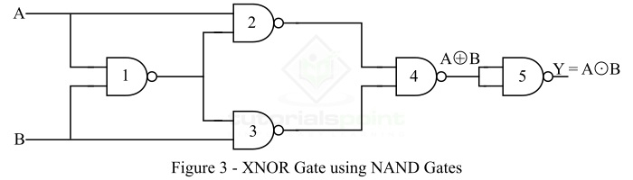
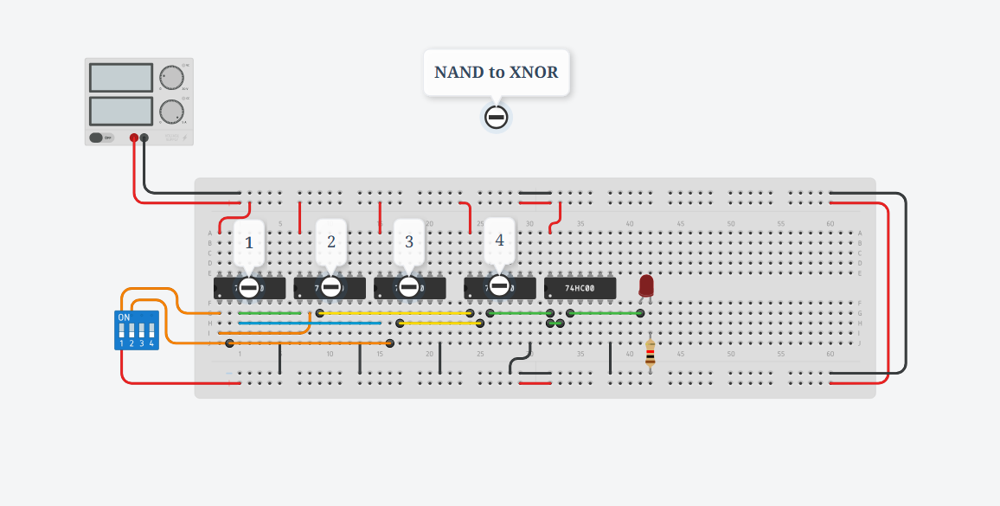

## Implementation of XNOR Gate from NAND Gate

আমরা জানি, NAND Gate হলো একটি universal logic gate, যেটি ব্যবহার করে যেকোনো ধরনের logic gate তৈরি করা যায়। এখন আমরা কেবল NAND gate ব্যবহার করে XNOR gate বাস্তবায়ন করব।

 ![[image-47.png]]

 
    

## What is a XNOR Gate?

XNOR (Exclusive-NOR) Gate হলো একটি derived logic gate। এর দুটি ইনপুট এবং একটি আউটপুট থাকে। XNOR gate তখনই HIGH (Logic 1) আউটপুট দেয় যখন দুটি ইনপুট সমান থাকে (উভয়ই 0 অথবা উভয়ই 1)। কিন্তু যখন দুটি ইনপুট আলাদা থাকে, তখন আউটপুট LOW (Logic 0) হয়।

### Output Equation of XNOR Gate

$$
Y = \overline{(A \oplus B)} = AB + \overline{A}\,\overline{B}
$$

---

## Truth Table of XNOR Gate

| A | B | Output (\$Y = \overline{(A \oplus B)}\$) |
| - | - | ---------------------------------------- |
| 0 | 0 | 1                                        |
| 0 | 1 | 0                                        |
| 1 | 0 | 0                                        |
| 1 | 1 | 1                                        |

---

## What is a NAND Gate?

NAND Gate হলো একটি **universal logic gate**। এটি মূলত AND এবং NOT gate-এর সমন্বয়। NAND gate-এর আউটপুট LOW হয় তখনই যখন এর সব ইনপুট HIGH হয়, বাকি সব ক্ষেত্রে আউটপুট HIGH থাকে।

### Output Equation of NAND Gate

$$
Y = \overline{(A \cdot B)}
$$

---

## Truth Table of NAND Gate

| A | B | Output (\$Y = \overline{(A \cdot B)}\$) |
| - | - | --------------------------------------- |
| 0 | 0 | 1                                       |
| 0 | 1 | 1                                       |
| 1 | 0 | 1                                       |
| 1 | 1 | 0                                       |

---

## Implementation of XNOR Gate from NAND Gate

Figure-3-এ ৫টি NAND gate ব্যবহার করে একটি XNOR gate এর বাস্তবায়ন দেখানো হয়েছে।

এখন ধাপে ধাপে দেখি কীভাবে এই সার্কিট কাজ করে।

প্রথম NAND gate-এর আউটপুটঃ

$$
Y_1 = \overline{(A \cdot B)}
$$

দ্বিতীয় NAND gate-এর আউটপুটঃ

$$
Y_2 = \overline{(A \cdot Y_1)} = \overline{(A \cdot \overline{(A \cdot B)})}
$$

তৃতীয় NAND gate-এর আউটপুটঃ

$$
Y_3 = \overline{(B \cdot Y_1)} = \overline{(B \cdot \overline{(A \cdot B)})}
$$

চতুর্থ NAND gate-এর আউটপুটঃ

$$
Y_4 = \overline{(Y_2 \cdot Y_3)}
$$

পঞ্চম NAND gate-এ \$Y\_1\$ এবং \$Y\_4\$ দিলে পাওয়া যায়ঃ

$$
Y = \overline{(Y_1 \cdot Y_4)}
$$

এখন expand করলে:

⇒ $Y = AB + \overline{A}\,\overline{B}$

⇒ $Y = \overline{(A \oplus B)}$

---
## IC Implementation of the XNOR using NAND:

## Testing:

✅ এইভাবে শুধুমাত্র NAND gate ব্যবহার করেও একটি XNOR gate তৈরি করা সম্ভব।

!!! info "সংক্ষেপে মনে রাখোঃ"

    
    * **A ⊕ B** → XOR gate
    * **A ⊙ B** → XNOR gate

    আর bar দিলে →

    **$\overline{A \oplus B}$** = $A ⊙ B$

    মানে, XOR-এর উপর wholebar = XNOR।
