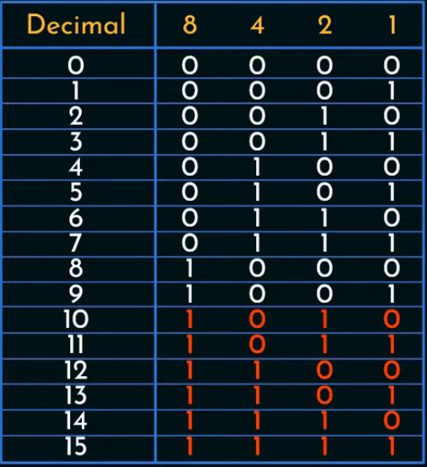
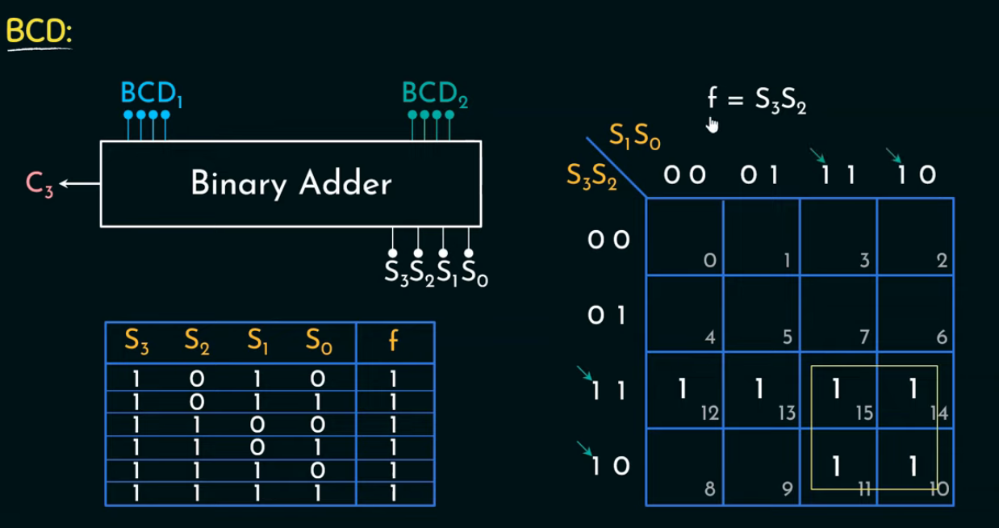
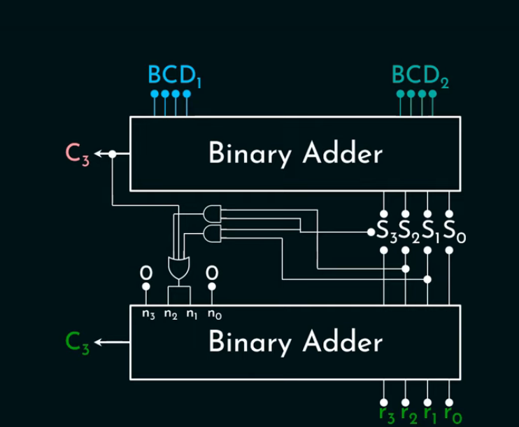
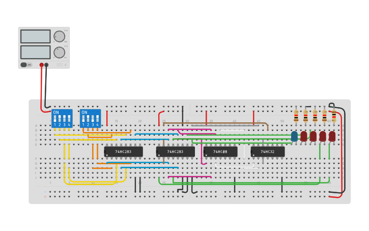

=== "Concept বুঝি"

    

    
    ### BCD অ্যাডার কী? (ক্লাস ৫-এর মতো সহজ করে)

    ধরো, তুমি গুনতে জানো ০ থেকে ৯ পর্যন্ত।
    এখন কল্পনা করো, কম্পিউটারও ঠিক এই ০–৯ দিয়েই হিসাব করতে চায়।
    এই কাজটা করতে যে পদ্ধতি লাগে, সেটার নাম **BCD**।

    ---

    ### BCD মানে কী?

    **BCD** মানে **Binary Coded Decimal**।
    সহজ ভাষায়, ০ থেকে ৯ সংখ্যাগুলোকে কম্পিউটার ৪টা বিট দিয়ে লেখে।

    যেমন

    * ৫ → 0101
    * ৯ → 1001

    ১০ হলে কিন্তু আর BCD হয় না। কারণ BCD-তে ০–৯ পর্যন্তই বৈধ।

    ---

    ### তাহলে BCD অ্যাডার কী?

    **BCD অ্যাডার** হলো এমন একটা যন্ত্র,
    যেটা **দুইটা দশমিক সংখ্যা যোগ করে**
    এবং দেখে ফলটা ঠিক আছে কি না।

    ---

    ### একটা ছোট গল্প দিয়ে বুঝি

    ধরো তুমি করছ
    **৭ + ৫**

    আমরা জানি উত্তর **১২**

    কিন্তু কম্পিউটার আগে করে কী

    * ৭ = 0111
    * ৫ = 0101

    এগুলো যোগ করলে হয়
    → 1100

    কিন্তু সমস্যা হলো
    **1100 মানে ১২**,
    আর ১২ BCD-তে অবৈধ। কারণ ৯-এর বেশি।

    ---

    ### তখন BCD অ্যাডার কী করে?

    সে বলে,
    “আহা, এটা তো ৯-এর বেশি হয়ে গেছে।”

    তখন সে **৬ যোগ করে**
    ৬ = 0110

    1100 + 0110 = 1 0010

    এখন ফলটা ভাগ হয়

    * 0001 → 1
    * 0010 → 2

    মানে উত্তর হলো **১২**
    এবার ঠিক BCD ফরম্যাটে।

    ---

    ### খুব সহজ করে মনে রাখার ট্রিক

    * যোগফল যদি **৯-এর বেশি হয়**
    * বা ক্যারি আসে
    → তখন **৬ যোগ করো**

    এটাই BCD অ্যাডারের কাজ।

    ---

    ### এক লাইনে সারসংক্ষেপ

    **BCD অ্যাডার** হলো এমন অ্যাডার
    যেটা দশমিক সংখ্যা যোগ করে
    আর ভুল হলে নিজে নিজে ঠিক করে নেয়।

    

    .jpg>)


    example একদম ভেঙে ভেঙে দেখাই।


    ## উদাহরণ: ৭ + ৫

    ## ধাপ ১: ইনপুট কোথা থেকে আসছে

    ### BCD₁ (৭)

    ৭ কে BCD-তে লিখলে

    ```
    7 = 0111
    ```

    ### BCD₂ (৫)

    ```
    5 = 0101
    ```

    এই দুইটা **উপরে থাকা Binary Adder**-এ ঢোকে।

    ---

    ## ধাপ ২: উপরের Binary Adder কী করে

    উপরের অ্যাডার শুধু সাধারণ বাইনারি যোগ করে।
    সে জানে না এটা দশমিক, সে শুধু বিট যোগ করে।

    ```
    0111   (7)
    + 0101   (5)
    --------
    1100
    ```

    আউটপুট হলো

    * **S₃ S₂ S₁ S₀ = 1100**
    * **C₃ = 0**

    এখন থামো।
    BCD-তে **1100 বৈধ না**, কারণ BCD-তে সর্বোচ্চ 1001 (৯)।

    কিন্তু অ্যাডার এটা বোঝে না।

    ---

    ## ধাপ ৩: মাঝখানের গেটগুলো কী করছে

    এই অংশটাকে ভাবো “ভুল ধরার পুলিশ”।

    ওরা তিনটা জিনিস চেক করে

    1. C₃ = 1 কি না
    2. S₃ · S₂ = 1 কি না
    3. S₃ · S₁ = 1 কি না

    এখন আমাদের ক্ষেত্রে

    * S₃ = 1
    * S₂ = 1
    * S₁ = 0

    তাই

    ```
    S₃ · S₂ = 1
    ```

    মানে শর্ত সত্য।

    সিদ্ধান্ত
    👉 “এই যোগফল BCD-এর বাইরে চলে গেছে”

    ---

    ## ধাপ ৪: n₃ n₂ n₁ n₀ কী হয়

    ভুল ধরা পড়লে সার্কিট বানায়

    ```
    n₃ n₂ n₁ n₀ = 0110
    ```

    মানে **৬**

    যদি ভুল না হতো

    ```
    n₃ n₂ n₁ n₀ = 0000
    ```

    এই লাইনে আসলে বলা হচ্ছে
    “৬ যোগ করতে হবে”

    ---

    ## ধাপ ৫: নিচের Binary Adder কী করে

    এখন নিচের অ্যাডার যোগ করে

    * আগের যোগফল: `1100`
    * correction: `0110`

    ```
    1100
    + 0110
    --------
    1 0010
    ```

    এখানে

    * **r₃ r₂ r₁ r₀ = 0010**
    * **C₃ = 1**

    ---

    ## ধাপ ৬: আউটপুটের মানে কী

    * `0010` → ২
    * carry `1` → পরের দশমিক স্থানে যাবে

    মানে পুরো ফল

    ```
    12
    ```

    একদম ঠিক দশমিক হিসাবের মতো।

    ---

    ## সার্কিটের প্রতিটা অংশ এক লাইনে

    * উপরের Binary Adder → যোগ করে
    * মাঝের Logic → দেখে ৯ ছাড়িয়েছে কিনা
    * নিচের Binary Adder → দরকার হলে ৬ যোগ করে
    * Carry → পরের digit-এ পাঠায়

    ---

    ## মনে রাখার খুব সহজ নিয়ম

    * যোগফল যদি **0–9** → কিছু করো না
    * যোগফল যদি **10–15** → **৬ যোগ করো**

    এটাই পুরো BCD Adder-এর প্রাণ।


=== "BCD Adder TinkerCad"

    
    
    

    You can copy (Tinker) this from this link:
    [https://www.tinkercad.com/things/jDmE54A3BRP-bcd-adder-4-bit-binary-adder](https://www.tinkercad.com/things/jDmE54A3BRP-bcd-adder-4-bit-binary-adder)