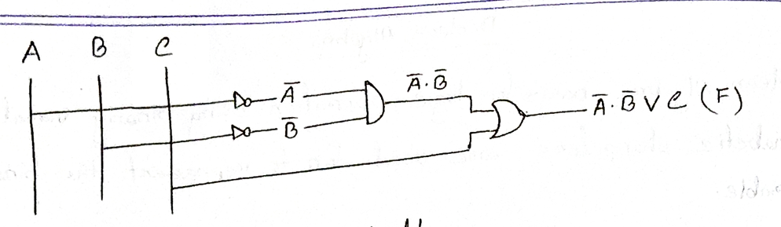

## **Boolean Algebra – Class Lecture**

আজকে আমরা শিখব **Boolean Algebra** নিয়ে।
Boolean Algebra basically একটা mathematical system, যেটা দিয়ে আমরা **logic operation** করি using **binary variables**. Binary মানে শুধু দুইটা value নিতে পারবে:

* **1** → True / High
* **0** → False / Low

Variable সাধারণত alphabet দিয়ে represent করি, যেমন A, B, C.
যদি আমরা **A bar** ($\overline{A}$) লিখি, মানে A-এর complement, অর্থাৎ A=1 হলে $\overline{A}$=0 আর A=0 হলে $\overline{A}$=1.

---

### Boolean Function

Boolean function হলো এমন একটা equation যেখানে variable গুলা combine হয় **AND (·)**, **OR (+ বা $\vee$)**, আর **NOT (bar)** দিয়ে।
Example:

$$
F = \overline{A} \cdot \overline{B} \, \vee \, C
$$

মানে F হবে 1 যদি A এবং B দুটোই 0 হয়, অথবা C=1 হয়।

---

### Truth Table বানানো

Truth Table basically সব possible input combination এর জন্য output দেখায়।
এই function $F = \overline{A} \cdot \overline{B} \vee C$ এর truth table:

| A | B | C | $\overline{A}$ | $\overline{B}$ | $\overline{A} \cdot \overline{B}$ | F |
| - | - | - | -------------- | -------------- | --------------------------------- | - |
| 0 | 0 | 0 | 1              | 1              | 1                                 | 1 |
| 0 | 0 | 1 | 1              | 1              | 1                                 | 1 |
| 0 | 1 | 0 | 1              | 0              | 0                                 | 0 |
| 0 | 1 | 1 | 1              | 0              | 0                                 | 1 |
| 1 | 0 | 0 | 0              | 1              | 0                                 | 0 |
| 1 | 0 | 1 | 0              | 1              | 0                                 | 1 |
| 1 | 1 | 0 | 0              | 0              | 0                                 | 0 |
| 1 | 1 | 1 | 0              | 0              | 0                                 | 1 |

---

### Logic Circuit Diagram

Circuit বানাতে প্রথমে A আর B এর উপর **NOT gate** লাগাবো, তারপর output দুইটা **AND gate** দিয়ে connect করব, তারপর C এর সাথে একটা **OR gate** এ দিবো। Final output হবে F.

*Figure 1: Logic circuit implementation of $F = \overline{A} \cdot \overline{B} \vee C$ using NOT, AND, and OR gates.*

---

### কিছু Boolean Identities

1. $A \vee 0 = A$
2. $A \cdot 0 = 0$
3. $A \vee 1 = 1$
4. $A \cdot 1 = A$
5. $A \vee A = A$
6. $A \cdot A = A$
7. $A \vee \overline{A} = 1$
8. $A \cdot \overline{A} = 0$
9. $\overline{\overline{A}} = A$
10. $A \vee B = B \vee A$ (Commutative)

---

আমরা expression টা নিচ্ছি:

$$
F = ABCD \vee \overline{A}BCD \vee BC
$$

**Step-by-step:**

1. $BC(AD \vee \overline{A}D \vee 1)$ – এখানে common $BC$ বের করে নিলাম।
2. $= BCD(A \vee \overline{A}) \vee BC$ – Identity: $A \vee \overline{A} = 1$
3. $= BCD \cdot 1 \vee BC$ – 1 দিয়ে AND করলে একই থাকে।
4. $= BCD \vee BC$ – এখন BC বের করলে আরও simplify হবে।
5. $= BC(D \vee 1)$ – Identity: $X \vee 1 = 1$
6. $= BC \cdot 1 = BC$

So final simplified form:

$$
F = BC
$$

---

### Consensus Theorem (1) { .annotate }

1.  Consensus মানে হলো একতা বা সাম্য।

Consensus theorem বলে যে:

$$
AB\overline{C} \vee BC \vee A\overline{C} = AB \vee A\overline{C}
$$

মানে, যদি expression এর মধ্যে এমন একটি term থাকে যেখানে একটি literal (যেমন B) AND হয়েছে তার complement-এর সাথে (অন্য term-এ), তাহলে ওই AND term টা বাদ দেওয়া যায়।

Easy ভাবে: একটা term অন্য দুই term-এর মধ্যে "consensus" তৈরি করে, যেটা actually redundant, তাই আমরা সেটা সরিয়ে ফেলতে পারি।

---

## **Just English – Textbook Style**

### Example Simplification

Given:

$$
F = ABCD \vee \overline{A}BCD \vee BC
$$

Steps:

1. Factor $BC$:

$$
F = BC(AD \vee \overline{A}D \vee 1)
$$

2. Apply complement law $A \vee \overline{A} = 1$:

$$
= BCD(1) \vee BC
$$

3. Simplify $X \cdot 1 = X$:

$$
= BCD \vee BC
$$

4. Factor $BC$ again:

$$
= BC(D \vee 1)
$$

5. Apply identity law $X \vee 1 = 1$:

$$
= BC \cdot 1
$$

6. Final:

$$
F = BC
$$

---

### Consensus Theorem (Textbook Form)

The **Consensus Theorem** states:

$$
AB\overline{C} \vee BC \vee A\overline{C} = AB \vee A\overline{C}
$$

The theorem indicates that the AND term $BC$ can be eliminated if one literal (such as $B$) appears in both complemented and uncomplemented form in other terms of the expression.
