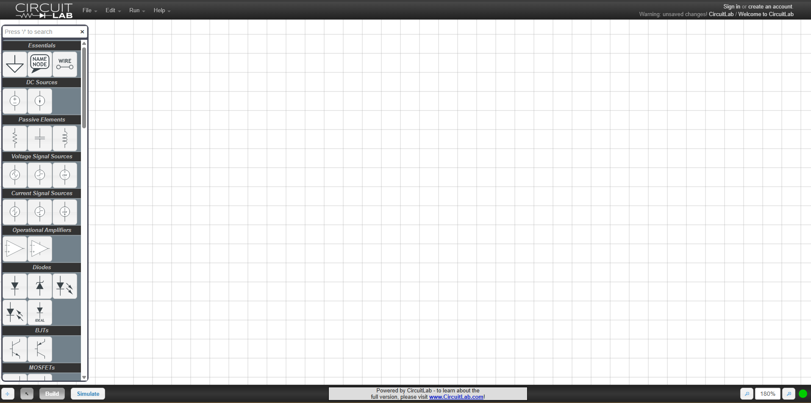

# Some DLD tools for daily use:

- [Boolean Function to circuit generator](https://www.boolean-algebra.com/) - এটা মজার tool কিন্তু এটাতে একটাই সমস্যা, সেটা হলো NOT দিতে হলে <code> ' </code> ব্যবহার না করে exclamation sign (!) ব্যবহার করতে হয়। 
	![[boolean-algebra.com.png|212x125]]
- [K-Map to Boolean function Converter](https://sublime.tools/karnaugh-map)
    এটা খুব easy একটা tool. শুধু click করে করে kmap এ 1 বা 0 বসালেই simplified boolean function টা পেয়ে যাবো। 
    ![[sublime.tools.png]]
- [AllMath](https://www.allmath.com/kmap-solver.php) - এটা আমার পছন্দের মধ্যে একটা টুলস। কারণ এটা দিয়ে আমি ইচ্ছেমতো variable দিয়ে KMap বানাতে পারি 
	![[allmath.com.png]]
- এরপরে আছে [charlie-coleman.com](https://www.charlie-coleman.com/experiments/kmap/) এটা দিয়েও K-Map generate করা যায়। 
    ![[charlie-coleman.com.png]]{width=60%}
- [atozmath.com - KMap](https://atozmath.com/KMap.aspx?q=kmap) এটাও অনেক powerful একটা tool কিন্তু এখানে full solution টা পেতে গেলে ৮-১০ সেকেন্ডের ads দেখতে হয়। তবে Ads blocker থাকলে সেটা থেকে  বাঁচা যায়, তবে ঐ সময়টুকু অপেক্ষা করতেই হয়। 
	![[atozmath.com - KMap.png]]

- [MadForMath](https://madformath.com/calculators/digital-systems/boolean-functions/function-to-logic-circuit-converter) - এটা আমার ব্যবহার করা সর্বপ্রথম tool. এটাতে অনেক কিছু আছে। মজার বিষয় হচ্ছে এটার execution time অনেক দ্রুত আর  সাথে সাথে সার্কিটও দেখায়। তবে কোন explanation নেই।  যেমনঃ TO TRUTH TABLE,COMPLEMENT,DUAL,TO CIRCUIT,SIMULATOR,TO SUM OF MINTERMS,TO PRODUCT OF MAXTERMS,TO CANONICAL,K-MAP SOLVER (SOP),K-MAP SOLVER (POS). 
		![[MadForMath.png]]

### Circuit Generators:
- [Circuitlab](https://www.circuitlab.com/editor/#?id=7pq5wm&from=homepage) - এটা যদিও ফ্রি না। তবে ফ্রিতে অনেক সময় ধরে কাজ করা যায়  আর খুবই standard components এখানে পাওয়া যায়। তবে মূলত এসাইনমেন্টের ছবি বা এ ধরনের bookish circuit বানাতে এটা অনেক ভালো। একটা tips দেই, সেটা হচ্ছে Grid lines গুলো remove করে screenshot দিয়ে এটা যেকোন এসাইনমেন্ট বা digital note এ ব্যবহার করা যায়। 
