In the context of **Boolean Algebra** (digital logic), the "Dual" is a specific way to transform a logic expression into a new one.

The **Principle of Duality** states that if a boolean equation is true, then its **dual** is also true. This is a fundamental tool used to derive new logic identities from existing ones.

### **How to Find the Dual**

To get the dual of any boolean expression, you follow three simple rules:

1. **Change AND () to OR ()**
2. **Change OR () to AND ()**
3. **Change 1s to 0s and 0s to 1s**

**Crucial Rule:** Do **NOT** change the variables themselves. If a variable is complemented (like ), it stays complemented. If it is normal (like ), it stays normal.

---

### **Examples**

Here are a few comparisons to help you visualize the change:

| Original Expression | **Dual** Expression | Logic Applied |
| --- | --- | --- |
|  |  | Changed OR to AND |
|  |  | Swapped all operators |
|  |  | Swapped operators & identity elements (1  0) |
|  |  | Swapped operators, **kept literals unchanged** |

---

### **Dual vs. Complement (The Common Trap)**

It is very easy to confuse the **Dual** with the **Complement** (Inverse). The key difference is what you do with the variables (A, B, etc.).

* **Dual:** You swap operators (AND/OR) but **leave variables alone**.
* **Complement:** You swap operators (AND/OR) **AND invert every variable** (apply NOT).

**Example:** Take the expression 

* **Dual:**  (Variables stay )
* **Complement:**  (Variables become )

### **Why is this useful?**

The Principle of Duality helps us halve the amount of work we need to do when memorizing rules.

For example, if you prove the distributive law:

You automatically know that its **dual** is also true without needing to prove it separately:

??? "NAND and NOR gate implementation"

    [Boolean function implementation using NAND and NOR gate in Bangla | NAND and NOR gate implementation](https://youtu.be/F2ATq6HYHpY)

    Here is the detailed step-by-step solution for the given Boolean function $F(x, y, z) = \sum(1, 2, 3, 4, 5, 7)$ using K-map simplification and universal gate implementations (NAND and NOR gates) as requested. We will follow a clear structure, using the standard approach for the Sum of Products (SOP) and Product of Sums (POS) forms.

    ---

    ### Step 1: Simplify the Boolean Function

    #### Minterms (Output 1):

    1, 2, 3, 4, 5, 7

    #### Missing Terms (Output 0):

    0, 6

    We will now use a **K-map** to simplify the given Boolean function.

    ### K-map for Three Variables:

    We will represent the K-map with the following cell layout corresponding to the combinations of (x), (y), and (z):

    | **yz \ x** | **00** | **01** | **11** | **10** |
    | ---------- | ------ | ------ | ------ | ------ |
    | **00**     | **0**  | **1**  | **1**  | **0**  |
    | **01**     | **1**  | **1**  | **1**  | **0**  |
    | **11**     | **1**  | **1**  | **1**  | **0**  |

    #### Grouping in the K-map:

    * **Group 1 (Red)**: Cells 1, 3, 5, 7 (Columns 01 and 11)
    Term: ( z ) (since ( z = 1 ) for all these cells)

    * **Group 2 (Blue)**: Cells 3, 2 (Row 0, Columns 11, 10)
    Term: ( \bar{x}y ) (since ( x = 0 ), ( y = 1 ), ( z ) changes)

    * **Group 3 (Green)**: Cells 4, 5 (Row 1, Columns 00, 01)
    Term: ( x\bar{y} ) (since ( x = 1 ), ( y = 0 ), ( z ) changes)

    Thus, the **simplified Boolean expression** in Sum of Products (SOP) form is:
    
    \[
    F_{SOP}(x, y, z) = z + \bar{x}y + x\bar{y}
    \]

    ---

    ### Step 2: Implementation with NAND Gates (Using SOP Form)

    #### Strategy:

    To implement the function with NAND gates, we will use the SOP form and apply double negation to convert OR operations to NAND gates.

    #### Expression:

    \[
    F = z + \bar{x}y + x\bar{y}
    \]

    #### Double Negate:

    \[
    F = \overline{\overline{z + \bar{x}y + x\bar{y}}}
    \]

    #### Apply De Morgan's Law (Inner Bar):

    \[
    F = \overline{\overline{z} \cdot \overline{(\bar{x}y)} \cdot \overline{(x\bar{y})}}
    \]

    #### Logic Circuit Design:

    1. **Input Stage**:
    Inverters are needed for (x), (y), and (z) to obtain ( \bar{x} ), ( \bar{y} ), and ( \bar{z} ).

    2. **Layer 1 (Product Terms)**:

    * **Gate 1**: Inputs ( \bar{x} ), ( y ) → Output: ( \overline{\bar{x}y} )
    * **Gate 2**: Inputs ( x ), ( \bar{y} ) → Output: ( \overline{x\bar{y}} )

    3. **Layer 2 (Summing)**:

    * **Gate 3**: Inputs ( \bar{z} ), Output from Gate 1, Output from Gate 2 → Final Output ( F )

    #### NAND Diagram:

    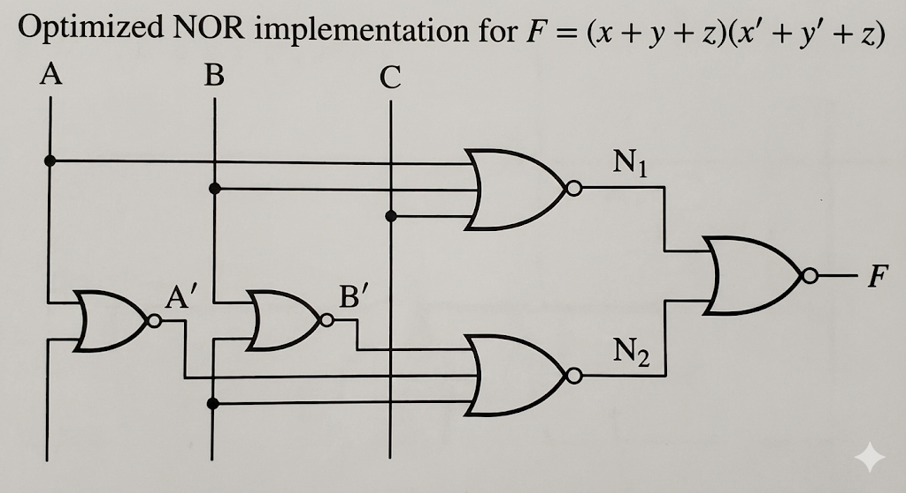

    ---

    ### Step 3: Implementation with NOR Gates (Using POS Form)

    #### Strategy:

    To implement the function with NOR gates, we use the **POS form** and apply double negation to convert AND operations to NOR gates.

    #### Expression:

    \[
    F = (x + y + z)(\bar{x} + \bar{y} + z)
    \]

    #### Double Negate:

    \[
    F = \overline{\overline{(x + y + z)(\bar{x} + \bar{y} + z)}}
    \]

    #### Apply De Morgan's Law (Inner Bar):

    Change the central AND ( \cdot ) to OR ( + ) by breaking the bar.

    \[
    F = \overline{\overline{(x + y + z)} + \overline{(\bar{x} + \bar{y} + z)}}
    \]

    #### Logic Circuit Design:

    1. **Input Stage**:
    Inverters are needed for ( x ) and ( y ) to obtain ( \bar{x} ) and ( \bar{y} ).

    2. **Layer 1 (Sum Terms)**:

    * **Gate 1**: Inputs ( x ), ( y ), ( z ) → Output: ( \overline{x + y + z} )
    * **Gate 2**: Inputs ( \bar{x} ), ( \bar{y} ), ( z ) → Output: ( \overline{\bar{x} + \bar{y} + z} )

    3. **Layer 2 (Product)**:

    * **Gate 3**: Takes outputs from Gate 1 and Gate 2 → Final Output ( F )

    ---

    This step-by-step process outlines the K-map simplification, SOP and POS derivation, and the corresponding implementations using NAND and NOR gates. The diagrams and logical circuit designs show the actual hardware-level implementation of the function.

??? "Tabulation method" 

    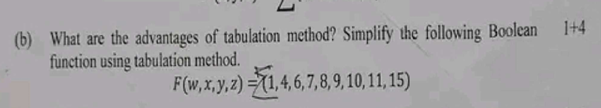
    
    Here is the complete answer:

    * * *

    **Answer to Question No (b)**

    **Advantages of Tabulation Method:**

    The advantages (subidha) of the Tabulation or Quine-McCluskey method are given below:

    1. This method (poddhoti) is systematic and guaranteed to give the minimal expression.
    2. It is very suitable for computer automation or programming because it uses a step-by-step algorithm.
    3. The Tabulation method can easily handle Boolean functions with a large number of variables (cholok), such as 5 or more, where Karnaugh Map (K-Map) becomes difficult and messy to read.
    4. It ensures that we find all Prime Implicants and Essential Prime Implicants correctly.

    * * *

    **Simplification using Tabulation Method:**

    Given Boolean Function:

    $F(w, x, y, z) = \sum(1, 4, 6, 7, 8, 9, 10, 11, 15)$

    **Step 1: Grouping minterms based on number of ones**

    We list the minterms in binary form and group (dol) them according to the number of 1s they contain.

    | **Group** | **Minterm** | **Binary (wxyz)** |
    | --- | --- | --- |
    | **G1** | 1 | 0 0 0 1 $\checkmark$ |
    |  | 4 | 0 1 0 0 $\checkmark$ |
    |  | 8 | 1 0 0 0 $\checkmark$ |
    | **G2** | 6 | 0 1 1 0 $\checkmark$ |
    |  | 9 | 1 0 0 1 $\checkmark$ |
    |  | 10 | 1 0 1 0 $\checkmark$ |
    | **G3** | 7 | 0 1 1 1 $\checkmark$ |
    |  | 11 | 1 0 1 1 $\checkmark$ |
    | **G4** | 15 | 1 1 1 1 $\checkmark$ |

    **Step 2: First Comparison Table (Pairing)**

    Now we compare (tulona) each term of a group with terms in the next group. If they differ by only one bit position, we put a dash (-).

    | **Group** | **Matched Pair** | **Binary Representation** |
    | --- | --- | --- |
    | **G1-G2** | (1, 9) | - 0 0 1 |
    |  | (4, 6) | 0 1 - 0 |
    |  | (8, 9) | 1 0 0 - $\checkmark$ |
    |  | (8, 10) | 1 0 - 0 $\checkmark$ |
    | **G2-G3** | (6, 7) | 0 1 1 - |
    |  | (9, 11) | 1 0 - 1 $\checkmark$ |
    |  | (10, 11) | 1 0 1 - $\checkmark$ |
    | **G3-G4** | (7, 15) | - 1 1 1 |
    |  | (11, 15) | 1 - 1 1 |

    **Step 3: Second Comparison Table (Quads)**

    We compare the pairs from Step 2.

    | **Group** | **Matched Quad** | **Binary Representation** | **Term** |
    | --- | --- | --- | --- |
    | **G1-G3** | (8, 9, 10, 11) | 1 0 - - | $w\bar{x}$ |
    |  | (8, 10, 9, 11) | 1 0 - - | (Same) |

    List of Prime Implicants:

    The terms that could not be combined further are Prime Implicants.

    1. (1, 9) $\rightarrow -001 \rightarrow \bar{x}\bar{y}z$
    2. (4, 6) $\rightarrow 01-0 \rightarrow \bar{w}x\bar{z}$
    3. (6, 7) $\rightarrow 011- \rightarrow \bar{w}xy$
    4. (7, 15) $\rightarrow -111 \rightarrow xyz$
    5. (11, 15) $\rightarrow 1-11 \rightarrow wyz$
    6. (8, 9, 10, 11) $\rightarrow 10-- \rightarrow w\bar{x}$

    **Step 4: Prime Implicant Table**

    Now we select the Essential (opori-harjo) Prime Implicants to cover all minterms.

    | **Prime Implicants** | **Term** | **1** | **4** | **6** | **7** | **8** | **9** | **10** | **11** | **15** |
    | --- | --- | --- | --- | --- | --- | --- | --- | --- | --- | --- |
    | **(1, 9)** | $\bar{x}\bar{y}z$ | $\mathbf{\otimes}$ |  |  |  |  | X |  |  |  |
    | **(4, 6)** | $\bar{w}x\bar{z}$ |  | $\mathbf{\otimes}$ | X |  |  |  |  |  |  |
    | (6, 7) | $\bar{w}xy$ |  |  | X | X |  |  |  |  |  |
    | (7, 15) | $xyz$ |  |  |  | X |  |  |  |  | X |
    | (11, 15) | $wyz$ |  |  |  |  |  |  |  | X | X |
    | **(8, 9, 10, 11)** | $w\bar{x}$ |  |  |  |  | $\mathbf{\otimes}$ | X | $\mathbf{\otimes}$ | X |  |

    **Selection Logic:**

    1. **Essential Prime Implicants (EPI):**

        - Column 1 has only one X in row (1,9). So, $\bar{x}\bar{y}z$ is essential.
        - Column 4 has only one X in row (4,6). So, $\bar{w}x\bar{z}$ is essential.
        - Column 8 and 10 have only one X in row (8,9,10,11). So, $w\bar{x}$ is essential.
    2. **Remaining Minterms:**

        - After selecting the EPIs, the minterms 1, 4, 6, 8, 9, 10, 11 are covered.
        - The remaining minterms are 7 and 15.
        - We need to pick a term that covers 7 and 15. The term $(7, 15)$ i.e., $xyz$ covers both efficiently.

    **Final Expression:**

    $$F(w, x, y, z) = \bar{x}\bar{y}z + \bar{w}x\bar{z} + w\bar{x} + xyz$$

??? "Carry Propagate and Carry Output"
    
    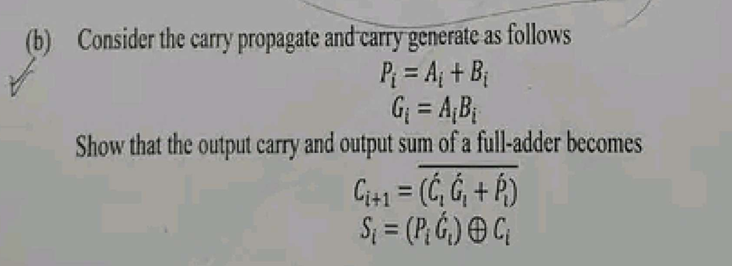

    Based on the full image provided, here is the complete step-by-step derivation in an exam-style format.
    (b) Consider the carry propagate and carry generate as follows:

    $$P_i = A_i + B_i$$

    $$G_i = A_i B_i$$

    Show that the output carry and output sum of a full-adder becomes:

    $$C_{i+1} = \overline{(\bar{C}_i \bar{G}_i + \bar{P}_i)}$$

    $$S_i = (P_i \bar{G}_i) \oplus C_i$$

    Answer:
    Given Parameters:
    Carry Propagate (ক্যারি বিস্তার): $P_i = A_i + B_i$
    Carry Generate (ক্যারি উৎপন্ন): $G_i = A_i B_i$
    We need to prove the expressions for the Sum ($S_i$) and Output Carry ($C_{i+1}$) of a Full Adder (পূর্ণ যোগকারক).
    Part 1: Derivation of Output Sum ($S_i$)
    Step 1: Standard Equation
    We know that the standard equation for the sum of a Full Adder is:

    $$S_i = A_i \oplus B_i \oplus C_i$$

    Step 2: Simplifying the term $(P_i \bar{G}_i)$
    Let us analyze the term inside the bracket from the given question: $(P_i \bar{G}_i)$.
    Substituting the values of $P_i$ and $G_i$:

    $$(P_i \bar{G}_i) = (A_i + B_i) \cdot \overline{(A_i B_i)}$$

    Using DeMorgan’s Law (ডি-মরগানের সূত্র), we know that $\overline{A_i B_i} = \bar{A}_i + \bar{B}_i$.
    So,

    $$(P_i \bar{G}_i) = (A_i + B_i)(\bar{A}_i + \bar{B}_i)$$

    Now, multiply the terms (Boolean distribution):

    $$= A_i\bar{A}_i + A_i\bar{B}_i + B_i\bar{A}_i + B_i\bar{B}_i$$

    We know that $A \cdot \bar{A} = 0$. So,

    $$= 0 + A_i\bar{B}_i + \bar{A}_iB_i + 0$$

    $$= A_i\bar{B}_i + \bar{A}_iB_i$$

    This is the definition of the XOR operation:

    $$(P_i \bar{G}_i) = A_i \oplus B_i$$

    Step 3: Final Expression for Sum
    Now substitute $(A_i \oplus B_i)$ back into the standard Full Adder sum equation:

    $$S_i = (A_i \oplus B_i) \oplus C_i$$

    $$S_i = (P_i \bar{G}_i) \oplus C_i$$

    (Proved)
    Part 2: Derivation of Output Carry ($C_{i+1}$)
    Step 1: Standard Equation
    The standard carry equation for a Full Adder using Propagate and Generate logic is:

    $$C_{i+1} = G_i + P_i C_i$$

    (Note: Since $P_i = A_i + B_i$, the term $P_i C_i$ covers the case where carry propagates. Although $G_i$ is already included in $P_i$, the boolean algebra $G_i + P_i C_i$ holds true for carry).
    Step 2: Analyzing the Given Equation
    We need to show that the Right Hand Side (RHS) matches the standard equation.
    Given RHS:

    $$RHS = \overline{(\bar{C}_i \bar{G}_i + \bar{P}_i)}$$

    Step 3: Applying DeMorgan’s Law
    Apply DeMorgan's theorem $\overline{X + Y} = \bar{X} \cdot \bar{Y}$ to the whole expression:

    $$= \overline{(\bar{C}_i \bar{G}_i)} \cdot \overline{(\bar{P}_i)}$$

    Now, simplify $\overline{(\bar{P}_i)}$ to $P_i$:

    $$= \overline{(\bar{C}_i \bar{G}_i)} \cdot P_i$$

    Apply DeMorgan's theorem again to the first part $\overline{(\bar{C}_i \bar{G}_i)} = \bar{\bar{C}}_i + \bar{\bar{G}}_i = C_i + G_i$:

    $$= (C_i + G_i) \cdot P_i$$

    Step 4: Expansion and Simplification
    Multiply $P_i$ with the terms inside:

    $$= P_i C_i + P_i G_i$$

    Now substitute the values of $P_i$ and $G_i$ into the term $P_i G_i$:

    $$P_i G_i = (A_i + B_i)(A_i B_i)$$

    $$= A_i A_i B_i + A_i B_i B_i$$

    $$= A_i B_i + A_i B_i$$

    $$= A_i B_i = G_i$$

    So, $P_i G_i$ is simply equal to $G_i$.
    (Concept: If you generate a carry ($G=1$), you automatically satisfy the propagate condition ($P=1$), so $P \cdot G = G$).
    Substitute this back:

    $$= P_i C_i + G_i$$

    $$C_{i+1} = G_i + P_i C_i$$

    This matches the standard carry equation.
    Therefore,

    $$C_{i+1} = \overline{(\bar{C}_i \bar{G}_i + \bar{P}_i)}$$

    (Proved)

??? "3 input Combinational circuit  to square output"

    ### Problem:

    Design a combinational logic circuit that takes a 3-bit input number \( ( A, B, C ) \) (where \( A \) is the most significant bit and \( C \) is the least significant bit) and generates an output binary number equal to the square of the input number. Provide the following:

    * Truth table for the inputs and outputs
    * Karnaugh Maps (K-maps) for the simplification of Boolean expressions for each output bit
    * The Boolean expressions for the output bits
    * The circuit diagram using logic gates

    ### **Problem Analysis**

    - **Goal:** Design a circuit that squares a 3-bit number.
    - **Input:** A 3-bit binary number. Let's call the inputs **A, B, C** (where A is the Most Significant Bit and C is the Least Significant Bit).

    - Maximum Input Value: $111\_2$ (Decimal 7).
    - **Output:** The square of the input.

    - Maximum Output Value: $7^2 = 49$.
    - To represent the decimal number 49 in binary, we need **6 bits** (since $2^5=32$ is too small, but $2^6=64$ covers it).
    - Let's call the outputs **$F\_5, F\_4, F\_3, F\_2, F\_1, F\_0$**.

    * * *

    ### **Step 1: Truth Table**

    We calculate the square for every possible input ($0$ to $7$) and convert the result into a 6-bit binary number.

    | **Decimal Input** | **Input (A B C)** | **Square (Decimal)** | **Output (F5​ F4​ F3​ F2​ F1​ F0​)** |
    | --- | --- | --- | --- |
    | 0 | 0 0 0 | 0 | 0 0 0 0 0 0 |
    | 1 | 0 0 1 | 1 | 0 0 0 0 0 1 |
    | 2 | 0 1 0 | 4 | 0 0 0 1 0 0 |
    | 3 | 0 1 1 | 9 | 0 0 1 0 0 1 |
    | 4 | 1 0 0 | 16 | 0 1 0 0 0 0 |
    | 5 | 1 0 1 | 25 | 0 1 1 0 0 1 |
    | 6 | 1 1 0 | 36 | 1 0 0 1 0 0 |
    | 7 | 1 1 1 | 49 | 1 1 0 0 0 1 |

    * * *

    ### **Step 2: Boolean Expression Simplification**

    We can determine the logic equation for each output bit. We can use Karnaugh Maps (K-Maps) or simple observation.

    **1. Output $F\_0$ (LSB)**

    - **Observation:** The column $F\_0$ is identical to the input column $C$ (0, 1, 0, 1...).
    - **Equation:** 

    $$F\_0 = C$$

    **2. Output $F\_1$**

    - **Observation:** The column $F\_1$ is all zeros. (This is mathematically true because the square of any integer $n$, modulo 4, is either 0 or 1. Thus, the second binary bit is always 0 for inputs up to 7).
    - **Equation:** 

    $$F\_1 = 0$$

    (Ground)

    **3. Output $F\_2$**

    - **High (1) at inputs:** 2 (010) and 6 (110).
    - **Boolean Algebra:** $\bar{A}B\bar{C} + AB\bar{C}$
    - **Factor out common terms:** $B\bar{C}(\bar{A} + A)$
    - **Equation:** 

    $$F\_2 = B\bar{C}$$

    **4. Output $F\_3$**

    - **High (1) at inputs:** 3 (011) and 5 (101).
    - **Boolean Algebra:** $\bar{A}BC + A\bar{B}C$
    - **Factor out C:** $C(\bar{A}B + A\bar{B})$
    - **Identify XOR:** The term inside the bracket is an XOR operation.
    - **Equation:** 

    $$F\_3 = C(A \oplus B)$$

    **5. Output $F\_4$**

    - **High (1) at inputs:** 4 (100), 5 (101), 7 (111).
    - **K-Map Grouping:**

    - Group 1 (inputs 4, 5): $A\bar{B}$
    - Group 2 (inputs 5, 7): $AC$
    - **Equation:** 

    $$F\_4 = A\bar{B} + AC$$

    (or factored: $A(\bar{B} + C)$)

    **6. Output $F\_5$ (MSB)**

    - **High (1) at inputs:** 6 (110) and 7 (111).
    - **Boolean Algebra:** $AB\bar{C} + ABC$
    - **Factor out AB:** $AB(\bar{C} + C)$
    - **Equation:** 

    $$F\_5 = AB$$

    * * *

    ### **Step 3: Final Design Summary**

    To build this circuit, you need the following logic gates based on the derived equations:

    - **$F\_0 = C$** (Direct connection)
    - **$F\_1 = 0$** (Connect to Logic Low/Ground)
    - **$F\_2 = B \text{ AND } (\text{NOT } C)$**
    - **$F\_3 = C \text{ AND } (A \text{ XOR } B)$**
    - **$F\_4 = A \text{ AND } ((\text{NOT } B) \text{ OR } C)$**
    - **$F\_5 = A \text{ AND } B$**

    ### **Logic Diagram Implementation**

    1. **Inputs:** Draw three lines representing A, B, and C.
    2. **NOT Gates:** Place NOT gates on lines B and C to create $\bar{B}$ and $\bar{C}$.
    3. **AND Gates:**

    - Connect A and B to an AND gate for output **$F\_5$**.
    - Connect B and $\bar{C}$ to an AND gate for output **$F\_2$**.
    4. **XOR/AND Combination:**

    - Connect A and B to an XOR gate. Connect the output of that XOR gate and input C into an AND gate for output **$F\_3$**.
    5. **OR/AND Combination:**

    - Connect $\bar{B}$ and C to an OR gate. Connect the output of that OR gate and input A into an AND gate for output **$F\_4$**.
    6. **Direct:** Connect input C directly to **$F\_0$**.
    7. **Ground:** Connect **$F\_1$** to ground.

    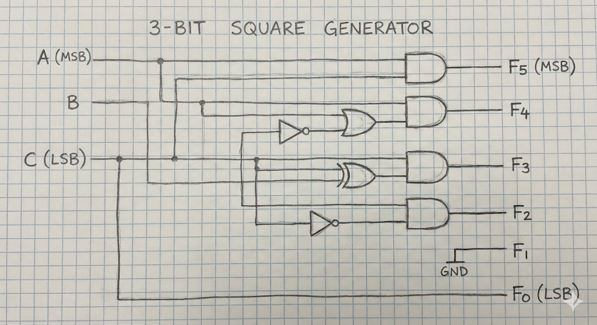

??? "Sequential Circuit"

    To justify a **20-mark allocation** for this question, a simple two-sentence definition is insufficient. At a university level, the examiner expects a deep dive into the architecture, timing mechanisms, mathematical representation, and state machine models.

    Here is the **enhanced version of the question** to match the depth of the answer provided below, followed by the comprehensive solution.

    ### **Enhanced Question (University Level)**

    > 
    > **Q4 (a) [20 Marks]:** Elaborate on the fundamental principles of Sequential Logic Circuits.
    > 
    > 1. **Define** the sequential circuit, contrasting it with combinational logic.
    > 2. **Illustrate** the general architecture using a detailed block diagram, explaining the role of the feedback path and memory elements.
    > 3. **Classify** sequential circuits based on signal timing (Synchronous vs. Asynchronous) and output dependency (Mealy vs. Moore). Provide a comparative analysis of these classifications.
    > 

    * * *

    ### **Comprehensive Answer**

    #### **1. Definition of Sequential Circuits**

    A **Sequential Circuit** is a class of digital logic circuits whose output depends not only on the **present value of its inputs** but also on the **past history of the inputs** (the current state of the system).

    Unlike Combinational circuits (where $Output = f(Input)$), Sequential circuits possess **memory**. The information stored in the memory elements defines the **"Present State"** of the circuit.

    Mathematically, the behavior can be described as:

    - $Output(t) = f(\text{Inputs}(t), \text{Present State}(t))$

    - $\text{Next State}(t+1) = f(\text{Inputs}(t), \text{Present State}(t))$

    * * *

    #### **2. Basic Block Diagram & Architecture**

    The architecture of a sequential circuit consists of two main components:

    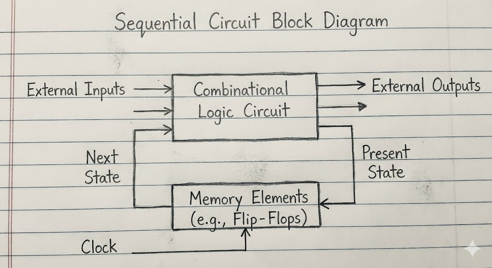
    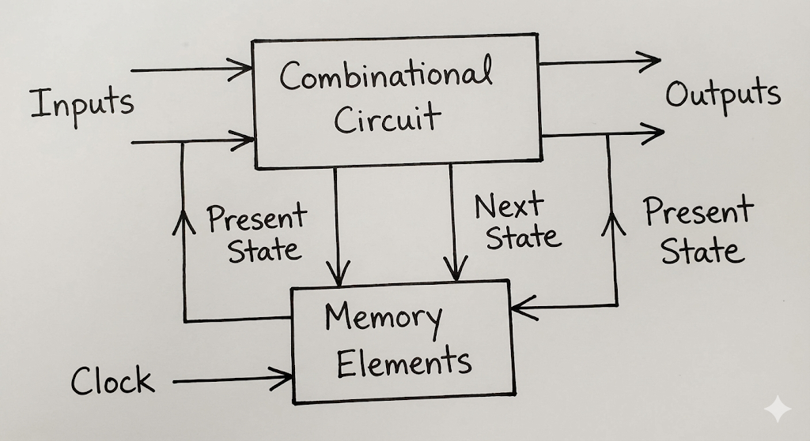

    1. **Combinational Logic Circuit:** Performs the logic operations (AND, OR, NOT gates) to determine outputs and next states.
    2. **Memory Elements:** Storage devices (Flip-Flops or Latches) connected in a **feedback path**.

    The feedback loop is the critical differentiator. It feeds the output of the memory elements (the "Present State") back into the input of the combinational logic.

    **Key Components in the Diagram:**

    - **External Inputs:** Signals coming from outside the circuit.
    - **Next State Logic:** Part of the combinational logic that calculates what the memory should store next.
    - **Memory Elements:** Store the binary state.
    - **Present State:** The data currently stored in memory, fed back to the input.
    - **External Outputs:** The final result delivered to the outside world.

    * * *

    #### **3. Classification of Sequential Circuits**

    Sequential circuits are primarily classified based on **how the memory elements are triggered** (Timing) and **how the outputs are derived** (State Output Relationship).
   
    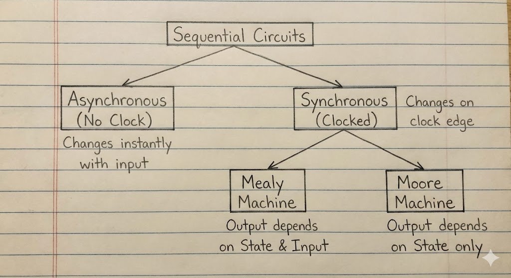
    ### **A. Classification based on Timing (Clocking)**

    This is the most fundamental classification.

    **1. Asynchronous Sequential Circuits**

    - **Definition:** These circuits do not use a global clock signal. The internal state changes **immediately** when there is a change in the input variables.
    - **Mechanism:** They rely on the propagation delay of logic gates and feedback loops for memory (often using Latches).
    - **Pros:** They are potentially faster because they don't have to wait for a clock edge.
    - **Cons:** Very difficult to design due to "race conditions" (timing uncertainties) and glitches.
    - **Use Case:** Small, simple circuits like SR Latches or handshake controllers.

    **2. Synchronous Sequential Circuits**

    - **Definition:** These circuits use a master **Clock Signal (CLK)**. The memory elements (Flip-Flops) only change their state at discrete instants, typically the rising or falling edge of the clock pulse.
    - **Mechanism:** Inputs can change at any time, but the effect is only synchronized with the clock beat.
    - **Pros:** Much easier to design and debug; prevents timing hazards and race conditions.
    - **Cons:** The speed is limited by the maximum clock frequency.
    - **Use Case:** The vast majority of modern digital systems (CPUs, GPUs, Counters, Registers).

    **Comparison Table:**

    | **Feature** | **Synchronous** | **Asynchronous** |
    | --- | --- | --- |
    | **Clock** | Present (Triggered) | Absent (Level/Pulse driven) |
    | **Memory Element** | Flip-Flops | Latches / Gate Delays |
    | **State Change** | Only at Clock Edge | Instant (upon Input change) |
    | **Design Complexity** | Easy (Standardized) | Difficult (Race conditions) |
    | **Speed** | Limited by Clock Speed | High (limited by gate delay) |

    * * *

    ### **B. Classification based on Output (Finite State Machine Models)**

    When modeling sequential circuits as Finite State Machines (FSM), they are classified into two types:

    **1. Mealy Machine**

    - **Definition:** The output depends on **both** the Present State and the Current External Inputs.
    - $Output = f(\text{State}, \text{Input})$
    - **Characteristic:** The output can change in the middle of a clock cycle if the input changes. It generally requires fewer states to implement a function.

    **2. Moore Machine**

    - **Definition:** The output depends **only** on the Present State.
    - $Output = f(\text{State})$
    - **Characteristic:** The output is synchronous with the state changes. It is generally safer and more stable but may require more logic states.

    * * *

    ### **Summary for the Examiner (20 Marks Breakdown)**

    - **Definition (4 Marks):** Clear distinction of "Memory" and "Past History".
    - **Block Diagram (6 Marks):** Correctly drawn diagram with Feedback path, Input, Output, and Memory blocks clearly labeled.
    - **Classification by Timing (5 Marks):** Detailed explanation of Synchronous vs Asynchronous.
    - **Classification by Output (5 Marks):** Detailed explanation of Mealy vs Moore models.

??? "Excitation Table of Flip-Flops"

    ### **Answer to Q4 (b)**

    **Excitation Table of Flip-Flops**

    To design any **Sequential Circuit** (অনুক্রমিক সার্কিট), we need to know the necessary inputs to change the state from the **Present State** (বর্তমান অবস্থা) to the desired **Next State** (পরবর্তী অবস্থা). The table that lists these required **Inputs** (ইনপুটসমূহ) for every possible **Transition** (পরিবর্তন) is called the **Excitation Table** (উদ্দীপনা সারণী).

    Below, we illustrate the excitation tables for RS, D, JK, and T flip-flops individually.
    
    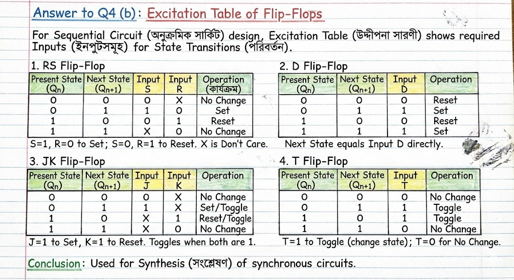

    * * *

    ### **1. RS Flip-Flop Excitation Table**

    The RS Flip-Flop has two inputs, S (Set) and R (Reset). Here, 'X' represents a **Don't Care** (গ্রাহ্য নয় এমন) condition, meaning the input can be either 0 or 1 without affecting the result.

    | **Present State $(Q_n​)$** | **Next State $Q_{n+1}$** | **Input S** | **Input R** | **Operation (কার্যক্রম)** |
    | --- | --- | --- | --- | --- |
    | 0 | 0 | 0 | X | No Change (অপরিবর্তিত) |
    | 0 | 1 | 1 | 0 | Set (সেট) |
    | 1 | 0 | 0 | 1 | Reset (রিসেট) |
    | 1 | 1 | X | 0 | No Change |

    **Explanation:**

    - When the state changes from 0 to 0, the S input must be 0 to avoid setting it to 1, but R can be anything because resetting a 0 keeps it 0.
    - When the state changes from 0 to 1, we must provide the Set input (S=1, R=0).

    * * *

    ### **2. D Flip-Flop Excitation Table**

    The D (**Data** or Delay) Flip-Flop is the simplest one. The input D simply determines the Next State directly.

    | **Present State (Qn​)** | **Next State (Qn+1​)** | **Input D** | **Operation** |
    | --- | --- | --- | --- |
    | 0 | 0 | 0 | Reset (0 stored) |
    | 0 | 1 | 1 | Set (1 stored) |
    | 1 | 0 | 0 | Reset |
    | 1 | 1 | 1 | Set |

    **Explanation:**

    - In a D Flip-Flop, the Next State ($Q\_{n+1}$) is always equal to the input D. So, the column for Input D is exactly the same as the Next State column.

    * * *

    ### **3. JK Flip-Flop Excitation Table**

    The JK Flip-Flop is very versatile and widely used in **Counters** (গণনাকারী যন্ত্র). It is similar to RS but handles the undefined state better.

    | **Present State (Qn​)** | **Next State (Qn+1​)** | **Input J** | **Input K** | **Operation** |
    | --- | --- | --- | --- | --- |
    | 0 | 0 | 0 | X | No Change |
    | 0 | 1 | 1 | X | Set / Toggle |
    | 1 | 0 | X | 1 | Reset / Toggle |
    | 1 | 1 | X | 0 | No Change |

    **Explanation:**

    - For a transition from 0 to 1, J must be 1 (to Set), and K is 'Don't Care' because if K is 0 it sets, and if K is 1 it **Toggles** (বিপরীত করা), both resulting in 1.
    - For a transition from 1 to 0, K must be 1 (to Reset).

    * * *

    ### **4. T Flip-Flop Excitation Table**

    The T (**Toggle**) Flip-Flop has only one input. It changes the state when the input is high.

    | **Present State (Qn​)** | **Next State (Qn+1​)** | **Input T** | **Operation** |
    | --- | --- | --- | --- |
    | 0 | 0 | 0 | No Change |
    | 0 | 1 | 1 | Toggle |
    | 1 | 0 | 1 | Toggle |
    | 1 | 1 | 0 | No Change |

    **Explanation:**

    - If the Present State and Next State are the same (0→0 or 1→1), the Input T is 0 because no change is needed.
    - If the Present State and Next State are different (0→1 or 1→0), the Input T must be 1 to trigger the toggle action.

    * * *

    Conclusion:

    These excitation tables are the fundamental tools we use for Synthesis (সংশ্লেষণ) of synchronous sequential circuits. By using these tables, we can easily determine the logic gates required for any design.

??? "Counter  Design" 

    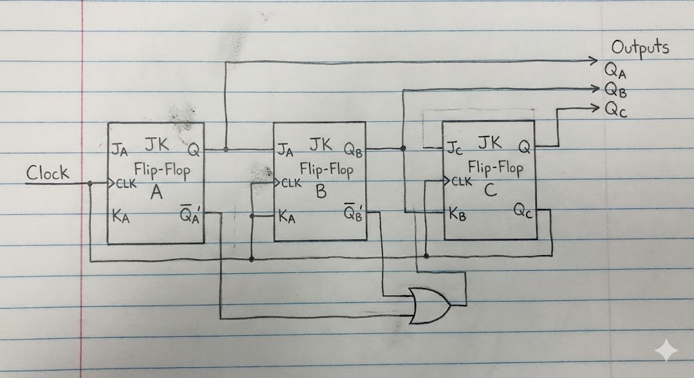

    Here is a step-by-step solution to design the specified counter.

    ### Design of a Synchronous Counter using J-K Flip-Flops

    #### Problem:
    Design a counter with the binary sequence 0, 3, 4, 6, 2, 5, 7 and repeat, using J-K flip-flops.

    #### Step 1: Determine the Number of Flip-Flops
    The sequence is:

    $$ 0 \rightarrow 3 \rightarrow 4 \rightarrow 6 \rightarrow 2 \rightarrow 5 \rightarrow 7 \rightarrow 0 $$

    The maximum decimal value in the sequence is 7. To represent 7 in binary, we need 3 bits (since $2^3 = 8$, which is sufficient to cover the range 0-7). Therefore, three J-K flip-flops are required. Let's denote them as $Q_A$, $Q_B$, and $Q_C$, where $Q_A$ is the Most Significant Bit (MSB) and $Q_C$ is the Least Significant Bit (LSB).

    #### Step 2: Create the State Table
    We list the present state and the corresponding next state from the given sequence. We also need to determine the required J and K inputs for each flip-flop to achieve these transitions.

    The excitation table for a J-K flip-flop is:

    - $0 \rightarrow 0 \Rightarrow J = 0, K = X$
    - $0 \rightarrow 1 \Rightarrow J = 1, K = X$
    - $1 \rightarrow 0 \Rightarrow J = X, K = 1$
    - $1 \rightarrow 1 \Rightarrow J = X, K = 0$

    (Where 'X' represents a "don't care" condition).

    The unused state is 1 (001). We will treat its next state as "don't care" (XXX) to simplify the logic.

    | Present State ($Q_A Q_B Q_C$) | Next State ($Q_A^+ Q_B^+ Q_C^+$) | $J_A$ | $K_A$ | $J_B$ | $K_B$ | $J_C$ | $K_C$ |
    |-------------------------------|------------------------------------|-------|-------|-------|-------|-------|-------|
    | 0 (000)                        | 3 (011)                            | 0     | X     | 1     | X     | 1     | X     |
    | 1 (001)                        | X (XXX)                            | X     | X     | X     | X     | X     | X     |
    | 2 (010)                        | 5 (101)                            | 1     | X     | X     | 1     | 1     | X     |
    | 3 (011)                        | 4 (100)                            | 1     | X     | X     | 1     | X     | 1     |
    | 4 (100)                        | 6 (110)                            | X     | 0     | 1     | X     | 0     | X     |
    | 5 (101)                        | 7 (111)                            | X     | 0     | 1     | X     | X     | 0     |
    | 6 (110)                        | 2 (010)                            | X     | 1     | X     | 0     | 0     | X     |
    | 7 (111)                        | 0 (000)                            | X     | 1     | X     | 1     | X     | 1     |

    #### Step 3: Obtain Simplified Boolean Expressions using K-Maps

    Using Karnaugh maps (K-maps) for each J and K input, we can derive the simplified boolean expressions.

    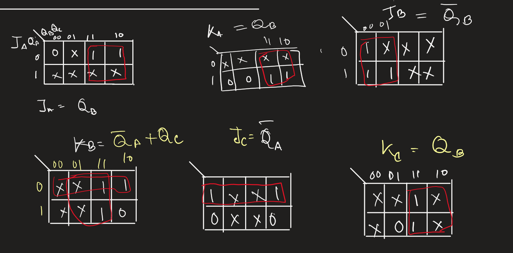

    For $J_A$ and $K_A$:
    Grouping the 1s and Xs in the K-maps gives:

    $$ J_A = Q_B $$

    $$ K_A = Q_B $$

    For $J_B$ and $K_B$:
    Grouping the 1s and Xs gives:

    $$ J_B = Q_A + \bar{Q}_B $$ 

    $$ K_B = Q_C $$

    For $J_C$ and $K_C$:

    Grouping the 1s and Xs gives:

    $$ J_C = \bar{Q}_A $$ 

    $$ K_C = Q_B $$

    #### Summary of Logic Equations:

    - $$ J_A = Q_B $$ 

    - $$ K_A = Q_B $$ 

    - $$ J_B = Q_A + \bar{Q}_B $$ 

    - $$ K_B = Q_C $$ 

    - $$ J_C = \bar{Q}_A $$ 

    - $$ K_C = Q_B $$

    #### Step 4: Draw the Logic Diagram
    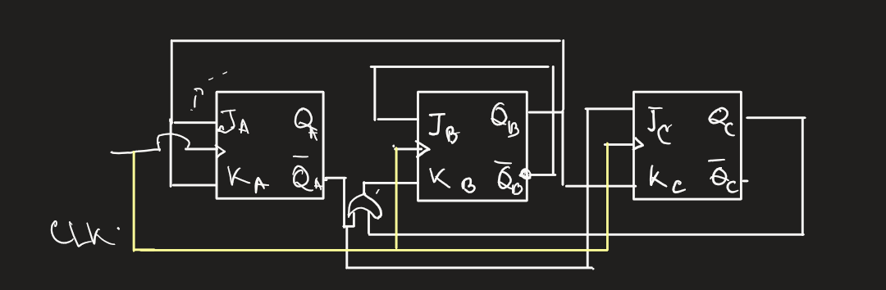
    Based on the derived equations, we can now draw the circuit diagram for the counter. All flip-flops are connected to a common clock signal (CLK) for synchronous operation.

    - **Flip-Flop A ($Q_A$):** Connect both $J_A$ and $K_A$ inputs to the $Q_B$ output of the second flip-flop.
    - **Flip-Flop B ($Q_B$):** Connect $J_B$ to the output of an OR gate, whose inputs are $Q_A$ and $\bar{Q}_B$. Connect $K_B$ to the $Q_C$ output of the third flip-flop.
    - **Flip-Flop C ($Q_C$):** Connect $J_C$ to the $\bar{Q}_A$ output of the first flip-flop. Connect $K_C$ to the $Q_B$ output of the second flip-flop.

    Here is the resulting logic diagram:

???  "Fewer NAND gate"

    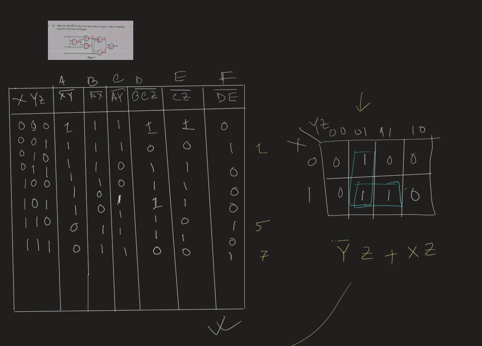
    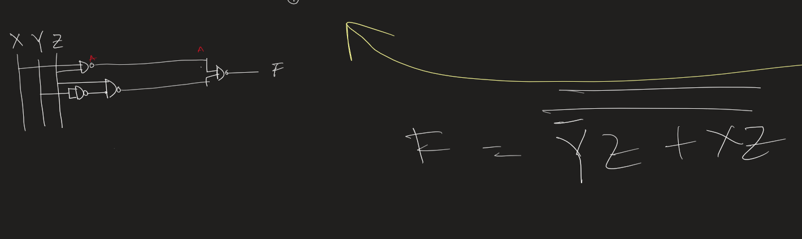 

??? "3 input Combinational circuit  to square output - ROM"

    <head></head>
    Below is a **complete, exam-ready answer** for **Question (b)**, written in **clear handwriting-style English**, structured exactly the way examiners expect. You can copy this directly in your answer script.

    * * *

    ## (b) Define Adder and Subtractor. Design a combinational circuit using a ROM that accepts a 3-bit number and generates an output binary number equal to the square of the input number.

    * * *

    ## Definition of Adder

    An **Adder** is a combinational logic circuit that performs the **addition of binary numbers**.  
    It produces two outputs called **Sum** and **Carry**.

    ### Types of Adders:

    1. **Half Adder**  
    Adds two single binary bits and produces Sum and Carry.
    2. **Full Adder**  
    Adds three binary bits (two inputs and one carry input).
    3. **Ripple Carry Adder**  
    Uses multiple full adders to add multi-bit binary numbers.

    * * *

    ## Definition of Subtractor

    A **Subtractor** is a combinational logic circuit that performs **binary subtraction**.  
    It produces two outputs called **Difference** and **Borrow**.

    ### Types of Subtractors:

    1. **Half Subtractor**  
    Subtracts two binary bits.
    2. **Full Subtractor**  
    Subtracts three binary bits (including borrow input).

    * * *

    ## ROM-Based Combinational Circuit Design

    ### (Square of a 3-bit Binary Number)

    * * *

    ### Step 1: Input and Output Specification

    - Input: 3-bit binary number **A B C**  
    where **A** is MSB and **C** is LSB.
    - Input range: (000\_2 (0)) to (111\_2 (7))
    - Maximum square:  
    (7^2 = 49 = 110001\_2)

    Therefore, **6 output bits** are required:  
    
    \[  
    F\_5 F\_4 F\_3 F\_2 F\_1 F\_0  
    \]

    * * *

    ### Step 2: Truth Table

    | A | B | C | Decimal | Square | Output (F\_5 F\_4 F\_3 F\_2 F\_1 F\_0) |
    | --- | --- | --- | --- | --- | --- |
    | 0 | 0 | 0 | 0 | 0 | 000000 |
    | 0 | 0 | 1 | 1 | 1 | 000001 |
    | 0 | 1 | 0 | 2 | 4 | 000100 |
    | 0 | 1 | 1 | 3 | 9 | 001001 |
    | 1 | 0 | 0 | 4 | 16 | 010000 |
    | 1 | 0 | 1 | 5 | 25 | 011001 |
    | 1 | 1 | 0 | 6 | 36 | 100100 |
    | 1 | 1 | 1 | 7 | 49 | 110001 |

    * * *

    ### Step 3: ROM Size Determination

    - Number of input lines = 3
    - Number of memory locations = (2^3 = 8)
    - Number of output bits = 6

    \[  
    \boxed{\text{Required ROM size } = 8 \times 6}  
    \]

    * * *

    ### Step 4: ROM Programming Table

    | Address (ABC) | ROM Output (Square) |
    | --- | --- |
    | 000 | 000000 |
    | 001 | 000001 |
    | 010 | 000100 |
    | 011 | 001001 |
    | 100 | 010000 |
    | 101 | 011001 |
    | 110 | 100100 |
    | 111 | 110001 |

    * * *

    ### Step 5: ROM Block Diagram (to draw in exam)
    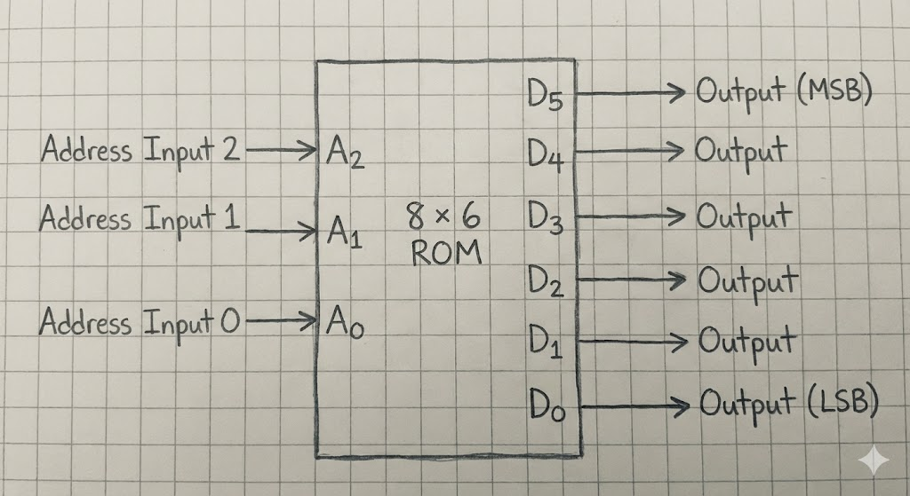
    

    * * *

    ### Step 6: Working Principle

    - The 3-bit input **ABC** is applied to the address lines of the ROM.
    - Each address stores the **pre-calculated square** of the input.
    - The ROM outputs the corresponding 6-bit binary square.
    - No additional logic gates are required.

    * * *

    ## Conclusion

    A combinational circuit using an **8 × 6 ROM** can efficiently generate the square of a 3-bit binary number.  
    The design is simple, fast, and suitable for digital system implementation.

??? "Dual equals Complement"
    
    Q: (c) Show that the dual of the equivalence function is equal to its complement
    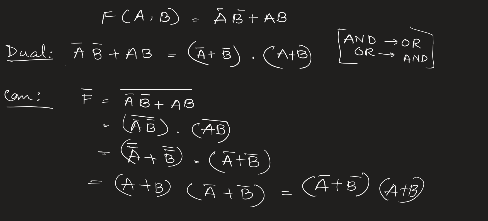

??? "Canonical vs Standard"

    ### **Difference between Canonical Form and Standard Form**

    In Digital Logic Design (ডিজিটাল লজিক ডিজাইন), representing Boolean functions correctly is very important. There are two main ways to represent any Boolean function (বুলিয়ান ফাংশন): the **Canonical Form** and the **Standard Form**. Below is the detailed comparison between them.

    #### **Comparison Table**

    | **S.No** | **Feature** | **Canonical Form (ক্যানোনিক্যাল ফর্ম)** | **Standard Form (স্ট্যান্ডার্ড ফর্ম)** |
    | --- | --- | --- | --- |
    | 1 | **Definition** | A Boolean function where each term contains **all** the variables (চলক) of the domain. | A Boolean function where terms may contain one, some, or all the variables of the domain. |
    | 2 | **Also Known As** | It is also called the **Expanded Form** (এক্সপ্যান্ডেড ফর্ম). | It is also called the **Simplified Form** (সরলীকৃত ফর্ম). |
    | 3 | **Basic Components** | It uses **Minterms** (মিনটার্ম) and **Maxterms** (ম্যাক্সটার্ম). | It uses general Product terms and Sum terms. |
    | 4 | **Relation to Truth Table** | It is directly obtained from the Truth Table (ট্রুথ টেবিল). | It is obtained after simplifying the canonical form using rules. |
    | 5 | **Uniqueness** | The canonical representation is **Unique** (অদ্বিতীয়) for a function. | The standard form is **Non-unique** (there can be many standard forms for one function). |
    | 6 | **Literals per Term** | Number of literals (লিটারাল) in each term is equal to the total number of variables. | Number of literals in a term is usually less than the total number of variables. |
    | 7 | **Complexity** | The expression is usually long and complex. | The expression is usually short and simple. |
    | 8 | **Circuit Cost** | Implementation (বাস্তবায়ন) is costly because it needs more gates. | Implementation is cheaper and efficient. |
    | 9 | **Logic Gates** | Requires logic gates with more inputs (fan-in). | Requires logic gates with fewer inputs. |
    | 10 | **Conversion** | Easy to convert to Standard form by simplification. | Hard to convert to Canonical form without algebraic manipulation. |

    * * *

    #### **20 Key Points of Difference**

    Here are the detailed points explaining the differences for full marks:

    1. **Fundamental Definition:** In Canonical form, every AND/OR term must have all input variables either in normal or complemented (পরিপূরক) form. In Standard form, variables can be missing from terms.
    2. **Alternative Names:** Canonical form is basically the raw data from the truth table, while Standard form is the minimized (মিনিমাইজড) version.
    3. **Types (SOP):** In Canonical, we use **Sum of Minterms** (Som). In Standard, we use **Sum of Products** (SOP).
    4. **Types (POS):** In Canonical, we use **Product of Maxterms** (PoM). In Standard, we use **Product of Sums** (POS).
    5. **Example (Canonical):** If variables are A, B, C, a term like $A\bar{B}C$ is canonical because all 3 are present.
    6. **Example (Standard):** For the same function, a term like $AC$ is standard because 'B' is missing.
    7. **Mapping:** We can plot Canonical forms directly into a Karnaugh Map (K-Map) easily. Standard forms first need to be expanded or analyzed to plot in K-Map.
    8. **Flexibility:** Standard form is more flexible for designers. Canonical form is rigid and fixed.
    9. **Simplification (সরলীকরণ):** We use Boolean Algebra or K-Map to convert Canonical to Standard. We generally don't convert Standard back to Canonical unless necessary for analysis.
    10. **Hardware Requirement:** Canonical form circuits (সার্কিট) are bulky. Standard form circuits are compact.
    11. **Gate Inputs:** If we have 4 variables, every gate in Canonical form needs 4 inputs. In Standard form, some gates might need only 2 inputs.
    12. **Analysis:** Canonical form is best for theoretical analysis and defining the function uniquely.
    13. **Practical Use:** Standard form is best for practical hardware design because it saves power and space.
    14. **Notation:** Canonical is often written using $\Sigma m$ (for minterms) or $\Pi M$ (for maxterms). Standard form is just written as an algebraic equation.
    15. **Scope:** Every Canonical form is technically a Standard form (with no missing variables), but not every Standard form is Canonical.
    16. **Delay:** Circuits made from Canonical forms usually have more propagation delay (ডিলে) due to complex wiring. Standard form is faster.
    17. **Conversion Effort:** Converting Standard to Canonical involves multiplying terms by $(X + \bar{X})$, which is a tedious process.
    18. **Number of Terms:** Canonical form generally has more terms (product terms or sum terms) than the Standard form.
    19. **Redundancy:** Canonical form contains redundant (অপ্রয়োজনীয়) information that can be removed. Standard form removes this redundancy.
    20. **Final Verdict:** For exam problems involving "Design a circuit," we always prefer **Standard Form**. For problems like "Write the function from the table," we use **Canonical Form**.

??? "State Table and State Digram"

    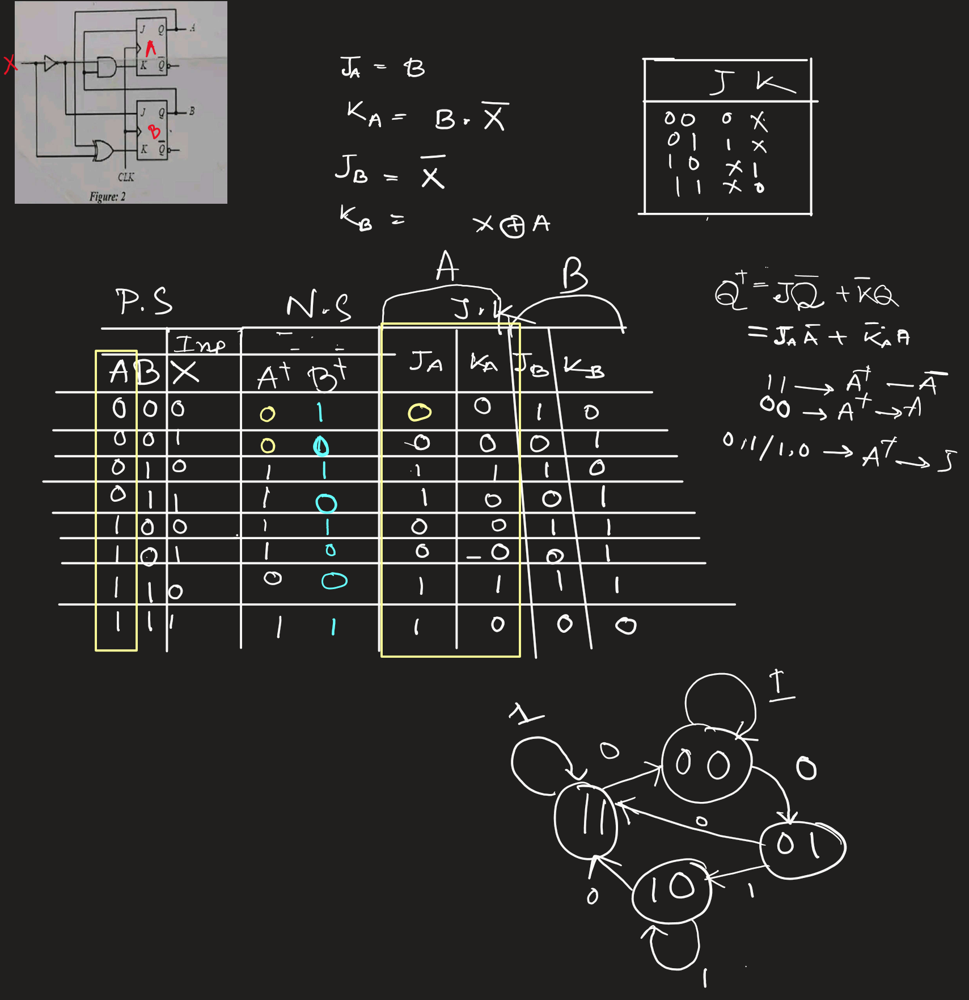

    ### **Solution for Question (b): Sequential Circuit Analysis**

    **Goal:** Derive the state table, state diagram, and function of the circuit in Figure 2.

    #### **Step 1: Analyze the Circuit Equations**

    First, determine the Boolean expressions for the J and K inputs of both Flip-Flops. Let the external input be $X$.

    - **For Flip-Flop A (Top):**

    - $J\_A = B$ (Direct connection)
    - $K\_A = B \cdot \bar{X}$ (AND gate with B and inverted X)
    - **For Flip-Flop B (Bottom):**

    - $J\_B = \bar{X}$ (Inverter output)
    - $K\_B = A \oplus X$ (XOR gate with A and X)

    * * *

    #### **Step 2: State Table (স্টেট টেবিল)**

    To fill this table quickly without doing complex calculations ($Q\_{next} = J\bar{Q} + \bar{K}Q$), use this **Exam Shortcut**:

    > 
    > **💡 JK Flip-Flop Shortcut Rule:**
    > 
    > - **If $J \neq K$:** The Next State **follows J**. (If $J=1$, Next=1. If $J=0$, Next=0).
    > - **If $J = K = 0$:** **No Change** (Next State = Present State).
    > - **If $J = K = 1$:** **Toggle** (Next State = Opposite of Present State).
    > 

    **Complete State Table:**

    | **Present State (বর্তমান অবস্থা)** | **Input** | **Flip-Flop A Inputs** | **Flip-Flop B Inputs** | **Next State (পরবর্তী অবস্থা)** |
    | --- | --- | --- | --- | --- |
    | **A B** | **X** | **$J\_A$** | **$K\_A$** | **$J\_B$** |
    | 0 0 | 0 | 0 | 0 | 1 |
    | 0 0 | 1 | 0 | 0 | 0 |
    | 0 1 | 0 | 1 | 1 | 1 |
    | 0 1 | 1 | 1 | 0 | 0 |
    | 1 0 | 0 | 0 | 0 | 1 |
    | 1 0 | 1 | 0 | 0 | 0 |
    | 1 1 | 0 | 1 | 1 | 1 |
    | 1 1 | 1 | 1 | 0 | 0 |

    * * *

    #### **Step 3: State Diagram (স্টেট ডায়াগ্রাম)**

    Based on the "Next State" columns above, the transitions are:

    - **State 00:**

    - If $X=0 \rightarrow$ Goes to **01**
    - If $X=1 \rightarrow$ Stays at **00**
    - **State 01:**

    - If $X=0 \rightarrow$ Goes to **11**
    - If $X=1 \rightarrow$ Goes to **10**
    - **State 10:**

    - If $X=0 \rightarrow$ Goes to **11**
    - If $X=1 \rightarrow$ Stays at **10**
    - **State 11:**

    - If $X=0 \rightarrow$ Goes to **00**
    - If $X=1 \rightarrow$ Stays at **11**

    *(Draw 4 circles labeled 00, 01, 10, 11 and connect them with arrows based on these transitions)*

    * * *

    #### **Step 4: Function of the Circuit (সার্কিটের কাজ)**

    The circuit's behavior is controlled by the input $X$:

    1. When Input X = 0 (Counting Mode):

    The circuit cycles through the sequence: $00 \rightarrow 01 \rightarrow 11 \rightarrow 00$.

    - It acts as a **Modulo-3 Counter** (counts 0, 1, 3, then repeats).
    - Note: It skips state $10$ (Decimal 2).
    2. When Input X = 1 (Hold Mode):

    The circuit mostly Holds (keeps) its current state.

    - If in 00, 10, or 11, it stays there.
    - If in 01, it switches to 10 and then stops.

    Conclusion:

    This is a Mode-Controlled Sequence Generator. In one mode ($X=0$), it generates a specific binary sequence, and in the other mode ($X=1$), it stops counting.

???  "PLA Problem"

    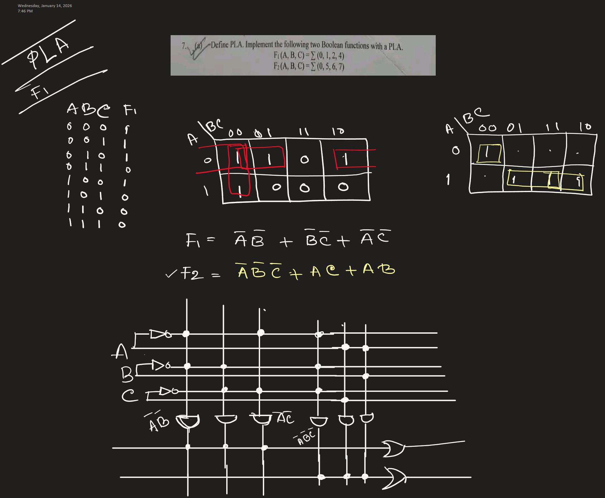

??? "4 bit binary 9's complement"

    Based on the image provided, here is the step-by-step design for the combinational circuit.

    ### **Problem Analysis**

    **Question 4.10:** Design a combinational circuit that converts a 4-bit BCD input to its nines complement output.

    - **Input:** A 4-bit BCD digit ($A, B, C, D$) representing decimal values 0–9.

    - *Note:* Inputs 10–15 (1010 to 1111) are invalid in BCD and are treated as "Don't Cares" ($X$).
    - **Output:** A 4-bit number ($w, x, y, z$) representing the 9's complement.

    - The 9's complement of a digit $N$ is calculated as $9 - N$.

    * * *

    ### **Step 1: Truth Table**

    We calculate the output by subtracting the input decimal value from 9.

    (Example: If Input is 2, Output is $9 - 2 = 7$).

    | **Decimal** | **Input (BCD) A B C D** | **9's Comp Calculation** | **Output w x y z** |
    | --- | --- | --- | --- |
    | 0 | 0 0 0 0 | $9 - 0 = 9$ | **1 0 0 1** |
    | 1 | 0 0 0 1 | $9 - 1 = 8$ | **1 0 0 0** |
    | 2 | 0 0 1 0 | $9 - 2 = 7$ | **0 1 1 1** |
    | 3 | 0 0 1 1 | $9 - 3 = 6$ | **0 1 1 0** |
    | 4 | 0 1 0 0 | $9 - 4 = 5$ | **0 1 0 1** |
    | 5 | 0 1 0 1 | $9 - 5 = 4$ | **0 1 0 0** |
    | 6 | 0 1 1 0 | $9 - 6 = 3$ | **0 0 1 1** |
    | 7 | 0 1 1 1 | $9 - 7 = 2$ | **0 0 1 0** |
    | 8 | 1 0 0 0 | $9 - 8 = 1$ | **0 0 0 1** |
    | 9 | 1 0 0 1 | $9 - 9 = 0$ | **0 0 0 0** |
    | 10–15 | 1 X X X | Invalid | X X X X |

    * * *

    ### **Step 2: K-Map Simplification**

    We will determine the Boolean expression for each output bit ($w, x, y, z$) using the inputs ($A, B, C, D$).

    **1. Output $z$ (LSB)**

    - Looking at the column for $z$: It is `1` when the input $D$ is `0`, and `0` when input $D$ is `1`.
    - It simply toggles every alternate number.
    - **Expression:** 

    $$z = \bar{D}$$

    **2. Output $y$**

    - Looking at the column for $y$: `0, 0, 1, 1, 0, 0, 1, 1...`
    - Compare this to input column $C$: `0, 0, 1, 1, 0, 0, 1, 1...`
    - They are identical for all valid BCD inputs.
    - **Expression:** 

    $$y = C$$

    **3. Output $x$**

    - $x$ is High (1) for inputs 2, 3, 4, 5.
    - Using a K-Map or Boolean logic:

    - Rows where $x=1$: 0010, 0011, 0100, 0101.
    - This pattern corresponds to an **XOR** relationship between inputs $B$ and $C$.
    - Check: $2 (0010) \rightarrow B=0, C=1 \rightarrow B \oplus C = 1$. (Correct)
    - Check: $4 (0100) \rightarrow B=1, C=0 \rightarrow B \oplus C = 1$. (Correct)
    - **Expression:** 

    $$x = B \oplus C$$

    **4. Output $w$ (MSB)**

    - $w$ is High (1) only for inputs 0 (0000) and 1 (0001).
    - For all other valid inputs (2–9), $w$ is 0.
    - This occurs when $A=0$, $B=0$, and $C=0$. The input $D$ can be 0 or 1.
    - This logic corresponds to a NOR operation of A, B, and C (Output is 1 only if all inputs are 0).
    - **Expression:** 

    $$w = \bar{A}\bar{B}\bar{C} = \overline{A + B + C}$$

    * * *

    ### **Step 3: Final Logic Equations**

    - **$z = \bar{D}$**
    - **$y = C$**
    - **$x = B \oplus C$**
    - **$w = \overline{A + B + C}$**

    * * *

    ### **Step 4: Logic Diagram**

    To draw the diagram, follow these connections:

    1. **Input Lines:** Draw four vertical lines labeled $A, B, C, D$.
    2. **Circuit for $z$:** Connect input $D$ to a **NOT gate**. The output is $z$.
    3. **Circuit for $y$:** Connect input $C$ directly to the output $y$ (a straight wire or a buffer).
    4. **Circuit for $x$:** Connect inputs $B$ and $C$ to an **XOR gate**. The output is $x$.
    5. **Circuit for $w$:** Connect inputs $A, B,$ and $C$ to a **3-input NOR gate**. The output is $w$.

    This design is efficient, using only one NOT gate, one XOR gate, and one NOR gate.

