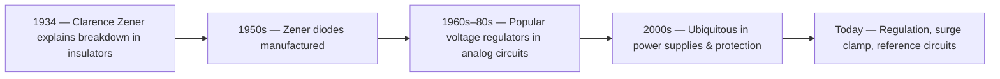

<!-- prettier-ignore-start -->

# Zener Diode Lab — ultra-beginner guide

## 0) What is a Zener diode? (in plain words)

A Zener diode is a special diode that, when reverse-biased, **holds its voltage almost constant** after a certain point called **breakdown (Zener) voltage, $V_Z$**.
Think of it like a **safety valve**: when pressure (voltage) tries to go higher, the valve opens more (current increases) so the pressure stays nearly the same.

* **Forward bias (like a normal diode):** starts conducting around **0.7 V** (silicon).
* **Reverse bias (the fun part):** barely any current… until **$V_Z$**. After that, voltage ≈ constant, current rises.

---

## 1) Symbols & quick meanings

| Symbol | Meaning                          | How to read it                           | Typical unit     |
| ------ | -------------------------------- | ---------------------------------------- | ---------------- |
| $V_Z$  | Zener (breakdown) voltage        | The “clamped” voltage in reverse         | volts (V)        |
| $R_S$  | Series resistor                  | Protects the Zener by limiting current   | ohms (Ω)         |
| $R_L$  | Load resistor                    | Your device/load connected to the output | ohms (Ω)         |
| $I_Z$  | Zener current                    | Current through the Zener                | ampere (A) or mA |
| $I_L$  | Load current                     | Current through the load                 | A or mA          |
| $V_O$  | Output voltage                   | Voltage across Zener (and load)          | V                |
| $r_z$  | Dynamic (incremental) resistance | Small-signal slope in Zener region       | Ω                |

---

## 2) Lab defaults vs. what you can change

| Parameter   | **Initial / default** (from your sheet) |                What you can set (safe range) | Notes                                   |
| ----------- | --------------------------------------: | -------------------------------------------: | --------------------------------------- |
| Zener diode |                D1N750 (≈ **6.2–6.3 V**) | Use any 5.1–6.8 V Zener for similar behavior | Reading may be 6.2–6.6 V in practice    |
| $R_S$       |                               **100 Ω** |                                     82–470 Ω | Lower $R_S$ → more current ⚠️           |
| $R_L$       | **1 kΩ** in fig., varied (10 kΩ → 10 Ω) |       10 kΩ down to \~200 Ω (for regulation) | Very small $R_L$ can break regulation ❌ |
| $V_{in}$    |                            0 → **10 V** |           up to 12 V (if your supply allows) | Don’t exceed diode power ⚠️             |
| Multimeters |                                       2 |                                            – | One for V, one for I                    |

> ⚠️ **Safety**: Always include $R_S$. Never connect a Zener directly to a supply in reverse bias — it will burn. ❌

---

## 3) Why the circuit behaves this way

* Below $V_Z$: negligible reverse current → output almost equals input (but small currents).
* Near $V_Z$: diode starts conducting → output **pins** near $V_Z$.
* Above $V_Z$: any extra input or lighter load mostly shows up as **more current**, not more voltage.

**Key formula (reverse region):**

$$
I_S=\frac{V_{in}-V_O}{R_S},\qquad
I_L=\frac{V_O}{R_L},\qquad
I_Z=I_S-I_L
$$

Regulation holds while **$I_Z>0$**. If $I_Z\le 0$, the Zener is “off” → **no regulation** ❌.

---

## 4) Step-by-step procedure (with beginner tips)

1. **Build** the circuit as in your sheet (Zener in reverse, $R_S=100 Ω$).
2. **Dial $V_{in}$** slowly from 0 V upward.
3. **Record** $V_O$ (across Zener) and **current** (either series current by meter in series, or compute from $(V_{in}-V_O)/R_S$).
4. **Find $V_Z$** where $V_O$ flattens (≈ 6.3 V).
5. **Compute $r_z$** with two points in the flat region: $r_z=\Delta V/\Delta I$.
6. **Test loads** $R_L=10 kΩ, 1 kΩ, 100 Ω, 10 Ω$. Note $V_O, I_L, I_Z$.
7. **Decide** if regulation held (check $I_Z>0$).

> ⚠️ **Polarity check**: The Zener’s **band** is the **cathode**. For reverse regulation, band goes to **+ side** through $R_S$. Wrong polarity = no breakdown reading ❌.

---

## 5) Example raw data (you can directly use)

**Reverse-bias sweep, $R_S=100 Ω$, no load $R_L=\infty$:**

| Step | $V_{in}$ (V) | $V_O$ = $V_Z$ (V) | $I$ (mA) = $(V_{in}-V_O)/100$ |
| ---: | -----------: | ----------------: | ----------------------------: |
|    1 |          3.0 |              3.00 |                           0.0 |
|    2 |          4.0 |              4.00 |                           0.0 |
|    3 |          5.5 |              5.50 |                           0.0 |
|    4 |          6.0 |              6.00 |                           0.0 |
|    5 |          6.3 |              6.28 |                           0.2 |
|    6 |          6.5 |              6.32 |                           1.8 |
|    7 |          7.0 |              6.35 |                           6.5 |
|    8 |          7.5 |              6.38 |                          11.2 |
|    9 |          8.0 |              6.42 |                          15.8 |
|   10 |          9.0 |              6.48 |                          25.2 |
|   11 |         10.0 |              6.55 |                          34.5 |

**Reading the table like a pro (beginner-friendly):**

* Rows 1–4: before breakdown (no current).
* Rows 5–11: in Zener region → **voltage barely increases** while current climbs a lot. ✅

---

## 6) Find $r_z$ (dynamic resistance) — worked example

Pick two points in the flat region, say rows **9** and **11**:

$$
\Delta V = 6.55-6.42=0.13\text{ V},\quad \Delta I = 34.5-15.8 = 18.7\text{ mA} = 0.0187\text{ A}
$$

$$
\boxed{r_z=\frac{\Delta V}{\Delta I}\approx\frac{0.13}{0.0187}\approx 6.95~\Omega}
$$

**Meaning:** Every extra **1 A** of current would raise $V_O$ by only \~7 V; at mA levels, changes are tiny → good regulation.

---

## 7) Line regulation — two beginner ways to report

**Way-A (datasheet-style):**

$$
\text{Line Reg}=\frac{r_z}{r_z+R_S}=\frac{6.95}{6.95+100}\approx \boxed{0.065 \,(6.5\%)}
$$

**Way-B (measured small change):**
If $V_{in}$ rises **2 V**, $V_O$ only rises **≈0.05–0.07 V**
$\Rightarrow \Delta V_O/\Delta V_{in}≈0.025–0.035$.
Both stories say the same thing: **output changes very little**. ✅

---

## 8) Zener regulator with load — do I still regulate?

Take $V_{in}=10 V$, $R_S=100 Ω$, $V_O\approx6.5 V$.
Source (series) current:

$$
I_S=\frac{10-6.5}{100}=0.035\text{ A}=35\text{ mA}
$$

Now try different loads:

|     $R_L$ | $V_O$ (V) | $I_L=V_O/R_L$ (mA) | $I_Z=I_S-I_L$ (mA) | Verdict               |
| --------: | --------: | -----------------: | -----------------: | --------------------- |
|     10 kΩ |       6.5 |               0.65 |              34.35 | ✅ Strong regulation   |
|      1 kΩ |       6.5 |                6.5 |               28.5 | ✅ Regulation OK       |
|     330 Ω |       6.5 |               19.7 |               15.3 | ✅ Regulation OK       |
| **200 Ω** |   **6.5** |           **32.5** |            **2.5** | ⚠️ Barely regulating  |
| **186 Ω** |  **≈6.5** |           **35.0** |             **≈0** | ⚠️ Edge of regulation |
|     100 Ω |  **≈5.0** |      50 (no Zener) |                \~0 | ❌ Zener turns off     |
|      10 Ω | **≈0.91** |    90.9 (no Zener) |                \~0 | ❌ Divider only        |

**Rule you can quote:**
Smallest load that still regulates:

$$
R_{L,\min} \approx \frac{V_Z}{I_S}=\frac{V_Z}{(V_{in}-V_Z)/R_S}=\boxed{\frac{V_Z\,R_S}{V_{in}-V_Z}}
$$

For our numbers:

$$
R_{L,\min}\approx \frac{6.5\times100}{10-6.5}\approx 186~\Omega
$$

Use the next standard value **≥ 200 Ω** in practice. ✅

---

## 9) Quick “cheat sheet” (stick this on your copy)

| Thing                       | What to write in report                                                           |
| --------------------------- | --------------------------------------------------------------------------------- |
| Breakdown voltage $V_Z$     | **6.3–6.5 V** (your page shows **6.30 V**)                                        |
| Dynamic resistance $r_z$    | \~**7 Ω** (from slope)                                                            |
| Line regulation             | **≈ 0.065 (6.5%)** or **ΔVo/ΔVin ≈ 0.03**                                         |
| $R_{L,\min}$ at 10 V, 100 Ω | **≈ 186 Ω**                                                                       |
| Why Zener regulates         | After $V_Z$, voltage \~constant; extra input → extra **current**, not **voltage** |

---

## 10) Common mistakes & fixes

* ❌ **No series resistor $R_S$** → diode overheats/burns.
  **Fix:** Always keep $R_S$ (100–470 Ω typical). ⚠️

* ❌ **Wrong polarity** (band/cathode on wrong side) → no breakdown.
  **Fix:** Band toward the + supply through $R_S$. ✅

* ❌ **Meter in wrong mode/range** → nonsense values.
  **Fix:** Use DC ranges, start high then go lower. ✅

* ❌ **Supply too low** (never reaches $V_Z$) → flat 0 mA.
  **Fix:** Increase $V_{in}$ above \~6.5 V. ✅

* ⚠️ **Overheating** at high current.
  **Fix:** Keep $I_Z$ within Zener power $P_Z$ (e.g., for a 0.5 W Zener at 6.2 V, max $I_Z\approx 80 mA$).

---

## 11) Flowcharts (visuals)

### A) Zener essentials timeline (with years)



### B) Your lab session roadmap (with minutes)

```mermaid
flowchart LR
  S[0–5 min: Build circuit\n(Zener reverse, RS=100Ω)] --> T[5–15 min: Sweep Vin\nRecord V and I]
  T --> U[15–25 min: Plot V–I\nMark Vz ≈ 6.3V]
  U --> V[25–35 min: Choose 2 points\nCompute rz = ΔV/ΔI]
  V --> W[35–50 min: Add loads RL\n10k→1k→330Ω→200Ω]
  W --> X[50–55 min: Check IZ>0?\nRegulating or not]
  X --> Y[55–60 min: Fill table, answer Qs]
```

### C) Do I regulate? (decision mini-flow)

```mermaid
flowchart TD
  A[Given Vin, RS, RL] --> B[Assume Vo ≈ Vz]
  B --> C[Compute IS = (Vin - Vo)/RS]
  C --> D[Compute IL = Vo/RL]
  D --> E{IS > IL ?}
  E -- Yes --> F[IZ = IS - IL > 0\n✅ Regulates at ~Vz]
  E -- No --> G[IZ ≤ 0\n❌ Zener off → Divider voltage\nIncrease RS or RL, or raise Vin]
```

---

## 12) Fill-in templates (handy for your copy)

**(1) Slope / dynamic resistance $r_z$:**

* Point-1: $V_{O1}=\_\_.\_\_\,V$, $I_1=\_\_.\_\_\,mA$
* Point-2: $V_{O2}=\_\_.\_\_\,V$, $I_2=\_\_.\_\_\,mA$
* $r_z=(V_{O2}-V_{O1})/(I_2-I_1)=\_\_.\_\_\,\Omega$

**(2) Minimum load that still regulates:**

$$
R_{L,\min}=\frac{V_Z\,R_S}{V_{in}-V_Z}=\_\_.\_\_\ \Omega
$$

**(3) Line regulation (either style):**

$$
\frac{\Delta V_O}{\Delta V_{in}}=\_\_.\_\_\quad\text{or}\quad\frac{r_z}{r_z+R_S}=\_\_.\_\_
$$

---

## 13) Final short answers (the two questions on your sheet)

**(i) How does the Zener regulate the output?**
In reverse breakdown, the Zener **clamps the output near $V_Z$**. When $V_{in}$ or load changes, mostly **current** changes through the Zener, while **voltage** changes a tiny amount (by $r_z \cdot \Delta I$). That’s why $V_O$ stays almost constant.

**(ii) What is $V_Z$ here and smallest working load?**

* From the graph/data: **$V_Z \approx 6.3\text{–}6.5 V$** (your sheet notes **6.30 V**).
* With $V_{in}=10 V$, $R_S=100 Ω$:

  $$
  R_{L,\min}\approx \frac{6.5\times100}{10-6.5}\approx 186\,Ω
  $$

  So **use $R_L \ge 200\,Ω$** for safe regulation. ✅


<!-- prettier-ignore-end-->
