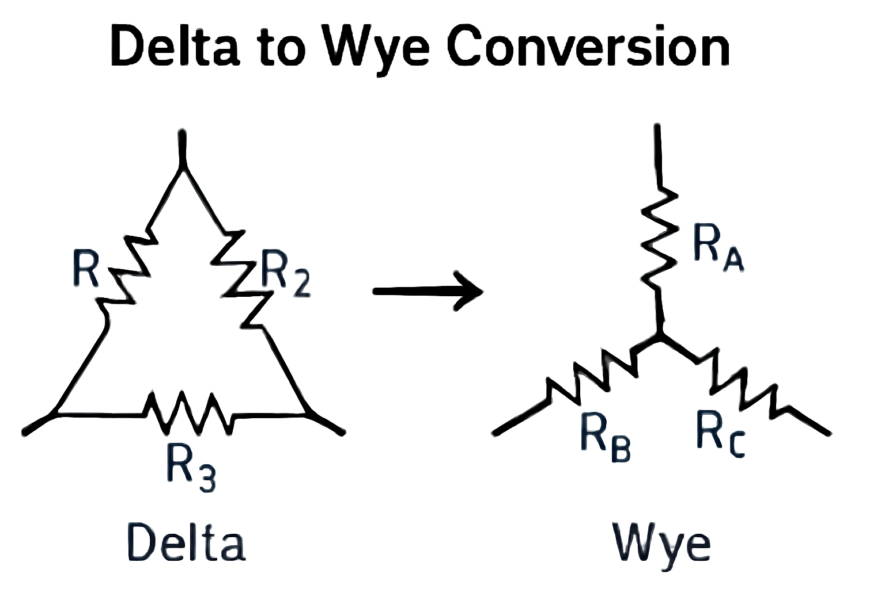

### Question 1: State and Prove Thevenin's Theorem with Example

<!-- #### Question:

**State and prove Thevenin’s Theorem. Derive the expression for the Thevenin equivalent circuit for a given network. Illustrate the process with a numerical example. Discuss the significance and applications of Thevenin's theorem in circuit analysis.** -->

#### Answer:

**Thevenin’s Theorem**:
Thevenin's theorem states that any linear, active electrical network with voltage sources and resistors can be replaced by an equivalent circuit consisting of a single voltage source in series with a single resistor. This is true for both AC and DC circuits, simplifying analysis when considering load resistance.

**Mathematical Formulation**:
The equivalent Thevenin voltage $V_{th}$ and resistance $R_{th}$ are defined as follows:

1. **Thevenin Voltage ($V_{th}$)**:

   * Remove the load resistance $R_L$ from the network.
   * Compute the open-circuit voltage, i.e., the voltage across the terminals where the load was connected. This is $V_{th}$.

2. **Thevenin Resistance ($R_{th}$)**:

   * Deactivate all independent voltage sources (replace voltage sources with short circuits and current sources with open circuits).
   * Find the equivalent resistance looking into the terminals where the load was connected. This is $R_{th}$.

**Thevenin's Theorem in Mathematical Steps**:

1. **Find $V_{th}$**: Measure or calculate the open-circuit voltage across the load terminals.

2. **Find $R_{th}$**: Replace all independent sources with their internal resistance, and find the equivalent resistance at the load terminals.

3. **Thevenin Equivalent Circuit**: The circuit is replaced by a voltage source $V_{th}$ in series with a resistor $R_{th}$, which can be used to calculate the current and voltage for different load resistances.

**Example**:
Consider a circuit with a 10V battery in series with a 10Ω resistor and a load resistor $R_L$ connected across the terminals. We need to find the Thevenin equivalent of this network at the terminals of the load resistor.

1. **Step 1 - Thevenin Voltage ($V_{th}$)**:
   With the load resistor removed, the open-circuit voltage is simply the battery voltage, $V_{th} = 10V$.

2. **Step 2 - Thevenin Resistance ($R_{th}$)**:
   Deactivate the battery (replace it with a short circuit). The remaining resistance seen from the load terminals is just $R_{th} = 10Ω$.

   Therefore, the Thevenin equivalent circuit is a 10V voltage source in series with a 10Ω resistor.

#### Applications:

* **Simplification of Circuit Analysis**: Thevenin’s theorem helps reduce complex circuits to a simple equivalent, making it easier to analyze.
* **Power Transfer Optimization**: By matching the load resistance to the Thevenin resistance, maximum power transfer occurs.

---

### Question 2: What is Delta-Wye (Δ-Y) Conversion? Provide Examples.

<!-- #### Question:

**What is Delta-Wye (Δ-Y) Conversion in electrical circuits? Derive the mathematical formulas for the conversion between the Delta and Wye configurations. Illustrate the conversion process with an example. Discuss the importance of this conversion in circuit analysis and solve for the equivalent impedance of a given Delta network.** -->

#### Answer:

**Delta-Wye (Δ-Y) Conversion**:
The Delta-Wye conversion (also known as Δ-Y or Δ-to-Y conversion) is a technique used to simplify the analysis of resistive networks. In this process, a three-terminal Delta network (with resistances $R_1$, $R_2$, $R_3$ forming a triangle) is transformed into a three-terminal Wye network (with resistances $R_A$, $R_B$, $R_C$ forming a 'Y' shape), and vice versa. This conversion is useful when analyzing complex circuits involving three-phase systems or any network where resistances are in a triangular configuration.

**Mathematical Formulas**:
It looks like there’s an issue with the formatting of the equations, and particularly with the multiplication signs. The formulas should correctly display the multiplication sign and ensure clarity. Here’s the corrected version of your equations and the example:

### **Delta to Wye Conversion**:

The resistances in a Delta network can be converted into the corresponding resistances in a Wye network using the following relations:

$$
R_A = \frac{R_1 \times R_2}{R_1 + R_2 + R_3}
$$

$$
R_B = \frac{R_2 \times R_3}{R_1 + R_2 + R_3}
$$

$$
R_C = \frac{R_3 \times R_1}{R_1 + R_2 + R_3}
$$

### **Wye to Delta Conversion**:

Conversely, the resistances in a Wye network can be converted to a Delta network using:

$$
R_1 = \frac{R_A \times R_B}{R_A + R_B + R_C}
$$

$$
R_2 = \frac{R_B \times R_C}{R_A + R_B + R_C}
$$

$$
R_3 = \frac{R_C \times R_A}{R_A + R_B + R_C}
$$

---

### **Example**:

Suppose we have a Delta network with the following resistances:

* $R_1 = 6Ω$
* $R_2 = 3Ω$
* $R_3 = 2Ω$

We will convert this into a Wye network.

#### **Step 1 - Apply the Delta to Wye Conversion Formulas**:

1. For $R_A$:

$$
R_A = \frac{6 \times 3}{6 + 3 + 2} = \frac{18}{11} \approx 1.636Ω
$$

2. For $R_B$:

$$
R_B = \frac{3 \times 2}{6 + 3 + 2} = \frac{6}{11} \approx 0.545Ω
$$

3. For $R_C$:

$$
R_C = \frac{2 \times 6}{6 + 3 + 2} = \frac{12}{11} \approx 1.091Ω
$$

   Therefore, the Wye resistances are:

   * $R_A \approx 1.636Ω$
   * $R_B \approx 0.545Ω$
   * $R_C \approx 1.091Ω$

2. **Step 2 - Verify the Results**: These resistances can now be used in a Wye configuration instead of the Delta configuration, simplifying the analysis.

#### Importance and Applications:

* **Simplification of Network Analysis**: Delta-Wye conversions make it easier to calculate the total impedance, especially in complex AC circuits.
* **Three-Phase Systems**: In electrical power systems, the Delta-Wye transformation is essential for balancing and analyzing three-phase circuits.
* **Impedance Matching**: Helps in matching impedances between different parts of a network to ensure maximum power transfer.

