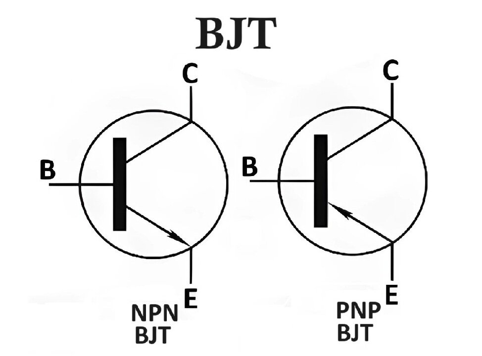

??? info "Bipolar Junction Transistor (BJT)"

    ## 4. Bipolar Junction Transistor (BJT)

    ### BJT Basics

    A Bipolar Junction Transistor, commonly called BJT, is a semiconductor device (সেমিকন্ডাক্টর ডিভাইস) used for amplification (বর্ধন) and switching (সুইচিং) purposes in electronic circuits (ইলেকট্রনিক সার্কিট). It is called bipolar (দ্বিমুখী) because both electrons (ইলেকট্রন) and holes (হোল) take part in current conduction (কারেন্ট পরিবাহিতা).

    A BJT has three terminals (টার্মিনাল), namely emitter (এমিটার), base (বেস), and collector (কালেক্টর). There are two types of BJTs. One is NPN transistor (এনপিএন ট্রানজিস্টর) and the other is PNP transistor (পিএনপি ট্রানজিস্টর).

    

    ## Construction of BJT

    The construction (গঠন) of a BJT consists of three semiconductor regions (সেমিকন্ডাক্টর অঞ্চল) arranged in a sandwich form. These regions are emitter, base, and collector.

    The emitter is heavily doped (বেশি ডোপড) to supply a large number of charge carriers (চার্জ বাহক). The base is very thin (পাতলা) and lightly doped (কম ডোপড). The collector is moderately doped (মাঝারি ডোপড) and has a larger area (বড় এলাকা) compared to the emitter.

    In an NPN transistor, a thin P type base is placed between two N type regions. In a PNP transistor, a thin N type base is placed between two P type regions.

    Main features of construction:

    * Emitter supplies charge carriers
    * Base controls the flow of carriers
    * Collector collects the carriers

    ---

    ## Modes of Operation

    The modes of operation (কার্যপ্রণালী মোড) of a BJT depend on the biasing condition (বায়াসিং অবস্থা) of its two junctions. A BJT has two junctions. One is emitter base junction and the other is collector base junction.

    ### Cut off Mode

    In cut off mode (কাট অফ মোড), both the emitter base junction and collector base junction are reverse biased (রিভার্স বায়াসড). In this mode, no current flows through the transistor. The transistor behaves like an open switch (খোলা সুইচ).

    ### Active Mode

    In active mode (অ্যাক্টিভ মোড), the emitter base junction is forward biased (ফরওয়ার্ড বায়াসড) and the collector base junction is reverse biased. This mode is used for amplification. A small base current controls a large collector current.

    ### Saturation Mode

    In saturation mode (স্যাচুরেশন মোড), both the emitter base junction and collector base junction are forward biased. In this mode, the transistor conducts maximum current and behaves like a closed switch (বন্ধ সুইচ).

    ---

    ## BJT V I Characteristics

    The V I characteristics (ভোল্টেজ কারেন্ট বৈশিষ্ট্য) of a BJT show the relationship (সম্পর্ক) between voltage and current under different operating conditions.

    There are three important characteristics curves.

    ### Input Characteristics

    The input characteristics show the relation between base current (বেস কারেন্ট) and base emitter voltage (বেস এমিটার ভোল্টেজ) at a constant collector emitter voltage. This curve looks similar to a diode characteristic because the base emitter junction is forward biased.

    ### Output Characteristics

    The output characteristics show the relation between collector current (কালেক্টর কারেন্ট) and collector emitter voltage (কালেক্টর এমিটার ভোল্টেজ) for different values of base current. In the active region, the collector current remains almost constant for a given base current.

    ### Transfer Characteristics

    The transfer characteristics show the relation between collector current and base current at a constant collector emitter voltage. This curve explains the current gain (কারেন্ট গেইন) of the transistor.

    ---

    ## Conclusion

    The Bipolar Junction Transistor is an important electronic device used widely in amplifiers and switching circuits. Its construction consists of emitter, base, and collector regions with different doping levels. The modes of operation explain how the transistor behaves under different biasing conditions. The V I characteristics help in understanding the electrical behavior of a BJT and its practical applications in electronic circuits.

??? info "Diode vs Transistors vs Rectifiers vs BJT "

    To clear your confusion, here is a structured explanation distinguishing these terms. The main confusion usually stems from mixing up "Components" (Hardware) with "Applications" (Jobs).

    ### **1. Diode (The Component)**

    A **Diode** is a basic electronic component (উপাদান). It is a two-terminal device made of semiconductor material.

    * **Structure:** It has one **P-N Junction**.
    * **Terminals:** Two terminals – Anode (+) and Cathode (-).
    * **Main Function:** It allows current to flow in **only one direction** (একমুখী). It blocks current in the reverse direction.
    * **Analogy:** Think of it as a "One-way Valve" (একমুখী ভালভ) in a water pipe.

    ### **2. Rectifier (The Application)**

    A **Rectifier** is **not** a specific component; it is a **Circuit** or an **Application** (ব্যবহার/প্রয়োগ).

    * **Definition:** A circuit that converts AC (Alternating Current) into DC (Direct Current).
    * **Relationship:** To build a Rectifier circuit, we use **Diodes**.
    * **Types:** Half-wave rectifier (uses 1 diode), Full-wave rectifier (uses 2 or 4 diodes).
    * **Key Point:** The Diode is the *tool*, and Rectification is the *work* it does.

    ### **3. Transistor / BJT (The Controller)**

    A **Transistor** is an advanced semiconductor component. **BJT** (Bipolar Junction Transistor) is the most common type of transistor.

    * **Structure:** It has **two P-N Junctions** connected back-to-back (N-P-N or P-N-P).
    * **Terminals:** Three terminals – Emitter, Base, and Collector.
    * **Main Function:** It does not just allow current to flow; it **controls** the amount of current.
    1. **Switching:** Turning current ON/OFF fully.
    2. **Amplification (বিবর্ধন):** Converting a weak signal into a strong signal.

    * **Analogy:** Think of it as a "Water Tap" (পানির কল). You can turn it completely off, completely on, or control the flow rate with the handle (Base).

    ---

    ### **Comparison Table (তুলনামূলক ছক)**

    | Feature | Diode | Rectifier | BJT (Transistor) |
    | --- | --- | --- | --- |
    | **Identity** | It is a Component (উপাদান). | It is a Circuit / Process (সার্কিট). | It is a Component (উপাদান). |
    | **Main Job** | Allows current in one direction only. | Converts AC to DC. | Amplifies signals or acts as a switch. |
    | **Structure** | 1 P-N Junction. | Made using Diodes. | 2 P-N Junctions. |
    | **Terminals** | 2 (Anode, Cathode). | Input (AC) & Output (DC). | 3 (Emitter, Base, Collector). |
    | **Control** | No control (Passive Device). | N/A | Fully controllable (Active Device). |

    ### **Summary of the Link**

    1. **Diode** is the simplest brick.
    2. If you use Diodes to convert AC to DC, that circuit is called a **Rectifier**.
    3. If you stick two Diodes together (back-to-back) and add a third controlling terminal, you get a **BJT (Transistor)**, which can amplify signals.

??? info "Rectifiers and Power Supply Fundamentals"

    ## **Chapter 1: Rectifiers and Power Supply Fundamentals**

    ### **1.1 Introduction to Rectifiers**

    A rectifier is an electrical device that converts Alternating Current (AC), which periodically reverses direction, into Direct Current (DC), which flows in only one direction, enabling most electronics (phones, computers) to run on grid power.
    The **rectifier (রেক্টিফায়ার)** is an essential electronic device used in power supply systems. The main purpose of rectification is to convert alternating current into direct current so that electronic circuits can operate properly.

    **Purpose of rectification (রেক্টিফিকেশনের উদ্দেশ্য):**
    Most electrical power supplied to homes and industries is in the form of **alternating current AC (পরিবর্তী প্রবাহ)**. However, electronic components and circuits require **direct current DC (স্থির প্রবাহ)** for proper operation. Rectification is the process by which AC is converted into DC using semiconductor devices such as diodes. Without rectification, electronic equipment like radios, computers, and communication systems cannot function.

    **Difference between AC and DC:**

    ### **Difference between AC (Alternating Current) and DC (Direct Current)**

    | No. | AC (Alternating Current)                                                                        | DC (Direct Current)                                                                    |
    | --- | ----------------------------------------------------------------------------------------------- | -------------------------------------------------------------------------------------- |
    | 1   | AC is a type of electric current in which the direction of flow changes periodically with time. | DC is a type of electric current which flows only in one direction.                    |
    | 2   | The magnitude of AC varies continuously with time.                                              | The magnitude of DC remains constant with time.                                        |
    | 3   | AC is generally produced by alternators in power stations.                                      | DC is generally produced by batteries, cells, and rectifiers (রেক্টিফায়ার).           |
    | 4   | AC can be easily stepped up or stepped down using a transformer (ট্রান্সফরমার).                 | DC cannot be directly stepped up or stepped down using a transformer.                  |
    | 5   | AC is mainly used for long distance power transmission because of lower power loss.             | DC is mainly used in electronic circuits and devices where steady voltage is required. |
    | 6   | The frequency (কম্পাঙ্ক) of AC has a definite value, such as 50 Hz in many countries.           | DC has zero frequency since it does not change direction.                              |
    | 7   | AC is suitable for household and industrial power supply.                                       | DC is suitable for electronic equipment like computers, radios, and mobile devices.    |

    **Role of rectifiers in electronic circuits:**
    Rectifiers play a very important role in electronic circuits. They are mainly used in power supply units to provide DC voltage to electronic components such as transistors, integrated circuits, and operational amplifiers. Rectifiers are also used in battery chargers, adapters, and DC motor drives. Thus, rectifiers act as a bridge between AC supply and DC operated electronic systems.

    ---

    ### **1.2 Half-Wave Rectifier**

    A **half-wave rectifier (অর্ধ তরঙ্গ রেক্টিফায়ার)** is the simplest form of rectifier circuit. It allows current to pass only during one half cycle of the input AC signal.

    **Circuit construction (সার্কিট গঠন):**
    The half-wave rectifier circuit consists of a single **PN junction diode (পি এন জাংশন ডায়োড)** connected in series with a load resistance and an AC voltage source, usually through a transformer. The diode is oriented in such a way that it conducts only during the positive half cycle of the input voltage.

    **Working principle (কার্যপদ্ধতি):**
    During the positive half cycle of the AC input, the diode becomes forward biased and allows current to flow through the load. During the negative half cycle, the diode becomes reverse biased and blocks the flow of current. As a result, only one half of the AC waveform appears across the load, while the other half is eliminated.

    **Input and output waveforms (ইনপুট ও আউটপুট তরঙ্গরূপ):**
    The input waveform of a half-wave rectifier is a sinusoidal AC signal. The output waveform is a pulsating DC waveform consisting of only positive half cycles. The negative half cycles are completely absent in the output.

    **DC output voltage (ডিসি আউটপুট ভোল্টেজ):**
    The DC output voltage of a half-wave rectifier is obtained by taking the average value of the output waveform over one complete cycle. The output voltage is low because only half of the input signal is utilized.

    **Ripple factor (রিপল ফ্যাক্টর):**
    Ripple factor is defined as the ratio of the AC component present in the output to the DC component. In a half-wave rectifier, the ripple factor is high, which means the output contains a large amount of fluctuation and is not smooth.

    **Efficiency (দক্ষতা):**
    Rectifier efficiency is the ratio of DC output power to AC input power. The efficiency of a half-wave rectifier is low because only half of the input power is converted into useful DC power, while the remaining half is wasted.

    **Advantages and disadvantages (সুবিধা ও অসুবিধা):**
    The main advantage of a half-wave rectifier is its simple circuit design and low cost. It requires only one diode and is easy to construct. However, it has many disadvantages such as low efficiency, high ripple factor, and poor voltage regulation. Due to these drawbacks, it is not suitable for practical power supply applications.

    **Applications (প্রয়োগ):**
    Half-wave rectifiers are mainly used in low power applications where simplicity is more important than efficiency. They are used in signal demodulation, simple battery chargers, and small electronic experiments for learning and demonstration purposes.