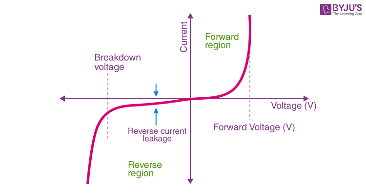
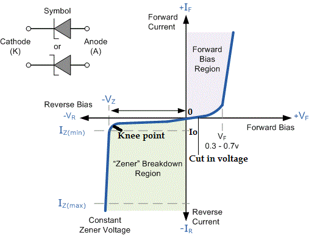
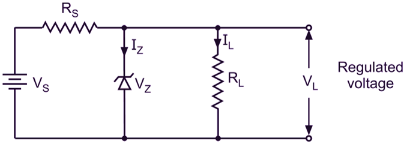

??? info "1. Semiconductor Devices"
   
    ## Semiconductor Devices

    Semiconductor devices are electronic components made using semiconductor materials like silicon and germanium. These materials have electrical conductivity between conductors and insulators. By adding impurities in a controlled way, we can change their electrical behavior and make useful devices such as diodes and transistors.

    ---

    ## PN Junction Diode

    A PN junction diode is a basic semiconductor device formed by joining P-type and N-type semiconductor materials together. It mainly allows current to flow in one direction and blocks it in the opposite direction.

    ---

    ### Formation of PN Junction

    When P-type and N-type materials are joined together, a PN junction is formed.
    P-type material has more holes as majority charge carriers, while N-type material has more electrons as majority charge carriers.

    After joining, electrons from the N-side move towards the P-side and holes from the P-side move towards the N-side. This movement happens due to concentration difference of charge carriers.

    ---

    ### Depletion Region and Barrier Potential

    When electrons and holes recombine near the junction, a region is formed where no free charge carriers are present. This region is called the depletion region.

    Due to this recombination, fixed ions are left behind, creating an electric field. This electric field produces a potential difference across the junction, known as barrier potential. This barrier potential prevents further movement of charge carriers across the junction.

    ---

    ### Drift Current

    Drift current is caused by the electric field present in the depletion region.
    Minority charge carriers are pushed across the junction due to this electric field. This movement of carriers under the influence of the electric field produces drift current.

    Drift current is very small in magnitude.

    ---

    ### Diffusion Current

    Diffusion current is caused due to the difference in concentration of charge carriers.
    Majority charge carriers move from higher concentration region to lower concentration region across the junction.

    Electrons diffuse from N-side to P-side and holes diffuse from P-side to N-side. This movement produces diffusion current.

    ---

    ### Equilibrium Condition in a PN Junction

    In equilibrium condition, the PN junction is not connected to any external power supply.
    At this condition, diffusion current and drift current are equal in magnitude but opposite in direction.

    As a result, the net current through the PN junction becomes zero. The depletion region and barrier potential remain constant in equilibrium.

??? info "2. Diodes"

    ## 2. Diode

    A diode is a two terminal semiconductor device formed using a PN junction. It allows current to flow in one direction and restricts current in the opposite direction. Diodes are mainly used for rectification and protection in electronic circuits.

    ---

    ## Construction and Biasing

    ### Physical Construction of a Diode

    A diode is constructed by joining P-type and N-type semiconductor materials together.
    The P-type region is doped with trivalent impurities and has holes as majority charge carriers.
    The N-type region is doped with pentavalent impurities and has electrons as majority charge carriers.

    Metal contacts are provided on both P-side and N-side for external connections.
    The junction formed between P-type and N-type materials creates a depletion region inside the diode.

    ---

    ### Forward Bias

    A diode is said to be forward biased when the P-side is connected to the positive terminal of the power supply and the N-side is connected to the negative terminal.

    In forward bias, the barrier potential decreases and the depletion region becomes thinner.
    This allows majority charge carriers to cross the junction easily.
    As a result, current flows through the diode.

    ---

    ### Reverse Bias

    A diode is said to be reverse biased when the P-side is connected to the negative terminal of the power supply and the N-side is connected to the positive terminal.

    In reverse bias, the barrier potential increases and the depletion region becomes wider.
    Majority charge carriers are blocked from crossing the junction.
    Only a very small current flows due to minority charge carriers.

??? info "V–I Characteristics of a Diode"

    ## V–I Characteristics of a Diode

    The V–I characteristics of a diode show the relationship between the voltage applied across the diode and the current flowing through it. This characteristic curve helps to understand the behavior of the diode in different operating regions.

    
 

    ### Forward Region Behavior

    When the diode is forward biased, it operates in the forward region.
    Initially, when a small forward voltage is applied, the current through the diode is very small. This happens because the barrier potential still opposes the flow of charge carriers.

    As the forward voltage increases beyond a certain value, the barrier potential is reduced significantly. After this point, a large number of majority charge carriers cross the junction. Because of this, the diode current increases rapidly with a small increase in voltage.

    In the forward region, the diode conducts current easily.

    ---

    ### Reverse Region Behavior

    When the diode is reverse biased, it operates in the reverse region.
    In this condition, the depletion region becomes wider and majority charge carriers are blocked.

    Only a very small current flows due to minority charge carriers. This current is called reverse saturation current. It is almost constant and very small in magnitude.

    Therefore, in the reverse region, the diode behaves like an open circuit.

    ---

    ### Cut-in Voltage

    The cut-in voltage is the minimum forward voltage at which the diode starts conducting appreciable current.
    Below this voltage, the diode current is very small and can be neglected.

    For silicon diodes, the cut-in voltage is approximately 0.7 volt.
    For germanium diodes, it is approximately 0.3 volt.

    Once the applied voltage exceeds the cut-in voltage, the diode current increases sharply.

    ---

    ### Breakdown Region

    When a very high reverse voltage is applied to the diode, the diode enters the breakdown region.
    In this region, the reverse current increases suddenly and sharply.

    This happens due to strong electric field across the junction which breaks the covalent bonds inside the semiconductor. If the current is not limited, the diode may get permanently damaged.

    In normal PN junction diodes, breakdown is undesirable. However, in special diodes like Zener diodes, breakdown is used for voltage regulation.

    ## Diagram Description: PN Junction Diode and Its V–I Characteristics

    This diagram shows the **structure of a PN junction diode**, its **symbol**, and the **V–I characteristics curve** under forward and reverse bias.

    

    ## 1. PN Junction Structure (Top Part)

    The left side of the diagram shows a **PN junction**.

    * The **N-region** contains electrons as majority charge carriers.
    * The **P-region** contains holes as majority charge carriers.

    These two regions are joined together to form a **PN junction diode**.

    ---

    ## 2. Diode Terminals and Symbol

    The diode has two terminals.

    * **Anode (A)** is connected to the P-type region.
    * **Cathode (K)** is connected to the N-type region.

    The diode symbol is shown using a triangle pointing towards a vertical line.

    * The **triangle side represents the anode**.
    * The **vertical line represents the cathode**.

    The arrow direction indicates the **direction of conventional current flow** when the diode is forward biased.

    ---

    ## 3. Conventional Current Flow

    Conventional current flows from **positive to negative terminal**.

    * In forward bias, current flows from **anode to cathode**.
    * This direction is shown clearly in the diagram.

    Electron flow is opposite to conventional current, but in exams we usually show conventional current.

    ---

    ## 4. Axes of V–I Characteristics Graph

    The right side of the diagram shows the **V–I characteristics of the diode**.

    * The **horizontal axis (X-axis)** represents voltage applied across the diode.

    * Right side shows **positive voltage (forward voltage)**.
    * Left side shows **negative voltage (reverse voltage)**.

    * The **vertical axis (Y-axis)** represents current through the diode in milliampere (mA).

    * Upward direction shows **forward current**.
    * Downward direction shows **reverse current**.

    ---

    ## 5. Forward Bias Region

    In the **forward bias region**, the anode is positive and the cathode is negative.

    * Initially, current is very small.
    * After reaching a certain voltage, current increases sharply.

    This sharp rise shows that the diode conducts heavily in forward bias.

    ---

    ## 6. Cut-in Voltage (Knee Voltage)

    The point where current starts increasing rapidly is called **cut-in voltage**.

    * For **silicon diode**, cut-in voltage is about **0.7 V**.
    * For **germanium diode**, cut-in voltage is about **0.3 V**.

    Below this voltage, the diode current is very small and almost negligible.

    ---

    ## 7. Reverse Bias Region

    In reverse bias, the anode is negative and the cathode is positive.

    * The diode does not conduct current.
    * Only a very small current flows, called **leakage current** or **reverse saturation current**.

    This current is shown as a small downward current on the graph.

    ---

    ## 8. Leakage Current

    Leakage current flows due to **minority charge carriers**.

    * It is very small in silicon diodes.
    * It is slightly higher in germanium diodes.

    The diagram shows approximate values for leakage current.

    ---

    ## 9. Breakdown Region

    When reverse voltage increases beyond a limit, the diode enters **breakdown region**.

    * Reverse current suddenly increases sharply.
    * This region is marked clearly in the graph.

    In normal diodes, breakdown can damage the diode if current is not limited.

    ---

    ## 10. Zener Breakdown Mention

    The diagram also mentions **Zener or avalanche breakdown**.

    * This type of breakdown is controlled and used in **Zener diodes**.
    * It is useful for voltage regulation.

    ---

    ## 11. Summary of the Diagram

    * Left side explains **structure and symbol of diode**.
    * Right side explains **electrical behavior using V–I curve**.
    * Forward bias shows conduction after cut-in voltage.
    * Reverse bias shows small leakage current.
    * Breakdown region shows sudden rise in reverse current.

    ---

    ## Final Exam Conclusion

    This diagram clearly explains the **construction**, **current flow**, and **V–I characteristics** of a PN junction diode under different biasing conditions. It helps to understand why a diode allows current in one direction and blocks it in the opposite direction.

??? info "Transistors vs Diodes and their relationship"

    ## Diode

    A diode is a two terminal semiconductor device formed by a single PN junction. The two terminals are anode and cathode. The main function of a diode is to allow current to flow in one direction and block current in the opposite direction.

    When a diode is forward biased, it conducts current after overcoming the barrier potential. When it is reverse biased, it blocks current except for a very small leakage current. Because of this unidirectional property, diodes are mainly used in rectifiers, voltage protection circuits, and signal clipping applications.

    The operation of a diode is simple and depends only on the applied voltage across its two terminals.

    ---

    ## Transistor

    A transistor is a three terminal semiconductor device formed using two PN junctions. The three terminals are emitter, base, and collector. A transistor can be of different types such as NPN or PNP.

    The main function of a transistor is to control current and amplify signals. A small current applied at the base terminal controls a much larger current flowing between the collector and emitter. This property is called current amplification.

    Transistors are widely used in amplifiers, switches, oscillators, and digital logic circuits. Compared to a diode, the operation of a transistor is more complex because it involves interaction between two PN junctions.

    ---

    ## Transistors vs Diodes (Detailed Explanation)

    A diode has only one PN junction, while a transistor has two PN junctions connected back to back. Because of this structural difference, their functions are also different.

    A diode has two terminals, so current flow depends only on the applied voltage. Once forward biased, current flows freely, and there is no external control over the amount of current except circuit resistance.

    In contrast, a transistor has three terminals. The current flowing through the collector and emitter is controlled by a small base current. This makes the transistor a current controlled device, while the diode is not.

    A diode cannot amplify signals because it does not provide power gain. It only allows or blocks current. A transistor can amplify signals because a small input signal at the base produces a larger output signal at the collector.

    In terms of application, diodes are mainly used where direction control of current is required. Transistors are used where signal amplification, switching, or control is needed.

    ---

    ## Relationship Between Diode and Transistor

    The relationship between diode and transistor is based on their internal structure and operation.

    A transistor is actually formed by combining two diodes back to back. In an NPN transistor, there is a diode between the base and emitter, and another diode between the base and collector. Similarly, in a PNP transistor, the same diode structure exists but with opposite polarity.

    The basic behavior of a transistor depends on the diode action of its PN junctions. For example, in normal transistor operation, the base-emitter junction is forward biased like a diode, while the base-collector junction is reverse biased like a diode.

    Without the PN junction behavior of diodes, a transistor cannot function. Therefore, diode operation is the foundation of transistor operation.

    ---

    ## Conclusion

    A diode is a simple device used for one direction current flow.
    A transistor is a more advanced device used for current control and amplification.
    Structurally and functionally, a transistor is built using diode principles.
    Thus, diodes and transistors are closely related semiconductor devices, but they serve different purposes in electronic circuits.

    ## Diode vs Transistor and Their Relationship

    | Aspect              | Diode                                                                   | Transistor                                                                      |
    | ------------------- | ----------------------------------------------------------------------- | ------------------------------------------------------------------------------- |
    | Definition          | Diode is a two terminal semiconductor device formed by one PN junction. | Transistor is a three terminal semiconductor device formed by two PN junctions. |
    | Number of terminals | Two terminals called anode and cathode.                                 | Three terminals called emitter, base, and collector.                            |
    | Internal structure  | Contains a single PN junction.                                          | Contains two PN junctions connected back to back.                               |
    | Basic operation     | Works based on forward and reverse biasing.                             | Works based on interaction of two biased PN junctions.                          |
    | Control of current  | Current depends only on applied voltage.                                | A small base current controls a large collector current.                        |
    | Amplification       | Cannot amplify signals.                                                 | Can amplify signals.                                                            |
    | Power gain          | No power gain is possible.                                              | Power gain is possible.                                                         |
    | Complexity          | Simple construction and operation.                                      | More complex construction and operation.                                        |
    | Main applications   | Used in rectifiers, clippers, and protection circuits.                  | Used in amplifiers, switches, and digital circuits.                             |
    | Switching ability   | Not effective as a controlled switch.                                   | Highly effective as an electronic switch.                                       |

    ---

    ## Relationship Between Diode and Transistor

    | Point                   | Explanation                                                                          |
    | ----------------------- | ------------------------------------------------------------------------------------ |
    | Structural relationship | A transistor is formed using two diode junctions connected together.                 |
    | Junction behavior       | Base-emitter and base-collector junctions act like diodes.                           |
    | Biasing condition       | In normal operation, one junction is forward biased and the other is reverse biased. |
    | Dependence              | Transistor operation depends on diode action of PN junctions.                        |
    | Fundamental concept     | Diode behavior is the foundation of transistor operation.                            |

    ---

    ## Conclusion

    Diode controls direction of current only.
    Transistor controls and amplifies current.
    Transistor operation is based on diode principles.

??? info "Introduction to Zener Diode"

    ## 3. Zener Diode

    ### Introduction

    A Zener diode is a special type of PN junction diode which is designed to operate safely in the reverse bias breakdown region (রিভার্স বায়াস ব্রেকডাউন অঞ্চল). Unlike an ordinary diode (সাধারণ ডায়োড), a Zener diode does not get damaged (ক্ষতিগ্রস্ত) when reverse voltage exceeds (অতিক্রম করে) a certain limit (সীমা). Instead, it allows current (কারেন্ট) to flow while keeping the voltage (ভোল্টেজ) almost constant (প্রায় স্থির). Because of this property (বৈশিষ্ট্য), the Zener diode is mainly used for voltage regulation (ভোল্টেজ নিয়ন্ত্রণ) and voltage reference (ভোল্টেজ রেফারেন্স) in electronic circuits (ইলেকট্রনিক সার্কিট).

    ---

    ## Zener Diode Operation

    The operation (কার্যপ্রণালী) of a Zener diode can be explained by studying its behavior (আচরণ) under forward bias (ফরওয়ার্ড বায়াস) and reverse bias (রিভার্স বায়াস) conditions (অবস্থা).

    ### Forward Bias Operation

    When a Zener diode is connected (সংযুক্ত) in forward bias, it behaves (আচরণ করে) like a normal silicon diode (সাধারণ সিলিকন ডায়োড). The current (কারেন্ট) starts flowing after the cut in voltage (কাট-ইন ভোল্টেজ) of approximately (প্রায়) 0.7 V. In this region, it is not used for regulation purposes (নিয়ন্ত্রণের উদ্দেশ্যে). The forward bias operation is similar (সদৃশ) to an ordinary PN junction diode.

    ### Reverse Bias Operation

    When the Zener diode is connected in reverse bias, very little current flows initially (শুরুর দিকে). As the reverse voltage increases, a point comes where the diode suddenly (হঠাৎ) starts conducting (পরিবাহিতা শুরু করে) heavily (বেশি পরিমাণে). This voltage is called the Zener breakdown voltage (জেনার ব্রেকডাউন ভোল্টেজ). At this point, the voltage across the diode remains nearly constant even if the current increases. This is the most important operating region (কার্যকরী অঞ্চল) of the Zener diode.

    ---

    ## Zener Breakdown

    Zener breakdown occurs (ঘটে) at low reverse voltages, usually (সাধারণত) below 5 V. This breakdown happens due to a very strong electric field (বৈদ্যুতিক ক্ষেত্র) across the depletion region (ডিপ্লিশন অঞ্চল).

    In a heavily doped (বেশি ডোপড) Zener diode, the depletion layer (ডিপ্লিশন স্তর) is very thin (পাতলা). When reverse voltage is applied (প্রয়োগ করা হয়), the electric field becomes strong enough to pull electrons (ইলেকট্রন) directly from their valence bonds (ভ্যালেন্স বন্ধন). These electrons move to the conduction band (কন্ডাকশন ব্যান্ড) and cause a sudden increase in current.

    Important points of Zener breakdown:

    * Occurs at low reverse voltage
    * Happens in heavily doped diodes
    * Depletion region is very thin
    * Breakdown is reversible (পুনরায় আগের অবস্থায় ফেরা যায়) and does not damage the diode if current is limited (সীমিত রাখা হয়)

    Zener breakdown is stable (স্থিতিশীল) and predictable (পূর্বানুমেয়), which makes it suitable (উপযুক্ত) for voltage regulation.

    ---

    ## Avalanche Breakdown

    Avalanche breakdown occurs at higher reverse voltages, usually above 5 V. This type of breakdown is caused by the collision (সংঘর্ষ) of charge carriers (চার্জ বাহক).

    In this process, free electrons (মুক্ত ইলেকট্রন) gain high kinetic energy (গতিশক্তি) due to the applied reverse voltage. These high energy electrons collide with atoms (পরমাণু) and knock out more electrons. This creates a chain reaction (শৃঙ্খল প্রতিক্রিয়া) known as avalanche effect (অ্যাভালাঞ্চ প্রভাব), resulting in a sudden rise (হঠাৎ বৃদ্ধি) in current.

    Important points of avalanche breakdown:

    * Occurs at high reverse voltage
    * Happens in lightly doped diodes (কম ডোপড ডায়োড)
    * Depletion region is wider (বিস্তৃত)
    * Breakdown is also reversible if current is controlled (নিয়ন্ত্রিত রাখা হয়)

    Both avalanche and Zener breakdowns are safe operating modes (নিরাপদ কার্যপ্রণালী) when the diode is properly designed (সঠিকভাবে নকশা করা).

    

    ## V I Characteristics of Zener Diode

    The V I characteristics (ভোল্টেজ-কারেন্ট বৈশিষ্ট্য) of a Zener diode explain the relationship (সম্পর্ক) between voltage and current in both forward and reverse bias conditions.

    ### Forward Bias Characteristics

    In the forward bias region, the Zener diode behaves like a normal diode. The current increases rapidly (দ্রুত) after the cut in voltage of about 0.7 V for silicon diode. This region is not important for Zener diode applications (প্রয়োগ).

    ### Reverse Bias Characteristics

    In the reverse bias region, initially only a small leakage current (লিকেজ কারেন্ট) flows. As the reverse voltage increases and reaches the Zener voltage, the current suddenly increases while the voltage across the diode remains almost constant. This flat portion (সমতল অংশ) of the curve (বক্ররেখা) shows the voltage regulation property.

    Key observations (পর্যবেক্ষণ) from V I characteristics:

    * Sharp knee (তীব্র বাঁক) at Zener voltage
    * Large change in current with very small change in voltage
    * Voltage remains constant in breakdown region

    This constant voltage region is used in power supply circuits (পাওয়ার সাপ্লাই সার্কিট) to protect devices (ডিভাইস) from voltage variations (ভোল্টেজ পরিবর্তন).

    ---

    ## Conclusion

    The Zener diode is an important semiconductor device (সেমিকন্ডাক্টর ডিভাইস) used mainly for voltage regulation. Its ability (ক্ষমতা) to operate safely in the breakdown region makes it different from ordinary diodes. Zener breakdown and avalanche breakdown are two mechanisms (প্রক্রিয়া) that allow current flow in reverse bias. The V I characteristics clearly show why the Zener diode is suitable for maintaining a constant output voltage (আউটপুট ভোল্টেজ) in electronic circuits.

??? info "Zener Regulator"

    ## Zener Regulator

    ### Introduction

    A Zener regulator is a simple voltage regulating circuit that uses a Zener diode to maintain a constant output voltage. It is commonly used in low power electronic circuits where a stable voltage supply is required. The Zener regulator works by operating the Zener diode in its reverse bias breakdown region (রিভার্স বায়াস ব্রেকডাউন অঞ্চল).

    

    ## Circuit Diagram

    The circuit diagram (সার্কিট চিত্র) of a Zener regulator consists of a DC input voltage source (ডিসি ইনপুট ভোল্টেজ উৎস), a series resistor (সিরিজ রেজিস্টর), a Zener diode (জেনার ডায়োড), and a load resistor (লোড রেজিস্টর).

    The series resistor is connected between the input supply and the Zener diode. The Zener diode is connected in reverse bias across the load. The output voltage is taken across the Zener diode and the load resistor.

    Main parts of the circuit:

    * DC input supply (ডিসি সরবরাহ)
    * Series resistor (সিরিজ রেজিস্টর)
    * Zener diode (জেনার ডায়োড)
    * Load resistor (লোড রেজিস্টর)

    ---

    ## Principle of Voltage Regulation

    The principle of voltage regulation (ভোল্টেজ নিয়ন্ত্রণের নীতি) in a Zener regulator is based on the constant voltage property (স্থির ভোল্টেজ বৈশিষ্ট্য) of the Zener diode in the breakdown region.

    When the input voltage increases, the current through the series resistor increases. As a result, more current flows through the Zener diode, but the voltage across it remains almost constant at the Zener voltage (জেনার ভোল্টেজ). When the input voltage decreases, the Zener current decreases, but the Zener diode still maintains nearly the same voltage across the load.

    Thus, variations (পরিবর্তন) in input voltage do not affect the output voltage significantly. This is how the Zener regulator provides a stable output voltage.

    !!! error "Voltage Regulation Characteristics & Mechanism of Zener Diode"

        ### **Voltage Regulation Characteristics & Mechanism of Zener Diode**

        **1. Operating Region & Breakdown Mechanism (অপারেটিং অঞ্চল ও ব্রেকডাউন কৌশল)**
        To work as a voltage regulator, the Zener diode must operate in the Reverse Breakdown Region (রিভার্স ব্রেকডাউন অঞ্চল).

        * **Reason:** After reaching a specific voltage (), the covalent bonds (সমযোজী বন্ধন) of silicon atoms break forcefully due to the intense electric field (তীব্র বৈদ্যুতিক ক্ষেত্র) of the junction. As a result, many free electrons (মুক্ত ইলেকট্রন) are released, which help to keep the voltage constant (স্থির).

        **2. Current vs Voltage Relationship (কারেন্ট বনাম ভোল্টেজ সম্পর্ক)**
        After reaching the breakdown voltage, even if the current () through the diode changes widely (ব্যাপকভাবে), for example from  to , the voltage () across its two terminals remains almost unchanged (অপরিবর্তিত). In the graph, this part becomes vertical (উল্লম্ব).

        * **Reason:** After the breaking of bonds, a flood of charge carriers (চার্জ বাহক) flows inside. As a result, the diode can conduct more current without increasing the voltage or pressure (চাপ).

        **3. Dynamic Impedance (পরিবর্তনশীল রোধ)**
        In the breakdown state, the internal resistance or impedance () of the Zener diode becomes extremely negligible (নগণ্য). Consequently, if there is a slight attempt to change the voltage, the diode absorbs (শুষে নেয়) a lot of current.

        * **Reason:** Due to the electrons released after the bond breaking, the obstacle or resistance (বাধা) in the path of electricity flow drops to almost zero level.

        **4. Role of Series Resistor (সিরিজ রেজিস্টরের ভূমিকা)**
        In the regulation process, Voltage Drop (ভোল্টেজ ড্রপ) is extremely important.

        * **Process:** When input voltage increases, the diode current increases. That extra current goes through the series resistor (). As a result, the voltage drop in  increases.
        * **Equation:** 
        * That means, as much as the input increases, the drop in the series resistor increases by exactly that amount. Therefore, the output () remains constant.

        **Summary (সারসংক্ষেপ)**
        The Zener diode breaks the Covalent Bond due to the high electric field and decreases its Dynamic Impedance. As a result, it converts any voltage fluctuation (ভোল্টেজ ওঠানামা) of the input into current fluctuation (কারেন্ট ওঠানামা) and uses that extra current to cause a voltage drop in the series resistor to keep the output voltage constant.
    ---

    ## Line Regulation

    Line regulation (লাইন রেগুলেশন) refers to the ability of the Zener regulator to maintain a constant output voltage when the input voltage changes.

    If the input voltage increases or decreases within a certain range, the Zener diode adjusts its current automatically to keep the output voltage nearly constant. A good Zener regulator has very small change in output voltage for a large change in input voltage.

    Line regulation is usually expressed as:
    Change in output voltage divided by change in input voltage.

    Good line regulation means better voltage stability.

    ---

    ## Load Regulation

    Load regulation (লোড রেগুলেশন) refers to the ability of the Zener regulator to maintain a constant output voltage when the load current changes.

    When the load resistance decreases, the load current increases. In this case, the current through the Zener diode decreases. When the load resistance increases, the load current decreases and more current flows through the Zener diode. In both cases, the voltage across the load remains almost constant.

    Load regulation shows how well the regulator responds to changes in load condition (লোড অবস্থা). A good Zener regulator has very small change in output voltage with change in load current.

    ---

    ## Conclusion

    The Zener regulator is a simple and effective voltage regulating circuit used in low power applications. Its operation is based on the constant voltage characteristic of the Zener diode in the breakdown region. The circuit diagram, principle of operation, line regulation, and load regulation together explain how a Zener regulator maintains a stable output voltage despite changes in input voltage and load current.
