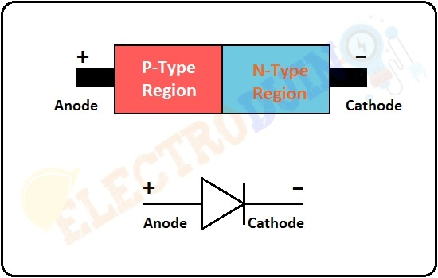
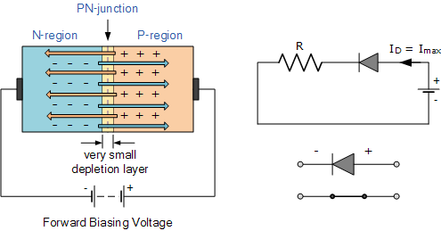
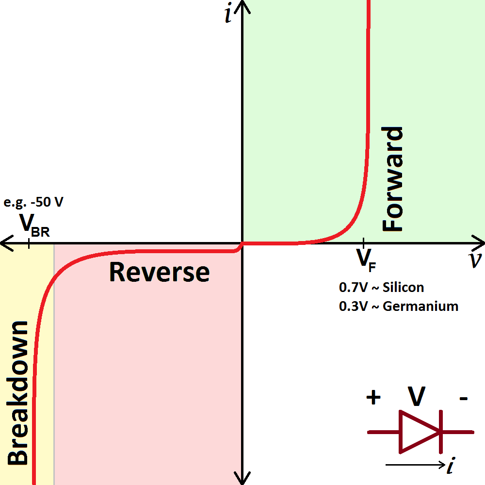
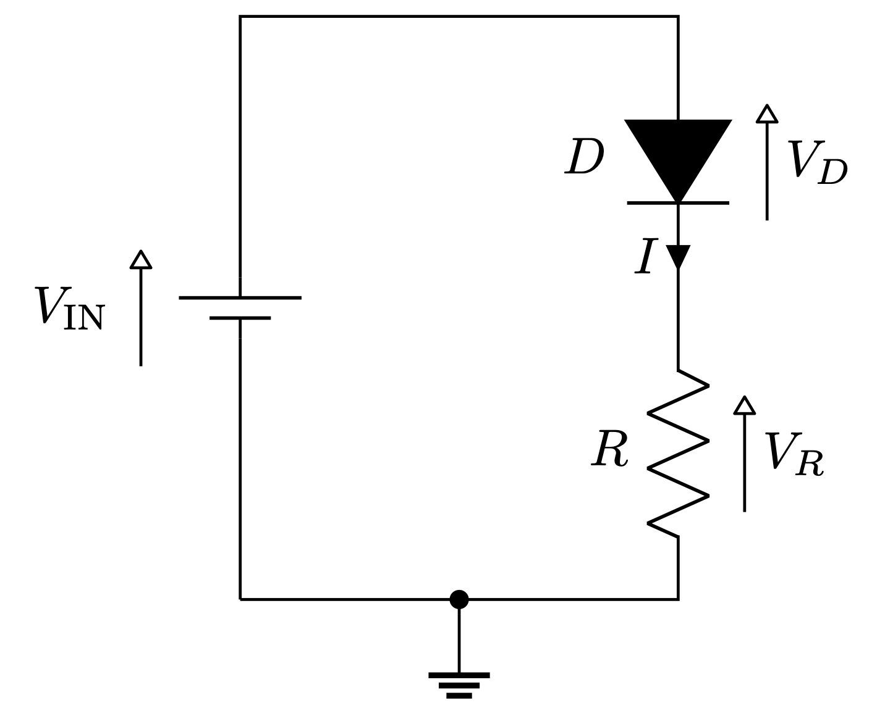

## Diode – Exam-oriented Notes with Easy Explanation and Analogy

### What is a diode 

A diode is a small electronic device made from semiconductor material that allows electric current to flow in only one direction and blocks it in the opposite direction under normal conditions.

Think of a diode like a **one-way road** for electricity. Cars can move only in the allowed direction. If they try to move backward, the road blocks them.

---

### Direction of current in a diode

* The arrow in the diode symbol shows the direction of **conventional current**
* Conventional current means flow of positive charge
* Electrons actually move in the opposite direction, but for circuit analysis we always follow conventional current

Analogy
Imagine water flowing in a pipe with an arrow painted on it. Engineers follow the arrow direction even if water molecules move differently inside.

---

### Anode and cathode

* **Anode**
  Left side of the diode
  Made of **P-type** semiconductor

* **Cathode**
  Right side of the diode
  Made of **N-type** semiconductor

Current can flow only from **anode to cathode** under proper conditions.

---

### Forward bias of a diode

A diode is said to be in **forward bias** when

* Battery positive terminal is connected to the anode
* Battery negative terminal is connected to the cathode

In this condition:

* The diode conducts current
* For a silicon diode, it needs about **0.6 to 0.7 V** to start conducting
* This minimum voltage is called the **knee voltage** or **cut-in voltage**

Analogy
Think of a door with a spring. You must push it with some minimum force to open it. Below that force, it stays closed.

---

### Reverse bias of a diode

A diode is in **reverse bias** when

* Battery negative terminal is connected to the anode
* Battery positive terminal is connected to the cathode

In this condition:

* The diode does not conduct current
* Only a very tiny leakage current may flow
* If very high reverse voltage is applied, the diode may break down

Analogy
Pushing the door from the wrong side will not open it unless you apply extreme force and break it.

---

### V–I characteristics of a diode

* X-axis represents voltage
* Y-axis represents current

Key points:

* In forward bias, current increases rapidly after about 0.7 V
* In reverse bias, current is almost zero
* At very high reverse voltage, **breakdown** occurs

Diodes are not meant to work in breakdown mode during normal operation.

---

### Simple circuit with diode and resistor

Given:

* Battery voltage = 12 V
* Resistor = 50 ohm
* Diode drop = 0.7 V

Step 1: Check if diode is ON
Current direction matches diode arrow, so diode conducts.

Step 2: Voltage across resistor
Total voltage = voltage across diode + voltage across resistor
Voltage across resistor = 12 − 0.7 = **11.3 V**

Step 3: Circuit current using Ohm’s law
I = V / R = 11.3 / 50 = **0.226 A** or **226 mA**

---

### Power calculation

Power consumed by diode
P = V × I
P = 0.7 × 0.226 ≈ **0.158 W**

Power consumed by resistor
P = 11.3 × 0.226 ≈ **2.554 W**

Power supplied by battery
P = 12 × 0.226 ≈ **2.712 W**

Total power supplied equals total power consumed.
This confirms energy conservation in the circuit.

---

### How to quickly check if a diode is ON or OFF in exams

1. Identify high potential and low potential
2. Conventional current flows from high to low potential
3. If current direction matches diode arrow, diode is ON
4. If current direction is opposite to arrow, diode is OFF

This method is fast and very useful in MCQs and numericals.

---

### One-line exam summary

A diode is a PN junction device that conducts current in forward bias after overcoming a threshold voltage and blocks current in reverse bias under normal operating conditions.

