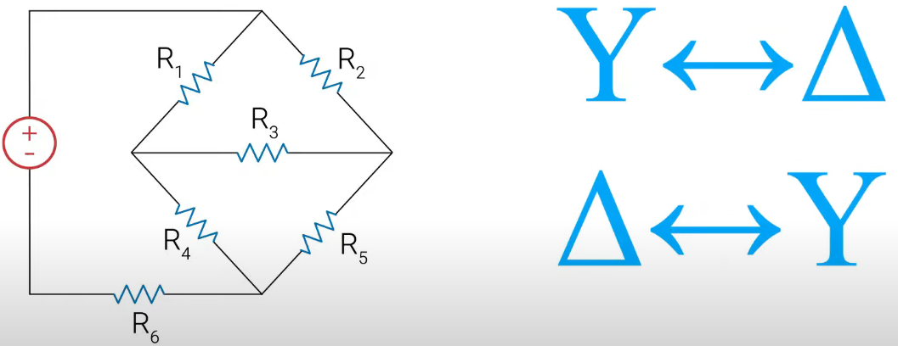
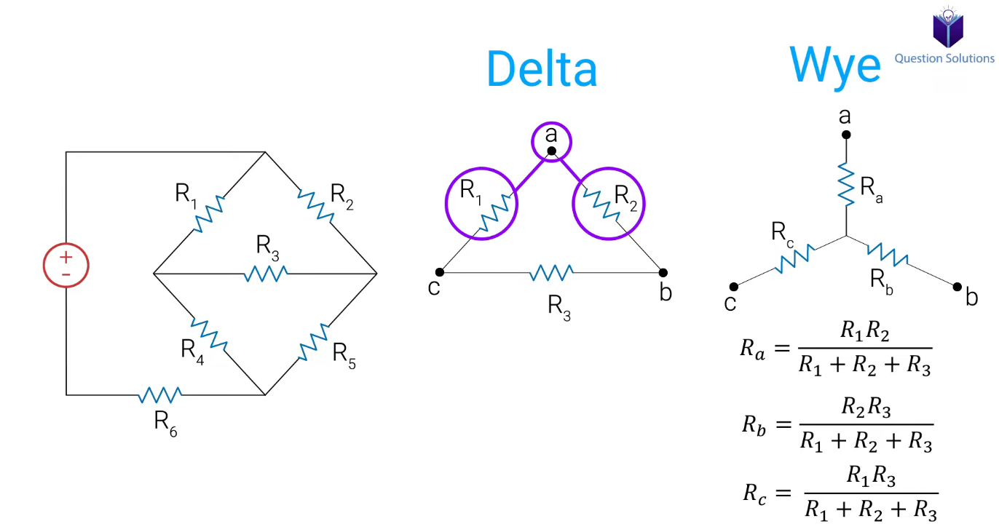
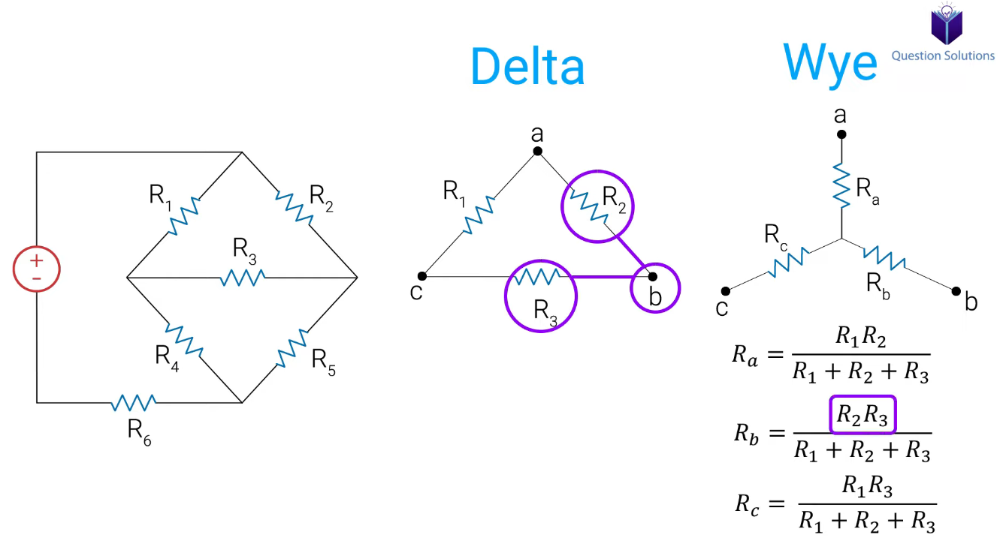
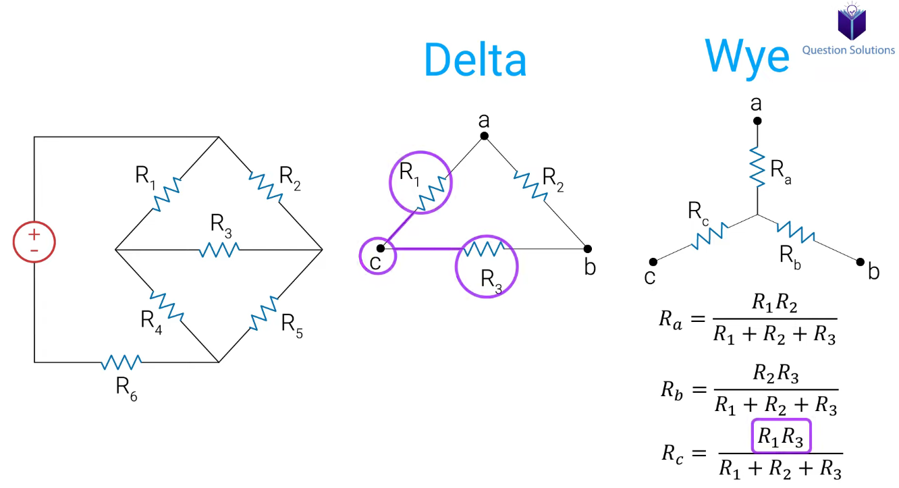
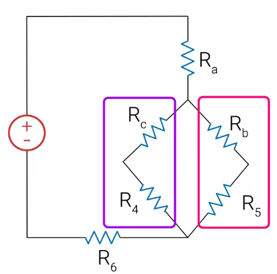
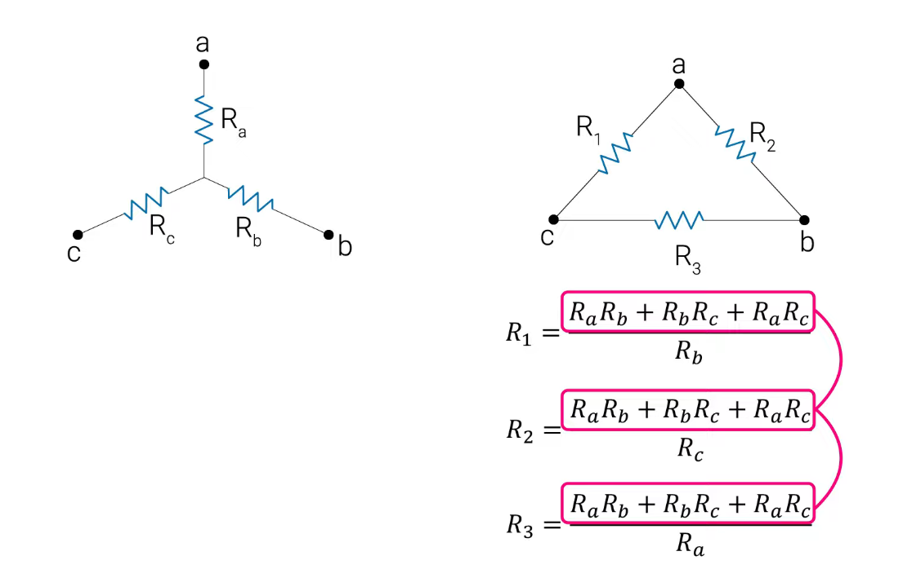
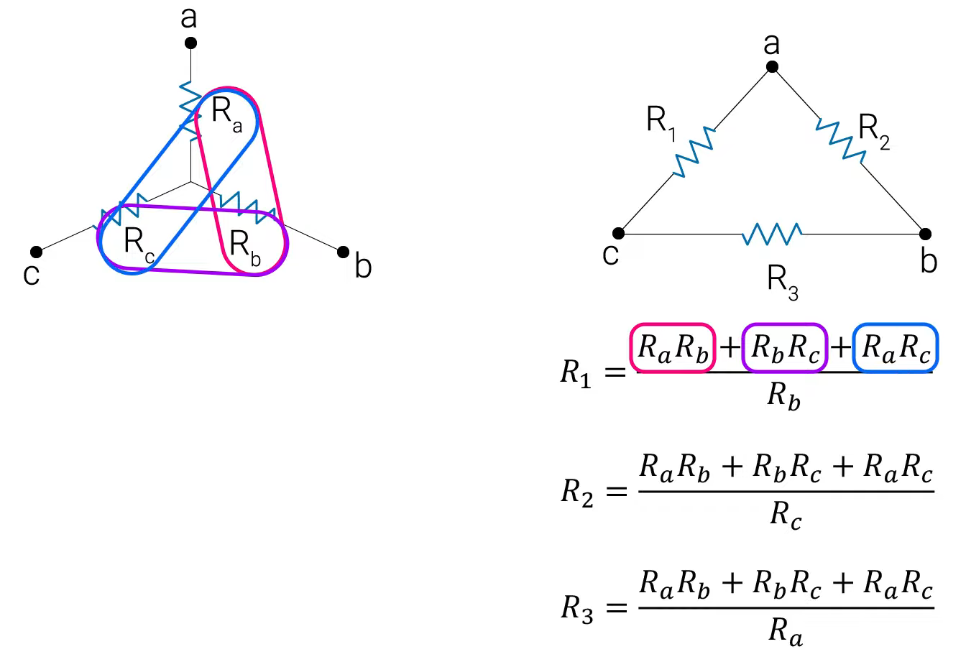
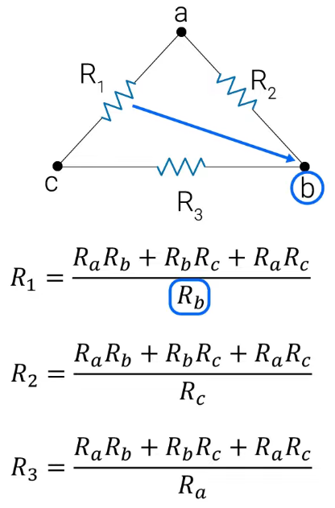
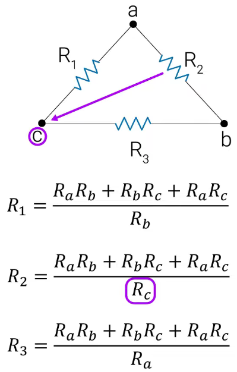
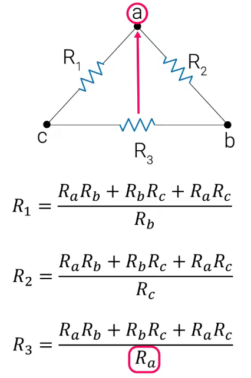

# Chapter 1: Introduction to Wye-Delta Transformations

 /// caption
 Introduction to Wye-Delta Transformations
 ///

Sometimes, you'll encounter electric circuits where you can't simplify the network using only the standard rules for **series** and **parallel** combinations. These circuits, often called bridge circuits, require a more advanced technique to analyze.

Consider the circuit below. If we try to find resistors in series or parallel, we quickly run into a problem. The current splits at the nodes, but because of the interconnected "bridge" resistor in the middle, no two resistors share the same current (series) or the same two nodes (parallel).

`[Insert Screenshot: The initial complex circuit that cannot be simplified]`

So, how can we simplify this? The solution lies in a powerful technique called the **Wye-Delta Transformation**. This method allows us to convert a section of a circuit from one configuration to another, making it possible to simplify using standard series/parallel rules.

---

### 1.1 The Delta ($\Delta$) and Wye (Y) Configurations

Let's focus on the part of the circuit causing the issue. It can be seen as either a **Delta** ($\Delta$) or a **Wye** (Y) configuration.

- **The Delta ($\Delta$) Configuration:** This is named after the Greek letter delta ($\Delta$) because it resembles a triangle. It's also known as a Pi ($\Pi$) network.

- **The Wye (Y) Configuration:** This is named for its resemblance to the letter 'Y'. It is also known as a T or Star network.

  `[Insert Screenshot: A Wye configuration diagram, labeled with nodes A, B, C and resistors Ra, Rb, Rc]`

The core idea is to convert the group of resistors from a $\Delta$ shape into an electrically equivalent Y shape, or vice-versa. Once converted, the new circuit structure is often simple enough to be solved with basic series and parallel combinations.

`[Insert Screenshot: An image showing the Delta configuration on the left and its equivalent Wye configuration on the right, with corresponding nodes A, B, C aligned]`

---

## Chapter 2: The Transformation Formulas

You don't need to memorize these formulas by rote. Instead, focus on the visual pattern, which makes them very easy to recall.

### 2.1 Delta ($\Delta$) to Wye (Y) Transformation

To find the equivalent resistors in the **Wye** network ($R_a, R_b, R_c$) from the resistors in the **Delta** network ($R_1, R_2, R_3$), we use the following pattern:

**The Rule:** The value of any resistor in the Y network is the **product of the two adjacent resistors** in the $\Delta$ network, divided by the **sum of all three resistors** in the $\Delta$ network.

Let's look at the formulas based on the diagram below:
  
   /// caption
   A highlighted Delta configuration in the circuit, labeled with nodes A, B, C and resistors R1, R2, R3
   ///

- To find $R_a$: Look at node **A**. The two adjacent resistors in the $\Delta$ network are $R_1$ and $R_2$.

$$
R_a = \frac{R_1 R_2}{R_1 + R_2 + R_3}
$$

- To find $R_b$: Look at node **B**. The two adjacent resistors are $R_2$ and $R_3$.

 /// caption
 A highlighted Delta configuration in the circuit, labeled with nodes A, B, C and resistors R1, R2, R3
 ///

$$
R_b = \frac{R_2 R_3}{R_1 + R_2 + R_3}
$$

- To find $R_c$: Look at node **C**. The two adjacent resistors are $R_1$ and $R_3$.

 /// caption
 A highlighted Delta configuration in the circuit, labeled with nodes A, B, C and resistors R1, R2, R3
 ///

$$
R_c = \frac{R_1 R_3}{R_1 + R_2 + R_3}
$$

Notice the denominator is the same in all three equations—it's simply the sum of all resistors in the delta.

So, the final simplified circuit is: 

### 2.2 Wye (Y) to Delta ($\Delta$) Transformation

To go in the opposite direction, converting from a **Wye** to a **Delta**, we follow a different but equally simple pattern.

**The Rule:** The value of any resistor in the $\Delta$ network is the **sum of all possible products of the Y-resistors taken two at a time**, divided by the **opposite Y-resistor**.

Let's look at the formulas based on the diagram below:

First, calculate the numerator, which is the same for all three formulas:

$$\text{Numerator} = R_a R_b + R_b R_c + R_c R_a$$

- To find $R_1$ (between nodes A and C): The resistor in the Y network _opposite_ to $R_1$ is $R_b$.
{ width="200px" }

$$
R_1 = \frac{R_a R_b + R_b R_c + R_c R_a}{R_b}
$$

- To find $R_2$ (between nodes A and B): The resistor opposite to $R_2$ is $R_c$.
{ width="200px" }

$$
R_2 = \frac{R_a R_b + R_b R_c + R_c R_a}{R_c}
$$

- To find $R_3$ (between nodes B and C): The resistor opposite to $R_3$ is $R_a$.
{ width="200px" }

$$
R_3 = \frac{R_a R_b + R_b R_c + R_c R_a}{R_a}
$$

### 2.3 A Special Case: The Balanced Load

If you're lucky, you'll encounter a circuit where all the resistors in a configuration have the same value. This is called a **balanced** load, and the math becomes incredibly simple.

- **For $\Delta \rightarrow Y$ Conversion (Balanced):**
If $R_\Delta = R_1 = R_2 = R_3$, then all the Y-resistors are equal.

$$
R_Y = \frac{R_\Delta}{3}
$$

- **For $Y \rightarrow \Delta$ Conversion (Balanced):**
If $R_Y = R_a = R_b = R_c$, then all the $\Delta$-resistors are equal.

$$
R_\Delta = 3 \times R_Y
$$

---

## Chapter 3: Worked Examples

Let's apply these concepts to solve some real circuit problems.

### Example 1: Finding Current $I_0$ Using $\Delta \rightarrow Y$

**Problem:** Find the value of the current $I_0$ in the circuit below.

`[Insert Screenshot: The circuit for the first example]`

**Solution:**

1.  **Identify the Configuration:** We can see that we cannot simplify this using series/parallel rules. However, the top three resistors ($12\Omega, 12\Omega, 12\Omega$) form a **Delta** configuration.

    `[Insert Screenshot: The circuit with the top Delta highlighted]`

2.  **Perform the Transformation:** Since all three resistors are $12\Omega$, this is a **balanced delta**. We can use the special case formula.

$$
R_Y = \frac{R_\Delta}{3} = \frac{12\Omega}{3} = 4\Omega
$$

Each new resistor in our Wye network will be $4\Omega$.

3.  **Redraw the Circuit:** Now, we replace the original delta with our new wye network.

    `[Insert Screenshot: The new circuit after the Delta has been replaced with the Wye]`

4.  **Simplify and Solve:** The new circuit is much easier to solve!

    - The $4\Omega$ resistor and the $8\Omega$ resistor are now in **series**. $R_{S1} = 4\Omega + 8\Omega = 12\Omega$.
    - The other $4\Omega$ resistor and the $2\Omega$ resistor are also in **series**. $R_{S2} = 4\Omega + 2\Omega = 6\Omega$.

    `[Insert Screenshot: The circuit after combining the series resistors]`

- Now, the two new resistors ($12\Omega$ and $6\Omega$) are in **parallel**.

$$
R_P = \frac{12 \times 6}{12 + 6} = \frac{72}{18} = 4\Omega
$$

`[Insert Screenshot: The circuit after combining the parallel resistors]`

- Finally, the top $4\Omega$ resistor and our new $4\Omega$ parallel equivalent resistor are in **series**, giving us the total equivalent resistance ($R_{eq}$).

$$
R_{eq} = 4\Omega + 4\Omega = 8\Omega
$$

`[Insert Screenshot: The final simplified circuit with one voltage source and one equivalent resistor]`

- Using Ohm's Law, we can find the total current from the source:

$$
I_{total} = \frac{V}{R_{eq}} = \frac{40V}{8\Omega} = 5A
$$

5.  **Work Backwards to Find $I_0$:**

    - The total current of $5A$ flows through the first $4\Omega$ resistor and the $4\Omega$ parallel combination. The voltage across the parallel combination is $V_p = I_{total} \times R_P = 5A \times 4\Omega = 20V$.
    - Since voltage is the same across parallel branches, the voltage across the $6\Omega$ series branch (which contains the resistor related to $I_0$) is also $20V$.
    - We can now find the current $I_0$ flowing through that branch using Ohm's Law:

$$
I_0 = \frac{V_p}{R_{S2}} = \frac{20V}{6\Omega} \approx 3.33A
$$

**Answer:** The current $I_0$ is **3.33 A**.

---

### Example 2: Finding Current $I_0$ Using $Y \rightarrow \Delta$

**Problem:** Find the value of the current $I_0$ in the circuit below.

`[Insert Screenshot: The circuit for the second example]`

**Solution:**

1.  **Initial Simplification:** We can see that the $3\Omega$, $4\Omega$, and $5\Omega$ resistors are in **series**. Let's combine them first.

$$
R_S = 3\Omega + 4\Omega + 5\Omega = 12\Omega
$$

Now, this $12\Omega$ resistor is in **parallel** with the original $12\Omega$ resistor.

$$
R_P = \frac{12 \times 12}{12 + 12} = \frac{144}{24} = 6\Omega
$$

`[Insert Screenshot: The partially simplified circuit]`

2.  **Identify the Configuration:** The remaining circuit is still complex. However, we can see a **Wye** formation with the $9\Omega$, $6\Omega$, and $18\Omega$ resistors connected at a central point. To make this easier to see, let's redraw the circuit.

    `[Insert Screenshot: The circuit redrawn to more clearly show the Wye network and its nodes A, B, C, D]`

3.  **Perform the Transformation:** We will convert this Wye ($R_A=9\Omega, R_B=6\Omega, R_C=18\Omega$) to a Delta.

- First, calculate the numerator:

$$
\text{Num} = (9)(6) + (6)(18) + (18)(9) = 54 + 108 + 162 = 324\Omega^2
$$

- Calculate the new delta resistors:

$$
R_{AB} = \frac{324}{R_C} = \frac{324}{18} = 18\Omega
$$

$$
R_{BC} = \frac{324}{R_A} = \frac{324}{9} = 36\Omega
$$

$$
R_{AC} = \frac{324}{R_B} = \frac{324}{6} = 54\Omega
$$

4.  **Redraw the Circuit:** Replace the Wye with our new Delta.

    `[Insert Screenshot: The circuit after the Wye has been replaced with the Delta]`

5.  **Simplify and Solve:**

- The new $18\Omega$ resistor is **parallel** to the original $2\Omega$ resistor.

$$
R_{P1} = \frac{18 \times 2}{18 + 2} = \frac{36}{20} = 1.8\Omega
$$

- The new $36\Omega$ resistor is **parallel** to the $6\Omega$ resistor from our first simplification step.

$$
R_{P2} = \frac{36 \times 6}{36 + 6} = \frac{216}{42} \approx 5.14\Omega
$$

`[Insert Screenshot: The circuit after combining the first set of parallel resistors]`

- These two new parallel equivalents ($1.8\Omega$ and $5.14\Omega$) are now in **series**.

$$
R_{S\_final} = 1.8\Omega + 5.14\Omega = 6.94\Omega
$$

`[Insert Screenshot: The circuit after combining the series resistors]`

- Finally, this series resistor ($6.94\Omega$) is in **parallel** with the last delta resistor ($54\Omega$).

$$
R_{eq} = \frac{6.94 \times 54}{6.94 + 54} \approx \frac{374.76}{60.94} \approx 6.15\Omega
$$

- The total current from the source is:

$$
I_{total} = \frac{V}{R_{eq}} = \frac{36V}{6.15\Omega} \approx 5.85A
$$

6.  **Work Backwards to Find $I_0$:**

- The voltage across the final parallel combination is $36V$. The current through the $R_{S\_final}$ branch is:

$$
I_{branch} = \frac{36V}{6.94\Omega} \approx 5.19A
$$

- This current ($5.19A$) is the same for the two series components ($1.8\Omega$ and $5.14\Omega$).
- The voltage across the $5.14\Omega$ resistor ($R_{P2}$) is:

$$
V_{P2} = 5.19A \times 5.14\Omega \approx 26.68V
$$

- This voltage is the same across the two parallel resistors that formed it ($36\Omega$ and $6\Omega$).
- $I_0$ is the current flowing through the $6\Omega$ resistor.

$$
I_0 = \frac{V_{P2}}{6\Omega} = \frac{26.68V}{6\Omega} \approx 4.45A
$$

**Answer:** The current $I_0$ is approximately **4.45 A**.

_(Note: The original video appears to get 3A. This difference is likely due to a different circuit interpretation or a simplification in the video's explanation. The step-by-step method shown here is the rigorous way to solve the redrawn circuit)._

---

### Example 3: Finding Voltage $V_0$ Using $\Delta \rightarrow Y$

**Problem:** Find the value of the voltage $V_0$ across the $6k\Omega$ resistor.

`[Insert Screenshot: The circuit for the third example]`

**Solution:**

1.  **Identify the Configuration:** The resistors on the right ($12k\Omega, 18k\Omega, 6k\Omega$) form a clear **Delta** network.

    `[Insert Screenshot: The circuit with the Delta network highlighted]`

2.  **Perform the Transformation:** Let's convert this Delta to a Wye.

- First, calculate the denominator (sum of resistors):

$$
\text{Den} = 12k\Omega + 18k\Omega + 6k\Omega = 36k\Omega
$$

- Now find the Wye resistors:

$$
R_a = \frac{12k \times 18k}{36k} = \frac{216k}{36} = 6k\Omega
$$   

$$
R_b = \frac{18k \times 6k}{36k} = \frac{108k}{36} = 3k\Omega
$$  

$$
R_c = \frac{12k \times 6k}{36k} = \frac{72k}{36} = 2k\Omega
$$

3.  **Redraw the Circuit:** Replace the Delta with our newly calculated Wye.

    `[Insert Screenshot: The circuit after the Delta has been replaced by the Wye]`

4.  **Simplify and Solve:**

- The $3k\Omega$ resistor and the $1k\Omega$ resistor are in **series**: $3k + 1k = 4k\Omega$.
- The $2k\Omega$ resistor and the $4k\Omega$ resistor are in **series**: $2k + 4k = 6k\Omega$.

`[Insert Screenshot: The circuit after combining the series resistors]`

- These two new series resistors ($4k\Omega$ and $6k\Omega$) are in **parallel**.

$$
R_P = \frac{4k \times 6k}{4k + 6k} = \frac{24k^2}{10k} = 2.4k\Omega
$$

`[Insert Screenshot: The circuit after combining the parallel resistors]`

- Finally, the $6k\Omega$ resistor is in **series** with this parallel equivalent.

$$
R_{eq} = 6k\Omega + 2.4k\Omega = 8.4k\Omega
$$

`[Insert Screenshot: The final simplified circuit]`

- The total current is:

$$
I_{total} = \frac{V}{R_{eq}} = \frac{84V}{8.4k\Omega} = 10mA
$$

5.  **Work Backwards to Find $V_0$:**

    - The total current of $10mA$ flows through the $2.4k\Omega$ parallel combination. The voltage across it is:

$$
V_P = I_{total} \times R_P = 10mA \times 2.4k\Omega = 24V
$$

- This voltage ($24V$) is the same across the two series branches that formed the parallel section.
- The branch containing the original $6k\Omega$ resistor (now part of a $6k\Omega$ series combination) has $24V$ across it. The current through this branch is:

$$
I_{branch} = \frac{24V}{6k\Omega} = 4mA
$$

- _Let's re-evaluate based on the video's probable logic._ The video's answer is likely derived from finding the voltage at the nodes of the original Delta.
- Voltage at the node after the first $6k\Omega$ resistor: $V_{node1} = 84V - (I_{total} \times 6k\Omega) = 84V - (10mA \times 6k\Omega) = 84V - 60V = 24V$.
- This $V_{node1}$ is the voltage at the top of the parallel combination. So the voltage across the parallel part is $24V$, which we already calculated.
- Current through the $6k\Omega$ series branch (containing the original $4k\Omega$ resistor) is $I_{branch2} = 24V / (2k+4k) = 4mA$.
- Current through the $4k\Omega$ series branch (containing the original $1k\Omega$ resistor) is $I_{branch1} = 24V / (3k+1k) = 6mA$.
- Now we need the voltage $V_0$ across the original $6k\Omega$ delta resistor. This resistor was between two nodes. The voltage at the node between the $1k\Omega$ and $6k\Omega$ (original) is $V_{nodeB} = I_{branch1} \times 1k\Omega = 6mA \times 1k\Omega = 6V$.
- The voltage at the node between the $4k\Omega$ and $6k\Omega$ (original) is $V_{nodeC} = I_{branch2} \times 4k\Omega = 4mA \times 4k\Omega = 16V$.
- $V_0$ is the potential difference between these two nodes.

$$
V_0 = V_{nodeC} - V_{nodeB} = 16V - 6V = 10V
$$

**Answer:** The voltage $V_0$ is **10V**.

---

## Conclusion

That covers the fundamental types of problems you will face with Wye-Delta and Delta-Wye transformations. By mastering the pattern for the conversion formulas, you can simplify otherwise unsolvable circuits into manageable series and parallel combinations. Thanks for reading, and best of luck with your studies!
