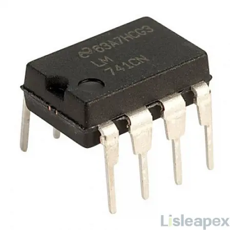
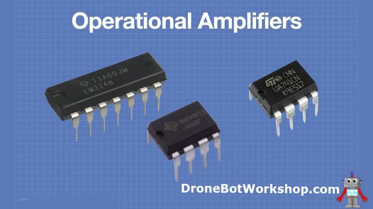
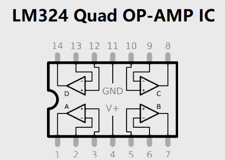
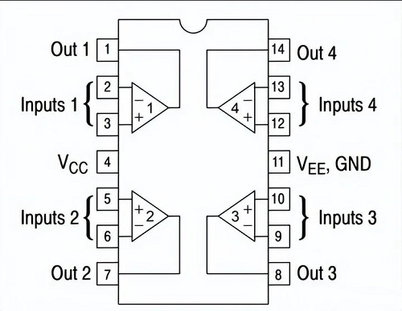

### Operational Amplifier

Operational Amplifier: [https://youtu.be/_ZuJgt4NfFI](https://youtu.be/_ZuJgt4NfFI)
Operational Amplifier Playlist Bangla: [Operational Amplifier Playlist Bangla](https://www.youtube.com/playlist?list=PLP48XoBlOMADncExQY7Ci7Rr4EZg2SjQU)

--- 

 

## **1. Op-Amp কী?**

Op-amp (Operational Amplifier) হলো একটি ছোট IC যার ভেতরে অনেকগুলো transistor, resistor, diode ইত্যাদি দিয়ে বানানো একটি সম্পূর্ণ সার্কিট থাকে। এটা কোনো সাধারণ component না—একটা mini circuit।

এটা signal amplify করতে পারে এবং voltage দিয়ে বিভিন্ন mathematical operation-ও করতে পারে।

**OP = Operational**
**AMP = Amplifier**

---

## **2. Amplifier কী করে?**

Amplifier একটি দুর্বল signal কে শক্তিশালী করে।
যেমন:

* মাইকের signal খুব দুর্বল
* Speaker চালাতে পারে না
* তাই amplifier signal বড় করে

Op-amp voltage বাড়ায়—কিন্তু signal এর shape বা মান নষ্ট করে না।

---

## **3. Op-Amp কেন special?**

সাধারণ amplifier শুধু signal বড় করে,
কিন্তু **op-amp গণিতও করতে পারে (voltages দিয়ে):**

* Add
* Subtract
* Scale
* Integrate
* Differentiate
* Average
  ইত্যাদি।

এগুলো analog circuit দিয়ে অনেক সহজে করা যায়—কোড ছাড়া, কোনো Arduino ছাড়াই।

---

## **4. Op-Amp IC হিসাবে কেন আসে?**

Op-amp transistor–resistor দিয়ে বানানো খুব ঝামেলার বিষয়।
তাই manufacturer এগুলোকে IC হিসেবে বানায়।
সাধারণত triangle shape symbol দিয়ে দেখানো হয়।

অনেক IC এক প্যাকেজে 2 বা 4 টি op-amp দেয় (dual / quad op-amp)।
৮-পিন dual op-amp package খুবই common এবং দামে খুবই সস্তা।

---

## **5. Basic Structure**

একটি op-amp এ থাকে:

* **দুটি input**

  * Inverting (–)
  * Non-inverting (+)
* **একটি output**
* **Dual power supply**, যেমন:

  * +5V থেকে +15V
  * –5V থেকে –15V
    এতে output 0 ভোল্টের উপরে-নিচে swing করতে পারে।

---

## **6. Important Properties**

### **(1) No input current**

Op-amp এর input-এ practically কোনো current যায় না → sensors disturb হয় না।

### **(2) Low output impedance**

Output থেকে current দিতে বা নিতে পারে → load মনে করে drive করতে পারে।

### **(3) Voltage Difference Amplification**

Op-amp শুধু V+ – V– এর difference amplify করে।

---

## **7. Two Main Modes**

### **A. Open Loop**

* কোনো feedback নেই
* Gain অনেক অনেক বেশি (100,000 – 1,000,000)
* খুব ক্ষুদ্র voltage difference = output supply rail এ গিয়ে ঠেকে
* তাই comparator হিসেবে ব্যবহার হয়

### **B. Closed Loop (Negative Feedback সহ)**

* Output কিছু অংশ input-এ ফেরত দেওয়া হয়
* Gain কমে → stable, predictable
* এখানেই op-amp সবচেয়ে useful

এভাবে তৈরি হয়:

* Inverting amplifier
* Non-inverting amplifier
* Summing amplifier
* Difference amplifier
* Integrator
* Differentiator
  ইত্যাদি।

---

## **8. Golden Rules of Op-Amp (Negative Feedback থাকলে)**

**Rule 1:** Input terminals-এ current ≈ 0
**Rule 2:** Inverting এবং non-inverting inputs-এর voltage equal হয়ে যায়

এ দুই rule দিয়ে op-amp circuit সহজে calculate করা যায়।

---

## **9. What’s Next?**

এই পর্যন্ত ছিল op-amp এর basics, properties এবং rules।
পরের ধাপে এগুলো ব্যবহার করে practical circuit বানানো যাবে—যেমন:

* Comparator
* Buffer
* Amplifier
* Integrator / Differentiator
