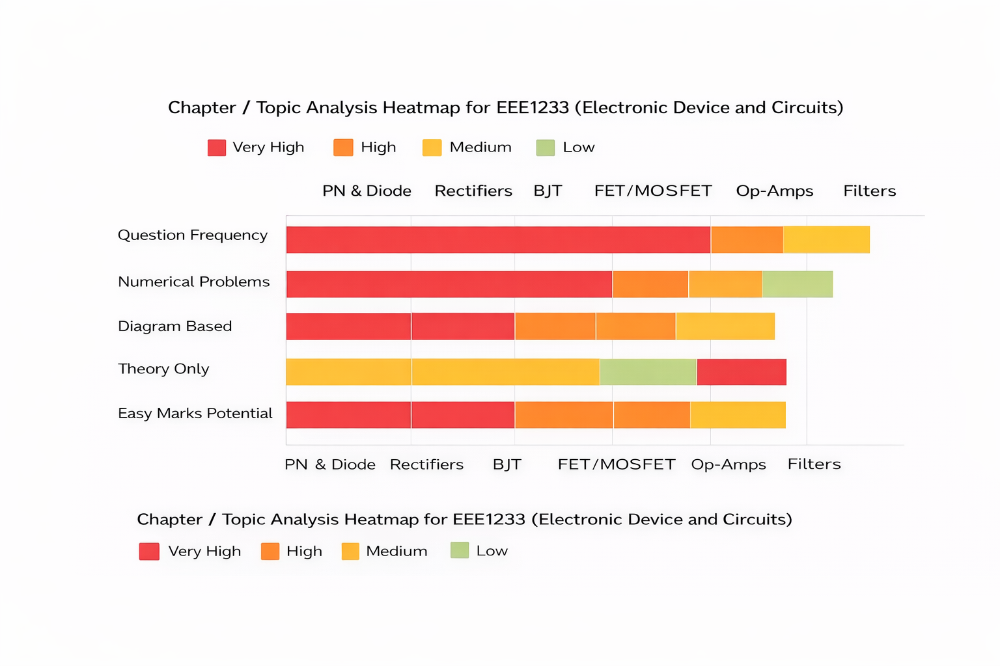

## **Chapter 1: Semiconductor Devices (PN Junction, Diodes, Zener Diode)**

**(PN Junction, Drift & Diffusion Current, Diode Biasing, V-I Characteristics, Zener Diode, Zener Regulator)**

1. **(a)** Draw and explain the V-I characteristics of a PN junction.
   **(c)** A silicon diode dissipates 3W for a forward DC current of 2A. Calculate the forward voltage drop across the diode and its bulk resistance.

2. (a) Explain p-n junction required for semiconductor devices. Define majority and minority carries.
   (b) Draw and explain the V-I characteristics curve of diode.

3. (a) Define doping. How hole is formed in P-type semiconductor?
   (b) What are the conditions for forward and reverse biasing of PN diode? When does diode works as logic gate?
   (c) What do you mean by drift current and diffusion current in p-n junction diode.

4. (a) Explain the formation of a pn-junction.
   (b) What is the barrier potential? What is the barrier potential of a silicon diode at room temperature?
   (c) What is mean by doping? Define conductor, semiconductor and insulator.
   (d) Draw and explain the I-V characteristics of a general purpose diode.

5. (b) What is the difference between normal and Zener diodes? Draw the diagrams in both cases.
   (c) Determine whether the ideal Zener diode of the Fig. is properly biased? Explain why?

6. (b) How a zener diode can be used for supplying constant voltage?

7. (a) What are the differences of P-N junction diode and zener diode?
   (c) Write the difference between the drift current and diffusion current. Find the zener diode current and the output power from the circuit.

(d) Differentiate between silicon diode and Zener diode.

---

## **Chapter 2: Rectifiers and Power Supplies**

**(Half Wave, Full Wave, Bridge Rectifier, Ripple Factor, Filters)**

1. **(b)** Compare between clipper and clampers.

2. (a) Prove that ripple factor of full-wave rectifier is less than half-wave rectifier.

3. (a) Explain full wave bridge rectifier with necessary diagram. What are the advantages of it over half and full wave rectifiers?

4. (a) Describe the basic operation of a full wave bridge rectifier circuit.

(d) Explain the operation of a full wave rectifier.

(c) A full wave rectifier uses two diodes, the internal resistance of each diode may be assumed constant at 25Ω. The transformer r.m.s. secondary voltage from center tap to each end of secondary is 50 V and load resistance is 990Ω. Find:
(i) the mean load current;
(ii) the r.m.s. value of load current.

---

## **Chapter 3: Bipolar Junction Transistor (BJT)**

**(Construction, Characteristics, CE Configuration, Current Relations, Amplifier, Switch)**

5. (a) Describe working principle of NPN transistor.

6. (a) Show that “Transistor can be used as an amplifier”.
   (b) Draw and explain the input and output characteristic curve of transistor with common emitter connection.

7. (a) What is the difference between BJT and FET?
   (c) Explain relationship between different currents of BJT.

8. (c) Explain how a transistor can be worked as a switch.

(a) Explain with diagram, the operation of BJT.
(b) Define load line and Q-point.

4. (a) Draw a CE amplifier circuit. Also, briefly explain the operation of CE amplifier.
   (b) Draw the load line curve for a CE amplifier.
   (c) Graphically show the phase reversal for CE amplifier for input sinusoidal wave.

---

## **Chapter 4: Field Effect Transistor (JFET, MOSFET, CMOS)**

**(JFET Characteristics, MOSFET Types, EMOS, DMOS, V-I Characteristics)**

3. (a) Define the threshold voltage for MOSFET. Discuss about construction and operation of n-channel enhancement MOSFET.
   (b) Explain the V-I characteristics of n-channel depletion.

4. (b) Describe static characteristics of a JFET.
   (c) Explain the operation of JFET for the following condition:
   VGS = 0V and VDS some possible value.

5. (a) What is the difference between a JFET and a bipolar transistor?
   (b) Explain the typical drain and transfer characteristics of an n-channel depletion MOSFET.

6. (a) Analysis the ID-VDS curve of a JFET and show the region which indicates Ohmic region.
   (b) When does a JFET behave like a resistor?

7. (a) "FET is a voltage controlled and uni-polar device." Explain the statement briefly.
   (b) Explain construction and working principle of JFET with necessary diagram.
   (c) Explain why the region upto  is called the ohmic region of JFET.

8. (a) Why FET is called as voltage controlled and unipolar device.
   (b) Explain the working principle of JFET with necessary diagram.
   (c) Define pinch-off voltage. Illustrate the operation of CMOS as an inverter.

9. (a) Narrate the operation of n-channel E-MOSFET with drain transfer characteristics.

---

## **Chapter 5: UJT and Negative Resistance**

7. (a) What is UJT? Design UJT and explain its working principle.
   (b) Explain the UJT characteristics curve. What do you mean by negative resistance?

8. (a) Explain the construction and operation of UJT with appropriate block diagrams.
   (b) Explain the reasons behind the existence of the negative resistance region in UJT.
   (c) Compare between BJT and UJT.

(c) Explain the reasons behind the existence of the negative resistance region on UJT.

---

## **Chapter 6: Amplifiers and Feedback**

**(CE Amplifier, CS Amplifier, Gain, Bandwidth, Feedback)**

2. (a) Define impedance, reactance, Ripple and cut-off frequency.
   (b) Define feedback, bandwidth, open-loop and closed loop.

3. (c) What are advantages of negative feedback?

4. (a) Classify amplifier according to the
   (i) Use;
   (ii) frequency capacity;
   (iii) mode operation.
   (b) Derive the expression of voltage gain Av and current gain Ai of a transistor amplifier.

---

## **Chapter 7: Operational Amplifier (Op-Amp)**

**(Inverting, Non-Inverting, Adder, Integrator, Differentiator)**

5. (c) Find output of a summing amplifier circuit where Rin1 = 1KΩ, Rin2 = 2 KΩ, Rf = 10 KΩ, Vin1 = 2mV, Vin2 = 5mV.

6. (a) Why op-amp is so called? For an inverting op-amp, show that , where symbols have their usual meaning.
   (b) Design an adder and high pass filter using op-amp.
   (c) For the op-amp circuit in Fig, calculate the output voltage.

7. (a) Write down the characteristics of an ideal Op-Amp?
   (b) Derive the output voltage equation on a closed loop non-inverting op-amp?
   (c) Draw the circuit diagram of an inverting amplifier (without feedback) with appropriate label and write the voltage gain equation of it.

8. (a) Write down the characteristics of an ideal op-amp.
   (b) Derive the output voltage equation on a close-loop non-inverting op-amp.
   (c) Show the circuit diagram of an integrator using op-amp.

---

## **Chapter 8: Filters and Signal Processing**

**(Low Pass, High Pass, Band Pass, ADC, DAC)**

7. (a) Compare between analog to digital and digital to analog converter.
   (b) Describe the first order high pass filter.
   (c) What do you mean by filter? Mention some uses of filter.

8. (a) Define filter. Mention its function.
   (b) Classify filter. Show the transfer function of each of the filter with necessary diagram.
   (c) Design a band-pass filter of the figure shown below with lower cutoff frequency of 20.1KHz and an upper cutoff frequency of 20.3KHz.

9. (a) Define filter. Show the classification of filter.
   (b) Explain the frequency versus gain curve of a first order active filter with circuit diagram.
   (c) If  and , find in the op-amp summing integrator circuit.

Below is a **clean, exam-oriented analysis**, a **horizontal heatmap**, and a **tight 3-day study plan** built strictly from the chapter-wise separation you approved.
Language is plain, pacing is realistic, and nothing unnecessary is added.

---

## 1. Chapter-wise Exam Analysis (Based on Frequency)

### High-weight chapters

These appear **almost every term**, often with numerical parts.

* **Semiconductor Devices (PN Junction, Diodes, Zener)**
* **BJT (Characteristics, CE Amplifier, Current relations)**
* **FET & MOSFET (JFET, EMOS, DMOS, V-I curves)**
* **Op-Amp (Inverting, Non-inverting, Adder, Integrator)**

### Medium-weight chapters

Appear frequently but usually fewer sub-parts.

* **Rectifiers & Power Supplies**
* **Filters (LPF, HPF, BPF, cutoff frequency)**

### Low-weight but risky chapters

Short questions, easy marks, often ignored.

* **UJT & Negative Resistance**
* **Feedback & Amplifier classification**
* **ADC / DAC concepts**

---

## 2. Horizontal Heatmap (Easy Visual Priority)

**Interpretation in one line:**
If time is short, **PN Diode + BJT + FET + Op-Amp** alone can safely cover **5 full questions**.

---

## 3. 3-Day Study Plan (Realistic, No Overload)

Each day assumes **6–7 focused hours**, split into theory + numericals + diagrams.

---

### **Day 1: Foundation + Maximum Return**

**Morning (3 hrs)**

* PN junction formation
* Drift current vs diffusion current
* V-I characteristics of diode
* Zener diode, breakdown, Zener regulator
* Practice:

  * Ripple factor logic
  * Simple diode power calculation

**Afternoon (2 hrs)**

* Rectifiers

  * Half wave vs full wave vs bridge
  * Advantages, ripple comparison
* Draw at least **3 clean diagrams**

**Night (1–2 hrs)**

* Short notes only

  * Barrier potential
  * Doping
  * Majority vs minority carriers

🎯 Outcome:
You secure **Diode + Rectifier questions fully**.

---

### **Day 2: Transistors = Core Marks**

**Morning (3 hrs)**

* BJT

  * Construction and working
  * CE configuration
  * Input/output characteristics
  * Current relations (IE, IB, IC)
* Draw CE amplifier and load line

**Afternoon (2 hrs)**

* JFET

  * Construction
  * ID–VDS curve
  * Ohmic region
  * Pinch-off voltage

**Night (1–2 hrs)**

* MOSFET

  * Threshold voltage
  * n-channel EMOS operation
  * Depletion vs enhancement
  * One clean V-I characteristic sketch

🎯 Outcome:
You can confidently answer **any BJT or FET question**, theory or numerical.

---

### **Day 3: Scoring Tools + Easy Finish**

**Morning (3 hrs)**

* Op-Amp

  * Ideal characteristics
  * Inverting amplifier derivation
  * Non-inverting amplifier derivation
  * Summing amplifier numerical
  * Integrator circuit

**Afternoon (2 hrs)**

* Filters

  * LPF, HPF, BPF
  * Cut-off frequency meaning
  * Frequency vs gain curve
* ADC vs DAC comparison

**Night (1–2 hrs)**

* UJT

  * Construction
  * Characteristics curve
  * Negative resistance meaning
* Fast revision of definitions

  * Feedback
  * Bandwidth
  * Open loop vs closed loop

🎯 Outcome:
You lock **Op-Amp + Filter + UJT** without stress.

---

## Final Exam Strategy (Very Important)

* Attempt order:
  **Diode → BJT → FET → Op-Amp → Filter/UJT**
* Always **draw diagrams first**, even before writing explanation.
* For numericals, write formula clearly even if final value is wrong.
