**Bangladesh Open University**
School of Science and Technology
B. Sc in Computer Science and Engineering Program
152 Term (1st Year 2nd Semester)

**Final Examination**

Time: 3 hours                                                                  Total Marks (5x14): 70
Course Code & Title: **EEE1233 Electronic Devices and Circuit**

---

**[N.B.: Answer any 5 (five) questions. The figures in the right margin indicate the full marks. All portions of each question must be answered sequentially.]**

---

**1. (a)** Draw and explain the V-I characteristics of a PN junction.
**(b)** Compare between clipper and clampers.
**(c)** A silicon diode dissipates 3W for a forward DC current of 2A. Calculate the forward voltage drop across the diode and its bulk resistance.

---

**2. (a)** Define impedance, reactance, Ripple and cut-off frequency.
**(b)** Define feedback, bandwidth, open-loop and closed loop.

---

**3. (a)** Define the threshold voltage for MOSFET. Discuss about construction and operation of n-channel enhancement MOSFET.
**(b)** Explain the V-I characteristics of n-channel depletion.
**(c)** What are advantages of negative feedback?

---

**4. (a)** What is the difference between BJT and FET?
**(b)** Describe static characteristics of a JFET.
**(c)** Explain the operation of JFET for the following condition:
VGS = 0V and VDS some possible value.

---

**5. (a)** Describe working principle of NPN transistor.
**(b)** When does LED emit no light?
**(c)** Find output of a summing amplifier circuit where Rin1 = 1KΩ, Rin2 = 2 KΩ, Rf = 10 KΩ, Vin1 = 2mV, Vin2 = 5mV.

---

**6. (a)** Classify amplifier according to the
(i) Use; (ii) frequency capacity; (iii) mode operation.
**(b)** Derive the expression of voltage gain Av and current gain Ai of a transistor amplifier.

---

**7. (a)** Compare between analog to digital and digital to analog converter.
**(b)** Describe the first order high pass filter.
**(c)** What do you mean by filter? Mention some uses of filter.

---

**Bangladesh Open University**
**School of Science and Technology**
**B. Sc in Computer Science and Engineering Program**
**162 Term (1st Year 2nd Semester) Final Examination**
**Course Code & Title: EEE1233 Electronic Device and Circuit**

**Time: 3 hours** **Total Marks: 70**

*[N.B.: Answer any 5 (five) questions. The figures in the right margin indicate the full marks. All portions of each question must be answered sequentially.]*

1. (a) Explain p-n junction required for semiconductor devices. Define majority and minority carries.             5+2
(b) Draw and explain the V-I characteristics curve of diode.                                                                            4
(c) Prove that ripple factor of full-wave rectifier is less than half-wave rectifier.                                            3
2. (a) What is the difference between normal and Zener diodes? Draw the diagrams in both cases.                  3+2
(b) When does an ideal diode work as switch: ON and OFF modes.                                                                    3
(c) Determine whether the ideal Zener diode of the Fig. is properly biased? Explain why?                              6
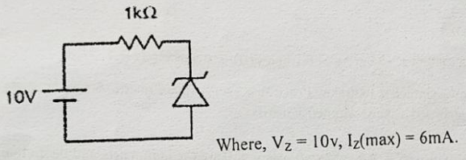

(1kΩ Resistor in series, Zener diode in parallel)
10V source
Where, Vz = 10v, Iz(max) = 6mA.
3. (a) Show that “Transistor can be used as an amplifier”.                                                                                       4
(b) Draw and explain the input and output characteristic curve of transistor with common emitter connection.     5
(c) Two diodes are connected parallel in the circuit. What will be the current in the circuit?                  5

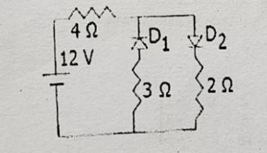

(Resistor 4Ω in series with parallel branches)
12 V source
Branch 1: D1, 3 Ω
Branch 2: D2, 2 Ω
4. (a) What is the difference between a JFET and a bipolar transistor?                                                                 3
(b) Explain the typical drain and transfer characteristics of an n-channel depletion MOSFET.                        8
(c) Explain relationship between different currents of BJT.                                                                                3
5. (a) Analysis the ID-VDS curve of a JFET and show the region which indicates Ohmic region.                         6
(b) When does a JFET behave like a resistor?                                                                                        2
(c) Illustrate the response curve for band pass, low pass and high pass filters.
6. (a) Why op-amp is so called? For an inverting op-amp, show that  , where symbols have their usual meaning.
(b) Design an adder and high pass filter using op-amp.                                                                                        3
(c) For the op-amp circuit in Fig, calculate the output voltage .                                                                         5
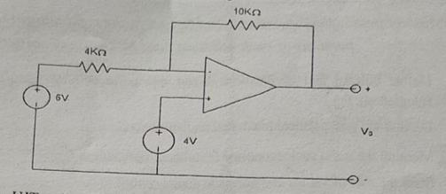
7. (a) What is UJT? Design UJT and explain its working principle.                                                                           1+4
(b) Explain the UJT characteristics curve. What do you mean by negative resistance?                                 4+2
(c) Refer to the Fig. below, determine the minimum value of  that will produce saturation. Where refers to the base current. 3
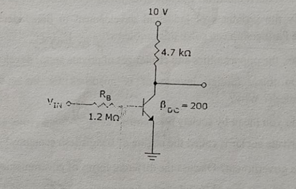

---

Based on the uploaded images, here is the converted text. I have separated the content based on the distinct exam papers provided in the files.

### **Document 1: Partial Exam Paper (Questions 6 & 7)**

*(Derived from `image_3ad846.jpg` and `image_44d84b.jpg`)*

6. (a) Why op-amp is so called? For an inverting op-amp, show that  , where symbols have
their usual meaning.
(b) Design an adder and high pass filter using op-amp.                                                                                        3
(c) For the op-amp circuit in Fig, calculate the output voltage V₀.                                                                         5
**[Circuit Diagram Description]**
* Feedback Resistor: 10KΩ
* Input Resistor: 4KΩ
* Non-inverting Input: 4V source
* Inverting Input Source: 6V source
* Output: V₀

7. (a) What is UJT? Design UJT and explain its working principle.                                                                           1+4
(b) Explain the UJT characteristics curve. What do you mean by negative resistance?                                 4+2
(c) Refer to the Fig. below, determine the minimum value of I_B that will produce saturation. Where I_B       3
refers to the base current.
**[Circuit Diagram Description]**
* Supply Voltage: 10 V
* Collector Resistor: 4.7 kΩ
* Base Resistor (): 1.2 MΩ
* Input: 
* Transistor Gain: 

---

### **Document 2: 172 Term Final Examination**

*(Derived from `image_45b262.jpg`)*

**Bangladesh Open University**
**School of Science and Technology**
**B. Sc in Computer Science and Engineering Program**
**172 Term (1st Year 2nd Semester) Final Examination**
**Course Code & Title: EEE1233 Electronic Device and Circuits**

**Time: 3 hours** **Total Marks (5×14): 70**

*[N.B.: Answer any 5 (five) questions. The figures in the right margin indicate the full marks. All portions of each question must be answered sequentially.]*

1. (a) State and explain Norton's theorem.                                                                                                                   3
(b) Determine the current flowing through the resistor 30Ω in the Fig-1(b).                                                         6
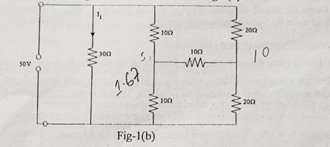
* A bridge circuit with resistors: 10Ω, 20Ω, 30Ω (center), 10Ω, 20Ω.
* Sources: 10V (left), 10 (right, likely Current or Voltage source, unit unclear in print but standard text implies Voltage usually or Current based on context, looks like 10).

(c) Replace the Y-configuration of the following circuit shown in fig-1(c) with a Delta-configuration and solve the source current .       5
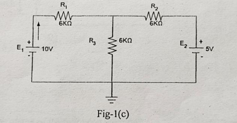
* Resistors:  6KΩ,  6KΩ,  6KΩ.
* Sources:  10V,  5V.

2. (a) Define doping. How hole is formed in P-type semiconductor?                                                                        2+3
(b) What are the conditions for forward and reverse biasing of PN diode? When does diode works              3+2
as logic gate?
(c) What do you mean by drift current and diffusion current in p-n junction diode.                                            4
3. (a) Explain full wave bridge rectifier with necessary diagram. What are the advantages of it over                4+2
half and full wave rectifiers?
(b) How a zener diode can be used for supplying constant voltage?                                                                     4
(c) Two diodes are connected parallel in the circuit shown below, so what will be the current in                    4
circuit?
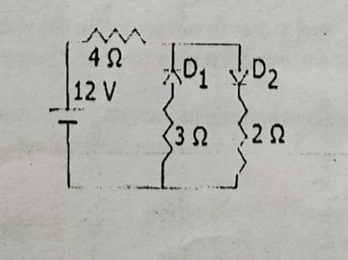
* Resistor: 4 Ω
* Voltage Source: 12 V
* Parallel Branch 1: Diode , Resistor 3 Ω
* Parallel Branch 2: Diode , Resistor 2 Ω

**Page 1 of 2**

4. (a) "FET is a voltage controlled and uni-polar device." Explain the statement briefly.                                        4
(b) Explain construction and working principle of JFET with necessary diagram.                                              6
(c) Explain why the region upto  is called the ohmic region of JFET.                                                              4
5. (a) Explain the construction and operation of UJT with appropriate block diagrams.                                          7
(b) Explain the reasons behind the existence of the negative resistance region in UJT.                                     4
(c) Compare between BJT and UJT.                                                                                                                      3
6. (a) Write down the characteristics of an ideal Op-Amp?                                                                                      3
(b) Derive the output voltage equation on a closed loop non-inverting op-amp?                                                 5
(c) Draw the circuit diagram of an inverting amplifier (without feedback) with appropriate label                   6
and write the voltage gain equation of it.
7. (a) Define filter. Mention its function.                                                                                                                     2+2
(b) Classify filter. Show the transfer function of each of the filter with necessary diagram.                             2+4
(c) Design a band-pass filter of the figure shown below with lower cutoff frequency of 20.1KHz                    4
and an upper cutoff frequency of 20.3KHz. Take R = 20KΩ. Calculate L and C.
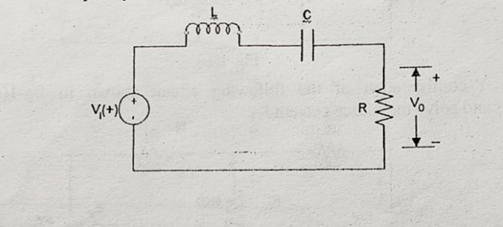
* Inductor (L) and Capacitor (C) in series.
* Resistor (R) in parallel with output .
* Input source .

---

অবশ্যই! তোমার আপলোড করা সবগুলো ছবি থেকে টেক্সট নিচে হুবহু তুলে ধরা হলো। আমি আলাদা আলাদা প্রশ্নপত্রের জন্য আলাদা সেকশন তৈরি করে দিয়েছি যাতে বুঝতে সুবিধা হয়।

### **Document 1: Partial Exam Paper (Questions 6 & 7)**

*(Derived from `image_3ad846.jpg` and `image_44d84b.jpg`)*

6. (a) Why op-amp is so called? For an inverting op-amp, show that  , where symbols have
their usual meaning.
(b) Design an adder and high pass filter using op-amp.                                                                                        3
(c) For the op-amp circuit in Fig, calculate the output voltage .                                                                         5
**[Circuit Diagram Description]**
* Feedback Resistor: 10KΩ
* Input Resistor: 4KΩ
* Non-inverting Input: 4V source
* Inverting Input Source: 6V source
* Output: 

7. (a) What is UJT? Design UJT and explain its working principle.                                                                           1+4
(b) Explain the UJT characteristics curve. What do you mean by negative resistance?                                 4+2
(c) Refer to the Fig. below, determine the minimum value of  that will produce saturation. Where        3
refers to the base current.
**[Circuit Diagram Description]**
* Supply Voltage: 10 V
* Collector Resistor: 4.7 kΩ
* Base Resistor (): 1.2 MΩ
* Input: 
* Transistor Gain: 

---

### **Document 2: 172 Term Final Examination**

*(Derived from `image_45b262.jpg`)*

**Bangladesh Open University**
**School of Science and Technology**
**B. Sc in Computer Science and Engineering Program**
**172 Term (1st Year 2nd Semester) Final Examination**
**Course Code & Title: EEE1233 Electronic Device and Circuits**

**Time: 3 hours** **Total Marks (5×14): 70**

*[N.B.: Answer any 5 (five) questions. The figures in the right margin indicate the full marks. All portions of each question must be answered sequentially.]*

1. (a) State and explain Norton's theorem.                                                                                                                   3
(b) Determine the current flowing through the resistor 30Ω in the Fig-1(b).                                                         6
**[Fig-1(b) Circuit Diagram]**
* A bridge circuit with resistors: 10Ω, 20Ω, 30Ω (center), 10Ω, 20Ω.
* Sources: 10V (left), 10 (right).

(c) Replace the Y-configuration of the following circuit shown in fig-1(c) with a Delta-configuration and solve the source current .       5
**[Fig-1(c) Circuit Diagram]**
* Resistors:  6KΩ,  6KΩ,  6KΩ.
* Sources:  10V,  5V.

2. (a) Define doping. How hole is formed in P-type semiconductor?                                                                        2+3
(b) What are the conditions for forward and reverse biasing of PN diode? When does diode works              3+2
as logic gate?
(c) What do you mean by drift current and diffusion current in p-n junction diode.                                            4
3. (a) Explain full wave bridge rectifier with necessary diagram. What are the advantages of it over                4+2
half and full wave rectifiers?
(b) How a zener diode can be used for supplying constant voltage?                                                                     4
(c) Two diodes are connected parallel in the circuit shown below, so what will be the current in                    4
circuit?
**[Circuit Diagram Description]**
* Resistor: 4 Ω
* Voltage Source: 12 V
* Parallel Branch 1: Diode , Resistor 3 Ω
* Parallel Branch 2: Diode , Resistor 2 Ω

**Page 1 of 2**

4. (a) "FET is a voltage controlled and uni-polar device." Explain the statement briefly.                                        4
(b) Explain construction and working principle of JFET with necessary diagram.                                              6
(c) Explain why the region upto  is called the ohmic region of JFET.                                                              4
5. (a) Explain the construction and operation of UJT with appropriate block diagrams.                                          7
(b) Explain the reasons behind the existence of the negative resistance region in UJT.                                     4
(c) Compare between BJT and UJT.                                                                                                                      3
6. (a) Write down the characteristics of an ideal Op-Amp?                                                                                      3
(b) Derive the output voltage equation on a closed loop non-inverting op-amp?                                                 5
(c) Draw the circuit diagram of an inverting amplifier (without feedback) with appropriate label                   6
and write the voltage gain equation of it.
7. (a) Define filter. Mention its function.                                                                                                                     2+2
(b) Classify filter. Show the transfer function of each of the filter with necessary diagram.                             2+4
(c) Design a band-pass filter of the figure shown below with lower cutoff frequency of 20.1KHz                    4
and an upper cutoff frequency of 20.3KHz. Take R = 20KΩ. Calculate L and C.
**[Circuit Diagram Description]**
* Inductor (L) and Capacitor (C) in series.
* Resistor (R) in parallel with output .
* Input source .

---

### **Document 3: 182 Term Final Examination**

*(Derived from `image_45b5c3.jpg`)*

**Bangladesh Open University**
**School of Science and Technology**
**B. Sc in Computer Science and Engineering Program**
**182 Term 1st Year 2nd Semester Final Examination**
**Course Code & Title: EEE1233 Electronic Device and Circuits**

**Time: 3 hours** **Total Marks (5×14): 70**

*[N.B.: Answer any 5 (five) questions. The figures in the right margin indicate the full marks. All portions of each question must be answered sequentially.]*

1. (a) Define conductor, insulator and semiconductor.                                                                                                   3
(b) What is meant by doping? Explain how hole is generated in p-type semiconductor.                                  5
(c) Draw and explain V-I characteristics curve of a semiconductor diode.                                                         6
2. (a) What are the differences of P-N junction diode and zener diode?                                                                 4
(b) Compare between BJT and JFET.                                                                                                                     4
(c) Explain how a transistor can be worked as a switch.                                                                                        6
3. (a) Describe the basic operation of a full wave bridge rectifier circuit.                                                                  4
(b) Discuss the forward and reverse biasing for silicon diode.                                                                               5
(c) Write the difference between the drift current and diffusion current. Find the zener diode current and    2+3
the output power from the circuit.
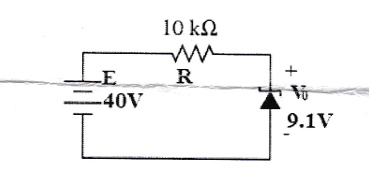
* Source: 40V
* Series Resistor: 10 kΩ
* Parallel Zener Diode Voltage (): 9.1V

4. (a) Why FET is called as voltage controlled and unipolar device.                                                                          3
(b) Explain the working principle of JFET with necessary diagram.                                                                      5
(c) Define pinch-off voltage. Illustrate the operation of CMOS as an inverter.                                                   6
5. (a) Narrate the operation of n-channel E-MOSFET with drain transfer characteristics.                                     4
(b) Calculate the output voltage  in the circuit in figure-5(b).                                                                         6

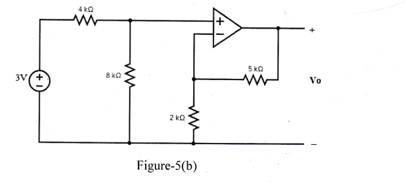
* Op-amp circuit with input 3V source.
* Resistors: 1kΩ (feedback), 5kΩ (feedback path), 2kΩ (input), 5kΩ (ground).

(c) Explain the reasons behind the existence of the negative resistance region on UJT.                                     4

**EEE1233** **Page 1 of 2**

6. (a) Write down the characteristics of an ideal op-amp.                                                                                        3
(b) Derive the output voltage equation on a close-loop non-inverting op-amp.                                                 4
(c) Show the circuit diagram of an integrator using op-amp. Sketch the output voltage for the circuit in       7
figure-6() given the input voltage in figure-6(). Take  at t = 0.
**[Figure-6() Description]**
* Integrator circuit with Capacitor 0.2 , Resistor 5 kΩ.

**[Figure-6() Description]**
* Triangular wave input graph.

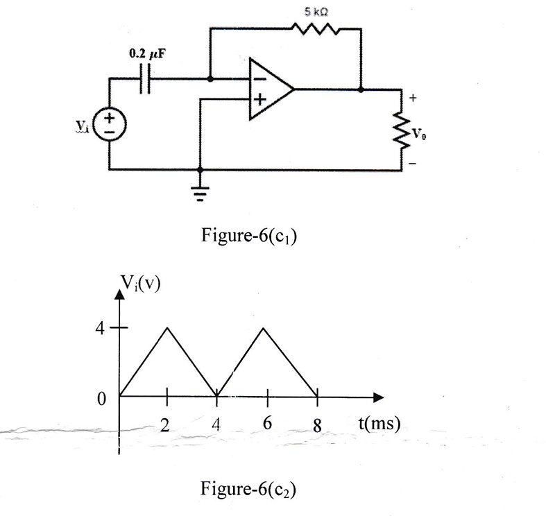

7. (a) Define filter. Show the classification of filter.                                                                                                    1+3
(b) Explain the frequency versus gain curve of a first order active filter with circuit diagram.                            6
(c) If  and , find in the op-amp summing integrator circuit. Assume that the         4
voltage across the capacitor is initially zero.
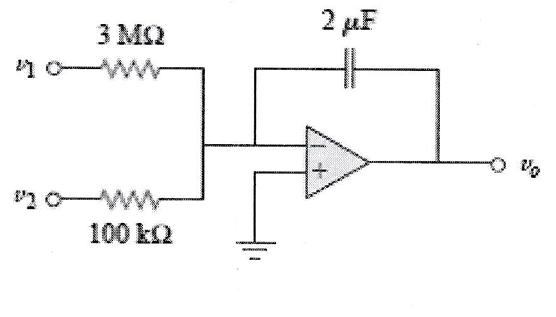

**Bangladesh Open University**
**School of Science and Technology**
**B. Sc. in Computer Science and Engineering Program**
**192 Term 1st year 2nd Semester Final Examination**
**Course Code & Title: CSE1233 Electronic Device and Circuit**

**Time: 3 Hours**                                                             **Total Marks: 70**

---

*[Answer any five of the following questions. Figures in the right margin indicate the full marks of each question. Fractions of a question should be answered together and sequentially.]*

---

**1.**
(a) Explain the formation of a pn-junction.                                                             5

(b) What is the barrier potential? What is the barrier potential of a silicon diode at room temperature?                                                             2+1

(c) What is mean by doping? Define conductor, semiconductor and insulator.                                                             2+4

(d) Draw and explain the I-V characteristics of a general purpose diode.                                                             4

(e) For the series diode configuration of the circuit, determine (V_D), (V_R), and (I_D).                                                             4

*(figure shows an 8 V source, a silicon diode, and a resistor R = 2.2 kΩ connected in series)*

---

(c) Sketch the output (v_o) and determine the dc level of the output for the following network.                                                             3

*(figure shows an input sinusoidal waveform (v_i) of 20 V peak, a diode, a resistor R = 2 kΩ to ground, and output (v_o))*

---

(d) Explain the operation of a full wave rectifier.                                                             3

---

**3.**
(a) Explain with diagram, the operation of BJT.                                                             5

(b) Define load line and Q-point.                                                             2

(c) A full wave rectifier uses two diodes, the internal resistance of each diode may be assumed constant at 25Ω. The transformer r.m.s. secondary voltage from center tap to each end of secondary is 50 V and load resistance is 990Ω. Find: (i) the mean load current; (ii) the r.m.s. value of load current.                                                             5

(d) Differentiate between silicon diode and Zener diode.                                                             2

---

**4.**
(a) Draw a CE amplifier circuit. Also, briefly explain the operation of CE amplifier.                                                             6

(b) Draw the load line curve for a CE amplifier.                                                             3

(c) Graphically show the phase reversal for CE amplifier for input sinusoidal wave.                                                             5
