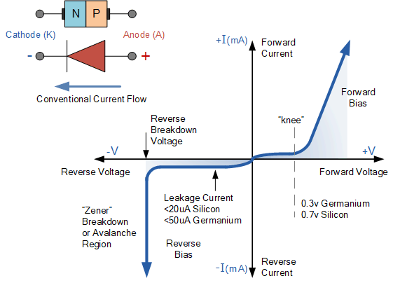

# DUET Suggestion solutions:

=== "Answer type 01"


    ## 1. Definition of Doping and Formation of Holes in P-type Semiconductor

    ### Doping (ডোপিং)

    Doping is the process of adding a small amount of impurity (অপদ্রব্য) atoms to a pure semiconductor crystal (কেলাস).1 We do this to strictly increase its electrical conductivity (তড়িৎ পরিবাহিতা). The impurity atoms added are known as dopants.2 For example, adding Boron to Silicon is a type of doping.

    ### Formation of a Hole (হোল) in P-type Semiconductor

    To make a p-type semiconductor, we add a trivalent impurity (ত্রিযোজী মৌল) like Boron or Gallium to a pure Silicon crystal.

    Silicon has 4 valence electrons (যোজন ইলেকট্রন).


    The trivalent atom like Boron has only 3 valence electrons.


    When Boron sits in the crystal structure, it forms covalent bonds (সমযোজী বন্ধন) with 3 neighbouring Silicon atoms.


    However, for the 4th bond, there is no electron available from the Boron atom.
    This creates a vacancy or a gap. We call this empty space a Hole.
    Since a hole represents the absence of a negative electron, it acts like a positive charge carrier (আধান বাহক).6


    ## 2. Definitions of Conductor, Semiconductor, and Insulator

    ### Conductor (পরিবাহী)

    Conductors are materials that allow electric current (তড়িৎ প্রবাহ) to flow through them very easily.7 They contain a large number of free electrons.
    Example: Copper, Aluminum, Silver.
    Energy Band: The valence band and conduction band overlap each other, so electrons can move freely.

    ## Semiconductor (অর্ধপরিবাহী)

    Semiconductors are materials whose conductivity lies between conductors and insulators.8 At absolute zero temperature, they act like insulators, but as the temperature rises, they start conducting.9
    Example: Silicon (Si), Germanium (Ge).
    Energy Band: There is a small forbidden energy gap (নিষিদ্ধ শক্তি স্তর) of about 1 eV between the valence and conduction bands.

    ## Insulator (অপরিবাহী)

    Insulators are materials that do not allow electric current to flow through them.10 They have practically no free electrons.
    Example: Wood, Glass, Rubber.
    Energy Band: There is a very large energy gap (greater than 5 eV), so electrons cannot jump to the conduction band.

    # 3. Differences Between Silicon Diode and Zener Diode

    Doping Level: A normal Silicon diode has moderate doping. A Zener diode (জেনার ডায়োড) is heavily doped.11


    Breakdown (ব্রেকডাউন): A Silicon diode gets damaged if the reverse voltage exceeds the breakdown voltage.12 A Zener diode is designed to operate safely in the breakdown region without getting damaged.


    Application (ব্যবহার): Silicon diodes are used for rectification.14 Zener diodes are used as voltage regulators (ভোল্টেজ রেগুলেটর) to provide a constant voltage.


    Symbol: The Silicon diode symbol has a straight bar. The Zener diode symbol has a bent bar that looks like the letter Z.


    # 4. Difference Between BJT and JFET

    Control Type: BJT or Bipolar Junction Transistor is a Current Controlled Device because the output current depends on the input base current.17 JFET or Junction Field Effect Transistor is a Voltage Controlled Device because the output current depends on the input gate voltage.


    Charge Carriers: BJT is bipolar (দ্বিমেরু), meaning conduction happens due to both electrons and holes.19 JFET is unipolar (একমেরু), meaning conduction happens due to only one type of majority carrier.


    Input Impedance (ইমপিডেন্স): BJT has low input impedance. JFET has very high input impedance


    # 5. Explanation of FET as a Voltage-Controlled and Unipolar Device

    ## Why Voltage-Controlled?

    In a FET, the output current or Drain current is controlled by the electric field (তড়িৎ ক্ষেত্র) created by the input voltage (Gate-to-Source voltage).22 We do not need any input current to control the output; just the voltage is enough. That is why it is called a voltage-controlled device.

    ## Why Unipolar?

    The term "Uni" means one. In a FET, the current conduction is performed by only one type of charge carrier.23 It is either electrons (in N-channel) or holes (in P-channel), but never both at the same time. Therefore, it is a unipolar device.

    # 6. UJT Definition and Equivalent Circuit

    ## UJT (ইউনিজাংশন ট্রানজিস্টর)

    The UJT stands for Unijunction Transistor.24 It is a three-terminal semiconductor switching device.25 Even though it is called a transistor, it is different from a normal BJT because it has only one PN junction and two base terminals. It is mostly used in triggering circuits for SCRs and in generating sawtooth waveforms (করাত-দাঁত তরঙ্গ).+1

    ## Equivalent Circuit (সমতুল্য বর্তনী)

    The equivalent circuit of a UJT consists of a diode connected to a voltage divider made of two resistors, 26$R_{B1}$ and 27$R_{B2}$.28
    The diode represents the PN junction formed by the Emitter.
    $R_{B1}$ is the variable resistance between the Emitter and Base 1.
    $R_{B2}$ is the fixed resistance between the Emitter and Base 2.

    

    # 7. Drift Current and Diffusion Current

    ## Drift Current (প্রবাহিত কারেন্ট)

    This current flows due to an external electric field. When we apply a voltage across a semiconductor, the charge carriers are forced to move in a specific direction. This forced movement causes drift current.

    ## Diffusion Current (ব্যাপন/ বিস্তার হওয়া কারেন্ট)

    This current flows due to the difference in concentration (ঘনত্ব) of charge carriers. If there are more carriers in one area and fewer in another, carriers naturally move from the higher density area to the lower density area. This movement causes diffusion current. It does not need an external voltage.

    In a PN junction, both **diffusion current** and **drift current** exist at the same time, but they come from different types of charge carriers and different causes.


    Diffusion current is due to **majority carriers**.

    * In the **P-region**, holes are the majority carriers.
    * In the **N-region**, electrons are the majority carriers.

    Because of the **concentration difference** between the two sides,
    holes diffuse from P to N and electrons diffuse from N to P.
    This movement from high concentration to low concentration creates the diffusion current.

    So, diffusion current is mainly caused by **majority carriers**.

    ### Drift current

    Drift current is due to **minority carriers**.

    * In the P-region, electrons are minority carriers.
    * In the N-region, holes are minority carriers.

    Inside the **depletion region**, there is an internal electric field (তড়িৎ ক্ষেত্র).
    This field pulls minority electrons toward the N-side and minority holes toward the P-side.
    This motion under the electric field produces drift current.

    So, drift current is mainly caused by **minority carriers**.

    ### At equilibrium (no external voltage)

    In a **PN junction diode** at equilibrium:

    * Diffusion current (majority carriers) flows in one direction.
    * Drift current (minority carriers) flows in the opposite direction.

    Both currents are **equal in magnitude**, so the **net current is zero**.

    ### In one line for exams

    * **Diffusion current**: due to **majority carriers**.
    * **Drift current**: due to **minority carriers**.


    # 8. V-I Characteristics Curve of a PN Junction Diode

    The V-I characteristic curve is a graph showing the relationship between the voltage across the diode and the current flowing through it.

    ## Forward Bias (সম্মুখ ঝোঁক)

    When the positive terminal of the source is connected to the P-side, the diode is forward biased. Initially, no current flows until the voltage crosses the Knee Voltage (0.7V for Silicon).29 After this point, the current increases rapidly.

    ## Reverse Bias (বিপরীত ঝোঁক)

    When the positive terminal is connected to the N-side, the diode is reverse biased. Practically zero current flows (only a tiny leakage current). If the reverse voltage is increased too much, it hits the Breakdown voltage, and current shoots up.
    


    # 9. Zener Diode as a Voltage Regulator

    A Zener diode maintains a constant voltage because it operates in the reverse breakdown region.30
    When the Zener diode is connected in parallel with the load in reverse bias
    If the input voltage increases, the current through the Zener diode increases, but the voltage drop across it remains constant (equal to Zener voltage, $V_z$).
    If the load current changes, the Zener diode adjusts its own current to keep the total voltage drop stable.
    So, the voltage across the load stays fixed at $V_z$, protecting the load from voltage fluctuations.

    # 10. Crystal Diode and Rectifying Action

    ## Crystal Diode (ক্রিস্টাল ডায়োড)

    A crystal diode is just another name for a standard PN junction diode consisting of two semiconductor materials joined together.
    A crystal diode, also known as a point-contact diode or cat's-whisker diode, is an early type of diode using a semiconductor crystal (like germanium or silicon) with a fine wire touching its surface to form a P-N junction, allowing current to flow primarily in one direction. Though largely replaced by modern P-N junction diodes, crystal diodes were crucial in early radio receivers for detecting and rectifying signals and are still used in some microwave applications and simple detectors. 

    ## Rectifying Action (একমুখীকরণ ক্রিয়া)

    Rectification means converting AC (Alternating Current) into DC (Direct Current).
    During the positive half cycle of AC input, the diode is forward biased. It behaves like a closed switch and allows current to pass through.
    During the negative half cycle, the diode is reverse biased. It behaves like an open switch and blocks the current.
    Since current flows only in one direction, the output is unidirectional or DC.

    # 11. Efficiency of a Full Wave Rectifier

    Efficiency ($\eta$) is the ratio of DC output power to AC input power.

    $$\eta = \frac{P_{DC}}{P_{AC}}$$
    1. DC Output Power ($P_{DC}$)


    $$P_{DC} = (I_{dc})^2 \times R_L$$

    For a full wave rectifier, the average current is $I_{dc} = \frac{2I_m}{\pi}$
    So, $P_{DC} = \left(\frac{2I_m}{\pi}\right)^2 R_L = \frac{4I_m^2}{\pi^2} R_L$
    2. AC Input Power ($P_{AC}$)


    $$P_{AC} = (I_{rms})^2 \times (R_f + R_L)$$

    Assuming forward resistance $R_f$ is very small compared to $R_L$


    $$P_{AC} = (I_{rms})^2 R_L$$

    For full wave, $I_{rms} = \frac{I_m}{\sqrt{2}}$
    So, $P_{AC} = \left(\frac{I_m}{\sqrt{2}}\right)^2 R_L = \frac{I_m^2}{2} R_L$
    3. Efficiency Calculation


    $$\eta = \frac{\frac{4I_m^2}{\pi^2} R_L}{\frac{I_m^2}{2} R_L}$$

    $$\eta = \frac{8}{\pi^2}$$

    $$\eta \approx 0.812$$
    So, the percentage efficiency is 81.2%.
    (Question 12 is skipped as per instruction)

    # 13. Transistor as an Amplifier

    A transistor acts as an amplifier (বিবর্ধক) by raising the strength of a weak signal.32 We usually use the Common Emitter (CE) configuration for this.

    The input signal is applied between the base and emitter.
    The transistor is biased in the active region.
    A small change in the input base current ($\Delta I_B$) causes a very large change in the output collector current ($\Delta I_C$) because $\Delta I_C = \beta \times \Delta I_B$ (where $\beta$ is the gain).
    This large current flows through the load resistor, producing a large voltage drop, which is the amplified output.

    # 14. Working Principle of JFET

    ## Construction (গঠন)

    A JFET has a bar of N-type silicon with two P-type regions diffused on the sides. These P-regions form the Gate. The ends of the N-bar are the Source and Drain.

    ## Working Principle (কার্যপদ্ধতি)

    Imagine water flowing through a pipe.
    When we apply a voltage $V_{DS}$ between Drain and Source, electrons flow from Source to Drain.
    When we apply a negative voltage to the Gate (33$V_{GS}$), it reverse biases the PN junctions.34


    This creates a "depletion region" (নিঃশেষিত অঞ্চল) which has no charge carriers.
    As we make the Gate more negative, the depletion regions grow wider and squeeze the channel.35 This reduces the current flow.


    So, by changing the Gate voltage, we can control the flow of current.

    # 15. Transistor Calculation (Common Emitter)

    ## Given Data

    Collector Supply Voltage ($V_{CC}$) = 8V
    Voltage drop across $R_C$ ($V_{RC}$) = 0.5V
    Collector Resistor ($R_C$) = 800 $\Omega$
    Current Gain Alpha ($\alpha$) = 0.96

    ## i) Collector Emitter Voltage ($V_{CE}$)

    Applying Kirchhoff's Voltage Law to the output loop


    $$V_{CE} = V_{CC} - V_{RC}$$

    $$V_{CE} = 8 - 0.5 = 7.5 \text{ V}$$

    ## ii) Base Current ($I_B$)

    First, we find Collector Current ($I_C$)


    $$I_C = \frac{V_{RC}}{R_C} = \frac{0.5}{800} = 0.000625 \text{ A} = 0.625 \text{ mA}$$

    Next, we find Current Gain Beta ($\beta$)


    $$\beta = \frac{\alpha}{1 - \alpha} = \frac{0.96}{1 - 0.96} = \frac{0.96}{0.04} = 24$$

    Now, we find Base Current


    $$I_B = \frac{I_C}{\beta} = \frac{0.625 \text{ mA}}{24} \approx 0.026 \text{ mA} = 26 \mu\text{A}$$

    # 16. Difference Between MOSFET and JFET

    Gate Structure: In JFET, the gate is formed by a PN junction.36 In MOSFET (Metal Oxide Semiconductor FET), the gate is insulated from the channel by a Silicon Dioxide layer.37
    +1


    Input Impedance: MOSFET has much higher input impedance than JFET because of the insulator layer.38


    Operation Modes: JFET works only in Depletion mode.39 MOSFET can work in both Depletion and Enhancement modes.40
    +1


    # 17. Construction and Working of P-Channel Depletion MOSFET

    ## Construction

    It has a P-type channel formed on an N-type substrate. The Source and Drain are P-type regions. There is a thin layer of SiO2 (glass) insulating the Gate terminal.

    ## Working

    Zero Gate Voltage ($V_{GS} = 0$): Since it is a depletion type, a physical channel already exists. So, if we apply voltage between Source and Drain, current flows.
    Positive Gate Voltage ($V_{GS} > 0$): If we apply a positive voltage to the gate, it repels the holes from the channel. This depletes the channel, increasing resistance and reducing current.
    Negative Gate Voltage (41$V_{GS} < 0$): If we apply a negative voltage, it attracts more holes into the channel.42 This enhances conductivity and increases current.


    # 18. Transfer Characteristics Sketch for N-Channel Depletion MOSFET

    ## Given

    $I_{DSS} = 10 \text{ mA}$ (Maximum current)
    $V_P = -4 \text{ V}$ (Pinch-off voltage)

    ## Sketch Description

    The Y-axis represents Drain Current ($I_D$) in mA.
    The X-axis represents Gate-Source Voltage ($V_{GS}$) in Volts.
    Point 1: At $V_{GS} = 0 \text{ V}$, the curve starts at the top at $I_D = 10 \text{ mA}$.
    Point 2: At $V_{GS} = -4 \text{ V}$, the curve touches the X-axis, meaning $I_D = 0 \text{ mA}$.
    The curve connects these two points in a parabolic shape, curving downwards.

    # 19. Characteristics of an Ideal Operational Amplifier

    An ideal Op-Amp is a perfect amplifier with these properties
    Infinite Voltage Gain ($A_v = \infty$): It can amplify the smallest signal to infinite levels.
    Infinite Input Impedance ($Z_{in} = \infty$): It draws zero current from the input source.
    Zero Output Impedance ($Z_{out} = 0$): It can drive any load without voltage drop.
    Infinite Bandwidth (ব্যান্ডউইথ): It can amplify all frequencies from 0 Hz to infinity.

    # 20. Operating Principle of Summing Amplifier

    A summing amplifier is used to add multiple input voltages.43 It is usually based on the inverting configuration.

    We connect multiple input voltages ($V_1, V_2, V_3$) to the inverting input through resistors.
    Since the non-inverting terminal is grounded and the Op-Amp has infinite gain, the inverting terminal is at a "Virtual Ground" (0V).
    The currents from all inputs merge and flow through the feedback resistor $R_f$.
    Output Voltage Equation


    $$V_{out} = - ( \frac{R_f}{R_1}V_1 + \frac{R_f}{R_2}V_2 + \dots )$$

    # 21. Input Impedance and Output Voltage Calculation

    ## Circuit Details (Inferred)

    Input Resistor ($R_1$) = 5 k$\Omega$
    Feedback Resistor ($R_f$) = 20 k$\Omega$
    Input Voltage ($V_{in}$) = 100 mV

    ## i) Input Impedance ($Z_{in}$)

    For an inverting amplifier, the input impedance is simply equal to the input resistor because of virtual ground.44


    $$Z_{in} = R_1 = 5 \text{ k}\Omega$$

    ## ii) Output Voltage ($V_{out}$)

    The gain formula is $A_v = - \frac{R_f}{R_1}$


    $$A_v = - \frac{20 \text{ k}\Omega}{5 \text{ k}\Omega} = -4$$

    $$V_{out} = A_v \times V_{in} = -4 \times 100 \text{ mV} = -400 \text{ mV}$$

    # 22. Filter Definition and Diagrams

    Filter (ফিল্টার)
    A filter is a circuit that allows signals of certain frequencies to pass through while blocking others.45

    Circuit Diagrams
    Band Pass Filter: It is a combination of a High Pass Filter followed by a Low Pass Filter.
    Band Stop Filter: It is often made by connecting a Low Pass and High Pass filter in parallel.
    Shutterstock

    # 23. Analog to Digital Conversion Procedure

    Converting an analog signal (like voice) to digital involves three main steps
    Sampling (স্যাম্পলিং): We take samples of the continuous analog signal at regular intervals. This turns the wave into discrete pulses.
    Quantization (কোয়ান্টাইজেশন): The sampled values are rounded to the nearest fixed level (like 3V or 4V) that the digital system understands.
    Encoding (এনকোডিং): Finally, each quantized level is converted into a binary code (0s and 1s).

    # 24. CMRR of an Ideal Op-Amp

    CMRR (Common Mode Rejection Ratio) is the ability of an Op-Amp to reject noise that is present at both input terminals.46


    $$\text{CMRR} = \frac{\text{Differential Gain } (A_d)}{\text{Common Mode Gain } (A_{cm})}$$

    For an ideal Op-Amp
    We want it to amplify the difference ($A_d = \infty$).
    We want it to completely ignore common noise ($A_{cm} = 0$).
    Therefore, $\text{CMRR} = \frac{\infty}{0} = \infty$.
    (Note: The question asks why it becomes unity, but theoretically it is infinity. Practically, a higher value is better, not unity).

    # 25. Differentiator vs Integrator

    Function: A differentiator produces an output proportional to the rate of change of the input.47 An integrator produces an output proportional to the area under the curve of the input.48
    +1


    Circuit: In a differentiator, the capacitor is at the input. In an integrator, the capacitor is in the feedback path.

    # 26. Short Notes on Filters

    (a) Low Pass Filter
    This filter allows low-frequency signals to pass easily but blocks high-frequency signals. It is usually made with a resistor in series and a capacitor in parallel to the ground.

    (b) High Pass Filter
    This filter does the opposite. It blocks low frequencies (like DC) and allows high-frequency signals to pass. It consists of a capacitor in series and a resistor in parallel.

    # 27. UJT Calculation

    Given Data
    Intrinsic Stand-off Ratio ($\eta$) = 0.6
    Inter-base Resistance ($R_{BB}$) = 12 k$\Omega$
    To find: $R_{B1}$ and $R_{B2}$

    Formulas
    We know that $R_{BB} = R_{B1} + R_{B2}$
    And $\eta = \frac{R_{B1}}{R_{BB}}$

    Step 1: Find $R_{B1}$


    $$R_{B1} = \eta \times R_{BB}$$

    $$R_{B1} = 0.6 \times 12 \text{ k}\Omega = 7.2 \text{ k}\Omega$$

    Step 2: Find $R_{B2}$


    $$R_{B2} = R_{BB} - R_{B1}$$

    $$R_{B2} = 12 \text{ k}\Omega - 7.2 \text{ k}\Omega = 4.8 \text{ k}\Omega$$

    Answer
    $R_{B1} = 7.2 \text{ k}\Omega$ and $R_{B2} = 4.8 \text{ k}\Omega$.
    


=== "Answer type 02"


## 1.  What is meant by doping? How is a hole formed in a p-type semiconductor?

**What is meant by doping (ডোপিং)?**
Doping (ডোপিং) means adding a very small and controlled amount of impurity (অমিশ্র) atoms into a pure semiconductor (সেমিকন্ডাক্টর) like silicon or germanium, to change its conductivity (পরিবাহিতা). The purpose is to increase the number of charge carriers (চার্জ বাহক) and make the material more useful in devices.

**How is a hole (হোল) formed in a p-type semiconductor (পি-টাইপ সেমিকন্ডাক্টর)?**
In p-type semiconductor (পি-টাইপ সেমিকন্ডাক্টর), we add trivalent (ত্রি-ভ্যালেন্ট) impurity atoms like boron. Silicon has 4 valence electrons (ভ্যালেন্স ইলেকট্রন), but boron has 3. So, one bond remains incomplete and one electron is missing in that bond. This missing electron position behaves like a positive charge carrier, and it is called a hole (হোল). When a nearby electron moves to fill this missing bond, another hole is created at the earlier place, so the hole appears to move through the crystal (ক্রিস্টাল).

---

## 2.  Define conductor, semiconductor, and insulator.

**Conductor (কন্ডাক্টর):** A conductor (কন্ডাক্টর) is a material which allows electric current (বিদ্যুৎ প্রবাহ) to pass easily because it has a large number of free electrons (মুক্ত ইলেকট্রন). Example: copper, aluminium.

**Semiconductor (সেমিকন্ডাক্টর):** A semiconductor (সেমিকন্ডাক্টর) is a material whose conductivity is between conductor and insulator. Its conductivity can be controlled by doping (ডোপিং), temperature (তাপমাত্রা), and light (আলো). Example: silicon, germanium.

**Insulator (ইনসুলেটর):** An insulator (ইনসুলেটর) is a material which does not allow current to pass easily because it has very few free electrons. Example: glass, rubber, mica.

---

## 3.  Differentiate between silicon diode and zener diode.

**Silicon diode (সিলিকন ডায়োড) vs zener diode (জেনার ডায়োড):**

1. **Basic purpose:**
   Silicon diode is mainly used for rectification (রেক্টিফিকেশন).
   Zener diode is mainly used for voltage regulation (ভোল্টেজ নিয়ন্ত্রণ).

2. **Operating region:**
   Silicon diode works in forward bias (ফরওয়ার্ড বায়াস) mainly.
   Zener diode is designed to work in reverse bias breakdown (রিভার্স বায়াস ব্রেকডাউন) region safely.

3. **Breakdown use:**
   Silicon diode breakdown is not used normally.
   Zener diode breakdown is used as the main feature.

4. **Voltage behavior:**
   Silicon diode forward drop is about 0.7 V typically.
   Zener diode maintains nearly constant voltage (প্রায় ধ্রুব ভোল্টেজ) in breakdown.

5. **Construction:**
   Silicon diode is moderately doped.
   Zener diode is heavily doped (বেশি ডোপড), so it has sharp breakdown at a fixed voltage.

---

## 4.  What is the difference between BJT and JFET?

**BJT (বিজেটি) vs JFET (জেএফইটি):**

1. **Type of carriers:**
   BJT is bipolar (বাইপোলার), it uses both electrons and holes.
   JFET is unipolar (ইউনিপোলার), it uses mainly one type of carrier.

2. **Control:**
   BJT is current-controlled (কারেন্ট কন্ট্রোলড), base current controls collector current.
   JFET is voltage-controlled (ভোল্টেজ কন্ট্রোলড), gate voltage controls drain current.

3. **Input current:**
   BJT base draws current.
   JFET gate current is almost zero in reverse bias condition.

4. **Input impedance:**
   BJT has lower input impedance.
   JFET has high input impedance.

5. **Noise:**
   BJT generally has more noise compared to JFET.
   JFET generally shows lower noise.

---

## 5.  FET is a voltage-controlled and unipolar device; briefly explain the statement.

FET (এফইটি) is called **voltage-controlled (ভোল্টেজ কন্ট্রোলড)** because its output current (drain current) is controlled by gate to source voltage (গেট টু সোর্স ভোল্টেজ), and not by gate current. The gate is reverse biased, so gate current is nearly zero, but the electric field (ইলেকট্রিক ফিল্ড) produced by the gate voltage controls the channel width.

FET is called **unipolar (ইউনিপোলার)** because conduction happens mainly due to only one type of charge carrier, either electrons (ইলেকট্রন) in n-channel or holes (হোল) in p-channel. So it does not depend on both carriers like BJT.

---

## 6.  What is meant by UJT? Draw the equivalent circuit of UJT.

**What is meant by UJT (ইউজেটি)?**
UJT (Unijunction Transistor, ইউনিজাংশন ট্রানজিস্টর) is a three-terminal semiconductor device having only one PN junction (পি-এন জাংশন). Its terminals are emitter (ইমিটার) E, base1 (বেস১) B1, and base2 (বেস২) B2. It is mostly used in triggering (ট্রিগারিং) and relaxation oscillator (রিল্যাক্সেশন অসিলেটর).

**Draw the equivalent circuit of UJT.**

Equivalent circuit (সরল সমতুল্য সার্কিট) is shown like this:

```
        B2
        o
        |
       [Rb2]
        |
        +------|>|------o E
        |       Diode
       [Rb1]
        |
        o
        B1
```

Here Rb1 and Rb2 are the interbase resistances, and the emitter is connected to the resistive bar through a diode junction.

---

## 7.  Define drift and diffusion current.

**Drift current (ড্রিফট কারেন্ট):**
Drift current (ড্রিফট কারেন্ট) is the current caused by movement of charge carriers due to an applied electric field (ইলেকট্রিক ফিল্ড). When voltage is applied, electrons and holes drift in opposite directions, producing current.

**Diffusion current (ডিফিউশন কারেন্ট):**
Diffusion current (ডিফিউশন কারেন্ট) is the current caused by movement of charge carriers from a region of higher concentration (বেশি ঘনত্ব) to a region of lower concentration, even without external electric field. In PN junction, carriers diffuse due to concentration difference.

---

## 8.  Draw and briefly explain the V-I characteristics curve of a PN junction diode.

**Draw:**

```
 I
 |            Forward region
 |               /
 |              /
 |             /
 |____________/________________ V
 |           .
 |           .   Reverse region (small leakage)
 |           .
 |           .___________ Breakdown
 |
```

**Brief explanation:**
In forward bias (ফরওয়ার্ড বায়াস), current is very small until the cut-in voltage (কাট-ইন ভোল্টেজ) is reached. After that, current rises sharply for small increase of voltage. For silicon diode, cut-in voltage is about 0.7 V.

In reverse bias (রিভার্স বায়াস), only a small leakage current (লিকেজ কারেন্ট) flows due to minority carriers. If reverse voltage increases beyond breakdown voltage (ব্রেকডাউন ভোল্টেজ), current rises sharply. In normal diode, breakdown is not intended operation.

---

## 9.  Explain how a zener diode maintains constant voltage across the load.

A zener diode (জেনার ডায়োড) is connected in reverse bias across the load with a series resistor (সিরিজ রেজিস্টর). When supply voltage increases, the zener enters breakdown region and keeps the voltage across it nearly constant at zener voltage (জেনার ভোল্টেজ). The extra voltage is dropped across the series resistor by increasing current. When supply voltage decreases, zener current decreases, but still the zener tries to stay in breakdown, so load voltage remains almost constant as long as zener current stays within safe limit. Thus it works as a voltage regulator (ভোল্টেজ রেগুলেটর).

---

## 10.  What is a crystal diode? Explain the rectifying action.

**What is a crystal diode (ক্রিস্টাল ডায়োড)?**
A crystal diode (ক্রিস্টাল ডায়োড) is a PN junction diode made from semiconductor crystal (সেমিকন্ডাক্টর ক্রিস্টাল), commonly silicon or germanium. It allows current mainly in one direction.

**Explain the rectifying action (রেক্টিফাইং অ্যাকশন).**
In forward bias (ফরওয়ার্ড বায়াস), the depletion region (ডিপ্লিশন রিজিয়ন) becomes thin, barrier potential (ব্যারিয়ার পটেনশিয়াল) reduces, and diode conducts heavily. In reverse bias (রিভার্স বায়াস), depletion region widens, barrier increases, and only tiny leakage current flows. Because it conducts in forward direction and blocks in reverse direction, it converts AC (এসি) into pulsating DC (পালসেটিং ডিসি). This is rectifying action.

---

## 11.  Derive an expression for the efficiency for a full wave rectifier.

Rectifier efficiency (রেক্টিফায়ার দক্ষতা) is defined as:

[
\eta = \frac{P_{dc}}{P_{ac}}
]

For a full wave rectifier:
Average (dc) current:

[
I_{dc} = \frac{2 I_m}{\pi}
]

RMS current:

[
I_{rms} = \frac{I_m}{\sqrt{2}}
]

DC power delivered to load (R_L):

[
P_{dc} = I_{dc}^2 R_L = \left(\frac{2 I_m}{\pi}\right)^2 R_L
]

AC input power to load (effective power):

[
P_{ac} = I_{rms}^2 R_L = \left(\frac{I_m}{\sqrt{2}}\right)^2 R_L
]

So,

[
\eta = \frac{\left(\frac{2 I_m}{\pi}\right)^2 R_L}{\left(\frac{I_m}{\sqrt{2}}\right)^2 R_L}
= \frac{\frac{4 I_m^2}{\pi^2}}{\frac{I_m^2}{2}}
= \frac{4}{\pi^2}\times 2
= \frac{8}{\pi^2}
]

Numerically,

[
\eta_{max} = \frac{8}{\pi^2} \approx 0.812 \approx 81.2%
]

This is the maximum theoretical efficiency for an ideal full wave rectifier.

---

## 12.  A full wave rectifier uses two diodes. The internal resistance of each diode may be assumed constant at 30ohm. The transformer r.m.s secondary voltage from centre tap to each end of secondary is 50V and load resistance is 1000 ohm. Find:

○  i) the mean load current
○  ii) the r.m.s. value of load current.

Given:
(V_{rms} = 50\text{ V}) (from centre tap to one end)
Diode internal resistance (R_f = 30\ \Omega)
Load resistance (R_L = 1000\ \Omega)

Peak voltage:

[
V_m = \sqrt{2} V_{rms} = \sqrt{2}\times 50 = 70.71\text{ V}
]

Peak current:

[
I_m = \frac{V_m}{R_f + R_L} = \frac{70.71}{30 + 1000}
= \frac{70.71}{1030} = 0.06865\text{ A}
]

**i) the mean load current (mean মানে গড়)**

[
I_{dc} = \frac{2 I_m}{\pi} = \frac{2\times 0.06865}{\pi}
= 0.0437\text{ A}
]

So, mean load current (I_{dc} \approx 43.7\text{ mA}).

**ii) the r.m.s. value of load current (r.m.s মানে কার্যকর মান)**

[
I_{rms} = \frac{I_m}{\sqrt{2}} = \frac{0.06865}{\sqrt{2}}
= 0.0486\text{ A}
]

So, (I_{rms} \approx 48.6\text{ mA}).

---

## 13.  Explain how the transistor acts as an amplifier.

A transistor (ট্রানজিস্টর) acts as an amplifier (অ্যাম্প্লিফায়ার) when it is biased (বায়াসড) in active region (অ্যাক্টিভ রিজিয়ন). In common emitter (কমন ইমিটার) mode, a small change in base current (বেস কারেন্ট) produces a much larger change in collector current (কলেক্টর কারেন্ট), because current gain (কারেন্ট গেইন) (\beta) is high.

When this varying collector current passes through collector load resistor (কলেক্টর লোড রেজিস্টর), it produces a larger varying voltage across it. So the output voltage variation becomes larger than the input signal variation. Hence the transistor provides amplification, meaning small input signal controls a larger output signal.

---

## 14.  Briefly explain the working principle of JFET with necessary diagram.

**Working principle:**
JFET (Junction Field Effect Transistor, জাংশন ফিল্ড ইফেক্ট ট্রানজিস্টর) has a channel (চ্যানেল) between source (সোর্স) and drain (ড্রেন). The gate (গেট) forms a reverse biased PN junction with the channel. When gate to source voltage (V_{GS}) becomes more negative (for n-channel), the depletion region widens and reduces channel width. This reduces drain current (I_D). So drain current is controlled by gate voltage.

**Necessary diagram (simple):**

```
   Gate (G)
     |
     |
  ---| |---   (Reverse biased junction)
     |
Source(S) ======= Channel ======= Drain(D)
```

---

## 15.  A transistor is connected in common emitter (CE) configuration in which collector supply is 8V and the voltage drop across resistance Rc connected in the collector current is 0.5V. The value of Rc = 800 ohm, if alpha = 0.96, determine:

○  i) collector emitter voltage
○  ii) base current.

Given:
(V_{CC} = 8\text{ V})
Drop across (R_C) is (V_{RC} = 0.5\text{ V})
(R_C = 800\ \Omega)
(\alpha = 0.96)

Collector current:

[
I_C = \frac{V_{RC}}{R_C} = \frac{0.5}{800} = 0.000625\text{ A} = 0.625\text{ mA}
]

**i) collector emitter voltage**

[
V_{CE} = V_{CC} - V_{RC} = 8 - 0.5 = 7.5\text{ V}
]

**ii) base current**
[
\alpha = \frac{I_C}{I_E} \Rightarrow I_E = \frac{I_C}{\alpha}
= \frac{0.000625}{0.96} = 0.0006510\text{ A}
]

[
I_B = I_E - I_C = 0.0006510 - 0.000625
= 0.0000260\text{ A} = 26.0\ \mu\text{A}
]

So, (V_{CE} = 7.5\text{ V}) and (I_B \approx 26\ \mu\text{A}).

---

## 16.  Difference between MOSFET and JFET

1. **Gate structure:**
   JFET has PN junction gate.
   MOSFET has insulated gate (ইনসুলেটেড গেট) using oxide layer (অক্সাইড স্তর).

2. **Input impedance:**
   JFET is high.
   MOSFET is very high.

3. **Operating modes:**
   JFET normally works in depletion mode only.
   MOSFET can be depletion type and enhancement type.

4. **Gate current:**
   JFET gate current is small leakage.
   MOSFET gate current is almost zero ideally due to insulation.

5. **ESD sensitivity:**
   JFET is less sensitive.
   MOSFET is more sensitive to static charge.

---

## 17. Explain the construction and working of p-channel depletion-type MOSFET.

**Construction (কনস্ট্রাকশন):**
A p-channel depletion MOSFET has a p-type channel already formed between source and drain. The substrate (সাবস্ট্রেট) is n-type. The gate is separated from the channel by a thin oxide layer (অক্সাইড স্তর), so gate is insulated.

**Working:**
At (V_{GS} = 0), the channel exists, so current can flow if (V_{DS}) is applied with proper polarity. If gate is made positive with respect to source, it attracts electrons toward the gate region, which reduces hole concentration in the p-channel and narrows the channel. So drain current decreases. If gate is made negative, it increases hole concentration and channel becomes wider, so current increases. Hence it is called depletion-type because the channel can be depleted by gate voltage.

---

## 18. Sketch the transfer characteristics for n-channel depletion-type MOSFET with Idss=10mA and VP= -4v.

For n-channel depletion MOSFET, transfer characteristic (ট্রান্সফার ক্যারেক্টারিস্টিক) is similar to JFET:

[
I_D = I_{DSS}\left(1 - \frac{V_{GS}}{V_P}\right)^2
]

Given: (I_{DSS} = 10\text{ mA}), (V_P = -4\text{ V})

Key points for sketch:

* At (V_{GS} = 0), (I_D = I_{DSS} = 10\text{ mA})
* At (V_{GS} = V_P = -4\text{ V}), (I_D = 0)

Simple sketch:

```
I_D (mA)
10 |       *
   |     *
   |   *
   | *
 0 +-------------------- V_GS
   -4        0
```

The curve is a parabola shape from (0, 10 mA) down to (-4 V, 0).

---

## 19. Mention the characteristics of an ideal operational amplifier.

Characteristics (বৈশিষ্ট্য) of an ideal operational amplifier (অপারেশনাল অ্যাম্প্লিফায়ার):

1. Infinite open-loop gain (খোলা লুপ গেইন অসীম).
2. Infinite input impedance (ইনপুট ইম্পিডেন্স অসীম), so input current is zero.
3. Zero output impedance (আউটপুট ইম্পিডেন্স শূন্য).
4. Infinite bandwidth (ব্যান্ডউইথ অসীম).
5. Infinite slew rate (স্লু রেট অসীম).
6. Zero offset voltage (অফসেট ভোল্টেজ শূন্য).
7. Infinite CMRR (সিএমআরআর অসীম), perfect common-mode rejection.
8. Infinite PSRR (পাওয়ার সাপ্লাই রিজেকশন রেশিও অসীম).

---

## 20. Illustrate the operating principle of a summing amplifier using Op-Amp with neat sketch.

A summing amplifier (সামিং অ্যাম্প্লিফায়ার) adds multiple input voltages and gives a single output proportional to the sum. In inverting summing amplifier, all inputs go through resistors to the inverting terminal, and non-inverting terminal is grounded.

Neat sketch (simple):

```
V1 o--R1--+
          |
V2 o--R2--+----o (-)      |\
                |         | \
                +--Rf--o  |  \----o Vout
                |      |  |  /
               GND    o (+)| /
                      |/ 
                     GND
```

Operating principle: due to virtual ground (ভার্চুয়াল গ্রাউন্ড) at inverting input, currents from inputs add at the node, and output adjusts so that:

[
V_{out} = -R_f\left(\frac{V_1}{R_1}+\frac{V_2}{R_2}+ \cdots \right)
]

---

## 21. Determine the input impedance and output voltage for the circuit in following figure.

(Figure shows an op-amp circuit with 5 kΩ input resistor, 20 kΩ feedback resistor, 100 mV AC source, and load RL).

Assuming it is an inverting amplifier (ইনভার্টিং অ্যাম্প্লিফায়ার) with ideal op-amp:

**Input impedance (ইনপুট ইম্পিডেন্স):**
Input impedance is approximately equal to input resistor:

[
Z_{in} \approx R_{in} = 5\text{ k}\Omega
]

**Output voltage:**
Gain:

[
A_v = -\frac{R_f}{R_{in}} = -\frac{20k}{5k} = -4
]

Input (V_{in} = 100\text{ mV} = 0.1\text{ V})

[
V_{out} = A_v V_{in} = -4 \times 0.1 = -0.4\text{ V}
]

So output voltage is about (-0.4\text{ V}) (400 mV, inverted phase).

---

## 22. Define Filter. Draw the circuit diagram of Band pass Filter and Band stop Filter using Op-Amp.

**Define Filter (ফিল্টার).**
A filter (ফিল্টার) is a circuit that allows certain frequency range (ফ্রিকোয়েন্সি রেঞ্জ) to pass and blocks other frequencies.

**Band pass filter (ব্যান্ড পাস ফিল্টার) using Op-Amp (simple idea):**
It passes a band of frequencies between (f_L) and (f_H).

One common method is cascade of high pass then low pass with op-amp buffer. Basic block sketch:

```
Vin -> High Pass -> Op-Amp Buffer -> Low Pass -> Vout
```

**Band stop filter (ব্যান্ড স্টপ ফিল্টার) using Op-Amp (simple idea):**
It rejects a band of frequencies and passes low and high frequencies.

Basic block sketch:

```
          -> Low Pass --
Vin ---->                +--> Summing -> Vout
          -> High Pass --
```

(These are neat exam sketches in block form when full component values are not given.)

---

## 23. Describe the basic principle of analog to digital conversion procedure using necessary diagram.

Analog to digital conversion (অ্যানালগ টু ডিজিটাল কনভার্সন) converts a continuous analog signal into binary numbers.

Basic steps:

1. **Sampling (স্যাম্পলিং):** Take values at regular time interval.
2. **Quantization (কোয়ান্টাইজেশন):** Round each sample to nearest fixed level.
3. **Encoding (এনকোডিং):** Convert the quantized value into binary code.

Necessary diagram (block):

```
Analog input -> Sample and Hold -> Quantizer -> Encoder -> Digital output
```

This is the basic principle used in ADC (Analog to Digital Converter).

---

## 24. Why the CMRR of an ideal operational amplifier becomes unity?

CMRR (Common Mode Rejection Ratio, কমন মোড রিজেকশন রেশিও) of an ideal op-amp does **not** become unity in the practical definition. For an ideal op-amp, common-mode gain (A_{cm}) is zero and differential gain (A_d) is infinite, so:

[
CMRR = \frac{A_d}{A_{cm}} \rightarrow \infty
]

So the correct ideal condition is **CMRR becomes infinite**, meaning it rejects common-mode signals perfectly. If CMRR becomes unity, it would mean no rejection, which is not ideal behavior.

---

## 25. Differentiate between differentiator and integrator.

**Differentiator (ডিফারেনশিয়েটর):**

* Output is proportional to rate of change of input.
* It performs differentiation (অন্তরকরণ).
* For ideal op-amp differentiator: (V_{out} \propto \frac{dV_{in}}{dt})

**Integrator (ইন্টিগ্রেটর):**

* Output is proportional to accumulation of input over time.
* It performs integration (সমাকলন).
* For ideal op-amp integrator: (V_{out} \propto \int V_{in},dt)

Also, differentiator uses capacitor at input and resistor in feedback, while integrator uses resistor at input and capacitor in feedback (typical op-amp forms).

---

## 26. Write short note on (a) low pass filter and (b) high pass filter.

**(a) low pass filter (লো পাস ফিল্টার):**
A low pass filter (লো পাস ফিল্টার) allows low frequencies to pass and attenuates (দুর্বল করে) high frequencies. It has a cut-off frequency (কাট-অফ ফ্রিকোয়েন্সি) (f_c). Frequencies below (f_c) pass with little loss.

**(b) high pass filter (হাই পাস ফিল্টার):**
A high pass filter (হাই পাস ফিল্টার) allows high frequencies to pass and attenuates low frequencies. It also has cut-off frequency (f_c). Frequencies above (f_c) pass easily.

---

## 27. Define UJT. The intrinsic stand off ratio for a UJT is determined to be 0.6. if the inter base resistance is 12k ohm, what are the values of Rb1 and Rb2?

**Define UJT (ইউজেটি).**
UJT (Unijunction Transistor, ইউনিজাংশন ট্রানজিস্টর) is a three terminal device with one PN junction, used mainly for triggering and timing circuits.

Given:
Intrinsic stand off ratio (\eta = 0.6)
Interbase resistance (R_{BB} = 12\text{ k}\Omega)
And (R_{BB} = R_{B1} + R_{B2})

By definition:

[
\eta = \frac{R_{B1}}{R_{B1}+R_{B2}} = \frac{R_{B1}}{R_{BB}}
]

So,

[
R_{B1} = \eta R_{BB} = 0.6 \times 12k = 7.2\text{ k}\Omega
]

[
R_{B2} = R_{BB} - R_{B1} = 12k - 7.2k = 4.8\text{ k}\Omega
]

So, (R_{B1} = 7.2\text{ k}\Omega) and (R_{B2} = 4.8\text{ k}\Omega).


    ??? "Problem - Full Wave Rectifier"

        12) A full wave rectifier uses two diodes. The internal resistance of each diode may be 
        assumed constant at 30ohm. The transformer r.m.s secondary voltage from centre tap 
        to each end of secondary is 50V and load resistance is 1000 ohm. Find: 
        ○  i) the mean load current 
        ○  ii) the r.m.s. value of load current. 

        Answer: 
        Given Data

        - R.M.S. secondary voltage (centre tap to each end):
        
        $$
        V_{\text{rms}} = 50 \text{ V}
        $$

        - Internal resistance of each diode:

        $$
        r_f = 30 \ \Omega
        $$

        - Load resistance:

        $$
        R_L = 1000 \ \Omega
        $$

        > In a centre-tapped full-wave rectifier, **only one diode conducts in each half-cycle**, so only **one diode resistance** is included in the circuit at a time.

        ---

        ## Step 1: Calculate Peak Voltage \( V_m \)

        The peak value of the secondary voltage is obtained from the RMS value as:

        $$
        V_m = \sqrt{2}\,V_{\text{rms}}
        $$

        Substituting the given value:

        $$
        V_m = \sqrt{2} \times 50
        $$

        $$
        V_m = 70.71 \text{ V}
        $$

        ---

        ## Step 2: Calculate Peak Current \( I_m \)

        During conduction, the total resistance in the circuit is:

        $$
        R_{\text{total}} = R_L + r_f
        $$

        $$
        R_{\text{total}} = 1000 + 30 = 1030 \ \Omega
        $$

        The peak current is therefore:

        $$
        I_m = \frac{V_m}{R_{\text{total}}}
        $$

        $$
        I_m = \frac{70.71}{1030}
        $$

        $$
        I_m = 0.06865 \text{ A}
        $$

        ---

        ## Solution (i): Mean Load Current \( I_{\text{dc}} \)

        For a full-wave rectifier, the mean (DC) value of load current is given by:

        $$
        I_{\text{dc}} = \frac{2 I_m}{\pi}
        $$

        Substituting the value of \( I_m \):

        $$
        I_{\text{dc}} = \frac{2 \times 0.06865}{\pi}
        $$

        $$
        I_{\text{dc}} = 0.0437 \text{ A}
        $$

        ### Answer (i)

        \[
        \boxed{I_{\text{dc}} = 0.0437 \text{ A } \approx 43.7 \text{ mA}}
        \]

        ---

        ## Solution (ii): R.M.S. Value of Load Current \( I_{\text{rms}} \)

        For a full-wave rectifier, the RMS value of load current is:

        $$
        I_{\text{rms}} = \frac{I_m}{\sqrt{2}}
        $$

        Substituting the value of \( I_m \):

        $$
        I_{\text{rms}} = \frac{0.06865}{\sqrt{2}}
        $$

        $$
        I_{\text{rms}} = 0.0485 \text{ A}
        $$

        ### Answer (ii)

        \[
        \boxed{I_{\text{rms}} = 0.0485 \text{ A } \approx 48.5 \text{ mA}}
        \]

        ---

        ## Final Results Summary

        | Quantity | Value |
        |--------|-------|
        | Peak voltage \( V_m \) | 70.71 V |
        | Peak current \( I_m \) | 68.65 mA |
        | Mean load current \( I_{\text{dc}} \) | 43.7 mA |
        | RMS load current \( I_{\text{rms}} \) | 48.5 mA |

        ---

    !!! warning "Comparison of AC, Half-Wave Rectifier, and Full-Wave Rectifier"


        ### Side-by-Side Formula Table: AC, Half-Wave, and Full-Wave Rectifier

        | Quantity                 | AC Supply                             | Half-Wave Rectifier (HW)        | Full-Wave Rectifier (FW)              |
        | ------------------------ | ------------------------------------- | ------------------------------- | ------------------------------------- |
        | Peak voltage             | ( $V_m$ )                             | ( $V_m$ )                       | ( $V_m$ )                             |
        | RMS voltage              | ( $V_{rms} = \dfrac{V_m}{\sqrt{2}}$ ) | ( $V_{rms} = \dfrac{V_m}{2}$ )  | ( $V_{rms} = \dfrac{V_m}{\sqrt{2}}$ ) |
        | Average (DC) voltage     | ( $0$ )                               | ( $V_{dc} = \dfrac{V_m}{\pi}$ ) | ( $V_{dc} = \dfrac{2V_m}{\pi}$ )      |
        | Peak current             | ( $I_m$ )                             | ( $I_m = \dfrac{V_m}{R}$ )      | ( $I_m = \dfrac{V_m}{R}$ )            |
        | RMS current              | ( $I_{rms} = \dfrac{I_m}{\sqrt{2}}$ ) | ( $I_{rms} = \dfrac{I_m}{2}$ )  | ( $I_{rms} = \dfrac{I_m}{\sqrt{2}}$ ) |
        | Average (DC) current     | ( $0$ )                               | ( $I_{dc} = \dfrac{I_m}{\pi}$ ) | ( $I_{dc} = \dfrac{2I_m}{\pi}$ )      |
        | Ripple factor            | Not defined                           | ( $r = 1.21$ )                  | ( $r = 0.482$ )                       |
        | Rectification efficiency | Not applicable                        | ( $\eta = 40.6%$ )              | ( $\eta = 81.2%$ )                    |
        | Form factor              | ( $1.11$ )                            | ( $1.57$ )                      | ( $1.11$ )                            |
        | Output frequency         | ( $f$ )                               | ( $f$ )                         | ( $2f$ )                              |


        ### Exam Notes (Optional)

        * AC has zero average value, so it is not suitable for DC operation.
        * Half-wave rectifier conducts during only one half cycle.
        * Full-wave rectifier uses both half cycles, giving higher efficiency and lower ripple.
        * RMS values are used for power calculations.

        ---

        If you want, I can also:

        * compress this into a **5-mark answer**
        * add **one-line memory formulas**
        * align it exactly with **BOU / National University question style**
        * add a **numerical-ready version with symbols only**
