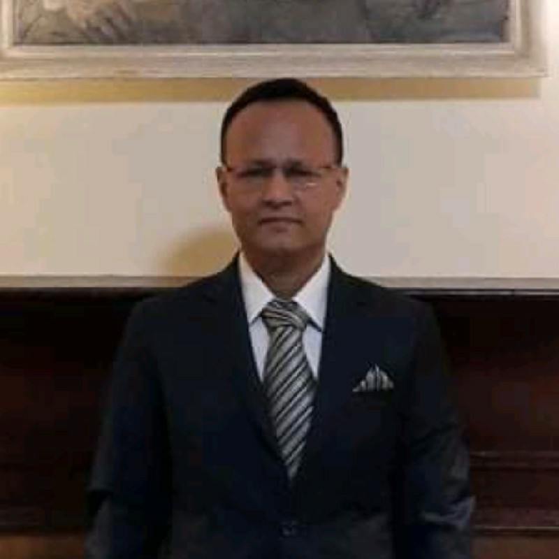
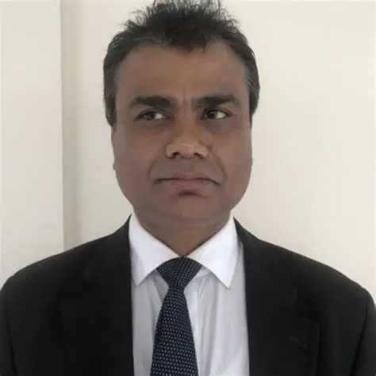

# 232 Term (1st Year, 2nd Semester)

??? question "Class Routine দেখতে ক্লিক করুন"

    ### Class Routine
    <iframe src="https://drive.google.com/file/d/1Z9EauGi5MImyfz6bpkFW7I9zEkxIRel-/preview" width="100%" height="600px" allow="autoplay"></iframe>

!!! info "Course Registration & Class Start Time of CSE Program"
    
    Link: [https://drive.google.com/file/d/1YTzvfVefx0PWHK2oeZwGwmtfjRYJKCC7/view?usp=sharing](https://drive.google.com/file/d/1YTzvfVefx0PWHK2oeZwGwmtfjRYJKCC7/view?usp=sharing)

!!! info "WhatsApp Study Groups"

    1. **12 SPL & SPL Lab**: [Join Here](https://chat.whatsapp.com/ItiE3cf9PDzEbqi31l1nhm)
    2. **12 EEE Theory**: [Join Here](https://chat.whatsapp.com/EtIC3TeOjXHBmfDuvE7Q5E)
    3. **12 EEE Lab**: [Join Here](https://chat.whatsapp.com/LlWmHOoHncMCmyJ3NUf7yf)
    4. **12 DLD Theory**: [Join Here](https://chat.whatsapp.com/LYagEcP4GVcDseTqlRdcSk)
    5. **12 MATH (MAT1231)**: [Join Here](https://chat.whatsapp.com/LBBvB7gBHGA138MPs2uv6T)
    6. **Bangladesh Studies (HUM1222)**: [Join Here](https://chat.whatsapp.com/Hya0uwmCfrmFxu4m5bUGza)
    7. **DLD Lab**: [Join Here](https://chat.whatsapp.com/JzSdfhgZ1qw0aOymRcERkK)

---

### 📐 Linear Algebra and Differential Equations

* 🔢 **Code**: MAT1231
* ✉ Email: sumon117ammh@gmail.com
* 👨‍🏫 **Teacher**: Mr. Md. Ershad Ali (EA)
* 🔗 **Resources**: [View](/all/bou-resources/bou-cse/12-semester/linear-algebra-and-differential-equations/linear-algebra-and-differential-equations/)

* 📝 **MCQ Practice**: [Start](/quizzes/12-mat1231)
* 📱 **WhatsApp Group**: [12 MATH (MAT1231)](https://chat.whatsapp.com/LBBvB7gBHGA138MPs2uv6T)

---

### 🗺️ Bangladesh Studies

* 🔢 **Code**: HUM1222
* 👨‍🏫 **Teacher**: Dr. Zahidur Rahman (ZR)
  {width=200px height=200px}
* 🔗 **Resources**: [View](/all/bou-resources/bou-cse/12-semester/bangladesh-studies/)
* 📝 **MCQ Practice**: [Start](/quizzes/12-hum1222)
* 📱 **WhatsApp Group**: [Bangladesh Studies (HUM1222)](https://chat.whatsapp.com/Hya0uwmCfrmFxu4m5bUGza)

---

### 💡 Electronic Device and Circuits

* 🔢 **Code**: EEE1233
* 👨‍🏫 **Teacher**: Professor Dr. Md. Adnan Kiber (AK)
  {width=200px height=200px}
* 🔗 **Resources**: [View](/all/bou-resources/bou-cse/12-semester/edc/)
* 📝 **MCQ Practice**: [Start](/quizzes/12-eee1233)
* 📱 **WhatsApp Group**: [12 EEE Theory](https://chat.whatsapp.com/EtIC3TeOjXHBmfDuvE7Q5E)

---

### 🧪 Electronic Device and Circuits Lab

* 🔢 **Code**: EEE12P4
* 👨‍🏫 **Teacher**: Prof. Dr. K.M. Rezanur Rahman (KMRR)
  {width=200px height=200px}
* 🔗 **Resources**: [View](/all/bou-resources/bou-cse/12-semester/edc-lab/)
* 📱 **WhatsApp Group**: [12 EEE Lab](https://chat.whatsapp.com/LlWmHOoHncMCmyJ3NUf7yf)

---

### 🔢 Digital Logic Design

* 🔢 **Code**: CSE1235
* 👨‍🏫 **Teacher**: Prof. Dr. Mohammed Nasir Uddin (MNU)
  {width=200px height=200px}

  * 📞 **Phone**: 01929-125856
* 🔗 **Resources**: [View](/all/bou-resources/bou-cse/12-semester/dld/)
* 📝 **MCQ Practice**: [Start](/quizzes/12-cse1235)
* **Book**: [Read & Download](https://drive.google.com/file/d/1VltmKbzZEI5TDvGWWPCL09mQeP6YnPXL/view?usp=sharing)
* 📱 **WhatsApp Group**: [12 DLD Theory](https://chat.whatsapp.com/LYagEcP4GVcDseTqlRdcSk)

---

### 🔌 Digital Logic Design Lab

* 🔢 **Code**: CSE12P6
* 👨‍🏫 **Teacher**: Mr. Md. Mahmudul Hasan (MH)
  {width=200px height=200px}

  * E-mail: [mahmudulhasan@bou.ac.bd](mailto:mahmudulhasan@bou.ac.bd)
  * 📞 **Cell**: +8801739-966934
* 🔗 **Resources**: [View](/all/bou-resources/bou-cse/12-semester/DLD-lab/index.html)
* 📱 **WhatsApp Group**: [DLD Lab](https://chat.whatsapp.com/JzSdfhgZ1qw0aOymRcERkK)

---

### 🧑‍💻 Structured Programming Language

* 🔢 **Code**: CSE1237
* 👨‍🏫 **Teacher**: Prof. Dr. Mohammad Mamunur Rashid (MMR)
* 🔗 **Resources**: [View](/all/bou-resources/bou-cse/12-semester/structured-programming/)
* 📝 **MCQ Practice**: [Start](/quizzes/12-cse1237)
* 📱 **WhatsApp Group**: [12 SPL & SPL Lab](https://chat.whatsapp.com/ItiE3cf9PDzEbqi31l1nhm)

---

### 🧑‍🔬 Structured Programming Language Lab

* 🔢 **Code**: CSE12P8
* 👨‍🏫 **Teacher**: Prof. Dr. Mohammad Mamunur Rashid (MMR)
* 🔗 **Resources**: [View](/all/bou-resources/bou-cse/12-semester/structured-programming-lab/)
* 📱 **WhatsApp Group**: [12 SPL & SPL Lab](https://chat.whatsapp.com/ItiE3cf9PDzEbqi31l1nhm)

