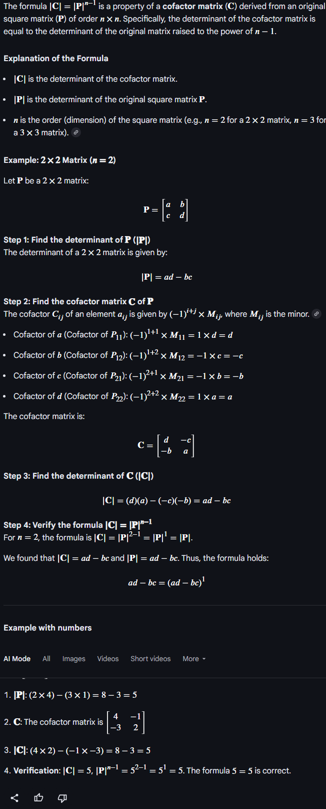

# The Determinant

??? "as image"

    

The formula $|\mathbf{C}| = |\mathbf{P}|^{n-1}$ is a property of a **cofactor matrix (C)** derived from an original **square matrix (P)** of order $n \times n$. Specifically, the determinant of the cofactor matrix is equal to the determinant of the original matrix raised to the power of $n - 1$.

**Explanation of the Formula**

* $|\mathbf{C}|$ is the determinant of the cofactor matrix.
* $|\mathbf{P}|$ is the determinant of the original square matrix $\mathbf{P}$.
* $n$ is the order (dimension) of the square matrix (e.g., $n = 2$ for a $2 \times 2$ matrix, $n = 3$ for a $3 \times 3$ matrix).

**Example: $2 \times 2$ Matrix ($n = 2$)**

Let $\mathbf{P}$ be a $2 \times 2$ matrix:

$$\mathbf{P} = \begin{bmatrix} a & b \\ c & d \end{bmatrix}$$

**Step 1: Find the determinant of $\mathbf{P}$ ($|\mathbf{P}|$ )**
The determinant of a $2 \times 2$ matrix is given by:

$$|\mathbf{P}| = ad - bc$$

**Step 2: Find the cofactor matrix $\mathbf{C}$ of $\mathbf{P}$**
The cofactor $C_{ij}$ of an element $a_{ij}$ is given by $(-1)^{i+j} \times M_{ij}$, where $M_{ij}$ is the minor.

* Cofactor of $a$ (Cofactor of $P_{11}$): $(-1)^{1+1} \times M_{11} = 1 \times d = d$
* Cofactor of $b$ (Cofactor of $P_{12}$): $(-1)^{1+2} \times M_{12} = -1 \times c = -c$
* Cofactor of $c$ (Cofactor of $P_{21}$): $(-1)^{2+1} \times M_{21} = -1 \times b = -b$
* Cofactor of $d$ (Cofactor of $P_{22}$): $(-1)^{2+2} \times M_{22} = 1 \times a = a$

The cofactor matrix is:

$$\mathbf{C} = \begin{bmatrix} d & -c \\ -b & a \end{bmatrix}$$

**Step 3: Find the determinant of $\mathbf{C}$ ($|\mathbf{C}|$ )**

$$|\mathbf{C}| = (d)(a) - (-c)(-b) = ad - bc$$

**Step 4: Verify the formula $|\mathbf{C}| = |\mathbf{P}|^{n-1}$**
For $n = 2$, the formula is $|\mathbf{C}| = |\mathbf{P}|^{2-1} = |\mathbf{P}|^{1} = |\mathbf{P}|$.

We found that $|\mathbf{C}| = ad - bc$ and $|\mathbf{P}| = ad - bc$. Thus, the formula holds:

$$ad - bc = (ad - bc)^1$$

**Example with numbers**

AI Mode All Images Videos Short videos More

1.  $|\mathbf{P}|: (2 \times 4) - (3 \times 1) = 8 - 3 = 5$

2.  $\mathbf{C}$: The cofactor matrix is $\begin{bmatrix} 4 & -1 \\ -3 & 2 \end{bmatrix}$

3.  $|\mathbf{C}|: (4 \times 2) - (-1 \times -3) = 8 - 3 = 5$

4.  **Verification:** $|\mathbf{C}| = 5$, $|\mathbf{P}|^{n-1} = 5^{2-1} = 5^1 = 5$. The formula $5 = 5$ is correct.