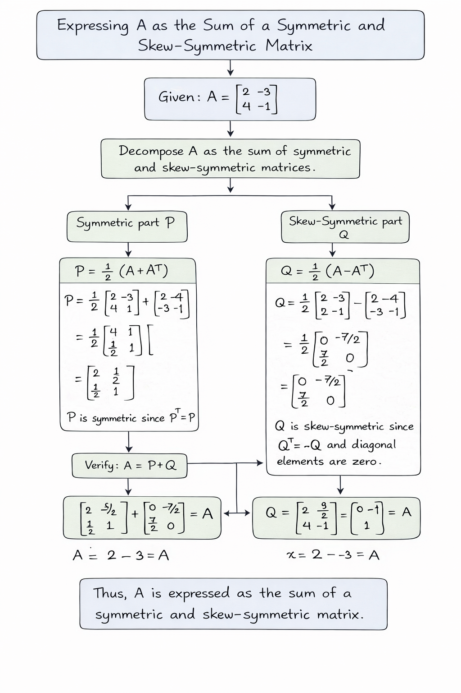
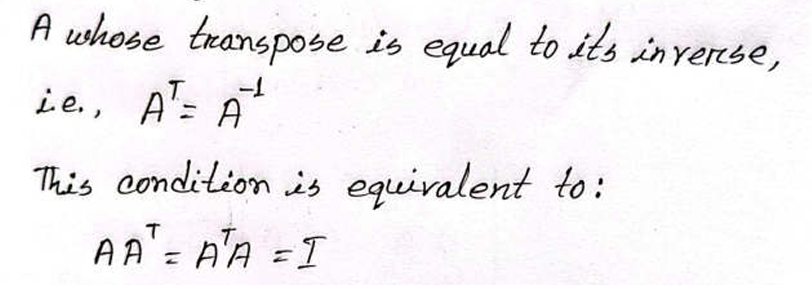
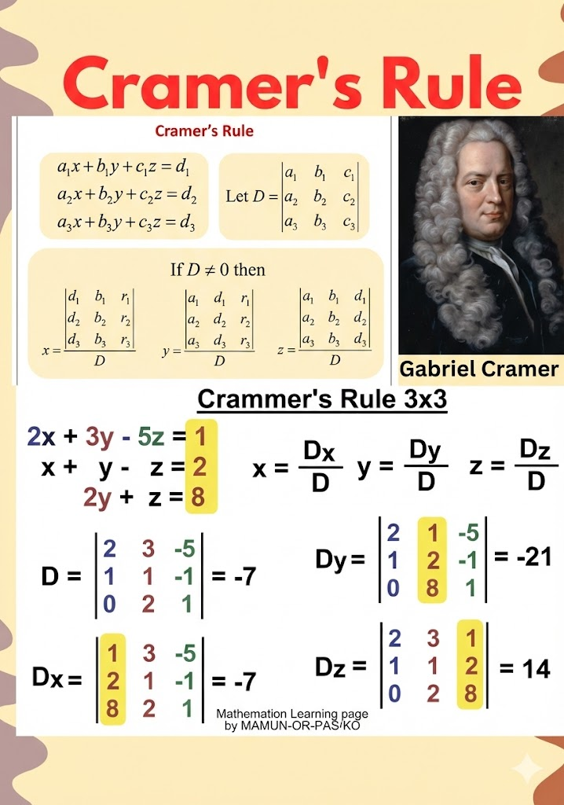

??? "Matrix at a glance"
    

    | **Matrix Type** | **Condition (LaTeX)** | **Description** |
    | --- | --- | --- |
    | **Symmetric** | $A = A^T$ | Equal to its transpose. |
    | **Skew-Symmetric** | $A = -A^T$ | Equal to negative transpose. |
    | **Orthogonal** | $A^T = A^{-1}$ | Transpose equals inverse. |
    | **Idempotent** | $A^2 = A$ | Square equals itself. |
    | **Involutory** | $A^2 = I$ | Square equals Identity. |
    | **Nilpotent** | $A^k = 0$ | Power $k$ results in Zero matrix. |
    | **Singular** | $ | A |
    | **Upper Triangular** | $a\_{ij} = 0 \text{ for all } i &gt; j$ | All elements below the main diagonal are zero. |
    | **Lower Triangular** | $a\_{ij} = 0 \text{ for all } i &lt; j$ | All elements above the main diagonal are zero. |
    | **Hermitian** | $A = A^\dagger$ | Equal to conjugate transpose. |
    | **Skew-Hermitian** | $A = -A^\dagger$ | Equal to negative conjugate transpose. |
    | **Unitary** | $AA^\dagger = I$ | Conjugate transpose is inverse. |
        

??? "Sum of a symmetric or skew symmetric"

    

??? "Orthogonal Matrix"
    
        

??? "Cramer's Rules"
    
    
    