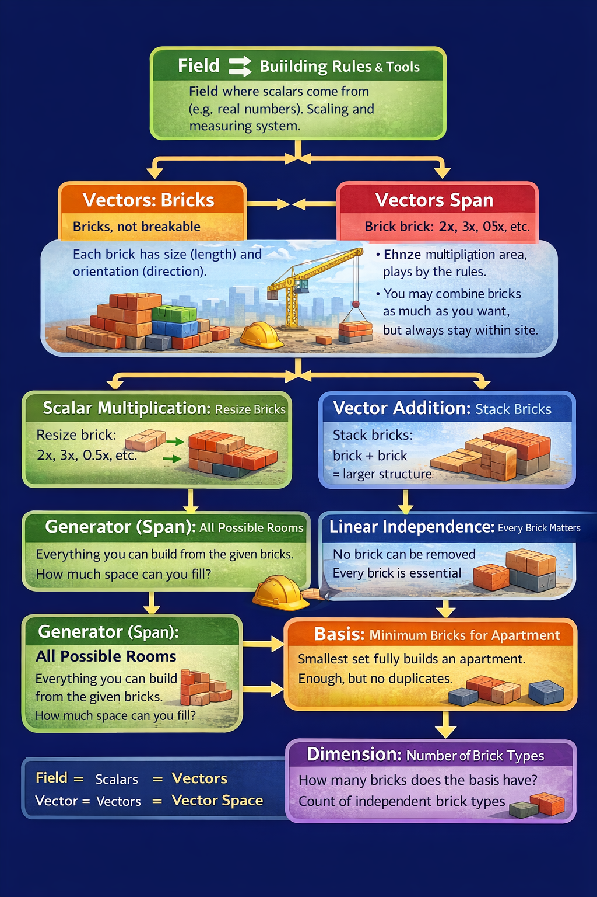

??? "Linear Dependence" 
    
    Linearly Independent Definition:
    A set of vectors is said to be linearly independent if none of the vectors can be expressed as a linear combination of the others.

    আরও ছোট করে:

    Alternative definition:
    Vectors are linearly independent if no vector is a scalar multiple of another vector.
    “একটা দিয়ে আরেকটা বানানো না গেলে → Linear Independent”

    Here is an “apartment” analogy:

    * **Field (F)**: the measurement system and scaling rules (what scalars are allowed).
    * **Scalar**: the number you use to resize a brick (comes from the field).
    * **Vector**: a brick (a directed piece you can use).
    * **Vector space (V)**: the whole apartment complex that obeys the rules over the field.
    * **Vector addition**: stacking bricks together.
    * **Scalar multiplication**: resizing or flipping a brick.
    * **Linear combination**: any build you make using resizing + stacking.
    * **Span / Generator**: the set of all builds you can make from a given brick set (all possible rooms you can produce from those bricks).
    * **Linear dependence**: at least one brick is redundant (can be built from the others).
    * **Linear independence**: no brick is redundant.
    * **Basis**: the smallest set of bricks that still builds the whole apartment (spans V and is independent).
    * **Dimension**: how many bricks are in a basis (how many independent “directions” the apartment needs).
    

??? "System of Linear eqn"
    