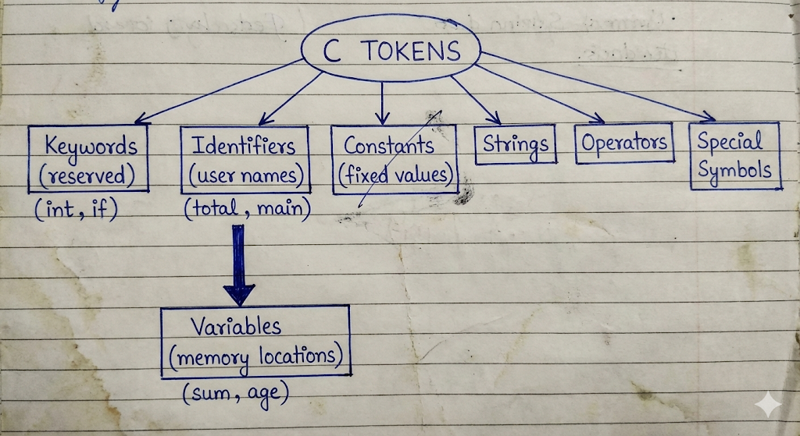
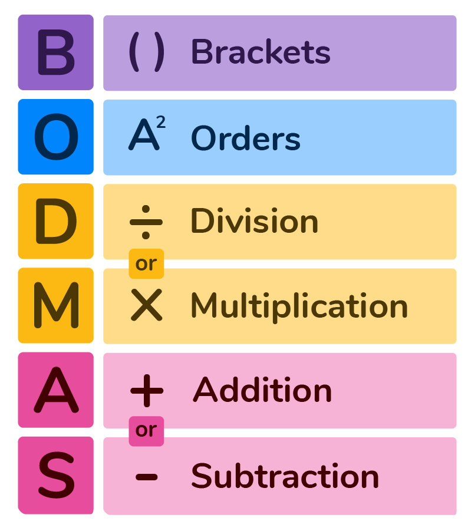
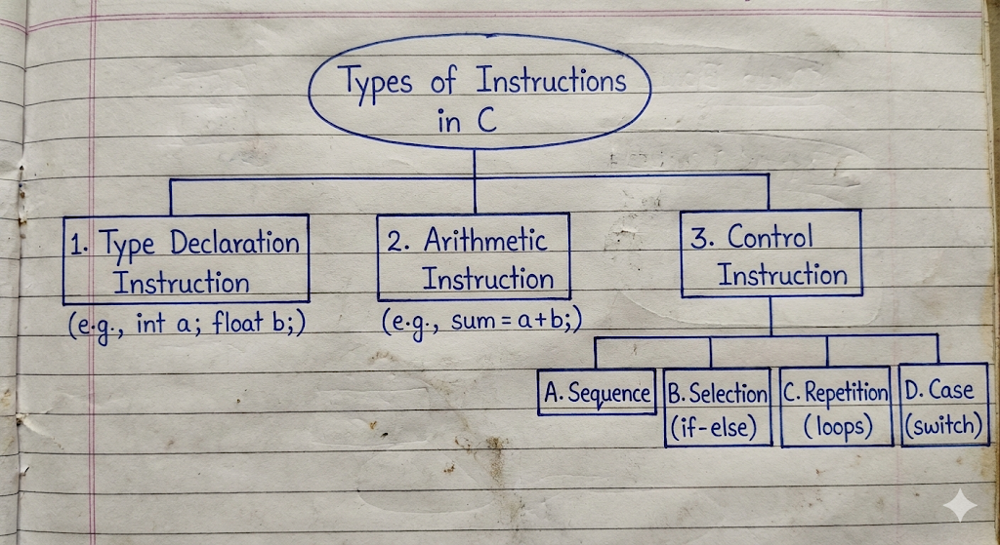

# Introduction to C

## Comparison: Structured vs Unstructured Programming 

??? "**Comparison: Structured vs Unstructured Programming** " 

    

    To understand why C is called a structured language, let us look at two examples performing the same task: **Printing numbers from 1 to 5.**

    ### **1. Unstructured Approach (Using `goto`)**

    In the early days (BASIC, Assembly), programmers used `goto` statements to jump (লাফানো) from one line to another. This creates "Spaghetti Code" which is very confusing.

    ```c
    // Unstructured Code Example
    #include <stdio.h>

    int main() {
        int i = 1;

        start:              // Label
        printf("%d ", i);
        i++;

        if(i <= 5)
            goto start;     // Jumps back to 'start' label

        return 0;
    }

    ```

    * **Problem:** If the program is big, jumping back and forth makes it hard to understand the flow (প্রবাহ).

    ### **2. Structured Approach (Using Loops/Functions)**

    In C, we use specific structures like `for`, `while`, or separate functions. This makes the code organized.

    ```c
    // Structured Code Example
    #include <stdio.h>

    // Function definition
    void printNumbers(int n) {
        int i;
        for(i = 1; i <= n; i++) {
            printf("%d ", i);
        }
    }

    int main() {
        printNumbers(5);  // Calling the function
        return 0;
    }

    ```

    * **Benefit:** We can clearly see that `printNumbers` is a separate block (ব্লক). If there is an error, we only check that block.

    ### **Key Differences**

    | Feature | Unstructured Programming | Structured Programming (C) |
    | --- | --- | --- |
    | **Logic Flow** | Uses `goto` to jump randomly. | Uses loops and functions. |
    | **Debug** | Difficult to find errors (ত্রুটি). | Easy to find and fix errors. |
    | **Readability** | Confusing and messy. | Clean and easy to read. |
    | **Modification** | Hard to modify (পরিবর্তন করা). | Easy to modify or expand. |


## **Difference between Variable and Constant**

??? "**Difference between Variable and Constant**"

    **Ans to the Question** 

    In C programming, both variables and constants are used to store data, but they behave differently during the execution (সম্পাদন) of the program.

    | Basis of Difference | Variable (চলক) | Constant (ধ্রুবক) |
    | --- | --- | --- |
    | **Definition** | A variable is a named memory location where data is stored, and its value (মান) can be changed during program execution. | A constant is a fixed value that does not change during the execution of the program. |
    | **Changeability** | The value of a variable can be modified (পরিবর্তন করা) multiple times. | Once defined, the value of a constant cannot be modified. |
    | **Declaration** | We declare it using data types like `#!c int a;` | We declare it using the `const` keyword or `#define` preprocessor. |
    | **Example** | `#!c int mark = 50; mark = 60;` (Valid) | `#!c const float PI = 3.14;` <br> `#!c PI = 3.15;` (Invalid/Error) <br> `#!c #define PI 3.14159 // Defining a symbolic constant PI` <br> `#!c #define MESSAGE "Hello, World!" // Defining a string constant` |

    ### **Rules for Variable Name**

    In C, variables are also known as Identifiers (শনাক্তকারী). We must follow specific rules while naming a variable. If we violate these rules, the compiler (কম্পাইলার) will show an error.

    **The rules are as follows:**

    1. **First Character:**
    A variable name must begin with an alphabet (letter) (uppercase A-Z or lowercase a-z) or an underscore `_`. It cannot start with a digit (অংক).
    * *Valid:* `age`, `_total`, `mark1`
    * *Invalid:* `1stRank` (Starts with a number)


    2. **Allowed Characters:**
    A variable name can consist of letters, digits, and underscores only. No other special characters (বিশেষ অক্ষর) like `@`, `$`, `%`, etc., are allowed.
    * *Invalid:* `user@name`, `price$`


    3. **No Keywords:**
    We cannot use C Keywords (reserved words) as variable names because they have special meaning to the compiler.
    * *Invalid:* `int`, `float`, `for`, `if`, `while`


    4. **No White Space:**
    Blank spaces (ফাঁকা স্থান) are not allowed within a variable name.
    * *Valid:* `student_name`
    * *Invalid:* `student name`


    5. **Case Sensitivity:**
    C is a case-sensitive language. This means uppercase and lowercase letters are treated as different.
    * *Example:* `SUM`, `sum`, and `Sum` are three different variables.


    6. **Length:**
    Although there is no strict limit, ANSI C recognizes the first 31 characters of a variable name. It is good practice to keep the name meaningful and short.


### **Identification of Syntax Errors**
??? "Fixing a buggy program"

    **Ans to the Q1(d)**


    Upon analyzing the given program code, the following Syntax Errors (সিনট্যাক্স ত্রুটি) or grammatical mistakes are identified:

    1. **Missing Header File:** The program uses the `printf` function to display output, but the standard input-output library `#include <stdio.h>` is missing at the top.
    2. **Missing Semicolons:** In C language, every executable statement must end with a semicolon `;`. It is missing in three places:
    * After the declaration `float perimeter, area`
    * After the assignment `radious = 5`
    * After the `printf` statement.


    ### **Corrected Program**

    Here is the code after fixing all the errors.

    ```c
    #include <stdio.h>   // Included header file
    #define PI 3.14  

    int main()  
    {  
    int radious;  
    float perimeter, area;  // Added semicolon
    
    radious = 5;            // Added semicolon
    
    perimeter = 2.0 * PI * radious;  
    area = PI * radious * radious;  
    
    printf("%f, %f", perimeter, area);  // Added semicolon
    
    return 0;  
    }

    ```

    ### **Output**

    When we execute (চালনা করা) the corrected program, the computer performs the following calculations:

    * **Perimeter:** 
    * **Area:** 

    Since the variables are of `float` data type, the `printf` function with `%f` specifier usually prints up to 6 decimal places by default.

    **The final output will be:**

    ```
    31.400000, 78.500000

    ```
## Tokens, Keywords, Identifiers, and Variables in C

??? "Tokens, Keywords, Identifiers, and Variables in C"

    Q: **Elaborate in detail on Tokens, Keywords, Identifiers, and Variables in C. Differentiate between them with a comprehensive comparison table.**

    ---

    ### **Introduction**

    To understand the C programming language, we must first understand its smallest building blocks. Just as a paragraph is made of sentences, and sentences are made of words, a C program is constructed using various elements like Tokens, Keywords, Identifiers, and Variables.

    ### **1. Tokens**

    **Definition:**
    A Token (টোকেন) is the smallest individual unit in a C program that the Compiler (কম্পাইলার) can understand. When we compile a program, the compiler breaks the entire code into these small units for processing. It is the basic vocabulary of the language.

    **Classification of Tokens:**
    C supports six types of tokens:

    1. **Keywords:** (`int`, `while`, `continue`)
    2. **Identifiers:** (`main`, `amount`, `total`)
    3. **Constants:** Fixed values like `100`, `3.14`, `'A'`.
    4. **Strings:** Sequence of characters like `"Hello World"`.
    5. **Special Symbols:** Punctuation like `;`, `{}`, `()`, `#`.
    6. **Operators:** Symbols that perform operations like `+`, `-`, `*`, `++`.
    
    **Example:**

    ```c
    int x = 10;

    ```

    This single line consists of 5 tokens:

    1. `int` (Keyword)
    2. `x` (Identifier)
    3. `=` (Operator)
    4. `10` (Constant)
    5. `;` (Special Symbol)

    ### **2. Keywords**

    **Definition:**
    Keywords (সংরক্ষিত শব্দ) are reserved words that have a fixed, pre-defined meaning in the C language. We cannot change their meaning, nor can we use them as names for variables or functions.

    **Key Characteristics:**

    * **Case Sensitivity:** All keywords must be written in Lowercase (ছোট হাতের অক্ষর).
    * **Total Count:** There are 32 standard keywords in ANSI C.
    * **Functionality:** They define the flow and structure of the program.

    **Examples:**

    * **Data Types:** `int`, `char`, `float`, `double`, `void`.
    * **Control Flow:** `if`, `else`, `switch`, `case`, `default`.
    * **Loops:** `for`, `while`, `do`.
    * **Storage Classes:** `auto`, `static`, `register`, `extern`.

    ### **3. Identifiers**

    **Definition:**
    Identifiers (শনাক্তকারী/নামকরণ) are the names given by the programmer to various program elements such as Variables (চলক), Functions (ফাংশন), Arrays, and Structures. They help in identifying a specific entity uniquely during the Execution (নির্বাহ) of the program.

    **Rules for Naming Identifiers:**

    1. **Start:** Must start with a letter (A-Z or a-z) or an underscore `_`.
    2. **Digits:** Can contain digits (0-9) but cannot start with one.
    3. **Special Characters:** No special characters allowed except underscore.
    4. **Keywords:** Keywords cannot be used as identifiers.
    5. **Length:** ANSI C recognizes the first 31 characters.

    **Valid vs Invalid Examples:**

    * `myVariable` (Valid)
    * `_score` (Valid)
    * `9thClass` (Invalid - starts with digit)
    * `roll number` (Invalid - contains space)

    ### **4. Variables**

    **Definition:**
    A Variable is a specific type of identifier. It is a named memory location used to store data. The value stored in a variable can be changed or modified (পরিবর্তন করা) during the program execution.

    **Declaration and Initialization:**

    * **Declaration:** Tells the compiler the variable's name and data type.
    * *Syntax:* `data_type variable_name;`


    * **Initialization:** Assigning a value to the variable.
    * *Syntax:* `variable_name = value;`


    **Scope of Variables:**

    * **Local Variables:** Declared inside a function block.
    * **Global Variables:** Declared outside all functions.

    ### **Detailed Comparison Table**

    Here is the comparison distinguishing all four concepts.

    | Basis of Difference | Token | Keyword | Identifier | Variable |
    | --- | --- | --- | --- | --- |
    | **Definition** | The smallest individual unit of a program. | Reserved words with fixed meanings. | User-defined names given to program elements. | A named memory location to store data. |
    | **Category/Relation** | It is the Super Set (everyone belongs here). | It is a type of Token. | It is a type of Token. | It is a type of Identifier (and thus a Token). |
    | **Creation** | Created by the compiler parsing the text. | Pre-defined by the language developers. | Defined by the Programmer (User). | Defined by the Programmer (User). |
    | **Meaning** | Depends on the type of token. | Has a fixed, special meaning. | Has no specific meaning until defined. | Holds a value that signifies data. |
    | **Changeability** | N/A | Cannot be changed. | Name is fixed once defined. | Value can be changed frequently. |
    | **Allowed Characters** | Varies (e.g., Operators use symbols). | Only English letters (lowercase). | Letters, digits, and underscore `_`. | Letters, digits, and underscore `_`. |
    | **Usage** | Building block of code. | Defines structure (syntax). | Identifies entities (Labeling). | Stores actual data values. |
    | **Examples** | `int`, `main`, `{`, `+`, `100` | `if`, `while`, `return`, `const` | `total`, `avg`, `calculate_sum` | `salary`, `age`, `marks` |

    ### **Sample Program Analysis**

    To summarize, let us look at a small code snippet to identify these parts.

    ```c
    int total = 100;

    ```

    * **Tokens:** There are 5 tokens (`int`, `total`, `=`, `100`, `;`).
    * **Keyword:** `int` is the keyword indicating integer type.
    * **Identifier:** `total` is the identifier (name).
    * **Variable:** `total` is also the variable because it occupies memory to store the value.
    * **Constant:** `100` is a constant value.

    In conclusion, while all Keywords, Identifiers, and Variables are Tokens, they serve very different purposes in constructing a structured C program.

## `#!c #include` directive

??? "`#!c #include` directive"

    **Question:**
    **Explain the `#!c #include` Directive in detail. Discuss its syntax, types, and how it works in the C compilation process.**

    ---

    ### **Introduction to `#!c #include` Directive**

    The `#!c #include` directive is one of the most important and commonly used Preprocessor Directives (প্রিপ্রসেসর নির্দেশাবলী) in C programming. It is not a C statement but a command given to the Preprocessor (প্রিপ্রসেসর).

    Before the actual Compilation (কম্পাইলেশন) starts, the preprocessor processes this directive. Its main job is to insert or copy the entire content of a specific file (usually a Header File) into the source program at the point where the `#!c #include` line is written.

    ### **Purpose of `#!c #include`**

    The primary purpose of the `#!c #include` directive is to allow a program to access functions and variables defined in external files or Standard Libraries (স্ট্যান্ডার্ড লাইব্রেরি).
    For example, to use the `printf()` function, we must include the `stdio.h` file because the definition of `printf` is written inside it.

    ### **Syntax**

    The `#!c #include` directive can be written in two different ways depending on where the file is located.

    **Syntax 1:**

    ```c
    #include <filename>

    ```

    **Syntax 2:**

    ```c
    #include "filename"

    ```

    ### **Types of `#!c #include` Formats**

    Although both formats perform the same task of including a file, the difference lies in **where** the preprocessor looks for the file.

    **1. Angle Brackets `< >` Format:**

    * **Usage:** `#!c #include <stdio.h>`
    * **Search Path:** When we use angle brackets, the preprocessor searches for the file only in the **Standard System Directories** (সিস্টেম ডিরেক্টরি). These are the folders where the compiler's built-in library files are installed.
    * **Use Case:** This is used for standard header files like `stdio.h`, `math.h`, `string.h`, etc.

    **2. Double Quotes `" "` Format:**

    * **Usage:** `#!c #include "myheader.h"`
    * **Search Path:** When we use double quotes, the preprocessor first searches for the file in the **Current Directory** (বর্তমান ডিরেক্টরি) where the source code is saved. If it does not find the file there, it then searches in the standard system directories.
    * **Use Case:** This is mainly used for **User-Defined** header files (files created by the programmer).

    ### **How `#!c #include` Works (The Process)**

    When we write a program, the compilation process happens in steps. The `#!c #include` directive is handled during the "Preprocessing" stage.

    1. The preprocessor scans the source code (উৎস কোড).
    2. When it finds an `#!c #include` line, it locates the specified file.
    3. It removes the `#!c #include` line and replaces it with the actual text/code contained inside that header file.
    4. The final code (which is now larger) is then sent to the Compiler.

    ### **Example Program**

    Here is a sample program demonstrating both types of includes.

    **File 1: `myfuncs.h` (User Defined File)**

    ```c
    // This is a custom header file
    int add(int a, int b) {
        return a + b;
    }

    ```

    **File 2: `main.c` (Main Program)**

    ```c
    #include <stdio.h>      // Standard Library include
    #include "myfuncs.h"    // User-defined include

    int main() {
        int sum = add(10, 20); // Calling function from myfuncs.h
        printf("The sum is: %d", sum); // Using function from stdio.h
        return 0;
    }

    ```

    ### **Why is it important?**

    * **Reusability (পুনর্ব্যবহারযোগ্যতা):** We can write a useful function once in a header file and use it in many programs using `#include`.
    * **Organization:** It helps in keeping the code clean by separating complex logic into different files.
    * **Standardization:** It provides access to the powerful set of C standard libraries.

    In conclusion, the `#include` directive is the bridge between our program and the vast resources available in C libraries.

## Precedence of Operators

??? "Precedence of Operators"


    ### **Introduction to Precedence of Operators**

    In C programming, an expression (রাশিমালা) often contains multiple operators. The **Precedence of Operators** (অপারেটর অগ্রাধিকার) determines which operator determines the grouping of terms in an expression. It decides which operation is performed first when there are mixed operators.

    Just like in Mathematics we follow the BODMAS rule, in C language we follow the Operator Precedence table. Operators with higher precedence are evaluated (মূল্যায়ন করা) before operators with lower precedence.

    ### **Hierarchy of Precedence (Higher to Lower)**

    Below is the segmented classification of operators based on their priority levels. The flow goes from Highest Precedence (top) to Lowest Precedence (bottom).

    #### **1. Unary Operators (Highest Priority)**

    These operators have the highest precedence among arithmetic and logical operators. They are evaluated first.

    * **Associativity:** Right to Left (ডান থেকে বামে)
    * **Operators:**
    * `++` (Increment)
    * `--` (Decrement)
    * `!` (Logical NOT)
    * `~` (Bitwise NOT)
    * `-` (Unary Minus)
    * `sizeof`


    #### **2. Arithmetic Operators**

    After handling unary operators, the compiler looks for arithmetic operators. Inside this category, there is also a split in priority.

    * **Level 2A: Multiplicative** (Higher within Arithmetic)
    * **Associativity:** Left to Right
    * **Operators:** `*`, `/`, `%`


    * **Level 2B: Additive** (Lower within Arithmetic)
    * **Associativity:** Left to Right
    * **Operators:** `+`, `-`


    * *Note:* Multiplication and Division happen before Addition and Subtraction.
    

    #### **3. Shift Operators**

    These are used to shift bits.

    * **Associativity:** Left to Right
    * **Operators:** `<<`, `>>`

    #### **4. Relational Operators**

    These operators are used for comparison (তুলনা). They have lower precedence than arithmetic operators.

    * **Level 4A: Inequality**
    * **Associativity:** Left to Right
    * **Operators:** `<`, `<=`, `>`, `>=`


    * **Level 4B: Equality**
    * **Associativity:** Left to Right
    * **Operators:** `==`, `!=`


    #### **5. Bitwise Operators**

    These work on individual bits. They are evaluated after relational operators.

    * **Associativity:** Left to Right
    * **Operators:**
    * `&` (Bitwise AND) - Higher
    * `^` (Bitwise XOR) - Medium
    * `|` (Bitwise OR) - Lower


    #### **6. Logical Operators**

    These are used to combine conditions. They have lower precedence than bitwise operators.

    * **Level 6A: Logical AND**
    * **Associativity:** Left to Right
    * **Operator:** `&&`


    * **Level 6B: Logical OR**
    * **Associativity:** Left to Right
    * **Operator:** `||`


    * *Important:* `&&` is always evaluated before `||`.

    #### **7. Ternary Operator**

    This is the conditional operator.

    * **Associativity:** Right to Left
    * **Operator:** `? :`

    #### **8. Assignment Operators (Lowest Priority)**

    These are evaluated last, meaning the result is assigned (বরাদ্দ করা) only after all calculations are done.

    * **Associativity:** Right to Left
    * **Operators:** `=`, `+=`, `-=`, `*=`, `/=`, etc.

    ---

    ### **Summary Table of Precedence**

    | Rank | Operator Category | Operators | Associativity |
    | --- | --- | --- | --- |
    | 1 | **Unary** | `++`, `--`, `!`, `sizeof` | Right to Left |
    | 2 | **Arithmetic (Multiplicative)** | `*`, `/`, `%` | Left to Right |
    | 3 | **Arithmetic (Additive)** | `+`, `-` | Left to Right |
    | 4 | **Relational** | `<`, `>`, `<=`, `>=` | Left to Right |
    | 5 | **Equality** | `==`, `!=` | Left to Right |
    | 6 | **Logical AND** | `&&` | Left to Right |
    | 7 | **Logical OR** | ` |  |
    | 8 | **Conditional** | `? :` | Right to Left |
    | 9 | **Assignment** | `=`, `+=`, `-=` | Right to Left |
    | 10 | **Comma** | `,` | Left to Right |

    ---

    ### **Example of Evaluation**

    Let us consider an expression to understand how precedence works.

    **Expression:**
    `x = 10 + 20 * 5;`

    **Step-by-Step Execution:**

    1. Here we have `+` (Addition), `*` (Multiplication), and `=` (Assignment).
    2. According to precedence, `*` is higher than `+`.
    3. So, `20 * 5` is calculated first. Result is `100`.
    4. Now the expression becomes `x = 10 + 100`.
    5. Next, `+` is evaluated. `10 + 100` becomes `110`.
    6. Finally, `=` has the lowest precedence, so `110` is assigned to `x`.

    **Result:** `x = 110`

## Data Types

??? "Data Types"

    **Ans to the Question**

    ### **Definition of Data Type**

    A **Data Type** in C programming specifies the type of data that a variable (চলক) can store. It tells the Compiler (কম্পাইলার) two main things:

    1. How much **Memory** (মেমরি) or storage space is to be allocated for the variable.
    2. How the stored bit pattern should be interpreted or processed.

    Every variable in C must have a data type associated with it. For example, if we want to store a student's roll number, we use an integer type, but if we want to store their percentage, we use a float type.

    ### **Classification of Data Types**

    C language provides a rich set of data types. They are broadly classified into three main categories as shown in the chart below.

    **1. Primary (Built-in) Data Types:** These are the fundamental data types provided by C.
    **2. Derived Data Types:** These are derived from the primary data types (like Arrays, Pointers).
    **3. User-Defined Data Types:** These are defined by the programmer (like Structure, Union, Enum).

    ---

    ### **Detailed Explanation of Primary Data Types**

    The Primary or Basic data types are the most commonly used types. Here is the explanation of each with examples.

    #### **1. Integer (`int`)**

    The `int` keyword is used to declare integer variables. It stores whole numbers (পূর্ণসংখ্যা) without any decimal or fractional parts.

    * **Memory Size:** Usually 2 bytes or 4 bytes (depends on the processor/compiler).
    * **Range:** -32,768 to 32,767 (for 2 bytes).
    * **Format Specifier:** `%d`
    * **Qualifiers:** We can modify the size and range using qualifiers like `short`, `long`, `signed`, and `unsigned`.

    **Example Code:**

    ```c
    int age = 21;
    printf("My age is %d", age);

    ```

    #### **2. Floating Point (`float`)**

    The `float` keyword is used to store decimal numbers or real numbers. It is used when we need precision (নির্ভুলতা) or fractional values. It typically provides 6 digits of precision.

    * **Memory Size:** 4 bytes.
    * **Format Specifier:** `%f`

    **Example Code:**

    ```c
    float marks = 85.50;
    printf("My marks: %f", marks);

    ```

    #### **3. Double (`double`)**

    The `double` data type is similar to `float` but it provides **Double Precision**. It is used when we need to store very large decimal numbers with higher accuracy (up to 15 digits).

    * **Memory Size:** 8 bytes.
    * **Format Specifier:** `%lf`

    **Example Code:**

    ```c
    double pi = 3.1415926535;
    printf("Value of PI: %lf", pi);

    ```

    #### **4. Character (`char`)**

    The `char` keyword is used to store a single character (অক্ষর). In C, characters are enclosed in single quotes like `'A'`. Internally, the computer stores the ASCII value (an integer) of that character.

    * **Memory Size:** 1 byte.
    * **Format Specifier:** `%c`

    **Example Code:**

    ```c
    char grade = 'A';
    printf("Your grade is %c", grade);

    ```

    #### **5. Void (`void`)**

    The `void` data type means "nothing" or "no value". It is generally used with functions (ফাংশন) to specify that the function does not return (ফেরত দেওয়া) any value. We cannot create a variable of type `void`.

    **Example Code:**

    ```c
    void display() {
        printf("This function returns nothing.");
    }

    ```

    ---

    ### **Brief on Derived and User-Defined Types**

    Since this is a comprehensive question, we must also mention these types.

    **Derived Data Types:**
    These are built by combining basic data types.

    * **Arrays:** A collection of variables of the same type. Example `int numbers[5];`
    * **Pointers:** Variables that store the address (ঠিকানা) of another variable.

    **User-Defined Data Types:**
    These allow programmers to define their own custom types.

    * **Structure (`struct`):** Can store variables of different data types under one name.
    * **Union:** Similar to structure but shares the same memory location.
    * **Enumeration (`enum`):** Used to assign names to integral constants.

    ### **Summary Table**

    | Data Type | Keyword | Size (Typical) | Format Specifier | Use |
    | --- | --- | --- | --- | --- |
    | Integer | `int` | 4 bytes | `%d` | Counting, whole numbers |
    | Floating Point | `float` | 4 bytes | `%f` | Average, Percentage |
    | Double | `double` | 8 bytes | `%lf` | High precision calculation |
    | Character | `char` | 1 byte | `%c` | Grades, Symbols |

    In conclusion, choosing the correct data type is essential for Memory Management (মেমরি ব্যবস্থাপনা) and the correct execution of the program.

## **Briefly describe the types of instruction in C.**

??? "Instruction in C."

    **Question:**
    **Briefly describe the types of instruction in C.**

    ---

    ### **Introduction**

    In C programming, an Instruction (নির্দেশনা) is a command or statement given to the computer to perform a specific task. When we write a C program, it is basically a collection of instructions. The Compiler (কম্পাইলার) reads these instructions and translates them into machine language so the computer can execute (সম্পাদন) them.

    C instructions can be broadly classified into three main categories based on the type of work they perform.

    ### **1. Type Declaration Instruction**

    This is the first type of instruction used in C programs. To store any data in the memory (মেমরি), we must first declare the type of the variable. The Type Declaration Instruction is used to declare the type of variables (চলক) used in the program.

    * **Purpose:** It tells the compiler the name of the variable and the type of data it will hold.
    * **Rule:** All type declaration instructions must be written at the beginning of the `main()` function or before using the variable.
    * **Syntax:** `data_type variable_name;`
    * **Example:**
    ```c
    int roll_number;
    float marks;
    char grade;

    ```


    Here, `roll_number` is declared as an integer, `marks` as a float, and `grade` as a character.

    ### **2. Arithmetic Instruction**

    After declaring variables, we often need to process data. The Arithmetic Instruction (গাণিতিক নির্দেশনা) is used to perform arithmetic operations on constants and variables. These instructions are performed using arithmetic operators like `+`, `-`, `*`, `/`.

    * **Execution:** These instructions are executed by the ALU (Arithmetic Logic Unit) of the CPU.
    * **Structure:** It consists of a variable name on the left hand side and an expression (রাশিমালা) on the right hand side.
    * **Syntax:** `variable = expression;`
    * **Example:**
    ```c
    int a = 10, b = 20, sum;
    sum = a + b;

    ```


    Here, `a + b` is an arithmetic instruction that calculates the sum and stores it in the variable `sum`.

    ### **3. Control Instruction**

    By default, a C program executes instructions sequentially, meaning one line after another. However, sometimes we need to change this order or repeat some lines. The Control Instruction (নিয়ন্ত্রণ নির্দেশনা) is used to control the flow of execution of the program.

    Control instructions determine the order in which other statements are executed. They are further divided into four types:

    **A. Sequence Control Instruction:**
    This ensures that the instructions are executed in the same order (ক্রম) in which they appear in the program. This is the default behavior.

    **B. Selection or Decision Control Instruction:**
    These instructions allow the computer to take a decision (সিদ্ধান্ত) based on a condition. If the condition is true, one block of code runs; if false, another block runs.

    * **Examples:** `if`, `if-else`, `conditional operators`.

    **C. Repetition or Loop Control Instruction:**
    These instructions help us to execute a part of the program multiple times repeatedly (পুনরাবৃত্তিমূলকভাবে). Instead of writing the same code again and again, we use loops.

    * **Examples:** `for` loop, `while` loop, `do-while` loop.

    **D. Case Control Instruction:**
    This is used when we have multiple choices and we need to select one specific choice. It is generally used to create menus.

    * **Examples:** `switch` statement, `case`.

    ### **Conclusion**

    To write any meaningful C program, we need to use a combination of these three instructions. We start with Type Declaration to set up memory, use Arithmetic Instructions to calculate values, and use Control Instructions to manage the logic flow.
    
    