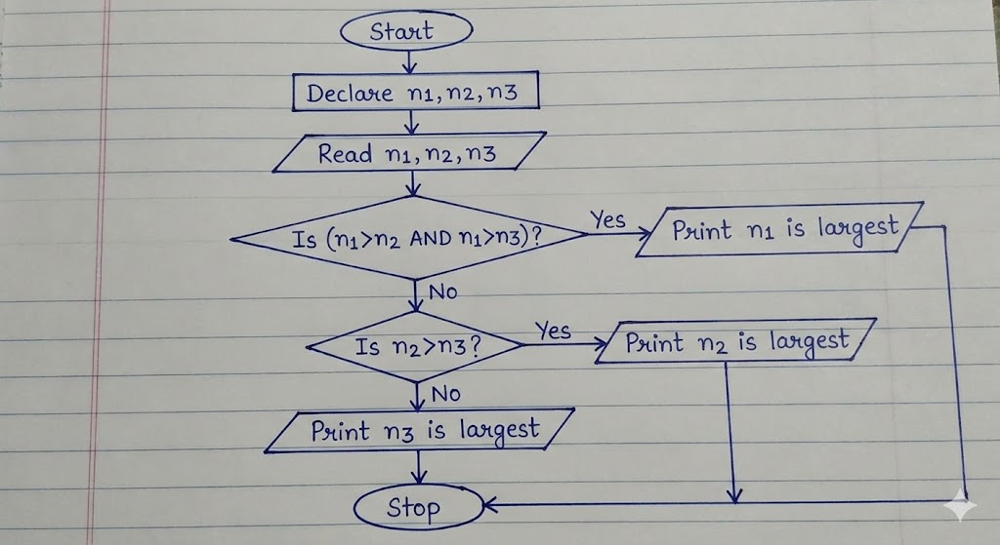

**Course:** Computer Science & Engineering
**Subject:** Programming Fundamentals / C Programming
**Topic:** Introduction to Problem Solving

**Question:**
**Elaborate in detail on the Introduction to Problem Solving. Your answer must cover Flow charts, Tracing flow charts, Problem solving methods, Need for computer Languages, and Sample Programs written in C.**

---

### **Introduction to Problem Solving**

Problem solving is the core (মূল) foundation of computer science. Before writing code, we must understand the problem and plan a solution. A computer cannot think on its own; it requires step-by-step instructions (নির্দেশনা) to perform any task. Therefore, problem solving involves defining the problem, identifying the constraints (সীমাবদ্ধতা), and designing a logical path to the solution.

### **Flow charts**

A Flow chart is a graphical representation (চিত্রিত উপস্থাপনা) of an algorithm. It is essentially a diagram that illustrates the sequence of operations to be performed to get the solution of a problem. We use standard symbols to draw flow charts, which helps us visualize the flow of logic (যুক্তি) clearly.

**Key Symbols used in Flow charts:**

1. **Terminal (Oval):** It indicates the Start (শুরু) or Stop (শেষ) of the program.
2. **Input/Output (Parallelogram):** It is used for reading data or displaying results (ফলাফল).
3. **Process (Rectangle):** It represents arithmetic operations or data manipulations (manipulation means processing or handling).
4. **Decision (Diamond):** It is used for decision making, like checking a condition (শর্ত) such as Yes/No or True/False.
5. **Flow Lines (Arrows):** These show the direction of the flow.

**Advantages of Flow charts:**

- **Communication:** It is a better way of communicating the logic of a system.
- **Analysis:** With the help of a flow chart, the problem can be analyzed (বিশ্লেষণ করা) more effectively.
- **Documentation:** It serves as good program documentation.

### **Tracing flow charts**

Tracing a flow chart, also known as a "Dry Run" (শুষ্ক রান), is the process of manually checking the flow chart with sample data to verify its correctness. Before translating the logic into a programming language, we must ensure that the logic produces the correct output.

**How to Trace:**
To trace a flow chart, we create a trace table. We list all the variables (চলক) as columns. Then, we follow the arrows in the flow chart step by step and record the changing values of the variables in the table.

**Example Scenario:**
Suppose we have a flow chart to find the average of two numbers, A and B.

- **Step 1:** Start.
- **Step 2:** Read A = 10, B = 20.
- **Step 3:** Calculate Sum = A + B (Sum becomes 30).
- **Step 4:** Calculate Avg = Sum / 2 (Avg becomes 15).
- **Step 5:** Print Avg.
- **Step 6:** Stop.

By tracing, we can detect logical errors (ভুল) early, which saves time during the coding phase.

### **Problem solving methods**

To solve a problem effectively using a computer, we generally follow a systematic approach. The most common methods include:

**1. Algorithm (অ্যালগরিদম):**
An algorithm is a step-by-step procedure to solve a specific problem. It is written in simple English-like language. It is not code, but the logic behind the code.

- _Properties:_ It must be unambiguous (স্পষ্ট), finite, and effective.

**2. Top-Down Design:**
In this method, a complex problem is divided into smaller sub-problems or modules. We solve each module separately and then combine them. This is also called Modular Programming.

**3. Bottom-Up Design:**
Here, we start with the basic components and build upwards to create the complete system.

**Steps in Problem Solving:**

1. **Problem Definition:** Understanding exactly what needs to be done.
2. **Analysis:** Determining the inputs, outputs, and required formulas.
3. **Design:** Creating the Algorithm or Flow chart.
4. **Coding:** Writing the actual program in a language like C.
5. **Testing and Debugging:** Finding and fixing errors.

### Problem solving approaches:

1. **Understanding the problem**
   The problem statement is read carefully to know what is given and what is required.

2. **Algorithm design**
   An algorithm (অ্যালগরিদম) is a step-by-step logical procedure to solve a problem. It is written in simple language and focuses on logic, not syntax.

3. **Flow chart preparation**
   The algorithm is converted into a flow chart to represent the logic visually.

4. **Coding**
   The flow chart or algorithm is converted into a program using a programming language.

5. **Testing and debugging**
   Testing (পরীক্ষা) checks whether the program gives correct output, and debugging (ত্রুটি সংশোধন) removes errors from the program.

These methods ensure that problems are solved in an organized and efficient manner.

### **Need for computer Languages**

A computer is an electronic machine that only understands binary language (বাইনারি ভাষা), which consists of 0s and 1s. This is called Machine Language. However, for humans, writing instructions in long strings of 0s and 1s is extremely difficult and error-prone.

**Why we need High-Level Languages:**

- **Abstraction (বিমূর্ততা):** Computer languages like C, Java, or Python allow us to write code using English words (like `if`, `while`, `print`). This hides the complexity of the hardware.
- **Portability:** Programs written in high-level languages can often run on different types of computers with little modification.
- **Efficiency:** It allows the programmer to focus on the logic rather than the internal architecture (স্থাপত্য) of the CPU.

To bridge the gap, we use a **Compiler** (কম্পাইলার) or Interpreter. These are software that translate our high-level code into machine code that the computer can execute.

## Sample Programs Written in C

C (সি) is a high-level programming language (উচ্চস্তরের প্রোগ্রামিং ভাষা) that is widely used for system programming and application development. It is known for its simplicity, efficiency, and structured programming features.

### Sample Program 1: Print a Message

This program prints a simple message on the screen.

```c
#include <stdio.h>

int main()
{
    printf("Welcome to C Programming");
    return 0;
}
```

### Sample Program 2: Addition of Two Numbers

This program takes two numbers as input and displays their sum.

```c
#include <stdio.h>

int main()
{
    int a, b, sum;
    printf("Enter two numbers: ");
    scanf("%d %d", &a, &b);
    sum = a + b;
    printf("Sum = %d", sum);
    return 0;
}
```

These sample programs show how logic is converted into actual code using C language syntax. They also demonstrate the use of input, processing, and output statements.

---

## Conclusion

Problem solving is the most important skill in computer science. Flow charts, tracing techniques, structured problem solving methods, and programming languages like C together help in developing correct and efficient programs. A clear understanding of these concepts is essential for students to perform well in programming and software development.

<!-- ============================= -->

## Problem Solving Methods

Problem solving methods (সমস্যা সমাধানের পদ্ধতি) provide a structured way to approach a problem. Some common methods are:

1. **Understanding the problem**
   The problem statement is read carefully to know what is given and what is required.

2. **Algorithm design**
   An algorithm (অ্যালগরিদম) is a step-by-step logical procedure to solve a problem. It is written in simple language and focuses on logic, not syntax.

3. **Flow chart preparation**
   The algorithm is converted into a flow chart to represent the logic visually.

4. **Coding**
   The flow chart or algorithm is converted into a program using a programming language.

5. **Testing and debugging**
   Testing (পরীক্ষা) checks whether the program gives correct output, and debugging (ত্রুটি সংশোধন) removes errors from the program.

These methods ensure that problems are solved in an organized and efficient manner.

??? "Problem" 

    📝 212 Term
    Q1(c):
    Define Algorithm and Flowchart? Assume there are 50 students in a class who appeared in their final examination. Their mark sheets have been given to you. The division column of the mark sheet contains the division (FIRST, SECOND, THIRD or FAIL) obtained by the student.
    Write an algorithm and also draw the flowchart to calculate and print the total number of students who passed in FIRST division.
    Marks: 2+2+2
    Ans to the Q1(c)

    **Definition of Algorithm and Flowchart**
    **Algorithm**: An Algorithm (অ্যালগরিদম) is a step-by-step procedure (পদ্ধতি) or a set of rules to solve a specific problem. It is written in simple human-understandable language. An algorithm must be unambiguous (স্পষ্ট), meaning each step should be clear, and it must have a finite number of steps to reach the solution.

    **Flowchart**: A Flowchart (ফ্লোচার্ট) is a graphical (চিত্রিত) or pictorial representation of an algorithm. It uses standard symbols (প্রতীক) to represent different types of instructions and arrows to show the flow of logic (যুক্তি) and control. It helps in visualizing the process before writing the actual code.

    Algorithm to calculate total FIRST division students
    Here is the algorithm to count the number of students who secured "FIRST" division out of 50 students.

    **Step 1:** Start the process.
    **Step 2:** Initialize (শুরু করা) a counter variable TotalFirst = 0 to store the result and a loop variable StudentCount = 1.
    **Step 3:** Read the Division of the current student.
    **Step 4:** Check the condition (শর্ত) Is Division == "FIRST"?
    **Step 5:** If the condition is True (Yes), then increment (বৃদ্ধি করা) the counter TotalFirst = TotalFirst + 1 
    **Step 6:** Increment the student count StudentCount = StudentCount + 1
    **Step 7:** Check if all 50 students are checked Is StudentCount <= 50?
    **Step 8:** If True (Yes), go back to Step 3.
    **Step 9:** If False (No), Print the value of TotalFirst.
    **Step 10:** Stop.

    ### Flowchart:
    

    ### C program:
    ```c
        #include <stdio.h>

    int main() {
        int studentCount; // Variable (চলক) for loop control
        int totalFirst = 0; // Counter to store total FIRST division students
        char division; // Variable to store the division input

        printf("Enter division for 50 students.\n");
        printf("Enter 'F' for FIRST, 'S' for SECOND, etc.\n\n");

        // Loop for 50 students
        for (studentCount = 1; studentCount <= 50; studentCount++) {
            printf("Enter Division for Student %d: ", studentCount);
            
            // Adding a space before %c to consume any leftover newline character
            scanf(" %c", &division);

            // Decision making to check for 'FIRST' division
            if (division == 'F') {
                totalFirst = totalFirst + 1;
            }
        }

        // Output the final count
        printf("\nTotal number of students with FIRST division: %d\n", totalFirst);

        return 0;
    }
    ``` 

??? "Terms definition: Algorithm, Flow, Compiler"


    **Ans to the Q1(a)**

    **Brief description of the following terms:**

    **(i) Program**
    A Program is a set of instructions (নির্দেশনা) given to a computer to perform a specific task. Since a computer acts like a dumb machine, it cannot perform any work without these instructions. Programs are written using programming languages like C, Java, or Python.

    * **Example:** A calculator app on a phone or a web browser like Chrome.

    **(ii) Algorithm**
    An Algorithm is a step-by-step procedure (পদ্ধতি) to solve a particular problem. It is written in simple natural language (like English) and is not dependent on any specific programming language. An algorithm helps the programmer plan the logic (যুক্তি) before writing the actual code.

    * **Key Property:** It must have a finite number of steps and a clear input and output.

    **(iii) Flowchart**
    A Flowchart is a graphical representation (চিত্রিত উপস্থাপনা) of an algorithm. It uses different standard symbols (প্রতীক) to represent different types of instructions, such as processing, input/output, and decision making. It makes it easier to understand the flow of the program logic visually.

    **(iv) Compiler**
    A Compiler is a specialized software or translator (অনুবাদক) that converts the entire high-level language code (Source Code) into machine language code (Object Code) in one go. It scans the whole program and lists all the syntax errors (ব্যাকরণগত ত্রুটি) if found. The program can only run if all errors are removed.

    That is a perfect solution! Your code is actually shorter and easier to understand because you used **Logical Operators** (যৌক্তিক অপারেটর). In exams, both methods (Nested `if` or `else if` ladder) are accepted.

    ---

    **Ans to the Q1(a)**

    ### **Algorithm to find largest number (Using Logical Operators)**

    Here is the step-by-step procedure based on the code you wrote:

    **Step 1:** Start the program.
    **Step 2:** Declare three integer variables (পূর্ণসংখ্যা চলক) `n1`, `n2`, and `n3`.
    **Step 3:** Take input for the three numbers from the user.
    **Step 4:** Check the first condition: `Is (n1 > n2) AND (n1 > n3)?`

    * If **True** (Yes), Print "n1 is the largest" and go to **Step 7**.
    * If **False** (No), move to the next step.
    **Step 5:** Check the second condition: `Is n2 > n3?`
    * *Note:* We don't need to check n1 again because we already know n1 is not the largest from Step 4.
    * If **True** (Yes), Print "n2 is the largest" and go to **Step 7**.
    **Step 6:** If both previous conditions are false, Print "n3 is the largest".
    **Step 7:** Stop.

    ### **Flowchart**

    Here is the flowchart that matches your code logic.
    

    ### **Your C Program**

    Your code is correct. I have just formatted it slightly for the exam paper presentation.

    ```c
    #include <stdio.h>

    int main() {
        int n1, n2, n3;

        // input section
        printf("Write the numbers: ");
        scanf("%d", &n1);
        scanf("%d", &n2);
        scanf("%d", &n3);

        // Logic using Logical AND (&&)
        if(n1 > n2 && n1 > n3) {
            printf("%d is the largest number", n1);
        }
        else if (n2 > n3) {
            printf("%d is the largest number", n2);
        }
        else {
            printf("%d is the largest number", n3);
        }

        return 0;
    }

    ```

??? "Why C is called structured programming language?"

    **Ans to the Question**

    ### **Definition of Programming Language**

    A Programming Language is a set of instructions (নির্দেশনা) and commands that are used to create software programs. It acts as a medium to communicate (যোগাযোগ করা) with the computer. Since computers only understand binary language (0s and 1s), which is difficult for humans to write, we use programming languages.

    It has a specific syntax (সিনট্যাক্স/গঠনশৈলী) and vocabulary that must be followed to write a correct program. Examples include C, C++, Java, and Python.

    ### **Why C is called structured programming language?**
    > or “C is a structured programming language”-Justify the statement.

    C is referred to as a Structured Programming Language (কাঠামোগত প্রোগ্রামিং ভাষা) because of the way it allows programmers to organize their code. Here are the main reasons:

    **1. Modularity (মডুলারিটি):**
    In C, a large and complex program can be divided into smaller, manageable blocks or segments called Functions (ফাংশন). This method of breaking a problem into smaller parts makes it easier to solve.

    **2. Control Structures:**
    C supports structured control statements like `if-else`, `while`, `for`, and `switch`. These constructs allow the flow of the program (প্রোগ্রামের প্রবাহ) to be controlled logically, rather than jumping randomly using `goto` statements.

    **3. Easy Debugging and Maintenance:**
    Since the program is divided into distinct functions, finding errors or Debugging (ত্রুটি সংশোধন) becomes easier. If there is an error in one part, we only need to check that specific function, not the whole program. It also helps in easy Maintenance (রক্ষণাবেক্ষণ) of the code.

    **4. Reusability:**
    Once a function is written to perform a task, it can be used or called multiple times in different parts of the program. This reduces the size of the code and saves time.

    In summary, C forces a logical structure on the program, making it efficient and readable, which is why it is called a structured programming language.
