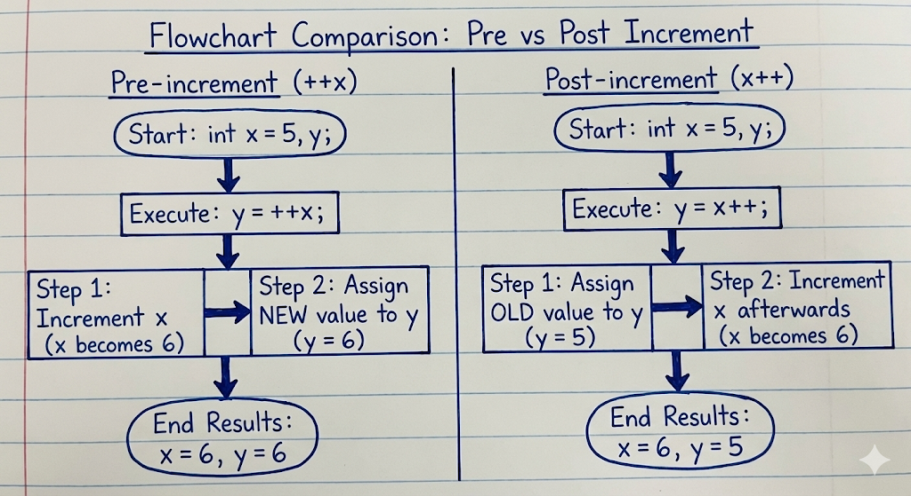

# Operators and Expressions

??? "`x = x + 1;` and `x++;`"

    **Ans to the Question**

    ### **Introduction**

    In C programming, both `x = x + 1;` and `x++;` are used to increase the value of a variable (চলক) by 1. However, when it comes to efficiency and programming style, there is a subtle difference between the two.

    **Statement:**
    Between the two statements, **`x++;` is considered more efficient** and is preferred by programmers.

    Below is the detailed explanation of why this is the case.

    ### **1. Theoretical Efficiency (Machine Level)**

    To understand the efficiency, we must look at how these high-level instructions are converted into Machine Code or Assembly Language by the Compiler (কম্পাইলার).

    **Case A: `x = x + 1;**`
    This is a standard arithmetic expression. Theoretically, the computer performs this in three steps:

    1. **Load:** It loads the value of `x` from memory into a CPU Register (রেজিস্টার).
    2. **Add:** It adds the constant value `1` to that register.
    3. **Store:** It stores the new value back into the memory location of `x`.

    * *Instruction:* `ADD x, 1` (Requires fetching the variable and the constant).

    **Case B: `x++;**`
    This uses the Increment Operator. Most processors have a specific machine instruction designed solely to increment a value by 1.

    * *Instruction:* `INC x` (Single machine instruction).

    **Conclusion on Machine Cycles:**
    Historically, the `INC` instruction executes faster and takes fewer CPU cycles (সিপিইউ সাইকেল) than the general `ADD` instruction. Therefore, `x++` is theoretically faster.

    ### **2. Compiler Optimization (Modern Context)**

    It is important to note that modern C compilers (like GCC or Clang) are extremely smart or Optimized (অপ্টিমাইজ করা).

    * If optimization is enabled, the compiler realizes that `x = x + 1` is doing the same work as `x++`.
    * Therefore, it generates the **same machine code** for both.
    * So, in a modern computer, you might not see a measurable speed difference, but `x++` remains the "native" way to increment in C.

    ### **3. Readability and Clarity**

    Efficiency is not just about execution speed; it is also about writing clean code.

    * **Conciseness:** `x++` is shorter and easier to type.
    * **Clarity:** It clearly signals the intent (উদ্দেশ্য) that "we are just stepping to the next value". `x = x + 1` looks like a mathematical equation.
    * **Address Calculation:** In complex cases like `arr[i++]`, using the increment operator is significantly more efficient and readable than writing `arr[i]; i = i + 1;`.

    ### **Comparison Summary**

    | Feature | `x = x + 1;` | `x++;` |
    | --- | --- | --- |
    | **Operator Type** | Assignment + Arithmetic | Unary Increment Operator |
    | **Instruction** | Typically `ADD` | Typically `INC` |
    | **Execution** | Might involve data movement. | Direct register operation. |
    | **Preferred Usage** | Mathematical formulas. | Loops and counters. |

    ### **Conclusion**

    While modern compilers make them equal in speed, **`x++;` is technically the efficient choice** because it maps directly to the hardware's increment instruction. It is the standard idiom in C programming.

### **Difference between Pre-increment and Post-increment**

??? "Pre-increment vs Post-increment"

    **Ans to the Question**
    In C programming, the increment operator (`++`) is used to increase the value of a variable by 1. However, the position of the `++` sign determines **when** the increment happens. This distinction is very important when used inside an expression (রাশিমালা).

    We classify them into two types:

    1. **Pre-increment (`++x`):** Change then Use.
    2. **Post-increment (`x++`):** Use then Change.

    ---

    ### **1. Pre-increment Operator (`++x`)**

    In Pre-increment (প্রাক-বৃদ্ধি), the operator is written **before** the operand.

    * **Rule:** "First increment, then use."
    * **How it works:**
    1. First, the value of the variable is increased by 1 immediately.
    2. Then, the new (updated) value is used in the expression or assignment.


    **Example:**

    ```c
    int a = 10;
    int b = ++a; 
    // Step 1: 'a' becomes 11.
    // Step 2: 'b' is assigned 11.

    ```

    *Result:* `a = 11`, `b = 11`.

    ---

    ### **2. Post-increment Operator (`x++`)**

    In Post-increment (পর-বৃদ্ধি), the operator is written **after** the operand.

    * **Rule:** "First use, then increment."
    * **How it works:**
    1. First, the current (original) value of the variable is used in the expression or assignment.
    2. After that line is executed, the value of the variable is increased by 1.

    

    **Example:**

    ```c
    int a = 10;
    int b = a++; 
    // Step 1: 'b' is assigned 10 (old value).
    // Step 2: 'a' becomes 11.

    ```

    *Result:* `a = 11`, `b = 10`.

    ---

    ### **Comparison Code Snippet**

    To clearly understand the difference, let us look at a single program illustrating both.

    ```c
    #include <stdio.h>

    int main() {
    int x = 5, y = 5;

    // Case 1: Pre-increment
    printf("Pre-increment: %d\n", ++x); // Prints 6 (Increments first)

    // Case 2: Post-increment
    printf("Post-increment: %d\n", y++); // Prints 5 (Prints first, then increments)

    // Checking final values
    printf("Final x: %d, Final y: %d", x, y); // Both are 6 now

    return 0;
    }

    ```

    ### **Summary Table**

    | Feature | Pre-increment (`++i`) | Post-increment (`i++`) |
    | --- | --- | --- |
    | **Symbol Position** | Before the variable. | After the variable. |
    | **Logic** | Increment  Assignment | Assignment  Increment |
    | **Priority** | Higher priority in execution order. | Value is updated after the current statement. |
    | **Memory Action** | Updates memory immediately before fetch. | Fetches old value, then updates memory. |

    ### **Conclusion**

    If used alone (like `x++;` or `++x;`), there is no difference in the result. But when used inside a formula or function (like `y = x++`), **Pre-increment** uses the new value, while **Post-increment** uses the old value.

??? "Which is Faster: `!#c ++x` (Pre) or `!#c x++` (Post)?"

    **Ans to the Question**

    ### **Which is Faster: `++x` (Pre) or `x++` (Post)?**

    **Direct Answer:**
    Between the two, **Pre-increment (`++x`)** is technically **faster and more efficient** than Post-increment (`x++`).

    Although modern Compilers (কম্পাইলার) optimize both to be nearly the same for simple variables (like `int`), theoretically and in complex scenarios, **Pre-increment is the winner.**

    ### **Why is Pre-increment (`++x`) Faster?**

    The main reason lies in the **Number of Steps** the computer has to perform internally to execute the instruction.

    
    
    **1. How Post-increment (`x++`) works:**
    When we write `y = x++;`, the computer has to do extra work to "remember" the old value.

    * **Step 1:** Create a temporary copy (অস্থায়ী কপি) of `x` to save its current value.
    * **Step 2:** Increment the real `x`.
    * **Step 3:** Return the saved temporary copy.
    * **Step 4:** Delete the temporary copy.
    * *Problem:* The creation and deletion of the temporary copy takes extra time and memory.

    **2. How Pre-increment (`++x`) works:**
    When we write `y = ++x;`, it is very direct.

    * **Step 1:** Increment `x` immediately.
    * **Step 2:** Return the new `x`.
    * *Benefit:* No temporary copy is needed. It is a straight calculation.

    ### **Comparison of Steps**

    | Feature | Pre-increment (`++x`) | Post-increment (`x++`) |
    | --- | --- | --- |
    | **Speed** | **Faster** | Slightly Slower (due to overhead) |
    | **Memory** | Uses less memory. | Uses extra memory for temporary storage. |
    | **Steps** | Fetch  Increment  Use | Fetch  **Save Old**  Increment  Use Old |

    ### **Conclusion**

    For simple counters in `for` loops (like `int i`), it does not make a visible difference today. However, it is a **Good Programming Habit** (ভাল অভ্যাস) to use `++x` (Pre-increment) because it avoids unnecessary work for the machine.
