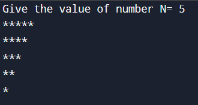
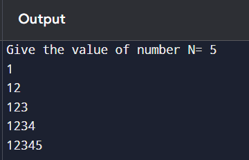
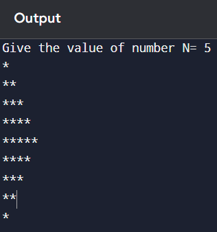
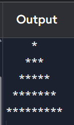
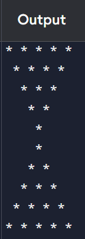
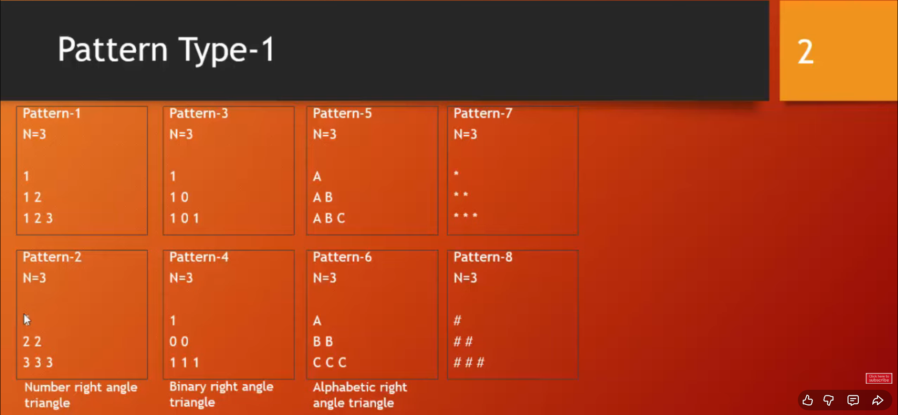
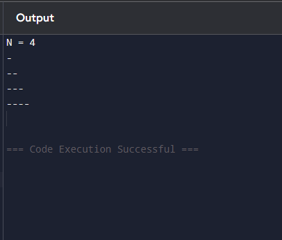

# C Patterns
   
!!! info "Pattern Type 01"

    ```c
    #include <stdio.h>
    int main()
    {
    // Loop from 1 to 10 and print each number
    int n, row, col;
    n = 4;
    for (row = 1; row <= n; row++)
    {
    for (col = 1; col <= n ; col++)
    {
    printf("*");
    }
    printf("\n");
    }
    return 0;
    }
    ```
    ```text

    1.  *****
        *****
        *****
        *****
        *****
    ```

!!! info "Pattern Type 02"

    ```c
    #include <stdio.h>

    int main() {
    int n, row, col;
    n = 0;
    printf("Give the value of number N= ");
    scanf("%d", &n);
    for (row=1; row<= n; row++){
        for(col =1; col<= row; col++){
            printf("*");
        }
            printf("\n");
    }

        return 0;
    }
    ```
    ```text
    2.  *
        **
        ***
        ****
        *****
    ```


!!! info "Pattern Type 03"
    
    ```c
    #include <stdio.h>

    int main() {
    int n, row, col;
    n = 0;
    printf("Give the value of number N= ");
    scanf("%d", &n);
    for (row=1; row<= n; row++){
        for(col = n; col >= row; col--){
            printf("*");
        }
            printf("\n");
    }

    return 0;
    }
    ```
    

!!! info "Pattern Type 04"
    
    ```c
    #include <stdio.h>

    int main() {
    int n, row, col;
    n = 0;
    printf("Give the value of number N= ");
    scanf("%d", &n);
    for (row=1; row<= n; row++){
        for (col=1; col<=row; col++ ){
            printf("%d", col);
        }
            printf("\n");
    }

        return 0;
    }
    ```
    

!!! info "Pattern Type 05"

    ```c
    #include <stdio.h>

    int main() {
    int n, row, col, stars;
    n = 0;
    printf("Give the value of number N= ");
    scanf("%d", &n);
    for (row = 1; row <= 2*n - 1; row++){
    if (row <= n){
        stars = row;
        }
        else {
            stars = 2*n - row ;
        }
    for (col = 1; col <= stars; col++){
            printf("*");
        }
        
            printf("\n");
    }
    
        return 0;
    }
    ```
    

!!! info "Pattern Type 06"

    ```c
    #include <stdio.h> 
    int main() {
        int row, col, n;
        n=5;
        for (row=1; row<=n; row++){
            
            // print spaces
            for (col = 1; col <= n - row; col++) {
                printf(" ");
            }
            for(col=1; col <= 2*row-1; col++ ){
                printf("*");
                
            }
            printf("\n");
        }
        
        

        return 0;
    }
    ```
    

    ---
    ```c

    ```
    
    ---
    ```c
    #include <stdio.h>

    int main() {
        int n = 5;
        int row, col;

        // Upper half
        for (row = 1; row <= n; row++) {
            // spaces
            for (col = 1; col <= row - 1; col++) {
                printf(" ");
            }
            // stars
            for (col = 1; col <= n - row + 1; col++) {
                printf("* ");
            }
            printf("\n");
        }

        // Lower half
        for (row = 1; row <= n; row++) {
            // spaces
            for (col = 1; col <= n - row; col++) {
                printf(" ");
            }
            // stars
            for (col = 1; col <= row; col++) {
                printf("* ");
            }
            printf("\n");
        }

        return 0;
    }

    ```
    
    ---


!!! info "Pattern Type 09"

    ```c
    #include <stdio.h>

    int main() {
        int row, col;
        int n = 5;

        for (row = 1; row <= n; row++) {

            // leading spaces
            for (col = 1; col <= n - row; col++) {
                printf("🔴");
            }

            if (row == 1) {
                printf("🟢");
            }
            else if (row < n) {
                printf("🟢");                       // left border
                for (col = 1; col <= 2*row - 3; col++) {
                    printf("⭐");                   // inner spaces
                }
                printf("🟢");                       // right border
            }
            else {
                for (col = 1; col <= 2*n - 1; col++) {
                    printf("🟢");                   // bottom row full stars
                }
            }

            printf("\n");
        }

        return 0;
    }
    ```
    ```text
    13.  *
        * *
       *   *
      *     *
     *********
    ```
    ```text
    🔴🔴🔴🔴🟢
    🔴🔴🔴🟢⭐🟢
    🔴🔴🟢⭐⭐⭐🟢
    🔴🟢⭐⭐⭐⭐⭐🟢
    🟢🟢🟢🟢🟢🟢🟢🟢🟢

    ```
    
!!! info "Pattern Type 14"

    ```text
    🟢🟢🟢🟢🟢🟢🟢🟢🟢
    🔴🟢⭐⭐⭐⭐⭐🟢
    🔴🔴🟢⭐⭐⭐🟢
    🔴🔴🔴🟢⭐🟢
    🔴🔴🔴🔴🟢
    ```
    ```c
  
    #include <stdio.h>
    int main()
    {
    int n, row, col, stars, gaps;
    n=5;
    
    
    for (row=1; row<=n; row++){
        gaps=row-1;
    
    if(row==1){
        // 
        for(col=1; col <= n+4; col++){
        printf("🟢");
        // printf("%d %d %d", row, n, col);
        }
    }
    else{
        // gaps
        for(col=1; col <= gaps; col++){
        printf("🔴");
        }
        
        if(row<n){
            printf("🟢");
        for(col=1; col<=2*(n-row) -1 ; col++){
        printf("⭐");
        
        }
        printf("🟢");

        } else{
            for(col=1; col<=1; col++){
        printf("🟢");
        
        
        
        }  
        }
        


        
    
    }
    
        
        printf("\n");
    }
    }
    ```
!!! info "Pattern Type 01"
    
      

!!! info "Pattern Type 00"
    
    ```c
    #include <stdio.h>

    int main() {
    int n, row, col;
    printf("N = ");
    scanf("%d", &n);
    for (row = 1; row<=n; row++) {
    for (col=1; col <=row; col++) {
        printf("-");
    }
                printf("\n");
    }
    return 0;
    }
    ```
    


Pattern Questions

Print these patterns using loops:


```text

1.  *****
    *****
    *****
    *****
    *****


2.  *
    **
    ***
    ****
    *****


3.  *****
    ****
    ***
    **
    *


4.  1
    1 2
    1 2 3
    1 2 3 4
    1 2 3 4 5


5.  *
    **
    ***
    ****
    *****
    ****
    ***
    **
    *


6.       *
        **
       ***
      ****
     *****


7.   *****
      ****
       ***
        **
         *


8.      *
       ***
      *****
     *******
    *********


9.  *********
     *******
      *****
       ***
        *


10.      *
        * *
       * * *
      * * * *
     * * * * *


11.  * * * * *
      * * * *
       * * *
        * *
         *


12.  * * * * *
      * * * *
       * * *
        * *
         *
         *
        * *
       * * *
      * * * *
     * * * * *

13.      *
        * *
       *   *
      *     *
     *********


14.  *********
      *     *
       *   *
        * *
         *


15.      *
        * *
       *   *
      *     *
     *       *
      *     *
       *   *
        * *
         *


16.           1
            1   1
          1   2   1
        1   3   3   1
      1   4   6   4   1


17.      1
        212
       32123
      4321234
       32123
        212
         1


18.   **********
      ****  ****
      ***    ***
      **      **
      *        *
      *        *
      **      **
      ***    ***
      ****  ****
      **********


19.    *        *
       **      **
       ***    ***
       ****  ****
       **********
       ****  ****
       ***    ***
       **      **
       *        *


20.    ****
       *  *
       *  *
       *  *
       ****

21.    1
       2  3
       4  5  6
       7  8  9  10
       11 12 13 14 15

22.    1
       0 1
       1 0 1
       0 1 0 1
       1 0 1 0 1

23.        *      *
         *   *  *   *
       *      *      *

24.    *        *
       **      **
       * *    * *
       *  *  *  *
       *   **   *
       *   **   *
       *  *  *  *
       * *    * *
       **      **
       *        *

25.       *****
         *   *
        *   *
       *   *
      *****

26.   1 1 1 1 1 1
      2 2 2 2 2
      3 3 3 3
      4 4 4
      5 5
      6

27.   1 2 3 4  17 18 19 20
        5 6 7  14 15 16
          8 9  12 13
            10 11

28.      *
        * *
       * * *
      * * * *
     * * * * *
      * * * *
       * * *
        * *
         *

29.      
       *        *
       **      **
       ***    ***
       ****  ****
       **********
       ****  ****
       ***    ***
       **      **
       *        *

30.         1
          2 1 2
        3 2 1 2 3
      4 3 2 1 2 3 4
    5 4 3 2 1 2 3 4 5


31.      4 4 4 4 4 4 4  
         4 3 3 3 3 3 4   
         4 3 2 2 2 3 4   
         4 3 2 1 2 3 4   
         4 3 2 2 2 3 4   
         4 3 3 3 3 3 4   
         4 4 4 4 4 4 4   

32.    E
       D E
       C D E
       B C D E
       A B C D E

33.    a
       B c
       D e F
       g H i J
       k L m N o
     
34.    E D C B A
       D C B A
       C B A
       B A
       A
       
35.    1      1
       12    21
       123  321
       12344321
```