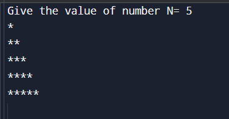

# C Patterns

??? "Pattern Type 01"
    
    
    
    ```c
    #include <stdio.h>

    int main() {
    int n, row, col;
    printf("N = ");
    scanf("%d", &n);
    for (row = 1; row<=n; row++) {
    for (col=1; col <=row; col++) {
        printf("-");
    }
                printf("\n");
    }
    return 0;
    }
    ```
    
    ---
    ```c
    #include <stdio.h>
    int main()
    {
    // Loop from 1 to 10 and print each number
    int n, row, col;
    n = 4;
    for (row = 1; row <= n; row++)
    {
        for (col = 1; col <= n ; col++)
        {
            printf("*");
        }
        printf("\n");
    }
    return 0;
    }
    ````
    

    ---
    ```c
    #include <stdio.h>

    int main() {
    int n, row, col;
    n = 0;
    printf("Give the value of number N= ");
    scanf("%d", &n);
    for (row=1; row<= n; row++){
        for(col =1; col<= row; col++){
            printf("*");
        }
            printf("\n");
    }

        return 0;
    }
    ```
    
    ---
    ```c
    // Online C compiler to run C program online
    #include <stdio.h>

    int main() {
    int n, row, col;
    n = 0;
    printf("Give the value of number N= ");
    scanf("%d", &n);
    for (row=1; row<= n; row++){
        for(col = n; col >= row; col--){
            printf("*");
        }
            printf("\n");
    }

    return 0;
    }
    ```
    
    ---
    
```c

```


??? "Pattern Type 01"
    
    
??? "Pattern Type 01"
    
    
??? "Pattern Type 01"
    
    