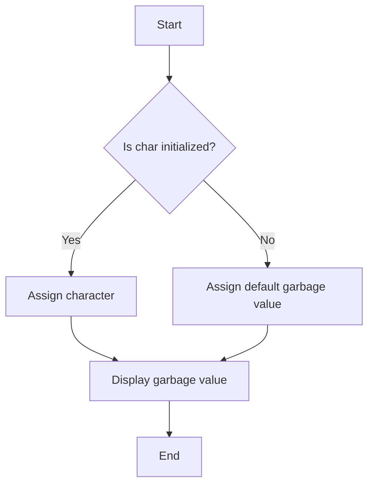

### C Character Data Type in C Programming: A Complete Beginner's Guide

**Char** হচ্ছে C programming language এর সবচেয়ে ছোট data type, যা একক (single) character store করার জন্য ব্যবহৃত হয়। এটি 'char' keyword দিয়ে ডিক্লেয়ার করা হয়।

#### What is a `char`?

* **`char`** data type-এর মাধ্যমে আপনি একক character (যেমন 'a', 'B', '3', '%') store করতে পারেন।
* এটি সাধারণত **1 byte** memory ব্যবহার করে।

#### Basic Syntax of `char`:

```c
char letter = 'A';  // Single character
```

এখানে `letter` নামে একটা `char` variable তৈরি করা হয়েছে, যার মান হচ্ছে 'A'।

#### Initial Value:

* Default value: যখন `char` variable কোন value assign করা না হয়, তখন এটা garbage value ধারণ করতে পারে। তাই প্রথমে অবশ্যই value assign করতে হবে।

```c
char letter;  // Uninitialized: May contain a garbage value
```

#### Size and Storage:

* `char` variable-এর **size** 1 byte (or 8 bits)।
* এটা শুধু 1টি character রাখবে, কিন্তু internally `char` data type অনেক কিছু store করতে পারে, যেমন ASCII values।

#### ASCII Values:

`char` datatype ASCII (American Standard Code for Information Interchange) values ব্যবহার করে। ASCII হল এক ধরনের encoding system যা কম্পিউটারকে characters এর numerical representation দিতে সাহায্য করে।

* **Example:**

  * `'A'` এর ASCII value হল 65
  * `'B'` এর ASCII value হল 66
  * `'a'` এর ASCII value হল 97
  * `' '` (space) এর ASCII value হল 32

#### Example Code:

```c
#include <stdio.h>

int main() {
    char letter = 'A';  // Declare a char variable
    printf("The letter is: %c\n", letter);  // Print the char
    printf("The ASCII value of %c is: %d\n", letter, letter);  // Print ASCII value
    return 0;
}
```

**Output:**

```
The letter is: A
The ASCII value of A is: 65
```

#### Key Points to Remember: ⚠️

* **Character Representation:** A `char` must be enclosed within single quotes (`' '`), not double quotes (`" "`).

  * ❌ `char letter = "A";` (Incorrect)
  * ✅ `char letter = 'A';` (Correct)

#### Default vs. Assigned Values:

* **Default Value:** যদি আপনি `char` variable কে initial value না দেন, এটি **garbage value** ধারণ করবে।
* **Assigned Value:** আপনি যেকোনো character বা character-এর ASCII value assign করতে পারেন।

| Value Assigned | Type of Value     | Example              |
| -------------- | ----------------- | -------------------- |
| `'A'`          | Character         | `char letter = 'A';` |
| `65`           | ASCII value (Int) | `char letter = 65;`  |

#### Analogies to Understand: 🤔

**Char** variable কে চিন্তা করুন **আপনার পকেটের চাবির মতো**। ধরুন, আপনি আপনার পকেটে শুধুমাত্র একটি চাবি রাখতে পারেন। সেটা যেমন একটা ছোট physical object (চাবি), তেমনি `char` ও একটি ছোট data store করে (যেমন একটা single letter বা symbol)। এতে আপনি শুধুমাত্র একটা নির্দিষ্ট জিনিস রাখতে পারবেন, তাই এইটা অন্য যেকোনো বড় ধরনের variable এর মতো অনেক data রাখতে পারবে না।

#### Pitfalls to Avoid: ❌

* **Garbage Values:** যখন char variable কে initialize না করেন, তখন garbage value আসতে পারে।
* **Single Quotes:** Character store করতে অবশ্যই single quote (`'`) ব্যবহার করুন। Double quote (`"`) ব্যবহার করলে তা string হয়ে যাবে।

#### Flowchart: Understanding `char` in C



এই flowchart এ দেখানো হয়েছে কীভাবে `char` variable কাজ করে — প্রথমে, যদি variable কে initialize না করা হয়, তা garbage value নেয়। আর যদি assign করা হয়, তা নির্দিষ্ট character ধারণ করে এবং শেষে সেটি display হয়।

#### Summary:

| Operation     | Description                                             | Example                 |
| ------------- | ------------------------------------------------------- | ----------------------- |
| Declare char  | Define a character variable                             | `char letter = 'A';`    |
| Display char  | Print the character stored in char variable             | `printf("%c", letter);` |
| ASCII value   | Print the ASCII value of a char                         | `printf("%d", letter);` |
| Default value | Uninitialized char variable may contain a garbage value | `char letter;`          |

#### Common Mistakes and How to Avoid: ⚠️

1. **Uninitialized `char` variable** may hold a garbage value. Always initialize it before using.
2. **Wrong quotes:** Use single quotes `' '` for characters and double quotes `" "` for strings.

---

Hope this clears things up! Let me know if anything's unclear or if you want more examples. 😊
