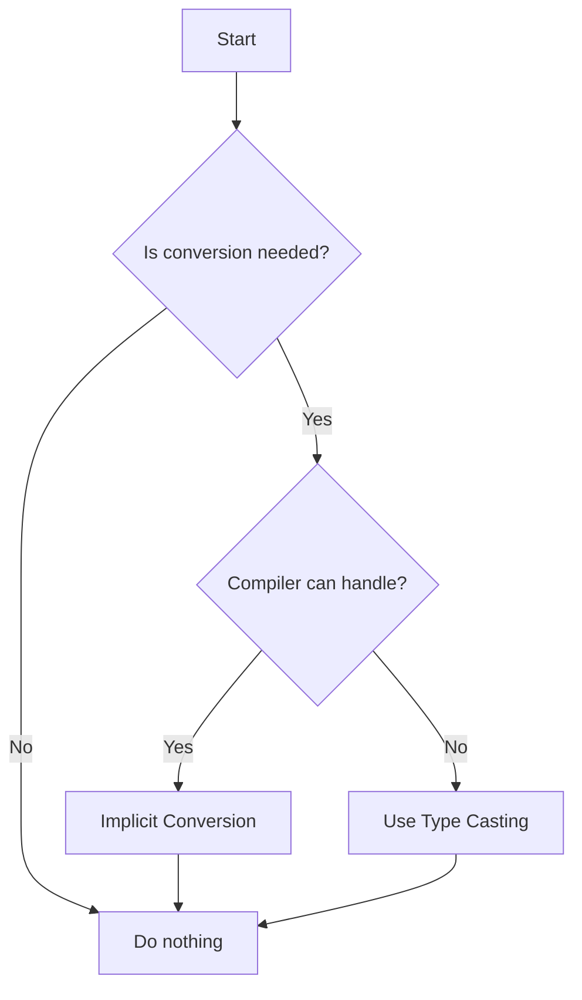

## 🔄 "C Type Conversion" Explained in Bangla-English Mix 💡

---

### 🤔 প্রথমে বুঝে নিই — "Type Conversion" মানে কি?

আমরা যখন C programming এ কাজ করি, তখন **variable** গুলা বিভিন্ন **data type** এর হয় — যেমন:

- `int` (whole number)
- `float` (decimal number)
- `char` (character), etc.

❓ **Type Conversion** মানে হলো — একটা data type কে **Automatically বা Manually অন্য একটা data type** এ **convert বা রূপান্তর** করা।

---

## 📘 ২ রকমের Type Conversion থাকে:

| Type        | নাম                           | কে করে              | উদাহরণ          |
| ----------- | ----------------------------- | ------------------- | --------------- |
| 🔁 Implicit | **Automatic Type Conversion** | C Compiler নিজে করে | `int` → `float` |
| 🛠️ Explicit | **Type Casting (Manual)**     | আমরাই করি           | `(float) x`     |

---

## ✅ 1. Implicit Type Conversion (Automatic)

### 👉 এটা Compiler নিজেই করে — যখন variable/constant দের মধ্যে mismatch থাকে।

### 🧠 Example:

```c
int a = 5;
float b = a;  // Implicitly converted from int to float
```

🧾 Explanation:

- `a` ছিল `int` type (5)
- `b` হলো `float` type
- কিন্তু `a` কে `float` এ assign করলে C compiler অটোমেটিক `5` → `5.0` বানায় ✅

> **এটা compiler করে silently – তুমি কিছু না বললেও।**

---

### ⚠️ Common Rule:

🔼 **Lower type → Higher type** এ convert হয়।

| From               | To     | Why                    |
| ------------------ | ------ | ---------------------- |
| `char` → `int`     | int    | bigger                 |
| `int` → `float`    | float  | float can hold decimal |
| `float` → `double` | double | double more precise    |

---

## 🛠️ 2. Explicit Type Conversion (Type Casting)

### 👉 যখন তুমি **manual** ভাবে convert করো এক type থেকে আরেকটায়।

### Syntax:

```c
(type_name) value_or_variable
```

### 🧠 Example:

```c
int x = 10, y = 3;
float result = (float)x / y;
```

#### Without Type Casting:

```c
int result = x / y;   // Output: 3 ❌ decimal lost
```

#### With Type Casting:

```c
float result = (float)x / y;  // Output: 3.333 ✅
```

> `x` কে `(float)` বানিয়ে দিছি — এতে result accurate আসে।

---

## 🎯 Why Type Conversion is Important?

✅ **Correct Calculation**: Otherwise তুমি ভুল result পাবে।
✅ **Avoid Data Loss**: কখনো `float → int` করলে fraction বাদ পড়ে যাবে।
✅ **Compiler Warning Avoid**: mismatched type হলে warning আসতে পারে।

---

## ⚠️ Warning Signs:

| Mistake                                    | What Happens     | Fix                        |
| ------------------------------------------ | ---------------- | -------------------------- |
| `int / int` দিয়ে `float` result expect করা | Decimal হারায় ❌ | One value কে `float` বানাও |
| `float` → `int` without casting            | Fraction বাদ ❌  | Use `(int)`                |

---

## 🧪 Real-Life Analogy (📦 Water Jug Example)

Imagine:

- `int` = ছোট water jug (no fraction)
- `float` = বড় jug with measurement scale

👉 তুমি যদি ছোট jug (int) এর পানি বড় jug (float) এ ঢালো — **সবটা যায় ✅**
কিন্তু বড় jug (float) এর পানি ছোটে ঢাললে — **overflow হবে বা কিছু বাদ যাবে ❌**

---

## 📋 Summary Table: Implicit vs Explicit

| Feature | Implicit                  | Explicit                  |
| ------- | ------------------------- | ------------------------- |
| নামে    | Auto Conversion           | Type Casting              |
| কে করে  | Compiler                  | Programmer                |
| Syntax  | No special syntax         | `(type)` before value     |
| Safe?   | Mostly                    | You must be careful       |
| Example | `int a = 5; float b = a;` | `float r = (float)a / b;` |

---

## ⏳ Flowchart (Markdown)



---

## 🧠 Some Beginner-Friendly Tips:

1. ✅ Try printing both values to **see the effect of conversion**.
2. ✅ Always cast **before** doing the operation — not after.
3. ⚠️ Never assume C will **keep your decimals** unless you force it!
4. ❌ Don’t cast `float → int` unless you're **okay with losing decimal part**.

---

## 🧪 Small Practice Task for You:

Write a C program that:

- Takes two `int` values from user
- Divides them and stores result as `float`
- Shows output with proper casting

---

Absolutely! Here's the full set of **C Type Conversion** quizzes as **code blocks** using proper `mcq` fenced code — ready to paste into your MkDocs `.md` files without breaking anything.

---

```mcq
---
type: single
question: What kind of conversion happens automatically in C when assigning an `int` value to a `float` variable?
---

- [ ] Explicit type casting
  > ❌ Incorrect. Explicit casting is done manually by the programmer.

- [x] Implicit type conversion
  > ✅ Correct! C automatically promotes `int` to `float`.

- [ ] Type overflow
  > ❌ Not related here. Overflow is about exceeding value range.

- [ ] Type mismatch error
  > ❌ No error occurs here; implicit conversion is safe.
```


```mcq
---
type: single
question: |
    What will be the value of `x` after this code runs?
    ```c
    float pi = 3.14;
    int x = pi;
    ```
---

- [ ] 3.14

  > ❌ `int` type can't store decimals.

- [x] 3

  > ✅ Correct. The fractional part is lost during float-to-int conversion.

- [ ] 4

  > ❌ That's not how truncation works.

- [ ] Error
  > ❌ No error; this is valid C.

```
---

```mcq
---
type: single
question: Which of the following correctly converts an `int` to `float` manually?
---

- [ ] float x = int(5);
  > ❌ That's not valid C syntax.

- [x] float x = (float)5;
  > ✅ Correct! `(float)` is used for manual type casting.

- [ ] float x = float(5);
  > ❌ This is Python-like, not C.

- [ ] float x = toFloat(5);
  > ❌ There's no such function in C.
```

---

```mcq
---
type: multiple
question: Which of the following type conversions are valid in C?
---

- [x] int → float
  > ✅ Safe, automatic conversion from lower to higher precision.

- [x] float → int
  > ✅ Valid but loses decimal part. Use explicit casting.

- [ ] char → float → double → int
  > ❌ While possible step-by-step, not meaningful together like this.

- [ ] int = (int)"hello"
  > ❌ Invalid. You can't cast a string to int in C like that.
```

---

``` mcq

type: single
question: What is the output of this C code?

```c
int a = 5, b = 2;
float result = a / b;
printf("%f", result);

---

- [ ] 2.5

  > ❌ `a / b` is integer division, so result is 2.

- [x] 2.000000

  > ✅ Correct! Though stored as `float`, the division is done in `int`.

- [ ] 2.500000

  > ❌ Not unless you cast at least one operand to `float`.

- [ ] Compilation Error
  > ❌ The code is syntactically correct.

```
