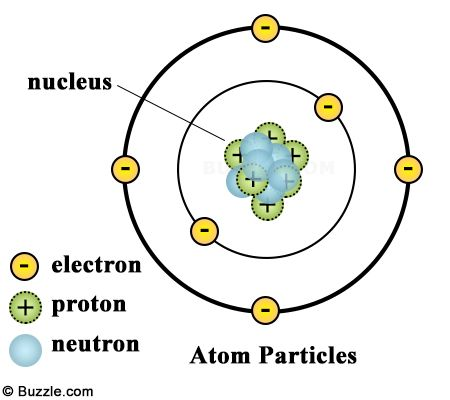
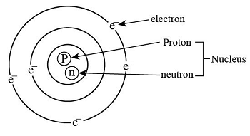

### 1. Atomic Structure and Periodicity

??? "Concept of Atom (পরমাণু) and Subatomic Particles (উপ-পারমাণবিক কণা)"

    ### Introduction (সূচনা)

    The atom (পরমাণু) is the basic (মৌলিক) building block of matter (পদার্থ). It is the smallest unit (একক) of an element (মৌলিক পদার্থ) that retains (বজায় রাখা) its chemical properties (রাসায়নিক বৈশিষ্ট্য). Everything we see around us is composed (গঠিত) of these tiny particles.

    ### Atomic Structure (পারমাণবিক গঠন)

    An atom consists (গঠিত হওয়া) of a central (কেন্দ্রীয়) nucleus (নিউক্লিয়াস) surrounded by a cloud of electrons (ইলেকট্রন). The nucleus is very small compared to the overall (সামগ্রিক) size of the atom, but it contains almost all of its mass (ভর).
    
    
    

    ### Subatomic Particles (উপ-পারমাণবিক কণা)

    There are three primary (প্রধান) subatomic particles that make up an atom:

    * **Protons (প্রোটন):** These are positively (ধনাত্মক) charged particles located (অবস্থিত) inside the nucleus. The number of protons determines (নির্ধারণ করা) the atomic number (পারমাণবিক সংখ্যা) of the element.
    * **Neutrons (নিউট্রন):** These are neutral (নিরপেক্ষ) particles, meaning they have no charge (চার্জ). They are also found inside the nucleus alongside (পাশাপাশি) the protons. Together, protons and neutrons are called nucleons (নিউক্লিয়ন).
    * **Electrons (ইলেকট্রন):** These are negatively (ঋণাত্মক) charged particles that revolve (আবর্তন করা) around the nucleus in specific orbits (কক্ষপথ) or energy levels (শক্তিস্তর). The mass of an electron is negligible (নগণ্য) compared to protons and neutrons.

    ### Conclusion (উপসংহার)

    In a neutral atom, the number of protons and electrons is equal (সমান), which makes the total (মোট) charge zero. Understanding (বোঝা) these subatomic particles is essential (অপরিহার্য) for studying chemistry (রসায়ন) and physics (পদার্থবিজ্ঞান).
