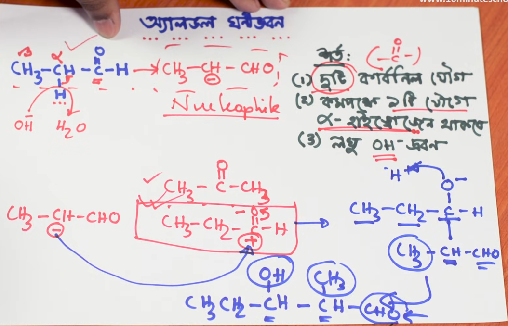

## অর্গানিক কেমিস্ট্রি: অ্যালডল ঘনীভবন (Aldol Condensation)

অ্যালডল ঘনীভবন বিক্রিয়া হলো জৈব রসায়নের অন্যতম গুরুত্বপূর্ণ একটি বিক্রিয়া।

=== "Bangla"

    ### ১. অ্যালডল ঘনীভবন বিক্রিয়ার শর্তাবলী

    বিক্রিয়াটি সংঘটিত হওয়ার জন্য ৩টি প্রধান শর্ত আবশ্যক:

    1. **দুইটি কার্বোনিল যৌগ:** বিক্রিয়াটিতে দুই অণু কার্বোনিল যৌগ (অ্যালডিহাইড বা কিটোন, অর্থাৎ $>C=O$ মূলকযুক্ত যৌগ) প্রয়োজন।
    * এই দুটি কার্বোনিল যৌগ একই হতে পারে (যেমন: দুই অণু প্রোপান্যাল)।
    * অথবা দুটি ভিন্ন কার্বোনিল যৌগও হতে পারে (যেমন: এক অণু প্রোপান্যাল ও এক অণু বিউটান্যাল)।

    2. **কমপক্ষে একটি যৌগে $\alpha$-হাইড্রোজেন থাকতে হবে:** বিক্রিয়ায় অংশগ্রহণকারী কার্বোনিল যৌগ দুটির মধ্যে অন্তত যেকোনো একটিতে অবশ্যই আলফা-হাইড্রোজেন ($\alpha$-H) বিদ্যমান থাকতে হবে।
    * *কার্বোনিল মূলকের সংলগ্ন কার্বনকে আলফা-কার্বন ($\alpha$-Carbon) বলা হয় এবং এই কার্বনে যুক্ত হাইড্রোজেনকে আলফা-হাইড্রোজেন ($\alpha$-Hydrogen) বলা হয়।*

    3. **লঘু ক্ষারের উপস্থিতি:** বিক্রিয়াটি লঘু ক্ষারীয় দ্রবণ (যেমন: লঘু $OH^-$, $NaOH$ বা $KOH$) এর উপস্থিতিতে ঘটে।

    ---

    ### ২. বিক্রিয়ার মূল কৌশল ও ধাপসমূহ

    ভিডিওতে প্রোপান্যাল ($\text{CH}_3-\text{CH}_2-\text{CHO}$) এর উদাহরণের মাধ্যমে বিক্রিয়াটি ব্যাখ্যা করা হয়েছে:

    #### **প্রথম ধাপ: নিউক্লিওফাইল (Nucleophile) গঠন**

    * কার্বোনিল যৌগের আলফা-হাইড্রোজেন অত্যন্ত **অম্লীয় (Acidic)** প্রকৃতির হয়।
    * লঘু ক্ষার থেকে আসা হাইড্রোক্সিল আয়ন ($OH^-$) প্রথম কার্বোনিল যৌগের এই অম্লীয় আলফা-হাইড্রোজেনকে আকর্ষণ করে প্ররোচিত করে এবং পানি ($H_2O$) হিসেবে বের করে নিয়ে যায়।
    * হাইড্রোজেনটি তার বন্ধনের ইলেকট্রন কার্বনে রেখে প্রোটন হিসেবে চলে যায়। ফলে একটি ঋণাত্মক আধানযুক্ত কার্বানায়ন বা **নিউক্লিওফাইল (Nucleophile / কেন্দ্রাকর্ষী বিকারক)** তৈরি হয়।
    * **বিক্রিয়া:**

    $$\text{CH}_3-\text{CH}_2-\text{CHO} + OH^- \rightarrow \text{CH}_3-\text{CH}^--\text{CHO} + H_2O$$

    #### **দ্বিতীয় ধাপ: দ্বিতীয় কার্বোনিল অণুতে আক্রমণ**

    * তৈরি হওয়া নিউক্লিওফাইলটি দ্বিতীয় কার্বোনিল যৌগের আংশিক ধনাত্মক চার্জযুক্ত কার্বোনিল কার্বনকে ($>C^{\delta+}=\text{O}^{\delta-}$) আক্রমণ করে।
    * দ্বিতীয় কার্বোনিল অণুর কার্বন-অক্সিজেন দ্বিবন্ধনটি ভেঙে একক বন্ধনে পরিণত হয় এবং অক্সিজেনের ওপর ঋণাত্মক চার্জ তৈরি হয়।
    * নিউক্লিওফাইলের যে আলফা-কার্বনে ঋণাত্মক আধান ছিল, সেই কার্বনটি সরাসরি দ্বিতীয় কার্বোনিল কার্বনের সাথে নতুন বন্ধন তৈরি করে যুক্ত হয়।

    #### **তৃতীয় ধাপ: চূড়ান্ত অ্যালডল (Aldol) যৌগ গঠন**

    * ঋণাত্মক চার্জযুক্ত অক্সিজেনটি পরবর্তীতে দ্রবণ থেকে একটি প্রোটন ($H^+$) গ্রহণ করে অ্যালকোহল মূলকে ($-\text{OH}$) পরিণত হয়।
    * **উৎপন্ন যৌগের সংকেত:**

    $$\text{CH}_3-\text{CH}_2-\text{CH}(\text{OH})-\text{CH}(\text{CH}_3)-\text{CHO}$$

    ---

    ### ৩. যৌগটির নাম "অ্যালডল" কেন?

    উৎপন্ন চূড়ান্ত যৌগটির দিকে লক্ষ করলে দেখা যায়, একই যৌগের মধ্যে:

    * অ্যালকোহল মূলক ($-\text{OH}$) উপস্থিত রয়েছে $\rightarrow$ **ol**
    * অ্যালডিহাইড মূলক ($-\text{CHO}$) উপস্থিত রয়েছে $\rightarrow$ **Ald**

    এই অ্যালডিহাইডের **Ald** এবং অ্যালকোহলের **ol** একত্রিত হয়ে নাম হয়েছে **Aldol (অ্যালডল)**। আর এই সম্পূর্ণ বিক্রিয়াটিকে বলা হয় **অ্যালডল ঘনীভবন বিক্রিয়া**।

    ---

    ### ৪. গুরুত্বপূর্ণ ব্যাখ্যা ও প্রশ্নোত্তর

    * **কেন দুটি কার্বোনিল যৌগ লাগে?**
    * প্রথম কার্বোনিল যৌগটি আলফা-হাইড্রোজেন অপসারণের মাধ্যমে নিউক্লিওফাইল গঠন করতে ব্যবহৃত হয়।
    * দ্বিতীয় কার্বোনিল যৌগটি ধনাত্মক কেন্দ্র (নিউকে্লয়াস) হিসেবে কাজ করে, যেখানে তৈরি হওয়া নিউক্লিওফাইলটি এসে আক্রমণ করে।

    * **কেন অন্তত একটি আলফা-হাইড্রোজেন থাকা বাধ্যতামূলক?**
    * আলফা-হাইড্রোজেন অম্লীয় হওয়ায় কেবল এটিই ক্ষারের সাথে বিক্রিয়া করে নিউক্লিওফাইল তৈরি করতে পারে।
    * প্রথম যৌগে আলফা-হাইড্রোজেন না থাকলে নিউক্লিওফাইলই গঠিত হবে না, ফলে বিক্রিয়া সামনে এগোবে না।
    * তবে **দ্বিতীয় কার্বোনিল যৌগে আলফা-হাইড্রোজেন না থাকলেও কোনো সমস্যা নেই**, কারণ দ্বিতীয় যৌগ থেকে হাইড্রোজেন অপসারণের প্রয়োজন হয় না।

=== "English"

    # Organic Chemistry: Aldol Condensation

    Aldol Condensation is one of the most fundamental carbon-carbon bond-forming reactions in organic chemistry.

    ---

    ## 1. Prerequisites / Necessary Conditions for Aldol Condensation

    For an Aldol Condensation reaction to occur, the following three conditions must be met:

    1. **Presence of Two Carbonyl Compounds:** The reaction requires two molecules containing a carbonyl group ($>C=O$), which can be aldehydes or ketones.
    * **Self-Aldol:** Both carbonyl molecules are identical (e.g., two molecules of propanal).
    * **Cross-Aldol:** The two carbonyl molecules are different (e.g., one molecule of propanal and one molecule of butanal).

    2. **Presence of at least One $\alpha$-Hydrogen ($\alpha$-H):** At least one of the two carbonyl compounds **must** contain an alpha-hydrogen.
    * *The carbon atom directly adjacent to the carbonyl carbon ($>C=O$) is called the **$\alpha$-carbon**, and any hydrogen atom attached to this $\alpha$-carbon is called an **$\alpha$-hydrogen**.*

    3. **Presence of a Dilute Base:** The reaction takes place in the presence of a dilute basic solution (e.g., dilute $\text{OH}^-$, $\text{NaOH}$, or $\text{KOH}$).

    ---

    ## 2. Reaction Mechanism & Step-by-Step Breakdown

    Taking two molecules of propanal ($\text{CH}_3-\text{CH}_2-\text{CHO}$) as an example:

    ### **Step 1: Formation of the Nucleophile (Carbanion)**

    * The $\alpha$-hydrogen of a carbonyl compound is acidic in nature due to the electron-withdrawing effect of the adjacent carbonyl group.
    * The hydroxide ion ($\text{OH}^-$) from the dilute base abstracts this acidic $\alpha$-hydrogen as a proton ($\text{H}^+$), forming a water molecule ($\text{H}_2\text{O}$).
    * The shared pair of bonding electrons remains on the $\alpha$-carbon, generating a negatively charged carbanion that acts as a powerful **nucleophile**.

    $$\text{CH}_3-\overset{\alpha}{\text{CH}}(\text{H})-\text{CHO} + \text{OH}^- \rightarrow \text{CH}_3-\overset{\ominus}{\text{CH}}-\text{CHO} + \text{H}_2\text{O}$$

    $$\text{(Nucleophile)}$$

    ---

    ### **Step 2: Nucleophilic Attack on the Second Carbonyl Compound**

    * The carbonyl bond ($>C=O$) of the second propanal molecule is polar: oxygen carries a partial negative charge ($\delta-$) while the carbonyl carbon carries a partial positive charge ($\delta+$).
    * The carbanion (nucleophile) generated in Step 1 uses its negative charge to attack the electrophilic carbonyl carbon ($\text{C}^{\delta+}$) of the second propanal molecule.
    * The $\pi$-electrons of the $C=O$ double bond shift to the oxygen atom, forming an alkoxide intermediate.

    $$\text{CH}_3-\text{CH}_2-\overset{\delta+}{\text{C}}\text{H}=\overset{\delta-}{\text{O}} + \text{CH}_3-\overset{\ominus}{\text{CH}}-\text{CHO} \rightarrow \text{CH}_3-\text{CH}_2-\overset{\text{O}^\ominus}{\underset{\mid}{\text{C}}}\text{H}-\overset{\text{CH}_3}{\underset{\mid}{\text{C}}}\text{H}-\text{CHO}$$

    ---

    ### **Step 3: Protonation to Form the Final Aldol Product**

    * The negatively charged oxygen atom ($\text{O}^\ominus$) abstracts a proton ($\text{H}^+$) from water ($\text{H}_2\text{O}$) to form a hydroxyl group ($-\text{OH}$).
    * This completes the synthesis of the **Aldol product**:

    $$\text{CH}_3-\text{CH}_2-\overset{\text{O}^\ominus}{\underset{\mid}{\text{C}}}\text{H}-\overset{\text{CH}_3}{\underset{\mid}{\text{C}}}\text{H}-\text{CHO} + \text{H}^+ \rightarrow \text{CH}_3-\text{CH}_2-\overset{\text{OH}}{\underset{\mid}{\text{C}}}\text{H}-\overset{\text{CH}_3}{\underset{\mid}{\text{C}}}\text{H}-\text{CHO}$$

    **Final Product Structure:** 3-hydroxy-2-methylpentanal

    ---

    ## 3. Why is it Called "Aldol"?

    The term **Aldol** is a combination word representing the two functional groups present simultaneously in the final product:

    * **Ald** $\rightarrow$ Represents the **Ald**ehyde group ($-\text{CHO}$).
    * **ol** $\rightarrow$ Represents the Alcoh**ol** group ($-\text{OH}$).

    $$\text{Aldehyde (Ald)} + \text{Alcohol (ol)} = \mathbf{Aldol}$$

    ---

    ## 4. Key Exam Questions & Analytical Points

    1. **Why are two carbonyl molecules required?**
    * The **first carbonyl molecule** serves to supply the acidic $\alpha$-hydrogen to form the nucleophile.
    * The **second carbonyl molecule** serves as an electrophilic target (positive center) for the nucleophile to attack.

    2. **Why is the presence of an $\alpha$-hydrogen mandatory in at least one compound?**
    * Without an $\alpha$-hydrogen, the base ($\text{OH}^-$) cannot generate the required nucleophile. If no nucleophile is formed, the addition reaction cannot proceed.
    * *Note:* The second carbonyl compound does not strictly require an $\alpha$-hydrogen because its role is only to act as an electrophile.
