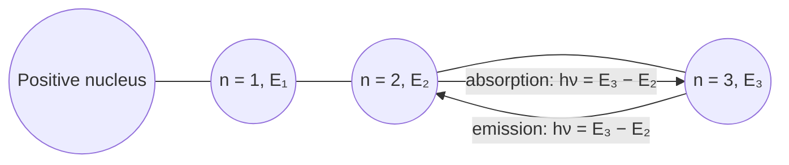
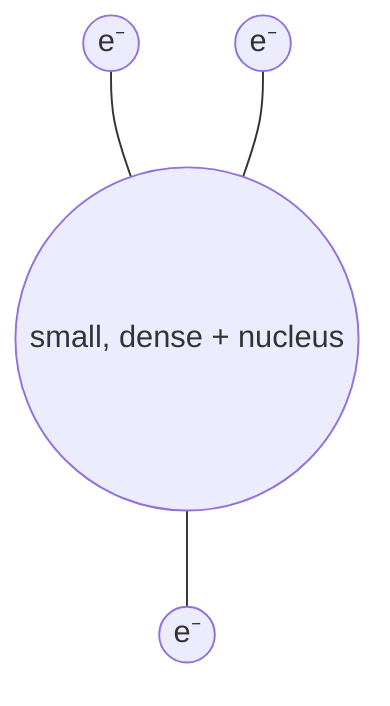
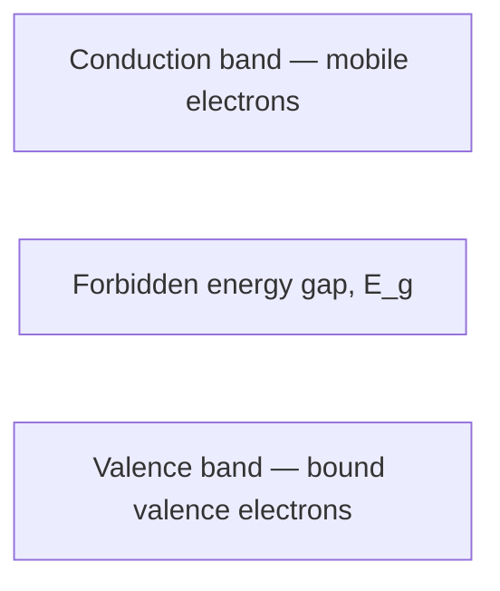
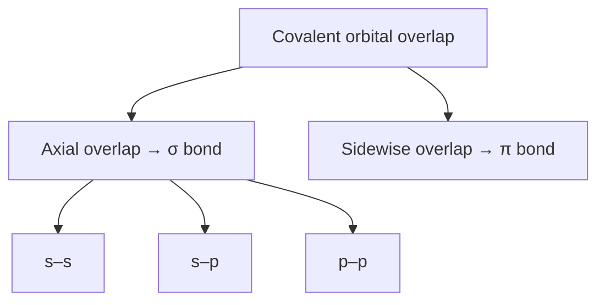
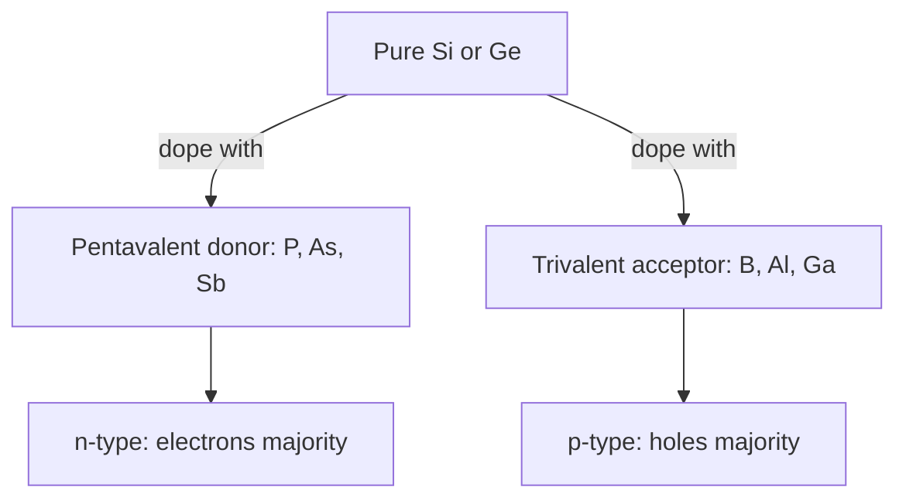
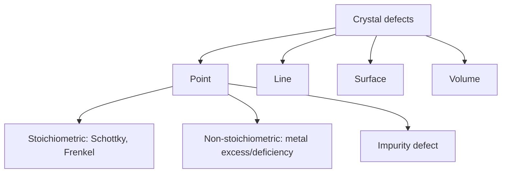
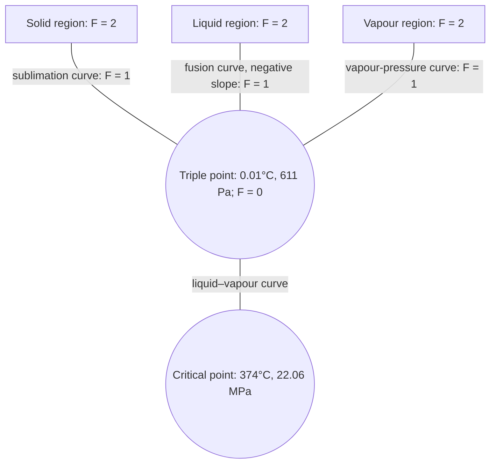

# Chemistry: Complete Exam-Ready Questions and Answers

> **Coverage:** Terms 161, 171, 181, 201 and 211  
> **Format:** Every supplied question is kept chapter-wise and term-wise. Answers are short, formal and suitable for examination.  
> **Note on diagrams:** The diagrams are original study schematics prepared from the supplied questions. They are not drawn to scale. Reproduce a neat labelled version in the examination where a figure is requested.

---

## Table of Contents

1. [Atomic Structure and Periodicity](#chapter-1-atomic-structure-and-periodicity)
   - [Term 161](#chapter-1-term-161)
   - [Term 171](#chapter-1-term-171)
   - [Term 181](#chapter-1-term-181)
   - [Term 201](#chapter-1-term-201)
   - [Term 211](#chapter-1-term-211)
2. [Chemical Bonding and Molecular Structure](#chapter-2-chemical-bonding-and-molecular-structure)
   - [Term 161](#chapter-2-term-161)
   - [Term 171](#chapter-2-term-171)
   - [Term 181](#chapter-2-term-181)
   - [Term 201](#chapter-2-term-201)
   - [Term 211](#chapter-2-term-211)
3. [Defects in Solids and Semiconductors](#chapter-3-defects-in-solids-and-semiconductors)
   - [Term 161](#chapter-3-term-161)
   - [Term 171](#chapter-3-term-171)
   - [Term 201](#chapter-3-term-201)
   - [Term 211](#chapter-3-term-211)
4. [Selective Organic Reactions](#chapter-4-selective-organic-reactions)
   - [Term 161](#chapter-4-term-161)
   - [Term 171](#chapter-4-term-171)
   - [Term 181](#chapter-4-term-181)
   - [Term 201](#chapter-4-term-201)
   - [Term 211](#chapter-4-term-211)
5. [Solutions and Phase Rule](#chapter-5-solutions-and-phase-rule)
   - [Term 161](#chapter-5-term-161)
   - [Term 171](#chapter-5-term-171)
   - [Term 181](#chapter-5-term-181)
   - [Term 201](#chapter-5-term-201)
   - [Term 211](#chapter-5-term-211)
6. [Thermochemistry and Chemical Kinetics](#chapter-6-thermochemistry-and-chemical-kinetics)
   - [Term 161](#chapter-6-term-161)
   - [Term 171](#chapter-6-term-171)
   - [Term 181](#chapter-6-term-181)
   - [Term 201](#chapter-6-term-201)
   - [Term 211](#chapter-6-term-211)
7. [Chemical Equilibria, pH and Electrical Properties](#chapter-7-chemical-equilibria-ph-and-electrical-properties)
   - [Term 161](#chapter-7-term-161)
   - [Term 171](#chapter-7-term-171)
   - [Term 181](#chapter-7-term-181)
   - [Term 201](#chapter-7-term-201)
   - [Term 211](#chapter-7-term-211)
8. [Quick Formula Sheet](#quick-formula-sheet)
9. [Figure Index](#figure-index)

---

# Chapter 1: Atomic Structure and Periodicity

## Chapter 1 Term 161

### Q1(a) [4]: Describe the postulates of Bohr's theory of atom.

**Answer:** Bohr's atomic theory has the following main postulates:

1. An atom contains a small positively charged nucleus, and electrons revolve around it only in certain permitted circular orbits called **stationary states**.
2. While an electron remains in a permitted orbit, it neither emits nor absorbs energy. Every orbit has a definite energy.
3. Only those orbits are allowed for which the angular momentum of electron is quantized:

   $$mvr=\frac{nh}{2\pi},\qquad n=1,2,3,\ldots$$

4. Radiation is emitted or absorbed only when an electron jumps between two permitted energy levels:

   $$h\nu=|E_2-E_1|$$

5. The orbit nearer to nucleus possesses lower energy, while a more distant orbit possesses higher energy.

**Required figure — Figure 1:**



### Q1(b) [4]: What is ionization energies and electronegativity.

**Answer:**

**Ionization energy** is the minimum energy required to remove the most loosely bound electron from an isolated gaseous atom in its ground state:

$$M(g)\rightarrow M^+(g)+e^-$$

It is generally expressed in $\mathrm{kJ\,mol^{-1}}$. Successive ionization energies are called first, second, third ionization energies and so on. Their values increase because electron is removed from a progressively more positive ion.

**Electronegativity** is the relative tendency of an atom in a molecule to attract the shared electron pair towards itself. It is a dimensionless comparative property, commonly expressed by Pauling scale. Fluorine is the most electronegative element. Electronegativity usually increases across a period and decreases down a group.

### Q1(c) [6]: Explain the periodicity of atomic volume and valency.

**Answer:**

**Atomic volume** is the volume occupied by one mole of atoms:

$$\text{Atomic volume}=\frac{\text{atomic mass}}{\text{density}}$$

Across a period, effective nuclear charge increases while electrons enter the same principal shell. Therefore, atomic radius and generally atomic volume decrease from left to right, with some irregularity due to crystal structure. Down a group, new electron shells are added; hence atomic volume generally increases.

**Valency** is the combining capacity of an atom. For representative elements across a period, valency with respect to hydrogen normally increases from 1 to 4 and then decreases from 4 to 0. For example, in the second period the usual valencies are Li = 1, Be = 2, B = 3, C = 4, N = 3, O = 2, F = 1 and Ne = 0. Down a group, the number of valence electrons remains similar; therefore, the common valency also remains similar.

---

## Chapter 1 Term 171

### Q1(a) [3+5]: Define orbit and orbital. Are 2P, 3f and 4S² orbital possible? Explain your answer.

**Answer:**

An **orbit** is a definite circular path around the nucleus in which an electron was assumed to move according to Bohr's model. It is specified mainly by the principal quantum number $n$.

An **orbital** is a three-dimensional region around the nucleus where the probability of finding an electron is maximum. One orbital can accommodate at most two electrons with opposite spins.

For a shell of principal quantum number $n$, the allowed azimuthal quantum numbers are $l=0$ to $(n-1)$.

| Given notation | Decision | Reason |
|---|---|---|
| $2p$ | Possible | For $n=2$, $l=1$ is allowed. |
| $3f$ | Not possible | An $f$ orbital requires $l=3$, but for $n=3$, only $l=0,1,2$ are allowed. |
| $4s^2$ | Possible configuration | A $4s$ orbital exists because $n=4,l=0$; its maximum occupancy is two electrons. Strictly, $4s^2$ is an orbital occupancy, not the name of an orbital. |

### Q1(b) [6]: What is the maximum number of electrons that can be present in the principal level for which n = 4?

**Answer:** The maximum number of electrons in a principal shell is:

$$N=2n^2$$

For $n=4$:

$$N=2(4)^2=32$$

The fourth shell contains $4s$, $4p$, $4d$ and $4f$ subshells. Their maximum capacities are $2$, $6$, $10$ and $14$ electrons respectively.

$$2+6+10+14=32$$

Therefore, the principal level for which $n=4$ can contain a maximum of **32 electrons**.

### Q5(c) [5]: Show the hydrogen bonding in acetic acid molecules and find Isotope, Isobar, Isotone from the following atoms: ${}^{12}_{6}C$, ${}^{14}_{6}C$, ${}^{28}_{14}Si$, ${}^{27}_{13}Al$ and ${}^{13}_{6}C$.

**Answer:** Two acetic acid molecules form a cyclic dimer through two intermolecular hydrogen bonds between hydroxyl hydrogen and carbonyl oxygen.

**Required figure — Figure 2:**

```text
        O···H—O
        ║     |
    CH₃—C     C—CH₃
        |     ║
        O—H···O
```

- **Isotopes:** Atoms having the same atomic number but different mass numbers. Thus, ${}^{12}_{6}C$, ${}^{13}_{6}C$ and ${}^{14}_{6}C$ are isotopes.
- **Isobars:** Atoms having the same mass number but different atomic numbers. There is **no isobaric pair** in the supplied list.
- **Isotones:** Atoms having the same number of neutrons but different atomic numbers. ${}^{28}_{14}Si$ has $28-14=14$ neutrons and ${}^{27}_{13}Al$ has $27-13=14$ neutrons; therefore, they are isotones.

### Q7(a) [8]: Write short notes on the followings: (i) Noble gasses; (ii) Hydrogen bonding; (iii) Normality and pH of solutions; (iv) Diamagnetism and paramagnetism.

**Answer:**

**(i) Noble gases:** Helium, neon, argon, krypton, xenon and radon are Group 18 elements. Their outer shell is complete—$ns^2np^6$, except He which is $1s^2$. Therefore, they are monoatomic, colourless gases having very low chemical reactivity and low boiling points.

**(ii) Hydrogen bonding:** It is the attractive interaction between H covalently bonded to a highly electronegative atom such as F, O or N and a lone pair of another electronegative atom. It may be intermolecular or intramolecular and strongly affects boiling point, solubility and structure.

**(iii) Normality and pH:** Normality is gram-equivalents of solute per litre of solution: $N=\text{equivalents}/V(\mathrm L)$. The pH is the negative logarithm of hydrogen-ion concentration: $pH=-\log[H^+]$.

**(iv) Diamagnetism and paramagnetism:** Substances containing only paired electrons are diamagnetic and are weakly repelled by a magnetic field. Substances containing one or more unpaired electrons are paramagnetic and are attracted by a magnetic field.

---

## Chapter 1 Term 181

### Q1(a) [3]: What is an orbital?

**Answer:** An orbital is a three-dimensional region around an atomic nucleus in which the probability of finding an electron is very high, usually described by a wave function. Every orbital is specified by three quantum numbers, $n$, $l$ and $m_l$, and it can contain a maximum of two electrons having opposite spin.

### Q1(b) [3]: Write down the rules of ground state electron configuration of elements.

**Answer:** Ground-state electronic configuration follows three rules:

1. **Aufbau principle:** Electrons fill orbitals in increasing order of energy, approximately following the $(n+l)$ rule.
2. **Pauli exclusion principle:** No two electrons in an atom can have the same set of four quantum numbers; therefore, an orbital holds at most two electrons with opposite spins.
3. **Hund's rule:** In degenerate orbitals, electrons occupy each orbital singly with parallel spins before pairing starts.

### Q1(c) [3]: Write the name of the orbital for which the quantum numbers are $n=2$ and $l=1$.

**Answer:** The value $l=1$ denotes a $p$ subshell. Since $n=2$, the orbital belongs to the **$2p$ subshell**. Its possible magnetic quantum numbers are $m_l=-1,0,+1$, giving three orbitals: $2p_x$, $2p_y$ and $2p_z$.

### Q1(d) [5]: Write the ground state electron configuration of element Na.

**Answer:** Sodium has atomic number $Z=11$, so it contains 11 electrons. Following Aufbau principle:

$$\boxed{1s^2\,2s^2\,2p^6\,3s^1}$$

Its shell distribution is $2,8,1$, and abbreviated configuration is $[Ne]3s^1$. The orbital representation of the valence shell is $3s: \uparrow$; hence sodium has one valence electron.

### Q3(a) [2+4]: What is ionization energy? Explain "ionization energy increases across a period".

**Answer:** Ionization energy is the minimum energy required to remove the most loosely held electron from one mole of isolated gaseous atoms in ground state.

Across a period, proton number increases and the added electrons enter the same principal shell. Shielding does not increase sufficiently, so effective nuclear charge rises and atomic radius decreases. The valence electron is consequently held more strongly and more energy is needed to remove it. Thus, ionization energy generally increases from left to right, though small exceptions occur due to subshell stability and electron pairing, such as Be/B and N/O.

### Q3(b) [2+2]: What are Nobel gases? What are their properties?

**Answer:** The correct term is **noble gases**. They are the Group 18 elements He, Ne, Ar, Kr, Xe and Rn.

Their important properties are: complete valence shell; very low reactivity; monoatomic and colourless nature; low melting and boiling points; high ionization energies; and nearly zero tendency to gain electrons. The heavier members, particularly xenon and krypton, can form some compounds with highly electronegative elements.

### Q5(a) [2+3]: What are isotopes and isobars? Choose isotopes and isobars from the following list.

**Answer:**

- **Isotopes** are atoms of the same element having the same atomic number but different mass numbers, for example ${}^{12}_{6}C$ and ${}^{14}_{6}C$.
- **Isobars** are atoms of different elements having the same mass number but different atomic numbers, for example ${}^{40}_{18}Ar$ and ${}^{40}_{20}Ca$.

The atom list is absent from the supplied question text for Term 181. Therefore, its particular isotope and isobar pairs cannot be selected without inventing data. Apply the definitions above to the original printed list.

### Q7(c) [4]: Why does the electron affinity decrease down a group except fluorine?

**Answer:** Down a group, atomic size and shielding effect increase. The incoming electron enters a shell farther from the nucleus and feels less effective nuclear attraction. Therefore, the energy released on electron addition generally decreases down a group; electron affinity becomes less favourable.

Fluorine shows an apparent irregularity when compared with chlorine. Its very compact $2p$ orbital has high electron–electron repulsion, so addition of an electron releases less energy than addition into the larger $3p$ orbital of chlorine. Hence chlorine has a more favourable electron affinity than fluorine.

---

## Chapter 1 Term 201

### Q1(a) [4]: Describe Rutherford's atomic model and mention its weakness.

**Answer:** Rutherford proposed that an atom contains a very small, dense and positively charged nucleus at its centre. Almost the whole mass of atom is concentrated in the nucleus. Electrons revolve around the nucleus, and most of the atomic volume is empty space. Electrostatic attraction between nucleus and electrons provides the centripetal force.

**Weakness:** According to classical electromagnetic theory, a revolving charged electron should continuously radiate energy, lose speed and finally fall into the nucleus. Thus, the model cannot explain atomic stability. It also cannot explain the discrete line spectra or the arrangement of electrons in definite energy levels.

**Required figure — Figure 3:**



### Q1(b) [4]: Write down postulates of Bohr's theory.

**Answer:**

1. Electrons revolve around the nucleus only in permitted stationary orbits of definite energy.
2. An electron in a stationary orbit does not radiate energy.
3. Angular momentum is quantized: $mvr=nh/2\pi$.
4. Energy is emitted or absorbed only during transition between two stationary levels.
5. The frequency of radiation satisfies $h\nu=|E_2-E_1|$.

See **Figure 1** for the energy-level representation.

### Q1(c) [6]: Find out the number of orbitals for which the following sets of quantum numbers is possible $n=3$, $l=2$ and $m=(+2)$.

**Answer:** For $n=3$, the allowed values of $l$ are $0,1,2$; therefore, $l=2$ is permitted and indicates the $3d$ subshell. For $l=2$, permitted magnetic quantum numbers are:

$$m_l=-2,-1,0,+1,+2$$

The specified value $m_l=+2$ identifies **one definite $3d$ orbital**. This orbital can contain a maximum of two electrons with spins $m_s=+\frac12$ and $-\frac12$.

### Q2(a) [5]: Write down the ground state electron configuration of following elements: (i) C(6); (ii) S(16); (iii) Mo(42); (iv) Ni(28); (v) Na(11).

**Answer:**

| Element | Ground-state electronic configuration |
|---|---|
| C, $Z=6$ | $1s^2 2s^2 2p^2$ |
| S, $Z=16$ | $1s^2 2s^2 2p^6 3s^2 3p^4$ |
| Mo, $Z=42$ | $[Kr]4d^5 5s^1$ |
| Ni, $Z=28$ | $[Ar]3d^8 4s^2$ |
| Na, $Z=11$ | $1s^2 2s^2 2p^6 3s^1$ |

Molybdenum shows the exceptional $4d^5 5s^1$ configuration because a half-filled $d$ subshell has additional stability.

### Q2(b) [6]: Explain "electron affinity of an element decreases down a group". Why is the value of electron affinity for fluorine out of line?

**Answer:** Down a group, both atomic radius and shielding by inner electrons increase. The added electron remains farther from the nucleus and experiences weaker effective nuclear attraction. Hence less energy is normally released when the atom accepts an electron, so electron affinity decreases in magnitude down a group.

Fluorine is very small, and an incoming electron must enter its compact $2p$ subshell, where electron–electron repulsion is considerable. Chlorine accepts the electron into a more spacious $3p$ subshell with lower repulsion. Therefore, chlorine releases more energy on gaining an electron than fluorine, making fluorine out of the regular order.

### Q2(c) [3]: Why does the ionization energy of Na is lower than Li?

**Answer:** Sodium has electronic configuration $[Ne]3s^1$, whereas lithium is $[He]2s^1$. The valence electron of Na is in the third shell, farther from the nucleus, and is more strongly shielded by inner electrons. It experiences less effective nuclear attraction than the $2s$ electron of Li. Therefore, less energy is required to remove it, and the first ionization energy of Na is lower than that of Li.

---

## Chapter 1 Term 211

### Q1(a) [5]: Define isotope and isobar with example.

**Answer:**

**Isotopes** are atoms of the same element having the same atomic number but different mass numbers. They possess the same number of protons and similar chemical properties but different numbers of neutrons. Example: ${}^{12}_{6}C$ and ${}^{14}_{6}C$.

**Isobars** are atoms of different elements having the same mass number but different atomic numbers. They have different numbers of protons and different chemical properties. Example: ${}^{40}_{18}Ar$ and ${}^{40}_{20}Ca$.

### Q1(b) [2+2]: What is an orbital? Define Hund's rule.

**Answer:** An orbital is a three-dimensional region around the nucleus where the probability of finding an electron is maximum. It can accommodate not more than two electrons of opposite spins.

**Hund's rule of maximum multiplicity:** When several orbitals have equal energy, electrons occupy them singly with parallel spins before any pairing occurs. For example, the three electrons of a $p^3$ configuration occupy the three $p$ orbitals separately as $\uparrow\;\uparrow\;\uparrow$.

### Q1(c) [5]: Mention the significance of quantum numbers.

**Answer:** Four quantum numbers completely describe an electron in an atom:

| Quantum number | Symbol | Significance |
|---|---:|---|
| Principal | $n$ | Main energy level, approximate size and energy of orbital. |
| Azimuthal | $l$ | Subshell and orbital shape; $0,1,2,3$ represent $s,p,d,f$. |
| Magnetic | $m_l$ | Orientation of orbital in space; values range from $-l$ to $+l$. |
| Spin | $m_s$ | Direction of electron spin; $+\frac12$ or $-\frac12$. |

Thus, quantum numbers explain shell structure, orbital type, orbital orientation and spin state of each electron.

### Q2(a) [5]: Write down the ground state electron configuration of the following elements: (i) C(6); (ii) S(16); (iii) Mo(42); (iv) Ni(28); (v) Na(11).

**Answer:**

$$\begin{aligned}
\mathrm C &: 1s^2 2s^2 2p^2\\
\mathrm S &: [Ne]3s^2 3p^4\\
\mathrm{Mo} &: [Kr]4d^5 5s^1\\
\mathrm{Ni} &: [Ar]3d^8 4s^2\\
\mathrm{Na} &: [Ne]3s^1
\end{aligned}$$

The Mo configuration is an exception to the simple Aufbau prediction because the half-filled $4d^5$ subshell is relatively stable.

### Q2(b) [2+4]: What is ionization energy? Why does the ionization energy decrease down a group in the periodic table?

**Answer:** Ionization energy is the minimum energy required to remove the outermost electron from an isolated gaseous atom in its ground state.

Down a group, a new principal shell is added at each step. Atomic radius and shielding effect therefore increase. Although nuclear charge also increases, shielding and greater distance reduce the effective attraction on the valence electron. The outermost electron becomes easier to remove; hence ionization energy generally decreases down a group.

### Q2(c) [3]: Why is the electron affinity of Be negative?

**Answer:** Beryllium has the stable electronic configuration $1s^2 2s^2$. The $2s$ subshell is completely filled. An incoming electron must enter the higher-energy $2p$ subshell and also experiences repulsion from existing electrons. Electron addition is therefore energetically unfavourable and requires energy rather than releasing it. For this reason, Be has nearly zero or unfavourable electron affinity (often stated as negative electron affinity, depending on the sign convention used).

---

# Chapter 2: Chemical Bonding and Molecular Structure

## Chapter 2 Term 161

### Q3(a) [9]: What is co-ordinate bond? Write the electronic formulae of the following compounds: (i) CO; (ii) H₂O₂; (iii) BF₃; (iv) C₂H₂.

**Answer:** A **coordinate covalent bond** is a covalent bond in which both shared electrons are donated by one atom. The donor possesses a lone pair and the acceptor possesses a vacant orbital. It is represented by an arrow from donor to acceptor, for example $NH_3+H^+\rightarrow NH_4^+$.

**Lewis electronic formulae:**

```text
(i) CO       ⁻:C≡O:⁺          one lone pair on each atom

(ii) H₂O₂    H—O—O—H          two lone pairs on each O

(iii) BF₃       F
               |
           F—B—F              three lone pairs on each F; B has six electrons

(iv) C₂H₂    H—C≡C—H
```

In CO, one accepted description includes a coordinate contribution, although the three C–O bonding pairs become indistinguishable in the complete molecule. BF₃ is electron-deficient because boron has an incomplete octet.

### Q3(b) [5]: Explain the following: (i) Ice floats on water; (ii) Water exists as a liquid under the ordinary conditions while H₂S exists as gas under the same conditions.

**Answer:**

**(i) Ice floats on water:** In ice, hydrogen bonds arrange water molecules in an open hexagonal lattice containing empty spaces. This structure has larger volume and lower density than liquid water, where part of the hydrogen-bond network collapses. Therefore, ice is less dense and floats.

**(ii) Different physical states:** Water molecules form strong intermolecular hydrogen bonds because oxygen is small and highly electronegative. Much energy is required to separate the molecules, giving water a boiling point of $100^\circ\mathrm C$; it is liquid at room temperature. Sulfur is larger and less electronegative, so $H_2S$ does not form appreciable hydrogen bonding. Only weak dipole and dispersion forces act between its molecules; hence it is a gas under ordinary conditions.

---

## Chapter 2 Term 171

### Q5(c) [5]: Show the hydrogen bonding in acetic acid molecules.

**Answer:** Acetic acid forms a stable cyclic dimer. Each molecule acts once as hydrogen-bond donor through its $O-H$ group and once as acceptor through its carbonyl oxygen. Two $O-H\cdots O=C$ hydrogen bonds hold the pair together.

Refer to **Figure 2**, the cyclic acetic-acid dimer. This association is responsible for the comparatively high boiling point and apparent double molecular mass of acetic acid in non-polar solvents or vapour at lower temperature.

### Q7(a) [8]: Write short notes on Noble gasses, Hydrogen bonding, Normality and pH of solutions, Diamagnetism and paramagnetism.

**Answer:**

- **Noble gases:** Group 18 elements with complete outer shell. They are monoatomic, colourless, have low boiling points and are chemically very unreactive.
- **Hydrogen bonding:** Attraction between H attached to F, O or N and a lone pair on another electronegative atom. It may be intermolecular or intramolecular and raises boiling point and solubility.
- **Normality:** Number of gram-equivalents of solute per litre of solution, $N=\text{equivalents}/V(\mathrm L)$. It depends on the reaction considered.
- **pH:** $pH=-\log[H^+]$. At $25^\circ\mathrm C$, pH 7 is neutral, below 7 acidic and above 7 basic.
- **Diamagnetism:** Weak repulsion from a field due to all electrons being paired.
- **Paramagnetism:** Attraction to a field due to one or more unpaired electrons.

---

## Chapter 2 Term 181

### Q3(c) [6]: Write the electronic formulae of the following compounds: (i) C₂H₆; (ii) BF₃; (iii) PCl₅; (iv) H₂O₂.

**Answer:**

```text
(i) C₂H₆      H₃C—CH₃

(ii) BF₃         F
                 |
             F—B—F       B has an incomplete octet

(iii) PCl₅       Cl
                  |
             Cl—P—Cl     five P—Cl single bonds; expanded octet
                / \
              Cl   Cl

(iv) H₂O₂      H—O—O—H   two lone pairs on each O
```

In ethane, each carbon forms four single covalent bonds. In $BF_3$, boron has six valence-shell electrons. In $PCl_5$, phosphorus uses an expanded valence shell. In $H_2O_2$, the $O-O$ bond is a single covalent bond.

### Q4(a) [4]: Define valance band, conduction band and forbidden band?

**Answer:**

- **Valence band:** The highest energy band occupied by valence electrons at $0\,K$. Electrons here normally take part in bonding and are not freely mobile.
- **Conduction band:** The higher allowed energy band in which electrons can move through the solid and conduct electricity.
- **Forbidden band or band gap ($E_g$):** The energy region between valence and conduction bands where no allowed electron states exist. A smaller $E_g$ makes electron promotion and electrical conduction easier.

**Required figure — Figure 4:**



### Q4(b) [4]: How many types of overlapping of covalent bond are seen?

**Answer:** Covalent bonds arise by two fundamental modes of orbital overlap:

1. **Axial or head-on overlap:** Electron density lies along the internuclear axis and forms a $\sigma$ bond. It may occur as $s-s$, $s-p$ or $p-p$ overlap.
2. **Lateral or sidewise overlap:** Two parallel $p$ orbitals overlap above and below the internuclear axis and form a $\pi$ bond.

A $\sigma$ bond is stronger and permits free rotation more easily. A $\pi$ bond is weaker and restricts rotation. A single bond is one $\sigma$ bond, a double bond is one $\sigma$ plus one $\pi$, and a triple bond is one $\sigma$ plus two $\pi$ bonds.

**Required figure — Figure 5:**



### Q4(c) [6]: Draw and explain the molecular orbitals of N₂ and O₂ according to MOT.

**Answer:** Atomic orbitals of similar energy and symmetry combine to form bonding and antibonding molecular orbitals. Bond order is:

$$\text{Bond order}=\frac{N_b-N_a}{2}$$

**$N_2$ (14 electrons):** For B₂–N₂, the relevant order is $\pi2p_x=\pi2p_y<\sigma2p_z$.

$$(\sigma1s)^2(\sigma^*1s)^2(\sigma2s)^2(\sigma^*2s)^2(\pi2p_x)^2(\pi2p_y)^2(\sigma2p_z)^2$$

Bond order $=(10-4)/2=3$. All electrons are paired, so $N_2$ is **diamagnetic** and has a triple bond.

**$O_2$ (16 electrons):** For O₂, the order has $\sigma2p_z$ below $\pi2p$.

$$\cdots(\sigma2p_z)^2(\pi2p_x)^2(\pi2p_y)^2(\pi^*2p_x)^1(\pi^*2p_y)^1$$

Bond order $=(10-6)/2=2$. The two unpaired electrons in degenerate $\pi^*2p$ orbitals make $O_2$ **paramagnetic**.

**Required figure — Figure 6 (valence-level occupancy):**

| Molecule | Bonding $2p$ orbitals | Antibonding $2p$ orbitals | Result |
|---|---|---|---|
| $N_2$ | $\pi2p_x^2\;\pi2p_y^2\;\sigma2p_z^2$ | empty | BO = 3, diamagnetic |
| $O_2$ | $\sigma2p_z^2\;\pi2p_x^2\;\pi2p_y^2$ | $\pi^*2p_x^1\;\pi^*2p_y^1$ | BO = 2, paramagnetic |

---

## Chapter 2 Term 201

### Q3(b) [5]: Draw and explain the molecular orbitals of O₂ according to MOT.

**Answer:** Oxygen has 16 total electrons. Its molecular-orbital configuration is:

$$\begin{aligned}
O_2: &(\sigma1s)^2(\sigma^*1s)^2(\sigma2s)^2(\sigma^*2s)^2\\
& (\sigma2p_z)^2(\pi2p_x)^2(\pi2p_y)^2(\pi^*2p_x)^1(\pi^*2p_y)^1
\end{aligned}$$

There are 10 electrons in bonding MOs and 6 in antibonding MOs:

$$\text{Bond order}=\frac{10-6}{2}=2$$

Thus, oxygen contains a double bond. The two electrons in $\pi^*2p_x$ and $\pi^*2p_y$ remain unpaired according to Hund's rule. Therefore, $O_2$ is paramagnetic, a fact correctly explained by MOT. Refer to **Figure 6** for the occupation diagram.

### Q3(c) [6]: Write the Lewis structure of the following molecules: (i) H₂O; (ii) NH₃; (iii) C₂H₂; (iv) BeCl₂; (v) CO₂; (vi) HF.

**Answer:**

```text
(i) H₂O       H—O—H       O has two lone pairs

(ii) NH₃        H
                |
            H—N—H         N has one lone pair

(iii) C₂H₂    H—C≡C—H

(iv) BeCl₂   :Cl—Be—Cl:   each Cl has three lone pairs; Be has four electrons

(v) CO₂       O=C=O       each O has two lone pairs

(vi) HF       H—F:        F has three lone pairs
```

$H_2O$ is bent, $NH_3$ is trigonal pyramidal, $C_2H_2$, $BeCl_2$ and $CO_2$ are linear, while HF is a diatomic linear molecule.

### Q4(a) [4]: Compare the properties of ionic and covalent compounds.

**Answer:**

| Property | Ionic compounds | Covalent compounds |
|---|---|---|
| Formation | Electron transfer; attraction between ions | Sharing of electron pairs |
| Physical state | Usually hard crystalline solids | Gases, liquids or softer solids are common |
| Melting/boiling point | Generally high | Generally low, except network solids |
| Electrical conduction | Conduct in molten or aqueous state | Usually non-conductors |
| Solubility | Often soluble in polar solvents such as water | Often soluble in non-polar solvents |
| Direction of bond | Non-directional electrostatic attraction | Directional bond |

These are general tendencies; network covalent substances such as diamond are important exceptions.

### Q4(b) [3x2]: Explain the following terms: (i) Hydrogen bonding; (ii) Metallic bonding; (iii) Water has maximum density at 4°C.

**Answer:**

**(i) Hydrogen bonding:** Attraction between a hydrogen atom covalently attached to F, O or N and a lone pair on another electronegative atom. It may occur between molecules or within one molecule.

**(ii) Metallic bonding:** Electrostatic attraction between a lattice of positive metal ions and delocalized valence electrons. The mobile electron cloud explains electrical conductivity, thermal conductivity, lustre, malleability and ductility.

**(iii) Maximum density of water:** On cooling liquid water below $4^\circ\mathrm C$, hydrogen bonds increasingly produce an open tetrahedral arrangement, which expands the volume. Above $4^\circ\mathrm C$, normal thermal expansion also increases volume. Hence the volume is minimum and density is maximum at approximately $4^\circ\mathrm C$.

---

## Chapter 2 Term 211

### Q3(a) [4]: How many types of overlapping of covalent bonds are seen?

**Answer:** Two principal types of overlap are found:

1. **Head-on overlap**, producing a $\sigma$ bond. Its common combinations are $s-s$, $s-p$ and $p-p$.
2. **Sidewise overlap** of parallel $p$ orbitals, producing a $\pi$ bond.

The electron cloud of a $\sigma$ bond is concentrated along the internuclear axis, while that of a $\pi$ bond lies above and below this axis. See **Figure 5**.

### Q3(b) [2+3]: Define co-ordination covalent bond. Show every type of bond available in NH₄Cl.

**Answer:** A coordinate covalent bond is a covalent bond in which the shared electron pair is supplied completely by one bonded atom.

Formation of ammonium chloride may be represented as:

$$:NH_3+H^+\longrightarrow[NH_4]^+$$

$$[NH_4]^++Cl^-\longrightarrow NH_4Cl$$

In its formation, nitrogen donates its lone pair to $H^+$, producing an **N→H coordinate bond**. The original three N–H bonds are ordinary covalent bonds. In the final $NH_4^+$ ion all four N–H bonds become equivalent. Between $NH_4^+$ and $Cl^-$ there is an **ionic bond or electrostatic attraction**.

### Q3(c) [5]: Draw and explain the molecular orbitals of O₂ according to MOT.

**Answer:** The MO configuration of $O_2$ is:

$$\cdots(\sigma2p_z)^2(\pi2p_x)^2(\pi2p_y)^2(\pi^*2p_x)^1(\pi^*2p_y)^1$$

Including core levels, bonding electrons $N_b=10$ and antibonding electrons $N_a=6$.

$$\text{Bond order}=\frac{10-6}{2}=2$$

Therefore, $O_2$ has a double bond. The two singly occupied degenerate $\pi^*$ orbitals contain parallel-spin electrons, so the molecule is paramagnetic. A concise diagram is given in **Figure 6**.

---
# Chapter 3: Defects in Solids and Semiconductors

## Chapter 3 Term 161

### Q2(a) [4]: What are the conductors, insulators and semiconductors?

**Answer:**

- **Conductors** permit electric current easily because they possess many mobile charge carriers. Their valence and conduction bands overlap or the conduction band is partly filled. Metals are common examples.
- **Insulators** offer very high resistance. Their valence band is full, conduction band is empty and the forbidden energy gap is large, normally above about $3\,\mathrm{eV}$. Glass and diamond are examples.
- **Semiconductors** have conductivity between conductors and insulators. Their small band gap allows some electrons to reach the conduction band by thermal energy. Their conductivity increases with temperature. Silicon and germanium are examples.

Refer to **Figure 4** for the meanings of valence band, band gap and conduction band.

### Q2(b) [10]: Explain n-type and p-type semiconductors.

**Answer:** A pure semiconductor is converted into an extrinsic semiconductor by adding a controlled amount of impurity, called **doping**.

**n-type semiconductor:** Silicon or germanium is doped with a pentavalent impurity such as P, As or Sb. Four impurity electrons form covalent bonds and the fifth is loosely held; it easily enters the conduction band. Electrons are majority carriers and holes are minority carriers. The donor atom becomes a fixed positive ion. The crystal as a whole remains electrically neutral.

**p-type semiconductor:** Silicon or germanium is doped with a trivalent impurity such as B, Al or Ga. The impurity forms only three bonds and leaves one incomplete bond or hole. A neighbouring electron fills it, causing the hole to move through the lattice. Holes are majority carriers and electrons are minority carriers. The acceptor atom becomes a fixed negative ion.

**Required figure — Figure 7:**



---

## Chapter 3 Term 171

### Q2(a) [2+6]: What are semiconductors? How does semiconductivity arise?

**Answer:** A semiconductor is a solid whose electrical conductivity lies between that of a conductor and an insulator. It normally has a small energy gap between valence and conduction bands, and its conductivity increases with temperature.

In a pure semiconductor at $0\,K$, the valence band is full and conduction band is empty. When temperature rises, some covalent bonds break and electrons receive sufficient energy to cross the small band gap into the conduction band. Each excited electron leaves a **hole** in the valence band. Under an electric field, conduction-band electrons move opposite to the field and holes effectively move along the field. Thus both electrons and holes carry current. Conductivity can be greatly increased by doping with pentavalent or trivalent impurities, forming n-type or p-type material respectively. See **Figure 7**.

### Q2(b) [6]: What do you mean by valance band, conduction band and forbidden band?

**Answer:** The **valence band** is the highest normally occupied energy band containing bonding electrons. The **conduction band** is a higher allowed band where electrons are mobile and can carry current. The **forbidden band** or band gap is the energy interval between them in which no permitted electron energy state exists.

In a conductor these bands overlap; in a semiconductor the gap is small; and in an insulator it is large. Therefore, band-gap size controls how easily electrons can be excited to conduct electricity. See **Figure 4**.

### Q5(a) [2+2]: What are defects in solid/crystal? Write some importance of crystal defects.

**Answer:** Crystal defects are irregularities or deviations from the perfectly periodic arrangement of particles in a crystalline solid.

Their importance includes:

1. controlling electrical and ionic conductivity;
2. producing colour centres in crystals;
3. changing density, strength, hardness and ductility;
4. allowing diffusion of atoms and ions;
5. enabling semiconductor doping and many catalytic properties.

Thus, defects are not always undesirable; controlled defects are essential in electronic and engineering materials.

### Q5(b) [3+3]: How many types of imperfections in crystalline solids? Give their names and explain point defects with suitable example.

**Answer:** On the basis of dimensionality, crystal imperfections are commonly divided into four classes: **point defects**, **line defects**, **surface defects** and **volume defects**.

A **point defect** is localized at or around one lattice point. Main point defects include vacancy, interstitial and substitutional defects. In ionic crystals, important stoichiometric point defects are:

- **Schottky defect:** Equal numbers of cations and anions are missing, preserving neutrality but lowering density; for example NaCl or KCl.
- **Frenkel defect:** A smaller ion leaves its normal site and occupies an interstitial position, producing a vacancy–interstitial pair without changing density; for example AgCl or ZnS.

**Required figure — Figure 8:**



---

## Chapter 3 Term 201

### Q3(a) [4]: What are semiconductors? What types of defects are present in stoichiometric compounds?

**Answer:** Semiconductors are materials of intermediate electrical conductivity having a small forbidden energy gap. Their conductivity increases with temperature and can be controlled by impurity doping. Silicon and germanium are common examples.

Stoichiometric compounds preserve the ratio of positive and negative ions. They mainly show two defects:

1. **Schottky defect:** Equal numbers of oppositely charged ions are absent from their normal lattice sites. Electrical neutrality is maintained and density decreases. Examples: NaCl, KCl and CsCl.
2. **Frenkel defect:** A smaller ion, usually a cation, moves from its lattice site to an interstitial site. Neutrality and density remain unchanged. Examples: AgCl, AgBr and ZnS.

See **Figure 8** for the defect classification.

---

## Chapter 3 Term 211

### Q6(b) [2+2]: What are conductor and semiconductor?

**Answer:** A **conductor** is a substance having very low electrical resistance and many free charge carriers. Its valence and conduction bands overlap or a band is partly filled; for example copper.

A **semiconductor** has conductivity between conductor and insulator and a small band gap. Its conductivity rises with temperature or doping; for example silicon and germanium.

### Q6(c) [2+3]: How many types of defects are available in solid? Explain point defect with suitable example.

**Answer:** Solid defects are mainly of four dimensional types: point, line, surface and volume defects.

A point defect affects one lattice point or its immediate surrounding. For example, in a **Schottky defect** of NaCl, equal numbers of $Na^+$ and $Cl^-$ ions are absent, so charge neutrality is maintained but density falls. In a **Frenkel defect** of AgCl, an $Ag^+$ ion leaves its normal position and enters an interstitial site; density remains nearly unchanged. The complete hierarchy is shown in **Figure 8**.

---

# Chapter 4: Selective Organic Reactions

## Chapter 4 Term 161

### Q5(a) [6]: Define carbonyl compound. How does acetaldehyde react with the following reagents? (i) CH₃MgI; (ii) C₆H₅NHNH₂.

**Answer:** Carbonyl compounds contain the carbonyl group, $>C=O$. Aldehydes have the group $-CHO$, while ketones have $>C=O$ bonded to two carbon atoms.

**(i) With methylmagnesium iodide:** Acetaldehyde undergoes nucleophilic addition. The product after hydrolysis is propan-2-ol, a secondary alcohol.

$$CH_3CHO+CH_3MgI\xrightarrow{\text{dry ether}}CH_3CH(OMgI)CH_3$$

$$CH_3CH(OMgI)CH_3\xrightarrow{H_3O^+}CH_3CH(OH)CH_3+Mg(OH)I$$

**(ii) With phenylhydrazine:** It gives acetaldehyde phenylhydrazone by condensation.

$$CH_3CHO+C_6H_5NHNH_2\rightarrow CH_3CH=NNHC_6H_5+H_2O$$

### Q5(b) [8]: Write a note on (i) Aldol condensation; (ii) Cannizzaro reaction; (iii) Nitration reaction; (iv) Friedel-Craft Alkylation.

**Answer:**

**(i) Aldol condensation:** Aldehydes or ketones having at least one $\alpha$-hydrogen form a $\beta$-hydroxy carbonyl compound in dilute base, followed by dehydration on heating.

$$2CH_3CHO\xrightarrow{dil.NaOH}CH_3CH(OH)CH_2CHO\xrightarrow{\Delta}CH_3CH=CHCHO+H_2O$$

**(ii) Cannizzaro reaction:** Aldehydes without $\alpha$-hydrogen undergo disproportionation in concentrated alkali: one molecule is oxidized and another is reduced.

$$2C_6H_5CHO+KOH\rightarrow C_6H_5COOK+C_6H_5CH_2OH$$

**(iii) Nitration:** Benzene reacts with concentrated nitric acid in presence of concentrated sulfuric acid at about $50$–$60^\circ C$ to form nitrobenzene.

$$C_6H_6+HNO_3\xrightarrow{conc.H_2SO_4}C_6H_5NO_2+H_2O$$

**(iv) Friedel–Crafts alkylation:** Benzene reacts with an alkyl halide in presence of anhydrous $AlCl_3$.

$$C_6H_6+RCl\xrightarrow{AlCl_3}C_6H_5R+HCl$$

---

## Chapter 4 Term 171

### Q6(a) [2+4]: Define carbonyl compounds. How can you chemically distinguish between aldehyde and ketones?

**Answer:** Carbonyl compounds are organic compounds containing the $>C=O$ functional group. Aldehydes are $RCHO$ and ketones are $RCOR'$.

They may be distinguished by the following tests:

| Test | Aldehyde | Ketone |
|---|---|---|
| Tollens' reagent | Gives a silver mirror because aldehyde is oxidized | Usually no reaction |
| Fehling's solution | Aliphatic aldehyde gives brick-red $Cu_2O$ | Usually no reaction |
| Schiff's reagent | Produces magenta colour | No immediate magenta colour |

For Tollens' test:

$$RCHO+2[Ag(NH_3)_2]^++3OH^-\rightarrow RCOO^-+2Ag\downarrow+4NH_3+2H_2O$$

### Q6(b) [8]: Explain the following terms: (i) Markovnikov rule; (ii) Aldol condensation reaction; (iii) Halogenations reaction.

**Answer:**

**(i) Markovnikov rule:** During addition of an unsymmetrical reagent such as HX to an unsymmetrical alkene, H generally attaches to the carbon already having more H atoms, while X attaches to the more substituted carbon.

$$CH_3CH=CH_2+HBr\rightarrow CH_3CHBrCH_3$$

**(ii) Aldol condensation:** Carbonyl compounds having $\alpha$-hydrogen form a $\beta$-hydroxy carbonyl compound in dilute alkali, which may dehydrate on heating.

$$2CH_3CHO\xrightarrow{dil.NaOH}CH_3CH(OH)CH_2CHO\xrightarrow{\Delta}CH_3CH=CHCHO+H_2O$$

**(iii) Halogenation:** It is introduction of halogen into an organic molecule. Alkanes undergo free-radical substitution under light, alkenes undergo electrophilic addition, and benzene undergoes electrophilic substitution in presence of a Lewis acid.

$$CH_2=CH_2+Br_2\rightarrow BrCH_2CH_2Br$$

---

## Chapter 4 Term 181

### Q7(a) [4]: What are alcohol and aldehyde compounds?

**Answer:**

**Alcohols** are organic compounds containing one or more hydroxyl groups, $-OH$, attached to a saturated carbon atom. Their general representation is $R-OH$; for example ethanol, $CH_3CH_2OH$.

**Aldehydes** are carbonyl compounds containing the terminal formyl group, $-CHO$. Their general formula is $R-CHO$; for example ethanal, $CH_3CHO$. Aldehydes are readily oxidized to carboxylic acids.

### Q7(b) [6]: Write down the following organic reaction: (i) aldol reaction; (ii) cannizzaro reaction; (iii) haloform reaction; (iv) Nitration reaction.

**Answer:**

**(i) Aldol reaction:**

$$2CH_3CHO\xrightarrow{dil.NaOH}CH_3CH(OH)CH_2CHO$$

**(ii) Cannizzaro reaction:**

$$2HCHO+NaOH\rightarrow HCOONa+CH_3OH$$

**(iii) Haloform reaction:** Methyl ketones react with halogen in alkali to give haloform.

$$RCOCH_3+3I_2+4NaOH\rightarrow RCOONa+CHI_3\downarrow+3NaI+3H_2O$$

The yellow $CHI_3$ precipitate is the iodoform test.

**(iv) Nitration:**

$$C_6H_6+HNO_3\xrightarrow{conc.H_2SO_4}C_6H_5NO_2+H_2O$$

---

## Chapter 4 Term 201

### Q7(a) [3]: What are alcohol and aldehyde compounds?

**Answer:** Alcohols contain the hydroxyl group $-OH$ attached to an $sp^3$ carbon and are represented as $R-OH$, for example $C_2H_5OH$. Aldehydes contain a terminal carbonyl or formyl group $-CHO$ and are represented as $R-CHO$, for example $CH_3CHO$.

### Q7(b) [6]: Write down the following organic reactions: Aldol reaction, Cannizzaro reaction and Grignard reaction.

**Answer:**

**Aldol reaction:**

$$2CH_3CHO\xrightarrow{dil.NaOH}CH_3CH(OH)CH_2CHO\xrightarrow{\Delta}CH_3CH=CHCHO+H_2O$$

**Cannizzaro reaction:**

$$2C_6H_5CHO+conc.KOH\rightarrow C_6H_5COOK+C_6H_5CH_2OH$$

**Grignard reaction:** A Grignard reagent adds to a carbonyl compound in dry ether; hydrolysis gives an alcohol.

$$RMgX+R'CHO\xrightarrow{dry\ ether}R'CH(OMgX)R\xrightarrow{H_3O^+}R'CH(OH)R$$

Formaldehyde gives a primary alcohol, another aldehyde gives a secondary alcohol and a ketone gives a tertiary alcohol.

### Q7(c) [3]: How can you convert primary amide to primary amine?

**Answer:** A primary amide is converted to a primary amine containing one carbon atom less by **Hofmann bromamide degradation**. The amide is heated with bromine and aqueous alkali.

$$RCONH_2+Br_2+4NaOH\rightarrow RNH_2+2NaBr+Na_2CO_3+2H_2O$$

For example:

$$CH_3CONH_2\xrightarrow{Br_2/NaOH}CH_3NH_2$$

The reaction proceeds through an isocyanate intermediate.

---

## Chapter 4 Term 211

### Q7(a) [4]: What are the IUPAC names of the following compounds:

**Source-recovery note:** The original Term 211 structure image, `CHE2122_211_Q7a_Organic_Compounds.png`, was not present in the supplied chapter files or the available Organic Chemistry PDF, and an exact public copy could not be located. Therefore, the original structures and their names must not be guessed.

#### Internet-based replacement practice figure

The following four structures are a **practice substitute**, not a claim about the compounds printed in the lost examination figure. They cover the main functional groups used in this chapter.

| (i) Alcohol | (ii) Aldehyde | (iii) Ketone | (iv) Amide |
|---|---|---|---|
|  |  |  |  |

**Answer to the replacement practice set:**

1. **3-Methylbutan-2-ol** — the longest chain containing $-OH$ has four carbon atoms; numbering gives the hydroxyl group locant 2 and the methyl substituent locant 3.
2. **2,2-Dimethylpropanal** — the aldehyde carbon is carbon 1; the parent is propanal and two methyl groups are present at carbon 2.
3. **3-Methylbutan-2-one** — the parent chain has four carbon atoms; numbering gives the carbonyl carbon the lower locant 2 and the methyl substituent locant 3.
4. **Ethanamide** — the parent chain, including the amide carbonyl carbon, has two carbon atoms; therefore, its systematic name is ethanamide.

**General naming procedure:** Select the longest chain containing the principal functional group, number it so that this group receives the lowest possible locant, identify and alphabetize the substituents, and finally apply the proper suffix such as **-ol**, **-al**, **-one** or **-amide**. For further practice, see the [IUPAC functional-group naming guide](https://chem.libretexts.org/Bookshelves/Organic_Chemistry/Organic_Chemistry_I_%28Liu%29/02%3A_Fundamental_of_Organic_Structures/2.04%3A_IUPAC_Naming_of_Organic_Compounds_with_Functional_Groups). Structure images are provided by the linked PubChem compound records.

### Q7(b) [6]: Write down the following organic reactions: Aldol reaction, Cannizzaro reaction and Grignard reaction.

**Answer:**

1. **Aldol:** $2CH_3CHO\xrightarrow{dil.NaOH}CH_3CH(OH)CH_2CHO\xrightarrow{\Delta}CH_3CH=CHCHO+H_2O$.
2. **Cannizzaro:** $2C_6H_5CHO+NaOH\rightarrow C_6H_5COONa+C_6H_5CH_2OH$.
3. **Grignard:** $RMgX+R'CHO\xrightarrow{dry\ ether}R'CH(OMgX)R\xrightarrow{H_3O^+}R'CH(OH)R$.

Aldol requires an $\alpha$-hydrogen, Cannizzaro requires an aldehyde without $\alpha$-hydrogen, and Grignard reaction must be performed in strictly dry ether because $RMgX$ is destroyed by water.

---

# Chapter 5: Solutions and Phase Rule

## Chapter 5 Term 161

### Q6(b) [6]: Explain the following terms: (i) Normality; (ii) Molarity; (iii) pH of Solutions.

**Answer:**

**(i) Normality ($N$):** Number of gram-equivalents of solute present in one litre of solution.

$$N=\frac{\text{equivalents of solute}}{\text{volume of solution in L}}=M\times n\text{-factor}$$

**(ii) Molarity ($M$):** Number of moles of solute present in one litre of solution.

$$M=\frac{\text{moles of solute}}{\text{volume of solution in L}}$$

Both normality and molarity are temperature-dependent because solution volume changes with temperature.

**(iii) pH:** Negative base-10 logarithm of hydrogen-ion activity, approximately concentration in a dilute solution:

$$pH=-\log[H^+]$$

At $25^\circ C$, a neutral aqueous solution has pH 7; acidic solution has pH below 7 and basic solution has pH above 7.

### Q6(c) [4]: Calculate the molality of a sulfuric acid solution containing 24.4g of sulfuric acid in 198g of water. The molar mass of sulfuric acid is 98.08.

**Answer:**

$$\text{Moles of }H_2SO_4=\frac{24.4}{98.08}=0.2488\ mol$$

$$\text{Mass of water}=198\ g=0.198\ kg$$

$$\text{Molality}=\frac{0.2488}{0.198}=1.256\ mol\,kg^{-1}$$

Therefore,

$$\boxed{m\approx1.26\ \mathrm{mol\,kg^{-1}}}$$

---

## Chapter 5 Term 171

### Q7(a) [8]: Write short notes on Normality and pH of solutions.

**Answer:**

**Normality:** It expresses concentration as gram-equivalents of solute per litre of solution:

$$N=\frac{w/E}{V(\mathrm L)}$$

where $w$ is solute mass and $E$ is equivalent mass. Equivalent mass is molar mass divided by the reaction-specific $n$-factor. Hence the normality of one solution may vary with the reaction. For acid–base reactions, $N_1V_1=N_2V_2$ at equivalence.

**pH:** It expresses acidity on a logarithmic scale:

$$pH=-\log[H^+]$$

A decrease of one pH unit means a tenfold increase in hydrogen-ion concentration. At $25^\circ C$, $pH+pOH=14$. Thus, pH below 7 is acidic, 7 is neutral and above 7 is basic for dilute aqueous solutions at this temperature.

### Q7(b) [6]: Show how the pH scale was established from ionic product of water.

**Answer:** Water undergoes self-ionization:

$$2H_2O(l)\rightleftharpoons H_3O^+(aq)+OH^-(aq)$$

For dilute notation:

$$K_w=[H^+][OH^-]$$

At $25^\circ C$, $K_w=1.0\times10^{-14}$. In pure water, $[H^+]=[OH^-]$, so:

$$[H^+]^2=10^{-14}\Rightarrow[H^+]=10^{-7}\,M$$

Taking negative logarithm:

$$pH=-\log(10^{-7})=7$$

Thus pH 7 is neutral at $25^\circ C$. If $[H^+]>10^{-7}$, pH is below 7 and the solution is acidic. If $[H^+]<10^{-7}$, pH is above 7 and the solution is basic. The familiar 0–14 scale is convenient for common dilute solutions, though values outside it are possible.

---

## Chapter 5 Term 181

### Q6(a) [4]: Explain the terms: (i) Normality; (ii) Molarity and (iii) Molality of a solution.

**Answer:**

- **Normality:** Gram-equivalents of solute per litre of solution, $N=\text{equivalents}/V(\mathrm L)$.
- **Molarity:** Moles of solute per litre of solution, $M=\text{moles}/V(\mathrm L)$.
- **Molality:** Moles of solute per kilogram of solvent, $m=\text{moles}/\text{mass of solvent in kg}$.

Normality and molarity change with temperature because they use solution volume. Molality does not appreciably change with temperature because it uses mass.

### Q6(b) [6]: Calculate the normality and molarity of a solution containing 20.7g of K₂CO₃ dissolved in 500ml of the given solution.

**Answer:** Molar mass of $K_2CO_3$ is approximately $138.2\,g\,mol^{-1}$.

$$\text{Moles}=\frac{20.7}{138.2}=0.1498\ mol$$

$$M=\frac{0.1498}{0.500}=0.2996\ M\approx0.300\ M$$

For acid–base neutralization, $K_2CO_3$ accepts two $H^+$ ions; therefore, $n$-factor $=2$.

$$N=M\times2=0.599\ N\approx0.600\ N$$

$$\boxed{M\approx0.300\ M,\qquad N\approx0.600\ N}$$

### Q6(c) [1+3]: What is meant by pH? Calculate the pH of 0.001N HCl assuming complete ionization of HCl.

**Answer:** pH is the negative logarithm of hydrogen-ion concentration:

$$pH=-\log[H^+]$$

HCl is monoprotic, so for complete ionization $0.001\,N=0.001\,M$ and:

$$[H^+]=1.0\times10^{-3}\,M$$

$$pH=-\log(10^{-3})=\boxed{3.00}$$

---

## Chapter 5 Term 201

### Q4(c) [4]: Draw the phase diagram of the water system and find the degrees of freedom in every region of this diagram.

**Answer:** The one-component water system contains solid, liquid and vapour regions separated by sublimation, fusion and vaporization curves. The fusion curve has a negative slope because ice is less dense than liquid water.

Gibbs phase rule is $F=C-P+2$. For water, $C=1$, hence $F=3-P$.

- Within any single-phase region, $P=1$ and $F=2$ (**bivariant**).
- Along any two-phase curve, $P=2$ and $F=1$ (**univariant**).
- At the triple point, $P=3$ and $F=0$ (**invariant**).
- At fixed pressure, the condensed phase rule may reduce the freedom by one.

**Required figure — Figure 9:**



### Q6(b) [4]: State and derive the Raoult's law for dilute solution.

**Answer:** **Raoult's law** states that the partial vapour pressure of a volatile component in an ideal solution equals the vapour pressure of the pure component multiplied by its mole fraction.

For solvent 1:

$$p_1=x_1p_1^0$$

For a dilute solution containing a non-volatile solute 2, $x_1=1-x_2$:

$$p_1=(1-x_2)p_1^0=p_1^0-x_2p_1^0$$

Therefore, lowering of vapour pressure is:

$$\Delta p=p_1^0-p_1=x_2p_1^0$$

Hence relative lowering is:

$$\boxed{\frac{\Delta p}{p_1^0}=x_2}$$

For a very dilute solution, $x_2\approx n_2/n_1$.

### Q6(c) [4]: 5.3 g of Na₂CO₃ is dissolved in 1 Kg of water. If the density of the solution is 0.997gmL⁻¹, calculate the molarity and normality of the solution.

**Answer:** Molar mass of $Na_2CO_3=106\,g\,mol^{-1}$.

$$n=\frac{5.3}{106}=0.0500\ mol$$

Mass of solution $=1000+5.3=1005.3\,g$.

$$V=\frac{1005.3\,g}{0.997\,g\,mL^{-1}}=1008.3\,mL=1.0083\,L$$

$$M=\frac{0.0500}{1.0083}=0.0496\,M$$

For acid–base reaction, $n$-factor of $Na_2CO_3=2$:

$$N=2M=0.0992\,N$$

$$\boxed{M=0.0496\,M,\qquad N=0.0992\,N}$$

### Q7(d) [2]: If a solution has a pH of 5.50 at 25°C, calculate its $[OH^-]$.

**Answer:**

$$pOH=14.00-5.50=8.50$$

$$[OH^-]=10^{-pOH}=10^{-8.50}=3.16\times10^{-9}\,M$$

$$\boxed{[OH^-]=3.16\times10^{-9}\ \mathrm{mol\,L^{-1}}}$$

---

## Chapter 5 Term 211

### Q4(b) [2+2]: What are colligative properties? Why are they called colligative properties?

**Answer:** Colligative properties are solution properties that depend only on the number of dissolved solute particles relative to solvent particles, not on the chemical identity of the solute, for an ideal dilute solution.

They are: relative lowering of vapour pressure, elevation of boiling point, depression of freezing point and osmotic pressure. They are called **colligative**, meaning “depending on the collection of particles,” because equal numbers of dissolved particles produce equal effects under the same conditions. Electrolytes require the van't Hoff factor because they dissociate or associate.

### Q4(c) [1+5]: What is the pH? Show that $pK_w=pH+pOH$.

**Answer:** pH is the negative logarithm of hydrogen-ion concentration:

$$pH=-\log[H^+]$$

The ionic product of water is:

$$K_w=[H^+][OH^-]$$

Taking negative logarithm on both sides:

$$-\log K_w=-\log[H^+]-\log[OH^-]$$

By definition, $pK_w=-\log K_w$, $pH=-\log[H^+]$ and $pOH=-\log[OH^-]$. Therefore:

$$\boxed{pK_w=pH+pOH}$$

At $25^\circ C$, $pK_w=14.00$, so $pH+pOH=14.00$.

### Q6(a) [2+3]: What is phase rule? Draw a phase diagram of water.

**Answer:** Gibbs phase rule gives the number of independent intensive variables required to define an equilibrium system:

$$\boxed{F=C-P+2}$$

where $F$ is degrees of freedom, $C$ is components and $P$ is phases. For water, $C=1$, so $F=3-P$.

The water phase diagram contains solid, liquid and vapour regions. The three equilibrium curves meet at the triple point. The liquid–vapour curve ends at the critical point, and the solid–liquid curve slopes negatively because melting ice decreases volume. Draw and label **Figure 9**.

---

# Chapter 6: Thermochemistry and Chemical Kinetics

## Chapter 6 Term 161

### Q4(a) [6]: Define order of a reaction, molecularity of a reaction and half life period.

**Answer:**

**Order of reaction** is the sum of the powers of reactant concentrations in the experimentally determined rate law. If $r=k[A]^m[B]^n$, total order is $m+n$. It may be zero, fractional or integral.

**Molecularity** is the number of reacting species taking part in one elementary step. It is always a positive integer, commonly one, two or three, and is not defined for an overall complex reaction.

**Half-life ($t_{1/2}$)** is the time required for the concentration or amount of a reactant to fall to one-half of its initial value. For a first-order reaction:

$$t_{1/2}=\frac{\ln2}{k}=\frac{0.693}{k}$$

### Q4(b) [5]: Show that for first order reactions the half life period is independent of the initial concentration.

**Answer:** For a first-order reaction $A\rightarrow$ products, the integrated rate equation is:

$$k=\frac{2.303}{t}\log\frac{[A]_0}{[A]_t}$$

At half-life, $[A]_t=[A]_0/2$ and $t=t_{1/2}$. Thus:

$$k=\frac{2.303}{t_{1/2}}\log\frac{[A]_0}{[A]_0/2}$$

$$k=\frac{2.303}{t_{1/2}}\log2=\frac{2.303\times0.3010}{t_{1/2}}$$

Therefore:

$$\boxed{t_{1/2}=\frac{0.693}{k}}$$

The expression contains $k$ but not $[A]_0$. Hence the half-life of a first-order reaction is independent of initial concentration.

### Q4(c) [3]: The half-life of a substance in a first order reaction is 20 minutes. Calculate the rate constant.

**Answer:**

$$k=\frac{0.693}{t_{1/2}}=\frac{0.693}{20\,min}=0.03465\,min^{-1}$$

Therefore:

$$\boxed{k=3.47\times10^{-2}\ \mathrm{min^{-1}}}$$

In seconds, $k=5.78\times10^{-4}\,s^{-1}$.

### Q6(a) [4]: What are exothermic and endothermic reactions?

**Answer:**

An **exothermic reaction** releases heat to the surroundings. Products have lower enthalpy than reactants, so $\Delta H<0$. Example:

$$CH_4+2O_2\rightarrow CO_2+2H_2O,\qquad \Delta H<0$$

An **endothermic reaction** absorbs heat from the surroundings. Products have higher enthalpy than reactants, so $\Delta H>0$. Example:

$$CaCO_3(s)\xrightarrow{\Delta}CaO(s)+CO_2(g),\qquad \Delta H>0$$

---

## Chapter 6 Term 171

### Q3(a) [4]: Define order and molecularity of a reaction.

**Answer:** **Order** is the sum of concentration exponents in the experimentally obtained rate equation. It refers to the overall reaction and may be zero, fractional or integral.

**Molecularity** is the number of reactant particles involved in one elementary collision or step. It is fixed by the mechanism and is always a positive whole number. For an elementary reaction only, order often equals molecularity; generally they are different concepts.

### Q3(b) [6]: Derive the rate equation for first order reaction.

**Answer:** For $A\rightarrow$ products, let the initial concentration be $a$ and the reacted amount after time $t$ be $x$. The remaining concentration is $(a-x)$.

$$-\frac{d[A]}{dt}=k[A]$$

Using $[A]=a-x$:

$$\frac{dx}{dt}=k(a-x)$$

$$\frac{dx}{a-x}=k\,dt$$

Integrating from $x=0$ at $t=0$ to $x=x$ at $t=t$:

$$\ln\frac{a}{a-x}=kt$$

Hence:

$$\boxed{k=\frac{1}{t}\ln\frac{a}{a-x}=\frac{2.303}{t}\log\frac{a}{a-x}}$$

Equivalently, $[A]_t=[A]_0e^{-kt}$.

### Q3(c) [4]: The rate constant for a first order reaction is $1.54\times10^{-3}\,s^{-1}$. Calculate its half-life period.

**Answer:**

$$t_{1/2}=\frac{0.693}{k}=\frac{0.693}{1.54\times10^{-3}\,s^{-1}}$$

$$t_{1/2}=450\,s=7.50\,min$$

$$\boxed{t_{1/2}=4.50\times10^2\,s\approx7.50\,min}$$

### Q4(c) [4]: State the laws of thermochemistry.

**Answer:** Important laws of thermochemistry are:

1. **Lavoisier–Laplace law:** Heat change of a reaction is equal in magnitude and opposite in sign to the heat change of its reverse reaction.
2. **Hess's law of constant heat summation:** Total enthalpy change depends only on initial and final states, not on the path or number of steps.
3. **Kirchhoff's law:** Variation of reaction enthalpy with temperature is related to the heat-capacity difference between products and reactants: $d(\Delta H)/dT=\Delta C_p$.

These laws follow from the first law of thermodynamics and the state-function nature of enthalpy.

---

## Chapter 6 Term 181

### Q2(a) [3]: What is the rate of reaction?

**Answer:** Rate of reaction is the change in concentration of a reactant or product per unit time. For:

$$aA+bB\rightarrow cC+dD$$

the rate is:

$$r=-\frac1a\frac{d[A]}{dt}=-\frac1b\frac{d[B]}{dt}=\frac1c\frac{d[C]}{dt}=\frac1d\frac{d[D]}{dt}$$

The negative sign for reactants indicates decreasing concentration. Common unit is $\mathrm{mol\,L^{-1}\,s^{-1}}$.

### Q2(b) [4+3]: Describe the equation to calculate the rate constant of a 1st order reaction and show the half-life of a 1st order reaction is independent of initial concentration of reactants.

**Answer:** For a first-order reaction, integration of $-d[A]/dt=k[A]$ gives:

$$\boxed{k=\frac{2.303}{t}\log\frac{[A]_0}{[A]_t}}$$

If the initial concentration is $a$ and $x$ reacts in time $t$, then $[A]_t=a-x$:

$$k=\frac{2.303}{t}\log\frac{a}{a-x}$$

At half-life, $a-x=a/2$:

$$k=\frac{2.303}{t_{1/2}}\log2$$

$$\boxed{t_{1/2}=\frac{0.693}{k}}$$

Because $a$ cancels, the half-life is independent of initial concentration.

### Q2(c) [4]: Compound A decomposes to form B and C, the reaction is 1st order. At 25°C the rate constant for the reaction is $0.45s^{-1}$. What is the half-life of A at 25°C?

**Answer:**

$$t_{1/2}=\frac{0.693}{k}=\frac{0.693}{0.45\,s^{-1}}=1.54\,s$$

Therefore:

$$\boxed{t_{1/2}=1.54\,s}$$

---

## Chapter 6 Term 201

### Q6(a) [6]: Derive mathematical expression for the rate constant of a reaction (A -> Products) of the first order.

**Answer:** For $A\rightarrow$ products:

$$-\frac{d[A]}{dt}=k[A]$$

Separating the variables:

$$-\frac{d[A]}{[A]}=k\,dt$$

Integrating between $[A]_0$ at $t=0$ and $[A]_t$ at time $t$:

$$-\int_{[A]_0}^{[A]_t}\frac{d[A]}{[A]}=k\int_0^t dt$$

$$\ln\frac{[A]_0}{[A]_t}=kt$$

Therefore:

$$\boxed{k=\frac1t\ln\frac{[A]_0}{[A]_t}=\frac{2.303}{t}\log\frac{[A]_0}{[A]_t}}$$

The unit of a first-order rate constant is time$^{-1}$, such as $s^{-1}$.

---

## Chapter 6 Term 211

### Q7(c) [4]: Write the laws of thermochemistry.

**Answer:**

1. **Lavoisier–Laplace law:** If a forward reaction has enthalpy change $\Delta H$, the reverse reaction has $-\Delta H$.
2. **Hess's law:** The total enthalpy change is the same whether a reaction occurs in one step or several steps, provided initial and final states are identical.
3. **Kirchhoff's law:** The change of reaction enthalpy with temperature depends on the difference between heat capacities of products and reactants, $d(\Delta H)/dT=\Delta C_p$.

---

# Chapter 7: Chemical Equilibria, pH and Electrical Properties

## Chapter 7 Term 161

### Q7(a) [5]: What is reversible reactions and equilibrium constant?

**Answer:** A **reversible reaction** can proceed in both forward and backward directions under the same conditions. It is represented by a double arrow:

$$A+B\rightleftharpoons C+D$$

At equilibrium, both directions continue but their rates become equal.

The **equilibrium constant** is the constant ratio of equilibrium activities or concentrations of products to reactants, each raised to its stoichiometric coefficient. For:

$$aA+bB\rightleftharpoons cC+dD$$

$$K_c=\frac{[C]^c[D]^d}{[A]^a[B]^b}$$

At a fixed temperature, $K$ has a definite value and indicates the extent of reaction. A large $K$ favours products, while a small $K$ favours reactants.

### Q7(b) [5]: Establish a relationship between $K_p$ and $K_c$.

**Answer:** For the gaseous reaction:

$$aA(g)+bB(g)\rightleftharpoons cC(g)+dD(g)$$

$$K_p=\frac{p_C^cp_D^d}{p_A^ap_B^b}$$

For an ideal gas, $p_i=C_iRT$. Substitution gives:

$$K_p=\frac{(C_CRT)^c(C_DRT)^d}{(C_ART)^a(C_BRT)^b}$$

$$K_p=K_c(RT)^{(c+d)-(a+b)}$$

If $\Delta n_g=$ moles of gaseous products minus moles of gaseous reactants, then:

$$\boxed{K_p=K_c(RT)^{\Delta n_g}}$$

When $\Delta n_g=0$, $K_p=K_c$.

### Q7(c) [4]: Write a short note on "Le Chatelier's Principle".

**Answer:** Le Chatelier's principle states that when a system at equilibrium is disturbed by a change of concentration, pressure or temperature, the equilibrium shifts in the direction that tends to oppose the disturbance.

- Adding a reactant or removing a product shifts equilibrium towards products.
- Increasing pressure shifts a gaseous equilibrium towards the side with fewer gas moles.
- Raising temperature favours the endothermic direction; lowering it favours the exothermic direction.
- A catalyst does not change the equilibrium position or $K$; it only helps equilibrium to be reached faster.

The equilibrium constant changes only with temperature.

---

## Chapter 7 Term 171

### Q4(a) [5]: Why chemical equilibrium is called a dynamic equilibrium?

**Answer:** Chemical equilibrium is called dynamic because the forward and reverse reactions do not stop. In a closed system, they continue simultaneously at equal rates:

$$r_{forward}=r_{reverse}$$

As a result, reactant and product concentrations remain constant with time, although individual molecules continuously change from reactants to products and back again. The constancy is macroscopic, while molecular changes are continuous. Equilibrium can be approached from either direction and remains unchanged unless temperature, pressure or concentration is disturbed.

**Required figure — Figure 10:**


At equilibrium, the two labelled rates are equal; the concentrations are constant but not necessarily equal.

### Q4(b) [5]: Derive the equilibrium constant ($K_c$) expression for the Schematic reaction $mM+nN=xX+yY$.

**Answer:** For the reversible reaction:

$$mM+nN\rightleftharpoons xX+yY$$

According to the law of mass action, at a fixed temperature:

$$r_f=k_f[M]^m[N]^n$$

$$r_r=k_r[X]^x[Y]^y$$

At equilibrium, $r_f=r_r$:

$$k_f[M]^m[N]^n=k_r[X]^x[Y]^y$$

Rearranging:

$$\frac{[X]^x[Y]^y}{[M]^m[N]^n}=\frac{k_f}{k_r}=K_c$$

Therefore:

$$\boxed{K_c=\frac{[X]^x[Y]^y}{[M]^m[N]^n}}$$

Pure solids and pure liquids are omitted because their activities are constant.

---

## Chapter 7 Term 181

### Q5(b) [2+3]: What is equilibrium law? Establish the relation between $K_p$ and $K_c$.

**Answer:** The equilibrium law or law of mass action states that at a fixed temperature, the ratio of product activities to reactant activities, each raised to its stoichiometric coefficient, has a constant value at equilibrium.

For a gaseous reaction, use $p_i=C_iRT$ in the expression for $K_p$. Then:

$$K_p=K_c(RT)^{\Delta n_g}$$

where $\Delta n_g$ is total stoichiometric moles of gaseous products minus that of gaseous reactants. Therefore, $K_p=K_c$ if $\Delta n_g=0$.

### Q5(c) [4]: The value of $K_p$ at 20°C for the reaction $2NO(g)+Cl_2(g)\rightleftharpoons2NOCl(g)$ is $1.9\times10^{-3}\,atm^{-1}$. Calculate the value of $K_c$ at the same temperature.

**Answer:**

$$\Delta n_g=2-(2+1)=-1$$

Using $K_p=K_c(RT)^{\Delta n_g}$:

$$K_p=K_c(RT)^{-1}=\frac{K_c}{RT}$$

$$K_c=K_pRT$$

At $20^\circ C$, $T=293\,K$ and $R=0.082057\,L\,atm\,mol^{-1}\,K^{-1}$.

$$K_c=(1.9\times10^{-3})(0.082057)(293)=4.57\times10^{-2}$$

$$\boxed{K_c\approx4.6\times10^{-2}\ \mathrm{L\,mol^{-1}}}$$

---

## Chapter 7 Term 201

### Q5(a) [5]: What is equilibrium constant? Write down the characteristics of chemical equilibrium.

**Answer:** The equilibrium constant is the ratio of equilibrium product activities to reactant activities, each raised to its stoichiometric coefficient, at a specified temperature.

Characteristics of chemical equilibrium are:

1. It is established only in a closed system.
2. It is dynamic; forward and reverse rates are equal.
3. Concentrations and observable properties remain constant, but reactant and product concentrations need not be equal.
4. It can be reached from either forward or reverse direction.
5. Its position changes with concentration, pressure and temperature.
6. The value of $K$ changes only with temperature.
7. A catalyst does not change $K$ or equilibrium composition.

### Q5(b) [4]: Show the relation between $K_c$ and $K_p$.

**Answer:** For $aA(g)+bB(g)\rightleftharpoons cC(g)+dD(g)$, substitute $p_i=C_iRT$ into the pressure equilibrium expression:

$$K_p=\frac{p_C^cp_D^d}{p_A^ap_B^b}
=K_c(RT)^{(c+d)-(a+b)}$$

Therefore:

$$\boxed{K_p=K_c(RT)^{\Delta n_g}}$$

where $\Delta n_g$ is gaseous product moles minus gaseous reactant moles.

### Q5(c) [5]: Calculate the concentration of $OH^-$ ions from water at 298K in 0.02M HCl solution.

**Answer:** HCl is a strong acid and dissociates completely, so $[H^+]\approx0.020\,M$. At $298\,K$:

$$K_w=[H^+][OH^-]=1.0\times10^{-14}$$

$$[OH^-]=\frac{1.0\times10^{-14}}{0.020}$$

$$\boxed{[OH^-]=5.0\times10^{-13}\ \mathrm{mol\,L^{-1}}}$$

The contribution $x$ from water satisfies $x(0.020+x)=10^{-14}$; since $x\ll0.020$, the approximation is fully valid.

---

## Chapter 7 Term 211

### Q4(a) [4]: State the law of mass action.

**Answer:** The law of mass action states that at constant temperature, the rate of an elementary reaction is proportional to the product of the active masses or concentrations of the reactants, each raised to the power of its stoichiometric coefficient.

For $aA+bB\rightarrow$ products:

$$r=k[A]^a[B]^b$$

For a reversible reaction at equilibrium, it leads to:

$$K_c=\frac{[C]^c[D]^d}{[A]^a[B]^b}$$

Modern treatment uses activities, and pure solids and liquids have unit activity.

### Q5(a) [1+4]: What is an equilibrium constant? Write down the characteristics of chemical equilibrium.

**Answer:** The equilibrium constant is the fixed ratio of product activities to reactant activities at equilibrium and a particular temperature, with each term raised to its stoichiometric coefficient.

Chemical equilibrium is dynamic; forward and backward rates are equal; macroscopic concentrations remain constant; it is established in a closed system; it may be approached from either direction; temperature changes $K$; concentration and pressure may shift its position; and a catalyst changes only the time required to reach equilibrium, not the equilibrium composition.

### Q5(b) [4]: Show the relation between $K_p$ and $K_c$.

**Answer:** For gases, $p_i=C_iRT$. Replacing each partial pressure in the $K_p$ expression by $C_iRT$ gives:

$$\boxed{K_p=K_c(RT)^{\Delta n_g}}$$

Here $\Delta n_g=\sum$ gaseous product coefficients $-\sum$ gaseous reactant coefficients. Thus, $K_p=K_c$ when $\Delta n_g=0$.

### Q5(c) [5]: Calculate the concentration of $OH^-$ ions from water at 298K in 0.02M HCl solution.

**Answer:** At $298\,K$, $K_w=1.0\times10^{-14}$. For fully ionized $0.02\,M$ HCl:

$$[H^+]=0.020\,M$$

$$[OH^-]=\frac{K_w}{[H^+]}=\frac{1.0\times10^{-14}}{2.0\times10^{-2}}$$

$$\boxed{[OH^-]=5.0\times10^{-13}\,M}$$

---

# Quick Formula Sheet

| Topic | Formula |
|---|---|
| Maximum electrons in shell | $2n^2$ |
| Bond order | $(N_b-N_a)/2$ |
| Molarity | $M=n/V(\mathrm L)$ |
| Molality | $m=n/\text{kg solvent}$ |
| Normality | $N=\text{equivalents}/V=M\times n\text{-factor}$ |
| pH and pOH | $pH=-\log[H^+]$, $pOH=-\log[OH^-]$ |
| Ionic product | $K_w=[H^+][OH^-]$; $pK_w=pH+pOH$ |
| Phase rule | $F=C-P+2$ |
| Raoult's law | $p_1=x_1p_1^0$; $\Delta p/p_1^0=x_2$ |
| First-order rate constant | $k=(2.303/t)\log([A]_0/[A]_t)$ |
| First-order half-life | $t_{1/2}=0.693/k$ |
| Gas equilibrium constants | $K_p=K_c(RT)^{\Delta n_g}$ |

# Figure Index

1. **Figure 1:** Bohr stationary levels and electronic transition — Chapter 1, Term 161, Q1(a).
2. **Figure 2:** Cyclic hydrogen-bonded acetic-acid dimer — Chapter 1, Term 171, Q5(c).
3. **Figure 3:** Rutherford nuclear model — Chapter 1, Term 201, Q1(a).
4. **Figure 4:** Valence band, forbidden gap and conduction band — Chapter 2, Term 181, Q4(a).
5. **Figure 5:** Head-on and sidewise orbital overlap — Chapter 2, Term 181, Q4(b).
6. **Figure 6:** Valence MO occupancy of $N_2$ and $O_2$ — Chapter 2, Term 181, Q4(c).
7. **Figure 7:** Formation of n-type and p-type semiconductors — Chapter 3, Term 161, Q2(b).
8. **Figure 8:** Hierarchy of crystal defects — Chapter 3, Term 171, Q5(b).
9. **Figure 9:** Water phase-equilibrium scheme — Chapter 5, Term 201, Q4(c).
10. **Figure 10:** Dynamic chemical equilibrium — Chapter 7, Term 171, Q4(a).
11. **Figure 11:** Internet-based IUPAC replacement practice structures — Chapter 4, Term 211, Q7(a). This is not the lost original examination figure.

---

## Source Coverage Note

This book answers every textual question contained in the seven supplied chapter files. **Chapter 4, Term 211, Q7(a)** depends on a linked image that was not included with the uploaded Markdown files or the available Organic Chemistry PDF. Its original reference is preserved, and a clearly labelled internet-based practice replacement has been added without pretending that it reproduces the lost examination compounds.
