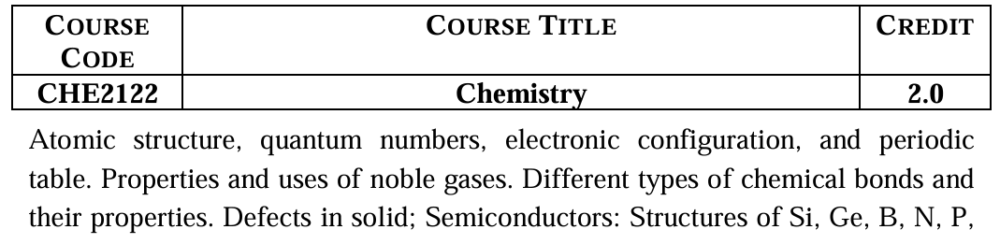
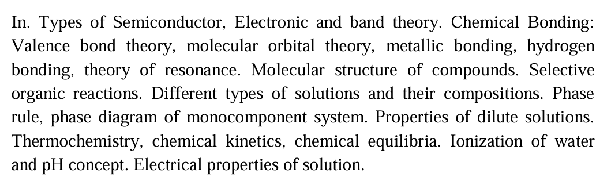

## Detailed Syllabus

??? "Syllabus Details"

    ### 1. Atomic Structure and Periodicity

    * Concept of atom and subatomic particles
    * Atomic models: Thomson, Rutherford, and Bohr models
    * Dual nature of matter and radiation
    * Heisenberg uncertainty principle
    * Quantum mechanical model of atom
    * Atomic orbitals, shapes, and orientations
    * Quantum numbers: principal, azimuthal, magnetic, and spin
    * Electronic configuration of elements
    * Aufbau principle, Pauli exclusion principle, Hund’s rule
    * Periodic table: long form periodic table
    * Periodic properties: atomic radius, ionic radius, ionization energy, electron affinity, electronegativity
    * Variation of properties across periods and groups

    ---

    ### 2. Noble Gases

    * Position of noble gases in the periodic table
    * Electronic configuration of noble gases
    * General properties: physical and chemical properties
    * Reasons for inertness
    * Compounds of noble gases (especially xenon compounds)
    * Uses of noble gases in industry, medicine, lighting, and research

    ---

    ### 3. Chemical Bonding

    * Cause of chemical bonding
    * Types of chemical bonds

    * Ionic bond
    * Covalent bond
    * Coordinate covalent bond
    * Metallic bond
    * Hydrogen bond
    * Bond parameters: bond length, bond angle, bond energy
    * Polarity of bonds and molecules
    * Valence bond theory
    * Hybridization and molecular geometry
    * Molecular orbital theory
    * Bonding in homonuclear and heteronuclear molecules
    * Theory of resonance and resonating structures

    ---

    ### 4. Solid State and Defects in Solids

    * Classification of solids: crystalline and amorphous
    * Types of crystal lattices
    * Unit cell and packing efficiency
    * Imperfections in solids

    * Point defects
    * Schottky defect
    * Frenkel defect
    * Non-stoichiometric defects
    * Effect of defects on physical properties

    ---

    ### 5. Semiconductors

    * Classification of solids based on conductivity
    * Conductors, semiconductors, and insulators
    * Intrinsic and extrinsic semiconductors
    * n-type and p-type semiconductors
    * Doping and its effect
    * Crystal structure of silicon (Si), germanium (Ge), boron (B), nitrogen (N), phosphorus (P)
    * Applications of semiconductors

    ---

    ### 6. Electronic and Band Theory

    * Energy bands in solids
    * Valence band and conduction band
    * Band gap concept
    * Band theory of conductors, semiconductors, and insulators
    * Effect of temperature on conductivity

    ---

    ### 7. Molecular Structure of Compounds

    * Lewis structures
    * VSEPR theory
    * Shapes of simple molecules
    * Hybridization and molecular geometry
    * Polarity and dipole moment

    ---

    ### 8. Selective Organic Reactions

    * Classification of organic reactions

    * Addition reactions
    * Substitution reactions
    * Elimination reactions
    * Rearrangement reactions
    * Basic reaction mechanisms
    * Simple examples of industrial and biological importance

    ---

    ### 9. Solutions

    * Types of solutions based on physical states
    * Solubility and factors affecting solubility
    * Concentration terms: molarity, molality, normality, mole fraction
    * Ideal and non-ideal solutions

    ---

    ### 10. Phase Rule and Phase Diagrams

    * Gibbs phase rule
    * Phase diagram of one-component (monocomponent) system
    * Phase diagram of water
    * Triple point and critical point
    * Applications of phase rule

    ---

    ### 11. Properties of Dilute Solutions

    * Colligative properties

    * Relative lowering of vapor pressure
    * Elevation of boiling point
    * Depression of freezing point
    * Osmotic pressure
    * Abnormal molecular mass and van’t Hoff factor

    ---

    ### 12. Thermochemistry

    * System and surroundings
    * Types of thermodynamic systems
    * Laws of thermodynamics (basic idea)
    * Enthalpy changes
    * Hess’s law
    * Bond energy and calorimetry

    ---

    ### 13. Chemical Kinetics

    * Rate of chemical reaction
    * Factors affecting reaction rate
    * Rate law and order of reaction
    * Molecularity
    * Activation energy
    * Arrhenius equation

    ---

    ### 14. Chemical Equilibrium

    * Reversible and irreversible reactions
    * Law of mass action
    * Equilibrium constant
    * Factors affecting equilibrium (Le Chatelier’s principle)

    ---

    ### 15. Ionization of Water and pH Concept

    * Self-ionization of water
    * Ionic product of water (Kw)
    * pH and pOH scale
    * Acids, bases, and salts
    * Strong and weak acids and bases
    * Buffer solutions and their importance

    ---

    ### 16. Electrical Properties of Solutions

    * Electrolytes and non-electrolytes
    * Strong and weak electrolytes
    * Conductance of solutions
    * Specific conductance and equivalent conductance
    * Kohlrausch’s law
    * Applications of conductance measurements

