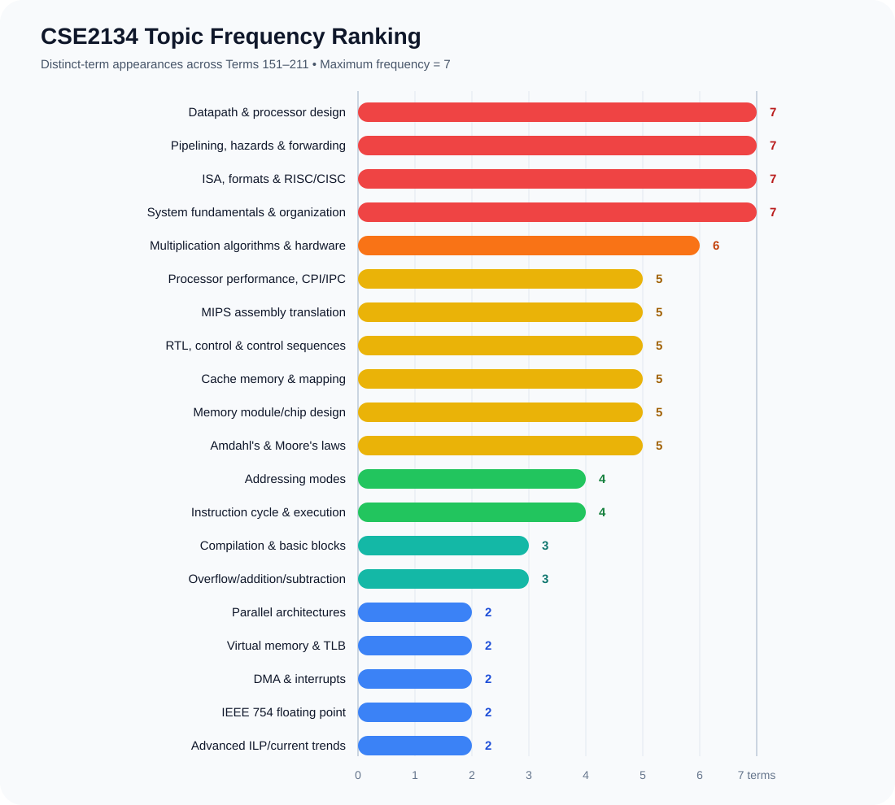

# Topic Frequency Analysis

> **Purpose:** Historical frequency analysis for exam preparation. This is an estimate based on the supplied question papers, not a guarantee of future questions.

## Analysis Scope

- **Terms analysed:** 151, 161, 171, 181, 191, 201 and 211
- **Total question papers:** 7
- **Handbook chapters:** 5
- **Counting method:** A topic is counted **once per term** when at least one question or sub-question from that topic appeared in that term.
- **Important:** Topic tags can overlap. For example, one question may involve both a datapath and control signals. Therefore, the frequencies should not be added together as if they were separate question totals.

## Colorful Ranked Frequency Graph

### Color meaning

| Color | Distinct terms | Interpretation |
|---|---:|---|
| 🔴 Red | 7 | Very high recurrence |
| 🟠 Orange | 6 | Very high recurrence |
| 🟡 Yellow | 5 | High recurrence |
| 🟢 Green | 4 | Strong recurrence |
| 🟦 Teal | 3 | Medium recurrence |
| 🔵 Blue | 2 | Lower recurrence, useful as backup |
| 🟣 Purple | 1 | Isolated past-paper topic |

## Complete Ranked Topic Table

| Rank | Topic group | Terms in which it appeared | Frequency | Priority |
|---:|---|---|---:|---|
| 1 | Datapath and processor implementation | 151, 161, 171, 181, 191, 201, 211 | **7/7** | Very high |
| 1 | Pipelining, hazards, forwarding and branch prediction | 151, 161, 171, 181, 191, 201, 211 | **7/7** | Very high |
| 1 | ISA, MIPS instruction formats, RISC/CISC and instruction representation | 151, 161, 171, 181, 191, 201, 211 | **7/7** | Very high |
| 1 | Computer-system fundamentals, classes, layers, components and organization | 151, 161, 171, 181, 191, 201, 211 | **7/7** | Very high |
| 5 | Multiplication algorithms, multiplier hardware and Booth multiplication | 151, 161, 171, 181, 191, 211 | **6/7** | Very high |
| 6 | Processor performance, CPI/IPC, execution time, MIPS and benchmarks | 151, 161, 171, 181, 191 | **5/7** | High |
| 6 | MIPS assembly-code translation | 151, 161, 171, 181, 191 | **5/7** | High |
| 6 | Register-transfer logic, processor control and control sequences | 151, 161, 181, 201, 211 | **5/7** | High |
| 6 | Cache memory, hit/miss concepts and mapping techniques | 151, 171, 181, 191, 201 | **5/7** | High |
| 6 | Memory-chip/module organization and design | 151, 161, 171, 201, 211 | **5/7** | High |
| 6 | Amdahl's Law and Moore's Law | 151, 161, 171, 181, 201 | **5/7** | High |
| 12 | Addressing modes | 151, 161, 181, 211 | **4/7** | Strong |
| 12 | Instruction cycle, instruction fetch and execution steps | 151, 181, 201, 211 | **4/7** | Strong |
| 14 | Compilation process, basic blocks and high-level-language translation | 171, 181, 191 | **3/7** | Medium |
| 14 | Overflow, addition/subtraction and related hardware | 151, 181, 191 | **3/7** | Medium |
| 16 | Flynn's classification, parallel architectures and shared memory | 151, 161 | **2/7** | Backup |
| 16 | Virtual memory, page tables, address translation and TLB | 181, 191 | **2/7** | Backup |
| 16 | DMA and interrupt handling | 191, 201 | **2/7** | Backup |
| 16 | IEEE 754 floating-point representation | 171, 191 | **2/7** | Backup |
| 16 | Advanced ILP/current trends: multithreading and dynamic scheduling | 151, 211 | **2/7** | Backup |
| 16 | Memory hierarchy, SRAM/DDR and memory–processor connection | 201, 211 | **2/7** | Backup |
| 22 | Division algorithm | 171 | **1/7** | Isolated |
| 22 | Big-Endian and Little-Endian data representation | 201 | **1/7** | Isolated |
| 22 | Standalone ALU block-diagram question | 151 | **1/7** | Isolated |

## Chapter-Level Coverage

| Handbook chapter | Terms represented | Coverage |
|---|---|---:|
| Fundamentals of a Computer System | 151, 161, 171, 181, 191, 201, 211 | **7/7** |
| Basic Processing Unit | 151, 161, 171, 181, 191, 201, 211 | **7/7** |
| Advanced Concepts in ILP and Current Trends | 151, 211 | **2/7** |
| Arithmetic for Computers | 151, 161, 171, 181, 191, 211 | **6/7** |
| Memory and I/O | 151, 161, 171, 181, 191, 201, 211 | **7/7** |

## Most Important Findings

1. **Datapath, pipelining, ISA/MIPS, and computer-system fundamentals appeared in every supplied paper.**
2. **Multiplication appeared in six of seven papers**, making it the strongest recurring arithmetic topic.
3. **Performance/CPI, MIPS translation, control/RTL, cache mapping, memory-module design, and performance laws each appeared in five terms.**
4. Memory and I/O questions are highly persistent, but the exact focus changes between cache, module design, address translation, DMA, interrupt, SRAM and memory connection.
5. Low-frequency topics should not be ignored completely. IEEE 754, virtual memory, DMA/interrupt and advanced ILP can still produce a full sub-question.

## Evidence-Based Revision Order

1. Datapath and processor design
2. Pipelining, hazards, forwarding and branch prediction
3. ISA, instruction formats, RISC/CISC and MIPS representation
4. Computer-system fundamentals and organization
5. Multiplication algorithms and hardware
6. Processor performance, CPI/IPC, execution time and Amdahl's Law
7. Cache mapping and memory-module design
8. MIPS assembly translation
9. RTL, control unit and control sequences
10. Addressing modes and instruction execution
11. Virtual memory, DMA, interrupt and IEEE 754
12. Remaining isolated topics

## Limitation

This ranking measures **historical recurrence**, not the probability guaranteed by the university. It is strongest when used to decide revision priority, while the complete syllabus should remain the final coverage target.
