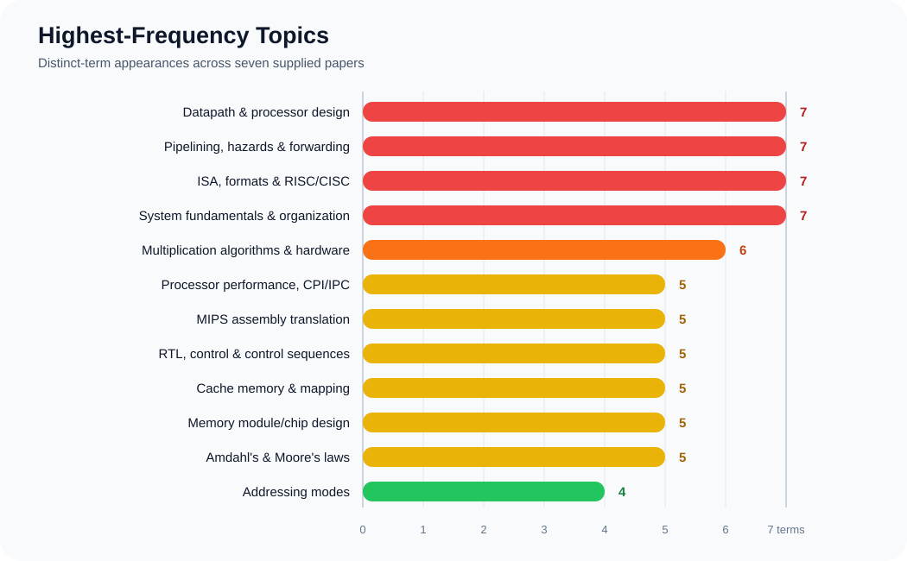

# Estimated Exam Suggestion

> **Important:** This is an evidence-based suggestion prepared from the supplied question papers for Terms 151, 161, 171, 181, 191, 201 and 211. It is not a guaranteed question paper.

## How This Suggestion Was Prepared

- Every topic was counted by the number of **distinct terms** in which it appeared.
- A topic was counted only once in one term, even when several sub-questions from that term covered it.
- The suggestion gives priority to repeated topics while maintaining balanced coverage of the five handbook chapters.
- Each selected block is an **intact 14-mark question from a supplied past paper**.
- Original wording, spelling, grammar, numbering, marks, equations, code and tables are retained.
- Questions that ask for a diagram or block diagram are kept exactly as printed. No substitute diagram has been inserted because the original question prompt did not supply one.

## Quick Frequency Graph



## Priority Summary

| Priority | Topics |
|---|---|
| **Very high** | Datapath and processor design; pipelining and hazards; ISA/MIPS formats and RISC/CISC; computer-system fundamentals; multiplication |
| **High** | Processor performance and CPI/IPC; MIPS code translation; RTL/control; cache mapping; memory-module design; Amdahl's and Moore's laws |
| **Strong** | Addressing modes; instruction cycle and execution steps |
| **Backup** | Virtual memory/TLB; DMA/interrupt; IEEE 754; parallel architecture; advanced ILP |

# Core Estimated Question Set

The following seven blocks provide a complete **7 × 14 = 98 marks** past-paper-based suggestion.

---

## Core Question 1 — Processor Performance and Amdahl's Law

**Original source: Term 161, Question 5 — 14 marks**

- **Q5(a) [5]:** How the performance of a computer is measured? Explain with example.
- **Q5(b) [6]:** Consider three different processors P1, P2, and P3 executing the same instruction set. P1 has a 3 GHz clock rate and a CPI of 1.5. P2 has a 2.5 GHz clock rate and a CPI of 1.0. P3 has a 4.0 GHz clock rate and has a CPI of 2.2.
  1. Which processor has the highest performance expressed in instructions per second?
  2. If the processors each execute a program in 10 seconds, find the number of cycles and the number of instructions.
  3. We are trying to reduce the execution time by 30% but this leads to an increase of 20% in the CPI. What clock rate should we have to get this time reduction?
- **Q5(c) [3]:** Explain Amdahl's Law.

---

## Core Question 2 — Computer Design, MIPS Formats and Assembly

**Original source: Term 171, Question 3 — 14 marks**

- **Q3(a) [4]:** Briefly discuss about four design principle of a computer.
- **Q3(b) [6]:** Explain different instruction format in MIPS machine language.
- **Q3(c) [4]:** Write down the assembly code for the following code segment:

  ```c
  f = (g + h) - (i + j);
  h = g + A[8];
  ```

---

## Core Question 3 — Datapath, Control Signals and Dynamic Scheduling

**Original source: Term 211, Question 3 — 14 marks**

- **Q3(a) [5]:** Explain with block diagram, the data path of a processor.
- **Q3(b) [3]:** What are the control signals for the data path?
- **Q3(c) [6]:** Briefly explain about dynamic scheduler with block diagram.

---

## Core Question 4 — Pipelining, Dependency and Forwarding

**Original source: Term 211, Question 4 — 14 marks**

- **Q4(a) [3]:** Explain the pipelined operation in ideal case.
- **Q4(b) [4]:** What are the issues of pipelined operation?
- **Q4(c) [3]:** Explain with example the use of operand forwarding to resolve data dependency issue.
- **Q4(d) [4]:** Show the modification in data path to support data forwarding.

---

## Core Question 5 — Binary Multiplier and Booth Algorithm

**Original source: Term 211, Question 5 — 14 marks**

- **Q5(a) [6]:** Design a 4-bit binary multiplier with details implementation.
- **Q5(b) [8]:** Briefly analysis the booth multiplication algorithm for the given input: $16 \times -2$.

---

## Core Question 6 — Memory-Module Design and Cache Mapping

**Original source: Term 171, Question 7 — 14 marks**

- **Q7(a) [6]:** Give a block diagram for a $512k \times 32$ memory module using $128k \times 8$.
- **Q7(b) [3+5]:** Why mapping function is needed when we use cache memory in the computer system? Explain three different mapping functions.

---

## Core Question 7 — Memory Technology, Interrupt and DMA

**Original source: Term 201, Question 4 — 14 marks**

- **Q4(a) [2+2]:** Define memory latency and bandwidth. What is the special feature of DDR SDRAM?
- **Q4(b) [4+2]:** Explain interrupt with its hardware circuit diagram. Draw the block diagram of multiple priority interrupt unit.
- **Q4(c) [4]:** Explain Direct Memory Access (DMA) controller with necessity diagram.

# High-Value Backup Question Set

These are full 14-mark blocks. Revise them after completing the seven core questions.

---

## Backup Question 1 — ISA, Embedded Processors and Performance Law

**Original source: Term 151, Question 1 — 14 marks**

- **Q1(a) [6]:** What do you understand by Instruction Set Architecture (ISA)? Explain the seven dimension of ISA.
- **Q1(b) [3]:** Why embedded processor market is higher than the others?
- **Q1(c) [3]:** Explain the Amdahl's law. What is the significance of this law?
- **Q1(d) [2]:** List the registers of x86 microprocessor.

---

## Backup Question 2 — MIPS Implementation, Assembly and Data Hazard

**Original source: Term 151, Question 2 — 14 marks**

- **Q2(a) [5]:** Explain the basic MIPS implementation of instruction set.
- **Q2(b) [6]:** Write down MIPS assembly code for following C code: `f = (g - h) + (i - j)`.
- **Q2(c) [3]:** What is data hazard? How do you overcome it? What are its side effects?

---

## Backup Question 3 — Benchmark Calculation and Virtual Memory

**Original source: Term 191, Question 5 — 14 marks**

- **Q5(a) [8]:** A benchmark program is run on a 40 MHz processor. The executed program consists of 100,000 instruction executions, with the following instruction mix and clock cycle count:

  | Instruction Type | Instruction Count | Cycle per Instruction |
  |---|---:|---:|
  | Integer arithmetic | 45000 | 1 |
  | Data transfer | 32000 | 2 |
  | Floating point | 15000 | 2 |
  | Control transfer | 8000 | 2 |

  Determine the effective CPI, MIPS rate for this program.

- **Q5(b) [6]:** Explain page fault, address translation and page table.

---

## Backup Question 4 — Hazard Removal, Branch Prediction and Fast Address Translation

**Original source: Term 191, Question 6 — 14 marks**

- **Q6(a) [4]:** How data and control hazard is removed? Explain.
- **Q6(b) [4]:** What is branch prediction? How branch target buffer can be used for branch prediction?
- **Q6(c) [6]:** Explain the proper techniques for fast address translation.

---

## Backup Question 5 — Memory Hierarchy, Chip Organization and SRAM

**Original source: Term 201, Question 3 — 14 marks**

- **Q3(a) [4]:** Define memory hierarchy. As one goes down the hierarchy, what happens about (i) Cost per bit; (ii) Capacity; (iii) Access time; (iv) Frequency of access of the memory by the processor.
- **Q3(b) [6]:** Explain with diagram the organization of a $1K \times 1$ memory chip.
- **Q3(c) [4]:** Describe the read and write operation from SRAM.

# Final Revision Checklist

## Must Revise First

- [ ] Single-cycle datapath and control
- [ ] Processor datapath and control signals
- [ ] Pipeline stages and ideal pipelining
- [ ] Structural, data and control hazards
- [ ] Operand forwarding and branch prediction
- [ ] ISA and MIPS instruction formats
- [ ] RISC and CISC
- [ ] MIPS assembly translation
- [ ] Binary multiplication and Booth multiplication
- [ ] CPI, IPC, execution time, MIPS and Amdahl's Law
- [ ] Cache mapping
- [ ] Memory-module design

## Revise Next

- [ ] RTL and control sequences
- [ ] Addressing modes
- [ ] Instruction cycle and execution steps
- [ ] Virtual memory, page table, TLB and address translation
- [ ] Interrupt and DMA
- [ ] IEEE 754
- [ ] Computer classes, layers, functional units and bus structure
- [ ] Flynn's classification and parallel architecture
- [ ] Dynamic scheduling and multithreading

## Suggested Practice Order

1. Answer the seven core blocks under exam timing.
2. Draw every requested datapath, pipeline, multiplier and memory diagram from memory.
3. Solve the numerical performance and multiplication questions without notes.
4. Complete the five backup blocks.
5. Use the frequency table only for priority; do not omit the remaining syllabus.

## Final Note

The strongest historical pattern is clear: **datapath, pipelining, ISA/MIPS, system organization, multiplication, performance, cache and memory design** deserve the greatest revision time. However, a lower-frequency topic may still appear, so this file should guide priority rather than replace complete syllabus preparation.
