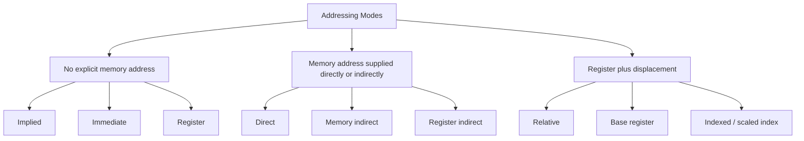
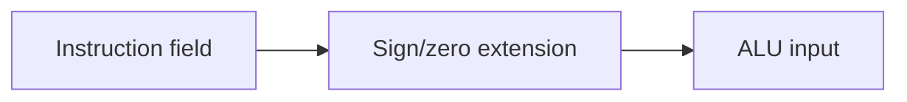
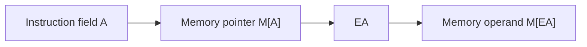

# Addressing Modes

## A Mega Note and Book-Chapter-Style Guide for Computer Organization and Architecture

An addressing mode is the rule that connects an instruction with its operand. This chapter organizes the supplied material from the basic meaning of an operand and Effective Address to individual addressing modes, combined address calculations, numerical problems, architecture examples, performance considerations, exam-ready answers, and revision.

Technical terms are kept in English because they are standard Computer Organization and Architecture jargon. Short Bangla explanations are retained where they remove common confusion.

---

# Table of Contents

### Part I — Foundations

1. [The basic idea](#1-the-basic-idea)
2. [Operand, address, and Effective Address](#2-operand-address-and-effective-address)
3. [Why addressing modes are necessary](#3-why-addressing-modes-are-necessary)
4. [Instruction-format connection](#4-instruction-format-connection)
5. [Notation used in this chapter](#5-notation-used-in-this-chapter)
6. [Classification](#6-classification)

### Part II — Fundamental Addressing Modes

7. [Implied addressing](#7-implied-addressing)
8. [Immediate addressing](#8-immediate-addressing)
9. [Register addressing](#9-register-addressing)
10. [Register-indirect addressing](#10-register-indirect-addressing)
11. [Auto-increment and auto-decrement](#11-auto-increment-and-auto-decrement)
12. [Direct addressing](#12-direct-addressing)
13. [Memory-indirect addressing](#13-memory-indirect-addressing)

### Part III — Relative, Base, Index, and Stack Forms

14. [Relative or PC-relative addressing](#14-relative-or-pc-relative-addressing)
15. [Base-register addressing](#15-base-register-addressing)
16. [Indexed addressing](#16-indexed-addressing)
17. [Stack addressing](#17-stack-addressing)
18. [Modern displacement and scaled-index forms](#18-modern-displacement-and-scaled-index-forms)

### Part IV — Comparison and Application

19. [Complete comparison table](#19-complete-comparison-table)
20. [Frequently confused pairs](#20-frequently-confused-pairs)
21. [Worked numerical problems](#21-worked-numerical-problems)
22. [How high-level programs use the modes](#22-how-high-level-programs-use-the-modes)
23. [Examples from MIPS, ARM, and x86](#23-examples-from-mips-arm-and-x86)
24. [Performance and design considerations](#24-performance-and-design-considerations)
25. [Common mistakes](#25-common-mistakes)

### Part V — Exam Preparation and Revision

26. [Exam-ready answers](#26-exam-ready-answers)
27. [Practice questions with answers](#27-practice-questions-with-answers)
28. [Final revision sheet](#28-final-revision-sheet)
29. [সহজ বাংলা রিভিশন](#29-সহজ-বাংলা-রিভিশন)

---

# Part I — Foundations

# 1. The basic idea

A machine instruction must answer two main questions:

1. **What operation will the processor perform?**
2. **Where will the processor obtain the operand?**

The opcode answers the first question. The addressing mode answers the second.

> **Definition:** An addressing mode is the rule used by the processor to interpret an instruction's operand field and locate or obtain the required operand.

Consider:

```text
ADD R1, X
```

The symbol `X` could mean different things:

* the number `X` itself;
* register number `X`;
* memory location `X`;
* a pointer stored at location `X`;
* an offset to be added to the PC;
* an offset to be added to a base or index register.

The addressing mode removes this ambiguity.

## One idea, different interpretations

Suppose the instruction field contains `500`.

| Interpretation | Meaning                                                                |
| -------------- | ---------------------------------------------------------------------- |
| Immediate      | Use the number `500`                                                   |
| Direct         | Use the value stored in `M[500]`                                       |
| Indirect       | Read an address from `M[500]`, then read the operand from that address |
| Relative       | Add `500` to the PC                                                    |
| Base           | Add `500` to a base register                                           |

বাংলায় সহজ কথা: **Instruction-এর address/operand field-এ একটি সংখ্যা দেখলেই সেটি data নাকি address বোঝা যায় না। Addressing mode বলে দেয় সংখ্যাটিকে কীভাবে ব্যবহার করতে হবে।**

---

# 2. Operand, address, and Effective Address

These three terms must not be mixed.

## Operand

The operand is the actual data used by an operation.

For:

```text
ADD R1, R2
```

the values stored in `R1` and `R2` are operands.

## Address

An address identifies a location in memory.

If `1200` is an address, then `M[1200]` means the value stored at location `1200`.

## Effective Address

The **Effective Address (EA)** is the final memory address calculated by the processor for a memory operand.

```text
Instruction fields + relevant registers
                    ↓
             EA calculation
                    ↓
              Memory access
                    ↓
                 Operand
```

If:

```text
R2 = 1000
Displacement = 24
```

then in base-plus-displacement addressing:

```text
EA = (R2) + 24
   = 1000 + 24
   = 1024

Operand = M[1024]
```

## The most important distinction

```text
EA       = address of the operand
M[EA]    = operand stored at that address
```

If the instruction only uses a register or an immediate constant, a memory EA may not be required at all.

---

# 3. Why addressing modes are necessary

## 3.1 Programming flexibility

Programs operate on constants, registers, variables, pointers, arrays, structures, stacks, and branch targets. One addressing rule would make some of these operations difficult or inefficient.

## 3.2 Shorter instructions

A register can be named with only a few bits. For example, selecting one of 32 registers needs only 5 bits. Embedding a full 32-bit or 64-bit address would require a much larger instruction.

## 3.3 Faster execution

Register and immediate operands avoid an extra data-memory read. This usually makes them faster than memory-based operands.

## 3.4 Relocation

Relative and base-register modes let a program or data block move without changing every instruction address.

## 3.5 Efficient data structures

* Arrays need indexing.
* Linked lists need pointers.
* Records need base plus field offset.
* Stacks need automatic pointer adjustment.
* Loops need nearby relative branches.

## 3.6 Larger address reach

An instruction may hold only a small displacement, but a register can hold a full machine address. Combining both provides compact instructions and a large address space.

---

# 4. Instruction-format connection

A general instruction may be represented as:

```text
+----------+----------+-------------+----------------------+
|  Opcode  | Mode bit | Register(s) | Address/Displacement |
+----------+----------+-------------+----------------------+
```

The exact fields depend on the ISA.

## Mode field

The mode field tells the control unit how to interpret the operand field.

Example:

| Mode bits | Possible interpretation |
| --------- | ----------------------- |
| `00`      | Immediate               |
| `01`      | Register                |
| `10`      | Direct                  |
| `11`      | Register indirect       |

This is only an illustrative encoding. A real ISA may encode modes through opcode variants rather than a separate mode field.

## Trade-off

More addressing modes provide flexibility, but their encodings consume instruction bits and can make decoding more complex. RISC architectures usually keep a small, regular set. CISC architectures often support many combinations.

---

# 5. Notation used in this chapter

| Symbol | Meaning                                                     |
| ------ | ----------------------------------------------------------- |
| `A`    | Address, constant, or displacement field in the instruction |
| `R`    | A register named by the instruction                         |
| `BR`   | Base register                                               |
| `IX`   | Index register                                              |
| `PC`   | Program Counter                                             |
| `SP`   | Stack Pointer                                               |
| `(R)`  | Contents of register `R`                                    |
| `M[x]` | Contents of memory location `x`                             |
| `EA`   | Effective Address                                           |
| `d`    | Size of an accessed item                                    |
| `←`    | Assignment or data transfer                                 |

The parentheses and square brackets have different roles:

```text
(R2)       = value currently held in R2
M[(R2)]    = memory value at the address held in R2
```

---

# 6. Classification



Auto-increment and auto-decrement are normally treated as special register-indirect modes. Stack addressing is often treated as an implied or specialized register-indirect mode.

---

# Part II — Fundamental Addressing Modes

# 7. Implied addressing

## Definition

In implied addressing, the operand is specified implicitly by the opcode or processor architecture. The instruction does not contain an explicit operand address.

## Rule

```text
Operand = architecturally implied location or state
```

## Examples

```text
CMA       ; complement accumulator
CLC       ; clear carry flag
STC       ; set carry flag
NOP       ; no operation
RET       ; use the return address through the implied stack mechanism
```

## Internal operation example

For `CMA`:

```text
AC ← NOT AC
```

The accumulator `AC` is not written in the instruction; the opcode implies it.

## Advantages

* Very short instruction.
* No operand-address calculation.
* Simple decoding for fixed operations.

## Limitations

* The programmer cannot choose a different operand.
* It is suitable only when the architecture defines a natural fixed operand.

## Typical uses

* flag operations;
* accumulator operations;
* stack operations;
* processor-control instructions.

## Key warning

Implied addressing does **not** mean that the instruction has no effect on data. It means that the affected data location is already understood.

---

# 8. Immediate addressing

## Definition

In immediate addressing, the actual operand is included in the instruction.

## Rule

```text
Operand = A
```

No EA is needed for the source constant.

## Examples

```text
MOV R1, #25
ADD R2, R2, #4
AND R3, R3, #0xFF
```

The `#` symbol commonly indicates a literal constant, though syntax varies by assembler.

## Data path



## Sign extension and zero extension

If the immediate field is shorter than the register width, it must be extended.

Example: an 8-bit immediate `1111 1100`.

* Sign-extended to 16 bits: `1111 1111 1111 1100` = `-4`
* Zero-extended to 16 bits: `0000 0000 1111 1100` = `252`

The opcode determines which extension rule is used.

## Advantages

* No data-memory read for the operand.
* Fast and compact for small constants.
* Useful for initialization and arithmetic with fixed values.

## Limitations

* The constant range is limited by field width.
* The constant is fixed inside the instruction.
* Large constants may require multiple instructions.

## Range example

For a 12-bit signed immediate:

```text
Range = −2^(12−1) to 2^(12−1)−1
      = −2048 to +2047
```

For a 12-bit unsigned immediate:

```text
Range = 0 to 2^12−1
      = 0 to 4095
```

---

# 9. Register addressing

## Definition

The instruction names a CPU register containing the operand.

## Rule

```text
Operand = (R)
```

## Example

```text
ADD R1, R2
```

In a two-address machine:

```text
R1 ← R1 + R2
```

In a three-address RISC machine:

```text
ADD R3, R1, R2
R3 ← R1 + R2
```

## Why the encoding is compact

If the processor has:

* 8 registers, a register number needs 3 bits;
* 16 registers, it needs 4 bits;
* 32 registers, it needs 5 bits.

This is much smaller than a full memory address.

## Advantages

* Very fast access.
* No data-memory access for the register operand.
* Small operand field.
* Reduces pressure on the memory bus.

## Limitations

* Register count is limited.
* Values must first be loaded from memory when not already in registers.

## Key warning

The register number is not an EA. If the instruction names `R5`, the operand is the contents of `R5`, not `M[5]`.

---

# 10. Register-indirect addressing

## Definition

The instruction names a register that contains the memory address of the operand.

## Formula

```text
EA = (R)
Operand = M[EA] = M[(R)]
```

## Worked example

Given:

```text
R2 = 1200
M[1200] = 75
```

Instruction:

```text
LOAD R1, (R2)
```

Execution:

```text
EA = (R2) = 1200
R1 ← M[1200] = 75
```

## Data path


## Advantages

* Natural pointer support.
* The register can hold a full-width address.
* The same instruction can access many locations by changing the register.
* Useful for dynamic data structures and sequential traversal.

## Limitations

* A data-memory access is needed.
* A register must be occupied by the address.

## Register versus register indirect

Suppose `R2 = 1200` and `M[1200] = 75`.

| Mode              |           Result |
| ----------------- | ---------------: |
| Register          | Operand = `1200` |
| Register indirect |   Operand = `75` |

---

# 11. Auto-increment and auto-decrement

These modes combine memory access and address-register update.

## 11.1 Auto-increment

### Rule

```text
EA = (R)
Operand = M[EA]
R ← R + d
```

Example:

```text
LOAD R1, (R2)+
```

If `R2 = 2000`, a 32-bit word occupies 4 bytes, and `M[2000] = 90`:

```text
R1 ← 90
R2 ← 2004
```

The old address is used before the register changes.

## 11.2 Auto-decrement

### Rule

```text
R ← R − d
EA = (R)
Operand = M[EA]
```

Example:

```text
LOAD R1, -(R2)
```

If `R2 = 2004` and `d = 4`:

```text
R2 ← 2000
R1 ← M[2000]
```

The register changes before the access.

## Why `d` matters

Address registers usually hold byte addresses.

| Data type  | Typical update |
| ---------- | -------------: |
| Byte       |            `1` |
| Halfword   |            `2` |
| Word       |            `4` |
| Doubleword |            `8` |

## Uses

* scanning arrays;
* reading strings;
* block copy;
* stack push/pop;
* processing buffers.

## Stack example

In a descending stack, push may behave like:

```text
SP ← SP − 4
M[SP] ← R1
```

Pop may behave like:

```text
R1 ← M[SP]
SP ← SP + 4
```

## Key warning

Auto-increment is commonly **post-increment**, while auto-decrement is commonly **pre-decrement**. Check the assembly syntax and ISA definition.

---

# 12. Direct addressing

## Definition

The address field of the instruction directly specifies the memory address of the operand.

## Formula

```text
EA = A
Operand = M[A]
```

## Example

Given:

```text
A = 500
M[500] = 80
```

Instruction:

```text
LOAD R1, 500
```

Result:

```text
EA = 500
R1 ← M[500] = 80
```

## Data path


## Advantages

* Simple EA calculation.
* Easy to understand.
* Useful for fixed variables and memory-mapped I/O addresses.

## Limitations

* Address range is restricted by the field width.
* The fixed address reduces relocation flexibility.
* Requires a data-memory access.

## Address range example

If the direct-address field is 16 bits:

```text
Directly encodable addresses = 0 to 2^16−1
                             = 0 to 65,535
```

This cannot directly identify every location in a larger address space.

---

# 13. Memory-indirect addressing

## Definition

The instruction address field identifies a memory location containing the final operand address.

## Formula

```text
EA = M[A]
Operand = M[EA] = M[M[A]]
```

## Worked example

Given:

```text
A = 500
M[500] = 1200
M[1200] = 75
```

Execution:

```text
EA = M[500] = 1200
Operand = M[1200] = 75
```

## Data path



## Advantages

* Supports pointers stored in memory.
* The pointer can change without changing the instruction.
* A memory word can hold a full address.

## Limitations

* Normally two data-memory reads are required.
* It is slower and increases memory traffic.

## Memory-reference count

Ignoring instruction fetch:

| Mode              | Extra data-memory reads to obtain source operand |
| ----------------- | -----------------------------------------------: |
| Immediate         |                                                0 |
| Register          |                                                0 |
| Direct            |                                                1 |
| Register indirect |                                                1 |
| Memory indirect   |                                                2 |

## Key warning

In indirect addressing:

```text
M[A] = address
M[M[A]] = operand
```

Do not treat the first memory value as the final data.

---

# Part III — Relative, Base, Index, and Stack Forms

# 14. Relative or PC-relative addressing

## Definition

A signed displacement is added to the Program Counter to calculate the target address.

## Formula

```text
EA = (PC) + sign_extend(A)
```

The ISA may define `(PC)` as the current instruction address or, more commonly, the address of the next instruction.

## Positive displacement

```text
PC = 1000
A = +40
EA = 1040
```

## Negative displacement

```text
PC = 1000
A = −24
EA = 976
```

## Typical use

```text
BEQ R1, R2, LOOP
BNE R3, R0, AGAIN
JREL +100
```

## Why branches use it

Branch targets are usually close to the current instruction. A small signed displacement can encode these targets efficiently.

## Relocation benefit

Suppose code moves from address `1000` to `5000`. If the branch source and target move together, their relative distance stays unchanged. Therefore, the encoded displacement may remain valid.

## Range calculation

For a signed `n`-bit displacement:

```text
Raw range = −2^(n−1) to 2^(n−1)−1
```

If instructions are 4-byte aligned and the displacement counts instructions:

```text
Byte reach = raw displacement × 4
```

Example, 16-bit signed word offset:

```text
Minimum = −32,768 × 4 = −131,072 bytes
Maximum =  32,767 × 4 =  131,068 bytes
```

## Common mistake

Students often add the displacement to the wrong PC. If the processor has already incremented PC during fetch, use the incremented PC when the ISA specifies it.

---

# 15. Base-register addressing

## Definition

A base register contains the starting address of a memory region, and the instruction supplies a displacement.

## Formula

```text
EA = (BR) + sign_extend(A)
```

## Worked example

```text
BR = 4000
A = 24
EA = 4024
Operand = M[4024]
```

## Conceptual model

```text
Base address of object/region + field or local offset
```

## Main uses

### Structure field

If a student record begins at `5000` and the `roll` field is 12 bytes from the beginning:

```text
EA = 5000 + 12 = 5012
```

### Stack frame

If frame pointer `FP = 8000` and a local variable is at offset `−16`:

```text
EA = 8000 − 16 = 7984
```

### Program relocation

Instructions may retain the same offsets while the base register changes to the program's new memory region.

## Advantages

* Compact encoding.
* Full-address reach through the register.
* Supports relocation, structures, and stack frames.

## Limitations

* The displacement has a limited range.
* A register must hold the base address.

---

# 16. Indexed addressing

## Definition

An index register is combined with a fixed address or base to access an element within an array, string, or table.

## Classical formula

```text
EA = A + (IX)
```

Here, `A` is often the array's starting address, and `(IX)` changes during a loop.

## Array example

An array begins at `2000`. Each element is 4 bytes. We need `A[6]`.

If the index register stores the byte offset:

```text
IX = 6 × 4 = 24
EA = 2000 + 24 = 2024
```

If the architecture supports scaling:

```text
EA = Base + Index × Scale
   = 2000 + 6 × 4
   = 2024
```

## Multidimensional array

For a row-major array:

```text
Address of A[i][j]
= Base + ((i × number_of_columns) + j) × element_size
```

Example:

```text
Base = 1000
Columns = 5
i = 2
j = 3
Element size = 4

EA = 1000 + ((2 × 5) + 3) × 4
   = 1000 + 13 × 4
   = 1052
```

## Advantages

* Efficient array and table access.
* The instruction's fixed part can remain unchanged while the index changes.
* Scaled indexing directly supports element sizes.

## Limitations

* EA calculation is more complex.
* The programmer/compiler must know whether the index is an element number or byte offset.

---

# 17. Stack addressing

## Definition

The operand is at or near the top of a stack, usually identified implicitly by the Stack Pointer.

## Basic rule

```text
EA = (SP)
```

The operation may also update `SP`.

## Examples

```text
PUSH R1
POP R2
CALL FUNCTION
RET
```

## Why it may be called implied

In `PUSH R1`, the source register is explicit, but the memory destination is implied by `SP`. In `RET`, even the return-address source is often implied by the stack mechanism.

## Main uses

* procedure calls;
* return addresses;
* saved registers;
* parameters;
* local variables;
* expression evaluation.

---

# 18. Modern displacement and scaled-index forms

Real processors often combine the basic modes.

## Base plus displacement

```text
EA = (Base) + Displacement
```

Used by MIPS and many RISC load/store instructions.

## Base plus index

```text
EA = (Base) + (Index)
```

Useful when both an object base and a changing offset are held in registers.

## Base plus scaled index plus displacement

```text
EA = (Base) + (Index × Scale) + Displacement
```

This is a powerful x86-style form.

Example:

```text
Base = 1000
Index = 7
Scale = 4
Displacement = 12

EA = 1000 + 7 × 4 + 12
   = 1040
```

Possible interpretation:

* `Base` points to a record or array;
* `Index × 4` selects an integer element;
* `12` selects a field or subarray offset.

## Scale values

Common scale factors are `1`, `2`, `4`, and `8`, matching common element sizes.

---

# Part IV — Comparison and Application

# 19. Complete comparison table

| Mode              | EA / operand rule      | Operand location            |              Data-memory reads* | Main use                       |
| ----------------- | ---------------------- | --------------------------- | ------------------------------: | ------------------------------ |
| Implied           | Fixed by opcode        | Implied register/flag/stack |        0 or operation-dependent | Flags, accumulator, control    |
| Immediate         | `Operand = A`          | Instruction                 |                               0 | Constants                      |
| Register          | `Operand = (R)`        | Register                    |                               0 | Fast temporary data            |
| Register indirect | `EA = (R)`             | Memory                      |                               1 | Pointers                       |
| Auto-increment    | `EA=(R)`; then `R←R+d` | Memory                      |                               1 | Forward traversal              |
| Auto-decrement    | `R←R−d`; then `EA=(R)` | Memory                      |                               1 | Stack/reverse traversal        |
| Direct            | `EA = A`               | Memory                      |                               1 | Fixed variables                |
| Memory indirect   | `EA = M[A]`            | Memory                      |                               2 | Pointer stored in memory       |
| Relative          | `EA = (PC) + A`        | Usually target address      | 0 for branch target calculation | Branches                       |
| Base register     | `EA = (BR) + A`        | Memory                      |                               1 | Frames, relocation, structures |
| Indexed           | `EA = A + (IX)`        | Memory                      |                               1 | Arrays, tables                 |
| Stack             | `EA = (SP)`            | Stack memory                |             Operation-dependent | Calls, push/pop                |

*Instruction fetch is not counted. A store writes memory rather than reading the final operand.

---

# 20. Frequently confused pairs

## 20.1 Immediate versus direct

```text
Immediate: Operand = A
Direct:    Operand = M[A]
```

If `A = 500` and `M[500] = 80`:

| Mode      | Operand |
| --------- | ------: |
| Immediate |     500 |
| Direct    |      80 |

## 20.2 Register versus register indirect

```text
Register:          Operand = (R)
Register indirect: Operand = M[(R)]
```

If `R = 1200` and `M[1200] = 75`:

| Mode              | Operand |
| ----------------- | ------: |
| Register          |    1200 |
| Register indirect |      75 |

## 20.3 Direct versus memory indirect

```text
Direct:   EA = A
Indirect: EA = M[A]
```

If `A=500`, `M[500]=1200`, and `M[1200]=75`:

| Mode     |   EA | Operand |
| -------- | ---: | ------: |
| Direct   |  500 |    1200 |
| Indirect | 1200 |      75 |

## 20.4 Base versus indexed

The arithmetic may be identical:

```text
EA = Register + Displacement
```

The intended role differs:

| Base register                        | Index register                     |
| ------------------------------------ | ---------------------------------- |
| Holds the start of a region/object   | Holds a changing position          |
| Displacement often selects a field   | Fixed address often names an array |
| Good for relocation and stack frames | Good for loops and arrays          |

In modern architectures, the distinction may be mostly conceptual.

## 20.5 Relative versus base

```text
Relative: EA = PC + displacement
Base:     EA = general/base register + displacement
```

Relative addressing uses the PC automatically. Base addressing names another register.

---

# 21. Worked numerical problems

## Problem 1: Identify the operand in several modes

Given:

```text
A = 400
R1 = 900
PC = 1000
M[400] = 700
M[700] = 55
M[900] = 88
```

### Immediate

```text
Operand = A = 400
```

### Register

```text
Operand = (R1) = 900
```

### Direct

```text
EA = 400
Operand = M[400] = 700
```

### Memory indirect

```text
EA = M[400] = 700
Operand = M[700] = 55
```

### Register indirect

```text
EA = (R1) = 900
Operand = M[900] = 88
```

### Relative

```text
EA = PC + A = 1000 + 400 = 1400
```

For a branch, `1400` is the target; the processor does not normally fetch a data operand from `M[1400]`.

---

## Problem 2: Auto-increment

Given:

```text
R3 = 2000
M[2000] = 25
Word size = 4 bytes
```

Instruction:

```text
LOAD R1, (R3)+
```

Solution:

```text
EA = 2000
R1 ← M[2000] = 25
R3 ← 2000 + 4 = 2004
```

---

## Problem 3: Auto-decrement

Given:

```text
R3 = 2004
M[2000] = 25
Word size = 4 bytes
```

Instruction:

```text
LOAD R1, -(R3)
```

Solution:

```text
R3 ← 2004 − 4 = 2000
EA = 2000
R1 ← M[2000] = 25
```

---

## Problem 4: Signed PC-relative branch

Given:

```text
Address of branch instruction = 1000
Instruction length = 4 bytes
Encoded displacement = −20 bytes
ISA uses next PC as base
```

First:

```text
Next PC = 1000 + 4 = 1004
```

Then:

```text
Target = 1004 − 20 = 984
```

---

## Problem 5: Indexed array

An array `A` starts at address `3000`. Each element is 8 bytes. Find `A[9]`.

```text
Offset = 9 × 8 = 72
EA = 3000 + 72 = 3072
```

---

## Problem 6: Base register and structure

A structure starts at address `6000`. A 4-byte field begins 28 bytes from the start.

```text
Base = 6000
Displacement = 28
EA = 6028
```

The bytes of the field begin at `6028`.

---

## Problem 7: x86-style scaled indexing

Given:

```text
Base = 10,000
Index = 12
Scale = 4
Displacement = 16
```

```text
EA = Base + Index × Scale + Displacement
   = 10,000 + 12 × 4 + 16
   = 10,064
```

---

# 22. How high-level programs use the modes

## Constant

C:

```c
x = 10;
```

Assembly idea:

```text
MOV R1, #10
```

Mode: immediate.

## Local arithmetic

C:

```c
c = a + b;
```

After values are loaded:

```text
ADD R3, R1, R2
```

Mode: register.

## Pointer dereference

C:

```c
x = *p;
```

Assembly idea:

```text
LOAD R1, (Rp)
```

Mode: register indirect.

## Structure field

C:

```c
x = student.roll;
```

Assembly idea:

```text
LOAD R1, roll_offset(Rbase)
```

Mode: base plus displacement.

## Array element

C:

```c
x = A[i];
```

Assembly idea:

```text
EA = A_base + i × element_size
```

Mode: indexed or scaled indexed.

## Loop branch

C:

```c
while (i < n) {
    ...
}
```

Assembly idea:

```text
BLT Ri, Rn, LOOP
```

Mode: PC-relative for the branch target.

---

# 23. Examples from MIPS, ARM, and x86

## 23.1 MIPS

MIPS has a small, regular set of addressing forms.

### Register

```asm
add $t0, $t1, $t2
```

### Immediate

```asm
addi $t0, $t1, 20
```

### Base plus displacement

```asm
lw $t0, 16($s0)
```

```text
EA = ($s0) + 16
```

### PC-relative branch

```asm
beq $t0, $t1, LABEL
```

### Pseudo-direct jump

Traditional MIPS jump instructions combine an instruction field with upper PC bits. This is commonly discussed separately from the basic data-addressing modes.

## 23.2 ARM / AArch64

ARM supports register, immediate, base-plus-offset, and update forms.

```asm
ADD X0, X1, #8
LDR X0, [X1, #16]
LDR X0, [X1], #8
LDR X0, [X1, #-8]!
```

Conceptually:

* `[X1, #16]`: base plus displacement;
* `[X1], #8`: post-index/update;
* `[X1, #-8]!`: pre-index/update.

## 23.3 x86

x86 supports rich combinations:

```asm
mov eax, [rbx + rcx*4 + 16]
```

```text
EA = RBX + RCX × 4 + 16
```

This combines base, scaled index, and displacement in one instruction.

## Architectural lesson

The mathematical ideas are shared, but syntax and exact behavior differ. Always use the ISA manual when exact encoding, PC value, sign extension, or update order matters.

---

# 24. Performance and design considerations

## Register and immediate modes

These usually provide the fastest operand supply because they avoid an extra data-cache lookup. They also reduce memory traffic.

## Memory modes

Direct, register-indirect, base, and indexed modes require a memory access. Actual time depends heavily on the cache hierarchy.

## Memory indirect

It may create a serial dependency:

```text
read pointer → obtain EA → read operand
```

The second access cannot begin until the first produces the address.

## Complex EA calculation

Modern processors usually contain an Address Generation Unit (AGU) that calculates forms such as:

```text
Base + Index × Scale + Displacement
```

Complex addressing can reduce instruction count, but it consumes hardware resources and may affect scheduling or throughput.

## Code density

Rich addressing modes can perform more work per instruction and improve code density. Regular RISC modes simplify decoding and pipelining. Modern designs balance these goals differently.

---

# 25. Common mistakes

1. Treating immediate data as a memory address.
2. Treating a register number as the operand instead of reading the register.
3. Forgetting the final memory access after calculating EA.
4. Stopping at `M[A]` in memory-indirect mode.
5. Counting instruction fetch as a data-memory reference when the question excludes it.
6. Forgetting sign extension for a negative displacement.
7. Using the current PC when the ISA specifies the next PC.
8. Incrementing by 1 when the operand occupies 4 or 8 bytes.
9. Mixing pre-decrement with post-decrement.
10. Multiplying an index by element size twice.
11. Claiming base and index modes are mathematically different in every ISA.
12. Forgetting that branch EA is a target address, not usually a data operand address.

---

# Part V — Exam Preparation and Revision

# 26. Exam-ready answers

## Short definition: What is addressing mode?

An addressing mode is the method used by a processor to interpret an instruction's operand field and determine where the operand is located. It may provide the operand directly, identify a register, specify a memory address, or calculate an Effective Address using registers and displacement values. Addressing modes improve flexibility, code density, relocation, and support for data structures.

## Explain Effective Address

The Effective Address is the final memory address calculated by the processor for a memory operand. It is produced according to the selected addressing mode. For example, in direct addressing `EA=A`; in register-indirect addressing `EA=(R)`; and in base-register addressing `EA=(BR)+A`. After EA is obtained, the memory operand is normally read as `M[EA]`.

## Five-mark comparison

| Mode              | Formula       | One use         |
| ----------------- | ------------- | --------------- |
| Immediate         | `Operand=A`   | Constants       |
| Register          | `Operand=(R)` | Fast arithmetic |
| Direct            | `EA=A`        | Fixed variable  |
| Register indirect | `EA=(R)`      | Pointer         |
| Relative          | `EA=(PC)+A`   | Branch          |
| Indexed           | `EA=A+(IX)`   | Array           |

## Ten-mark descriptive answer structure

For a long answer:

1. Define addressing mode and EA.
2. State why modes are required.
3. Explain each requested mode.
4. Write its EA/operand formula.
5. Give one instruction example.
6. Mention one advantage and one use.
7. Add a comparison table.
8. Finish with a short conclusion.

## Conclusion paragraph

Addressing modes form the link between an instruction and its data. Simple modes such as immediate and register provide speed, while indirect, base, indexed, relative, and auto-update modes provide pointer support, relocation, arrays, branches, and stack operations. The choice of mode affects instruction size, memory references, execution speed, and programming flexibility.

---

# 27. Practice questions with answers

## Q1. What is the difference between EA and operand?

**Answer:** EA is the final memory address. The operand is the data stored at that address. Thus, for a memory operand, `EA` is an address and `M[EA]` is the data.

## Q2. Which modes need no data-memory read for a source operand?

**Answer:** Immediate and register modes. Implied mode may also avoid a data-memory read when the implied operand is a register or flag.

## Q3. Which mode normally needs two data-memory reads?

**Answer:** Memory-indirect addressing: one read obtains the pointer and the second obtains the operand.

## Q4. Why is relative addressing suitable for branches?

**Answer:** Branch targets are usually close to the branch instruction. A small signed offset is enough, and the code remains relocatable if source and target move together.

## Q5. Why is register-indirect addressing useful for pointers?

**Answer:** A pointer is an address. When the address is held in a register, register-indirect addressing uses that register value as EA and accesses the pointed memory location.

## Q6. If `R2=500`, `M[500]=900`, and `M[900]=30`, find the operand.

| Mode              | Operand |
| ----------------- | ------: |
| Register          |     500 |
| Register indirect |     900 |

If instruction field `A=500`:

| Mode            | Operand |
| --------------- | ------: |
| Direct          |     900 |
| Memory indirect |      30 |

## Q7. What is the role of scaling in indexed addressing?

**Answer:** Scaling converts an element index into a byte offset. For 4-byte elements, index `i` requires offset `i×4`.

## Q8. What is the difference between post-increment and pre-decrement?

**Answer:** Post-increment uses the old register value as EA and increments afterward. Pre-decrement reduces the register first and uses the new value as EA.

---

# 28. Final revision sheet

## Formulas

```text
Implied           Operand is understood from opcode
Immediate         Operand = A
Register          Operand = (R)
Register indirect EA = (R);          Operand = M[(R)]
Auto-increment    EA = (R);          R ← R + d after access
Auto-decrement    R ← R − d;         EA = (R) after update
Direct            EA = A;            Operand = M[A]
Memory indirect   EA = M[A];         Operand = M[M[A]]
Relative          EA = (PC) + A
Base register     EA = (BR) + A
Indexed           EA = A + (IX)
Scaled indexed    EA = Base + Index × Scale + Displacement
Stack             EA = (SP), with architecture-defined update
```

## One-line memory trick

```text
Immediate = value in instruction
Register = value in register
Direct = address in instruction
Register indirect = address in register
Indirect = address in memory
Relative = PC + offset
Base = base + offset
Indexed = array base + changing index
```

## Speed tendency

```text
Register / Immediate
        ↓
One-memory-access modes
        ↓
Memory indirect
```

This is a conceptual tendency. Cache behavior and processor implementation determine actual performance.

---

# 29. সহজ বাংলা রিভিশন

## Addressing Mode কী?

Processor instruction-এর operand কোথায় আছে বা কীভাবে operand বের করতে হবে—এই নিয়মকেই **Addressing Mode** বলে।

## EA কী?

`EA` বা **Effective Address** হলো calculation করার পর পাওয়া operand-এর final memory address।

```text
EA = operand-এর ঠিকানা
M[EA] = সেই ঠিকানায় থাকা আসল data
```

## খুব সহজে সব mode

| Mode              | সহজ বাংলা অর্থ                                                     |
| ----------------- | ------------------------------------------------------------------ |
| Implied           | operand লেখা নেই; opcode দেখেই CPU বুঝে নেয়                        |
| Immediate         | instruction-এর মধ্যেই আসল data দেওয়া                               |
| Register          | register-এর ভিতরে আসল data                                         |
| Register indirect | register-এর ভিতরে data-এর memory address                           |
| Direct            | instruction-এ সরাসরি memory address                                |
| Indirect          | instruction যে memory location দেখায়, সেখানে আবার আসল address রাখা |
| Relative          | PC-এর সঙ্গে offset যোগ করে address                                 |
| Base              | base register-এর সঙ্গে offset যোগ                                  |
| Indexed           | array-এর base-এর সঙ্গে index যোগ                                   |
| Auto-increment    | access করার পর pointer সামনে যায়                                   |
| Auto-decrement    | pointer আগে পেছনে যায়, তারপর access হয়                             |

## সবচেয়ে গুরুত্বপূর্ণ পার্থক্য

ধরি:

```text
R1 = 500
M[500] = 80
```

তাহলে:

```text
Register mode          → operand = 500
Register indirect mode → operand = 80
```

আবার instruction field `A=500` হলে:

```text
Immediate mode → operand = 500
Direct mode    → operand = M[500] = 80
```

## পরীক্ষার আগে মনে রাখবেন

* Immediate-এ সংখ্যা হলো data।
* Direct-এ সংখ্যা হলো address।
* Register-এ register-এর value হলো data।
* Register indirect-এ register-এর value হলো address।
* Indirect-এ দুই ধাপে memory access হয়।
* Relative branch-এ PC-এর সঙ্গে signed offset যোগ হয়।
* Array-এর index-কে element size দিয়ে গুণ করতে হতে পারে।
* Auto-update সাধারণত data size অনুযায়ী হয়, সবসময় 1 করে নয়।
