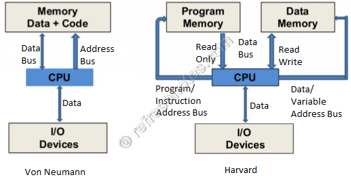

## QUESTIONS AND PROBLEMS

??? "**1.1.** Explain the functions of a computer control unit."

    ## **Enhanced Question (20 Marks)**

    **“Describe in detail the architecture and functions of the Control Unit (CU) of a computer system. Explain how it coordinates the execution of instructions, including the fetch-decode-execute cycle, and discuss different types of control units.”**

    ## **Answer**

    ### **1. Introduction to Control Unit (CU)**

    The **Control Unit (CU)** is a fundamental component of the Central Processing Unit (CPU) responsible for directing and coordinating all operations within a computer system. It acts as the “brain within the brain,” ensuring that instructions are executed in the correct sequence and that all hardware components work harmoniously.

    ### **2. Core Functions of the Control Unit**

    #### **a. Instruction Fetching**

    * The CU retrieves instructions from the main memory (RAM).
    * It uses the **Program Counter (PC)** to determine the address of the next instruction.
    * The instruction is loaded into the **Instruction Register (IR)**.

    #### **b. Instruction Decoding**

    * The CU interprets the fetched instruction.
    * It determines:

    * What operation is required (e.g., ADD, MOVE, JUMP)
    * Which operands are involved
    * This step translates machine instructions into control signals.

    #### **c. Instruction Execution Control**

    * The CU directs the **Arithmetic Logic Unit (ALU)**, registers, and memory to perform the required operation.
    * It ensures proper sequencing and timing of operations.

    #### **d. Generation of Control Signals**

    * Sends signals to different parts of the computer:

    * Memory (read/write)
    * ALU (operation selection)
    * Input/Output devices
    * These signals coordinate data movement and processing.

    #### **e. Coordination of System Components**

    * Ensures synchronization between:

    * CPU components (ALU, registers)
    * Memory
    * I/O devices
    * Maintains proper data flow through buses.

    #### **f. Handling Interrupts**

    * Detects and responds to interrupt signals from I/O devices.
    * Temporarily halts current execution and services the interrupt.
    * Resumes normal execution afterward.

    ### **3. Fetch–Decode–Execute Cycle**

    The Control Unit plays a central role in the **instruction cycle**:

    1. **Fetch**

    * Retrieve instruction from memory using the PC.

    2. **Decode**

    * Interpret the instruction and identify required actions.

    3. **Execute**

    * Perform the operation via ALU, memory, or I/O.

    4. **Store (if needed)**

    * Save the result back to registers or memory.

    This cycle repeats continuously, enabling program execution.

    ### **4. Types of Control Units**

    #### **a. Hardwired Control Unit**

    * Uses fixed hardware circuits (logic gates, flip-flops).
    * **Advantages:**

    * Faster execution
    * Efficient for simple instruction sets
    * **Disadvantages:**

    * Difficult to modify or extend

    #### **b. Microprogrammed Control Unit**

    * Uses microinstructions stored in control memory.
    * **Advantages:**

    * Flexible and easier to update
    * Suitable for complex instruction sets
    * **Disadvantages:**

    * Slower than hardwired CU

    ### **5. Role in Modern Computer Systems**

    * In modern CPUs, the CU works with:

    * **Pipelining** (overlapping instruction stages)
    * **Parallel processing**
    * **Branch prediction**
    * Enhances performance and efficiency.

    ### **6. Conclusion**

    The Control Unit is essential for the proper functioning of a computer system. By managing instruction execution, generating control signals, and coordinating all components, it ensures that programs run efficiently and accurately. Its design—whether hardwired or microprogrammed—directly impacts system performance and flexibility.

??? "**1.2.** In the processors such as Texas Instrument’s TMS 320XX (Digital signal processor series), there is a separate memory for code (program) and a separate memory to hold data. This type of architecture is known as the “Harvard architecture.” Compare this with the Von Neumann architecture or stored-program architecture discussed in this chapter."

    
    ## Enhanced Question
    > **"Critically analyze the fundamental differences between Von Neumann and Harvard architectures. Discuss how these differences impact instruction throughput, with specific reference to the 'Von Neumann Bottleneck.' Furthermore, explain why Harvard architecture is the preferred choice for high-performance systems like the Texas Instruments TMS 320XX DSP series."**

    ---

    ## Comprehensive Answer

    ### 1. Fundamental Conceptual Differences
    The core distinction lies in how the CPU accesses its two primary resources: **Instructions (Code)** and **Data**.

    *   **Von Neumann Architecture:** Utilizes a **unified memory space** and a single physical bus for both instructions and data. This means the CPU cannot fetch an instruction and perform a data read/write simultaneously.
    *   **Harvard Architecture:** Utilizes **physically separate memory pathways** (address and data buses) for instructions and data. This allows for concurrent access to both.

    

    ### 2. Comparative Analysis

    | Feature | Von Neumann Architecture | Harvard Architecture |
    | :--- | :--- | :--- |
    | **Bus Structure** | Single shared bus for data/instructions. | Separate buses for data/instructions. |
    | **Complexity** | Simpler hardware design; easier to manufacture. | Complex hardware due to dual bus sets. |
    | **Space Efficiency** | Efficient; free memory can be used for either code or data. | Can be wasteful if one memory is full and the other is empty. |
    | **Speed/Throughput** | Slower (Serial processing). | Faster (Parallel processing). |
    | **Typical Use** | General-purpose PCs, workstations. | DSPs, Microcontrollers (ARM, AVR). |

    ---

    ### 3. The Von Neumann Bottleneck
    In a university-level response, you must mention the **Von Neumann Bottleneck**. Since the CPU is significantly faster than memory, and both data and instructions must share the same "narrow" pipe (the single bus), the CPU spends a significant amount of time idle, waiting for memory transfers to complete. 

    $Throughput \propto \frac{1}{Bus\_Latency}$

    In Von Neumann systems, the latency is doubled because the fetch stage and the execute stage (if it involves data) cannot happen at the same time.

    ---

    ### 4. Why Harvard for DSPs (TMS 320XX)?
    Digital Signal Processors (DSPs) like the **TMS 320XX** series are designed for real-time mathematical operations (like Fast Fourier Transforms or filtering).

    *   **Instruction Pipelining:** Harvard architecture allows for efficient **pipelining**. While the CPU is executing a mathematical instruction that requires data from memory, it can simultaneously fetch the *next* instruction.
    *   **Deterministic Performance:** Real-time systems require predictable timing. Because Harvard avoids bus contention, execution times are more consistent.
    *   **Simultaneous Access:** Many DSP operations require two operands at once. Modified Harvard architectures often have even more buses to fetch multiple data pieces while fetching the instruction, maximizing the multiplier-accumulator (MAC) units.

       ### **2. Harvard Architecture**

    The **Harvard architecture** uses **separate memory units and buses** for:

    * **Program (instruction) memory**
    * **Data memory**

    #### **Key Features:**

    * Separate address spaces for instructions and data
    * Simultaneous access to instructions and data
    * Independent buses for each memory

    #### **Example:**

    * Texas Instruments TMS320 DSP series (widely used in real-time signal processing)

    #### **Advantages:**

    * **Higher performance** due to parallel access
    * **No bus contention** between instruction fetch and data transfer
    * Ideal for **real-time systems** (e.g., DSP, audio/video processing)

    #### **Disadvantages:**

    * More **complex hardware design**
    * Higher **cost**
    * Less flexible memory usage (separate spaces)

    ---

    ### **3. Von Neumann Architecture**

    The **Von Neumann architecture** uses a **single memory** for both:

    * Instructions
    * Data

    #### **Key Features:**

    * Shared memory and bus
    * Single address space
    * Sequential instruction execution

    #### **Advantages:**

    * **Simpler design**
    * Lower cost
    * Flexible memory usage

    #### **Disadvantages:**

    * **Von Neumann bottleneck** (limited by single bus)
    * Cannot fetch instructions and data simultaneously
    * Slower compared to Harvard architecture

    ---

    ### **4. Key Differences (Comparison Table)**

    | Feature      | Harvard Architecture             | Von Neumann Architecture   |
    | ------------ | -------------------------------- | -------------------------- |
    | Memory       | Separate for data & instructions | Single shared memory       |
    | Buses        | Separate buses                   | Single bus                 |
    | Access       | Parallel (simultaneous)          | Sequential                 |
    | Speed        | Faster                           | Slower (due to bottleneck) |
    | Complexity   | Higher                           | Lower                      |
    | Cost         | More expensive                   | More economical            |
    | Flexibility  | Less flexible                    | More flexible              |
    | Applications | DSP, embedded systems            | General-purpose computing  |

    ---

    ### **5. Performance Perspective**

    * Harvard architecture eliminates the **instruction/data access conflict**, significantly improving throughput.
    * Von Neumann systems suffer from the **Von Neumann bottleneck**, where instruction fetch and data access compete for the same bus.

    ---

    ### **6. Modern Systems Insight**

    * Many modern processors use a **Modified Harvard Architecture**:

    * Separate caches (instruction & data)
    * Unified main memory
    * This combines:

    * Speed of Harvard
    * Flexibility of Von Neumann

    ---

    ### **7. Applications**

    * **Harvard Architecture:**

    * Digital Signal Processing (DSP)
    * Embedded systems
    * Real-time control systems

    * **Von Neumann Architecture:**

    * Personal computers
    * General-purpose systems

    ###  Conclusion
    While Von Neumann architecture offers the flexibility and simplicity required for general-purpose computing, the physical separation of memory in Harvard architecture is essential for high-throughput, real-time applications where the "bottleneck" of a shared bus would be unacceptable.

**1.3.** Explain the functions of the following dedicated CPU registers: a) PC, b) IR, c) SP, d) Flag register.

**1.4.** Using a minimum number of 0-address instructions, write a program that is equivalent to

**a)** $Z = A * B + C * D + E * F$

**b)** $Z = A * A + E * A + A * B + E * B$

**\*1.5.** Assume there are four different machines with the characteristics shown in the table.

---
*[Throughput]:Throughput শব্দের আক্ষরিক অর্থ হলো কোনো নির্দিষ্ট সময়ে কী পরিমাণ কাজ বা উৎপাদন সম্পন্ন হলো। বাংলায় একে সহজভাবে "উৎপাদন হার" বা "কার্যসম্পাদন ক্ষমতা" বলা যেতে পারে। কম্পিউটার বা নেটওয়ার্কিং: একটি নেটওয়ার্ক লিঙ্কের মাধ্যমে প্রতি সেকেন্ডে প্রকৃতপক্ষে কতটুকু ডেটা (data) সফলভাবে এক স্থান থেকে অন্য স্থানে পৌঁছালো, তাকে থ্রুপুট বলা হয়।

---
*[Throughput]: Throughput শব্দের আক্ষরিক অর্থ হলো কোনো নির্দিষ্ট সময়ে কী পরিমাণ কাজ বা উৎপাদন সম্পন্ন হলো। বাংলায় একে সহজভাবে "উৎপাদন হার" বা "কার্যসম্পাদন ক্ষমতা" বলা যেতে পারে। কম্পিউটার বা নেটওয়ার্কিং: একটি নেটওয়ার্ক লিঙ্কের মাধ্যমে প্রতি সেকেন্ডে প্রকৃতপক্ষে কতটুকু ডেটা (data) সফলভাবে এক স্থান থেকে অন্য স্থানে পৌঁছালো, তাকে থ্রুপুট বলা হয়।