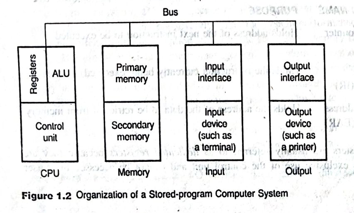
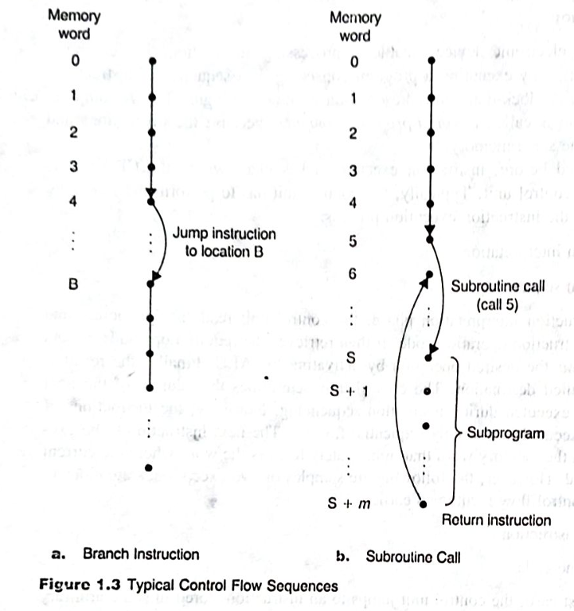

=== "Bangla"

    ## 💻 কম্পিউটার আসলে কী? (The Basics)

    ## 🧠 কন্ট্রোল ইউনিট (The Manager)

    সবকিছুর মূল চালিকাশক্তি হলো **Control Unit (CU)**। এটি CPU-এর ভেতরে থাকে এবং পুরো কাজটিকে দুটি প্রধান ভাগে ভাগ করে:

    1.  **Instruction Interpretation (ব্যাখ্যাকরণ):** প্রথমে কন্ট্রোল ইউনিট মেমোরি থেকে একটি ইনস্ট্রাকশন পড়ে এবং বোঝার চেষ্টা করে যে এটি আসলে কী করতে বলা হয়েছে (যেমন: যোগ নাকি বিয়োগ)। এরপর সে প্রয়োজনীয় ডেটা সংগ্রহ করে **ALU** (Arithmetic Logic Unit)-কে কাজ শুরু করার সিগন্যাল দেয়।
    2.  **Instruction Sequencing (ক্রম নির্ধারণ):** সাধারণত কম্পিউটার একটার পর একটা ইনস্ট্রাকশন সিরিয়ালি পালন করে। কন্ট্রোল ইউনিট ঠিক করে দেয় পরবর্তী কোন কাজটি করতে হবে।


    ## 🔄 ব্যতিক্রমী পরিস্থিতি (Exceptions to the Rule)

    সবসময় যে কম্পিউটার সোজা পথে চলে তা নয়। মাঝে মাঝে তাকে লাইন থেকে বিচ্যুত হতে হয়। আপনার ছবিতে দুটি প্রধান পরিস্থিতির কথা বলা হয়েছে:

    *   **Branch Instruction (ব্রাঞ্চিং):** যখন কম্পিউটারকে বলা হয় সোজা না গিয়ে অন্য কোনো অ্যাড্রেসে (ধরা যাক Address B) লাফ দিয়ে চলে যেতে।
    *   **Subroutine Calls (সাবরুটিন):** যখন মূল প্রোগ্রাম থামিয়ে ছোট একটি উপ-প্রোগ্রাম (Subprogram) চালানো হয় এবং কাজ শেষে আবার আগের জায়গায় ফিরে আসা হয়।

    ## 📊 Quick Sneak Peak: How Data Moves

    Here is a look at the values before and after a typical instruction execution based on **image_4a6205.jpg**.

    | Component | Initial Value (Start) | Provided Value (Context Based) |
    | :--- | :--- | :--- |
    | **Control Unit** | Waiting / Idle | Interpreting Opcode |
    | **Instruction Flow** | Sequential (1, 2, 3...) | Branching to Address B |
    | **ALU** | No active operation | Performing Desired Operation |
    | **Destination** | Undefined | Specified Destination Address |


    ## 🗺️ Visualizing the System Organization

    This flowchart visualizes the "Organization of a Stored-program Computer System" shown in **Figure 1.2** of your image **image_4a6205.jpg**.

    ```mermaid
    graph TD
        subgraph CPU
        A[Control Unit] --- B[ALU]
        B --- C[Registers]
        end
        
        subgraph Memory
        D[Primary Memory] --- E[Secondary Memory]
        end
        
        subgraph Input_Output
        F[Input Interface] --- G[Input Device/Terminal]
        H[Output Interface] --- I[Output Device/Printer]
        end
        
        Bus[=== THE SYSTEM BUS ===]
        
        CPU --- Bus
        Memory --- Bus
        Input_Output --- Bus
    ```

    

    ## ⚠️ Important Warnings for Beginners

    *   **⚠️ Sequential Warning:** সাধারণত কম্পিউটার সিরিয়ালি কাজ করলেও **Branching** বা **Subroutine** এর সময় এটি লাফ দিয়ে অন্য জায়গায় চলে যেতে পারে।
    *   **❌ Memory Confusion:** মনে রাখবেন, ইনস্ট্রাকশন এবং ডেটা উভয়ই কিন্তু একই মেমোরিতে থাকে, যে কারণে একে "Stored-program" কম্পিউটার বলে।
    *   **⚠️ The Role of Bus:** আপনার ছবির **Figure 1.2** এ যে 'Bus' দেখা যাচ্ছে, সেটি মূলত একটি হাইওয়ে যা CPU, Memory এবং I/O ডিভাইসের মধ্যে ডেটা আদান-প্রদান করে।


    #### ১. ডেডিকেটেড রেজিস্টারসমূহ (Dedicated Registers)
    CPU-এর কন্ট্রোল ইউনিট তার কাজগুলো সম্পন্ন করার জন্য তিনটি প্রধান রেজিস্টার ব্যবহার করে:
    *   **Program Counter (PC):** এটি পরবর্তী যে ইনস্ট্রাকশনটি চালানো হবে, তার মেমোরি অ্যাড্রেস ধরে রাখে।
    *   **Instruction Register (IR):** বর্তমানে যে ইনস্ট্রাকশনটি প্রসেস করা হচ্ছে, সেটি এখানে থাকে।
    *   **Effective Address Register (EAR):** মেমোরি থেকে যে ডেটা বা তথ্য আনতে হবে, তার সঠিক ঠিকানা এটি মনে রাখে।

    > ⚠️ **সতর্কতা:** এই রেজিস্টারগুলো কেবল কন্ট্রোল ইউনিটের জন্য সংরক্ষিত। একজন ইউজার বা সাধারণ প্রোগ্রামার সরাসরি এগুলো এক্সেস করতে পারে না।

    #### ২. কন্ট্রোল ফ্লো (Control Flow Sequences)
    কম্পিউটার সাধারণত মেমোরি থেকে সিরিয়ালি কাজ করে, কিন্তু **image_496a64.jpg** এর **Figure 1.3** এ দুটি ব্যতিক্রম দেখানো হয়েছে:
    *   **Branch Instruction (Figure 1.3a):** যখন মেমোরি লোকেশন ৪ থেকে সরাসরি লোকেশন B-তে লাফ দেওয়া হয়।
    *   **Subroutine Call (Figure 1.3b):** যখন মূল প্রোগ্রাম থামিয়ে অন্য একটি ছোট প্রোগ্রাম (Subprogram) চালানো হয় এবং কাজ শেষে 'Return' ইনস্ট্রাকশনের মাধ্যমে আবার আগের জায়গায় ফিরে আসা হয়।


    ### 🧠 মেমোরি ইউনিট (Memory Unit Overview)

    কম্পিউটারের সব প্রোগ্রাম এবং ডেটা মেমোরিতে জমা থাকে। এই মেমোরিকে মূলত দুটি ভাগে ভাগ করা যায়:

    *   **Primary Memory:** এটি সলিড-স্টেট প্রযুক্তিতে তৈরি এবং একে 'Executable Memory' বলা হয় কারণ CPU সরাসরি এখান থেকে কাজ করতে পারে।
    *   **Secondary Memory:** এটি মূলত ম্যাগনেটিক ডিস্ক বা টেপ জাতীয় ইলেকট্রোমেকানিক্যাল ডিভাইস।

    #### 📊 Quick Sneak Peak: Primary vs Secondary

    | Feature | Primary Memory | Secondary Memory |
    | :--- | :--- | :--- |
    | **Technology** | Solid-state | Electromechanical (Disks/Tapes) |
    | **Speed** | Very Fast (Matches CPU) | Slow |
    | **Cost** | High | Low |
    | **CPU Access** | Directly executable | Indirect (Needs swapping) |

    ### 💾 প্রাইমারি মেমোরি: RWM বনাম ROM

    প্রাইমারি মেমোরি আবার দুই ধরণের হয়:

    1.  **Read-Write Memory (RWM):** এখানে আপনি ডেটা পড়তেও পারবেন এবং নতুন কিছু লিখতেও পারবেন।
    2.  **Read-Only Memory (ROM):** এখান থেকে শুধু ডেটা পড়া যায়। কেন আমরা ROM ব্যবহার করি?
        *   **💰 Low Price:** বর্তমানে সস্তায় ROM তৈরি করা যায়।
        *   **🔒 Permanent Info:** কিছু তথ্য যেমন মনিটর প্রোগ্রাম বা ম্যাথমেটিক্যাল টেবিল কখনোই বদলানোর প্রয়োজন হয় না।

    > ⚠️ **Warning:** RWM এবং ROM উভয়কেই 'Random-Access' ডিভাইস বলা হয় কারণ মেমোরির যেকোনো জায়গা থেকে ডেটা আনতে একই সময় লাগে।

    আসলে আপনি এতক্ষণ যে Read-Write Memory (RWM) সম্পর্কে জানছিলেন, সেটিই হলো RAM (Random Access Memory)।

    সহজ কথায়, RAM হলো কম্পিউটারের "এক্টিভ কাজের টেবিল"। আপনার বইয়ের পাতা (image_4904cb.jpg) অনুযায়ী, এটি এমন এক ধরণের প্রাইমারি মেমোরি যেখানে তথ্য পড়া এবং লেখা—উভয়ই করা যায়।
    
    কেন একে RAM বলে? কারণ মেমোরির যেকোনো জায়গা (Address) থেকে তথ্য সংগ্রহ করতে একদম সমান সময় লাগে, যাকে বইয়ে 'Random-access' বলা হয়েছে।

    ভোল্টাইল মেমোরি: RAM-এর সবচেয়ে বড় বৈশিষ্ট্য হলো এটি অস্থায়ী। বিদ্যুৎ চলে গেলে এর সব তথ্য মুছে যায়। তাই একে সংরক্ষিত বা স্থায়ী তথ্যের জন্য ব্যবহার করা হয় না।

    কাজের ধরণ: আপনি যখন কোনো অ্যাপ বা গেম ওপেন করেন, সেটি সেকেন্ডারি মেমোরি (যেমন: SSD বা Hard Disk) থেকে লাফ দিয়ে RAM-এ চলে আসে যাতে CPU দ্রুত সেটি এক্সেস করতে পারে।

    আপনার শেয়ার করা **image_4c7d03.jpg** ফাইলটিতে কম্পিউটারের যোগাযোগের রাস্তা অর্থাৎ **System Bus** এবং কম্পিউটারের গঠন বা **Structures** নিয়ে আলোচনা করা হয়েছে। চলুন একদম গোড়া থেকে এটি বুঝে নেওয়া যাক।
    ---
    #### ১. সিস্টেম বাস (The System Bus) 🚌
    কম্পিউটারের বিভিন্ন অংশ যে তারের মাধ্যমে একে অপরের সাথে কথা বলে, তাকেই **Bus** বলে। এটি তিন প্রকার:
    *   **Address Bus:** এটি কেবল একমুখী (Unidirectional)। প্রসেসর কোন মেমোরি বা ডিভাইসের সাথে কাজ করবে, তার ঠিকানা বা অ্যাড্রেস এটি দিয়ে পাঠায়। ৩২-বিটের বাস হলে এটি ৪ বিলিয়নের বেশি জায়গা খুঁজে পেতে পারে।
    *   **Data Bus:** এটি উভমুখী (Bidirectional)। প্রসেসর এবং মেমোরির মধ্যে তথ্য আদান-প্রদান করার রাস্তা এটি।
    *   **Control Bus:** এটি ট্রাফিক পুলিশের মতো। এটি নির্দেশ দেয় যে এখন ডেটা পড়া হবে নাকি লেখা হবে এবং সব ডিভাইসকে সিনক্রোনাইজ করে।

    #### ২. কম্পিউটার স্ট্রাকচার (Computer Structures) 🏗️
    কম্পিউটারগুলো কীভাবে ডেটা প্রসেস করে, তার ওপর ভিত্তি করে এদের তিন ভাগে ভাগ করা হয়েছে:
    *   **General Register Machines:** এখানে অনেকগুলো পকেট বা রেজিস্টার ($R_0$ থেকে $R_7$) থাকে ডেটা রাখার জন্য।
    *   **Accumulator Based Machines:** এখানে একটি প্রধান রেজিস্টার থাকে যা দিয়ে সব কাজ হয়।
    *   **Stack Machines:** এটি একটি থালার স্তূপের মতো কাজ করে।

    > ⚠️ **মনে রাখবেন:** **Flag Register (F)** খুব গুরুত্বপূর্ণ। এটি বলে দেয় কোনো যোগফল কি শূন্য হয়েছে (Z-flag) নাকি হাতে কিছু রয়ে গেছে (Carry flag)।

    .png>)

    আপনার দেওয়া ছবিটি একটি **সাধারণ রেজিস্টার প্রসেসরের (General Register Processor)** গঠন বা আর্কিটেকচার তুলে ধরছে। নিচে ডায়াগ্রামের প্রতিটি অংশের বিস্তারিত ব্যাখ্যা বাংলায় দেওয়া হলো:

    ### **চিত্র ১.৪: একটি সাধারণ রেজিস্টার প্রসেসরের গঠন (Organization of a Typical General Register Processor)**

    এই ডায়াগ্রামটি মূলত প্রসেসরের ভেতরের বিভিন্ন অংশ এবং তারা কীভাবে একে অপরের সাথে যুক্ত থাকে তা দেখায়।

    ---

    ### **১. জেনারেল রেজিস্টার (General Registers: R0 - R7)**
    *   এখানে মোট ৮টি সাধারণ রেজিস্টার রয়েছে (R0 থেকে R7)।
    *   **কাজ:** এগুলো ডেটা, মেমোরি অ্যাড্রেস অথবা কোনো গাণিতিক বা লজিক্যাল অপারেশনের ফলাফল সাময়িকভাবে জমা রাখার জন্য ব্যবহৃত হয়।

    ### **২. PC (Program Counter)**
    *   **কাজ:** প্রসেসর বর্তমানে যে নির্দেশটি (Instruction) পালন করছে, তার ঠিক পরের নির্দেশের মেমোরি অ্যাড্রেস বা ঠিকানা এই রেজিস্টারে জমা থাকে। এটি কম্পিউটারকে পরবর্তী কাজের দিকনির্দেশনা দেয়।

    ### **৩. EAR (Effective Address Register)**
    *   **কাজ:** মেমোরি থেকে যখন কোনো ডেটা নিতে বা পাঠাতে হয়, তখন সেই নির্দিষ্ট মেমোরি লোকেশনের অ্যাড্রেস এই রেজিস্টারে সংরক্ষিত থাকে।

    ### **৪. SP (Stack Pointer)**
    *   এটি একটি বিশেষ বা ডেডিকেটেড রেজিস্টার।
    *   **কাজ:** এটি মেমোরির একটি বিশেষ অংশ 'স্ট্যাক'-এর একদম উপরের এলিমেন্টের ঠিকানা বা অ্যাড্রেস ধরে রাখে।

    ### **৫. IR (Instruction Register) ও কন্ট্রোল ইউনিট (Control Unit)**
    *   **IR:** প্রসেসর বর্তমানে যে নির্দেশটি নিয়ে কাজ করছে, সেটি এখানে থাকে।
    *   **কন্ট্রোল ইউনিট:** এটি প্রসেসরের 'মস্তিষ্ক' হিসেবে কাজ করে। এটি IR থেকে নির্দেশ পড়ে এবং সেই অনুযায়ী ALU ও অন্যান্য অংশকে কাজ করার সিগন্যাল দেয়।

    ### **৬. ALU (Arithmetic Logic Unit)**
    *   **কাজ:** কম্পিউটারের যাবতীয় গাণিতিক কাজ (যেমন: যোগ, বিয়োগ, গুণ, ভাগ) এবং যৌক্তিক বা লজিক্যাল কাজ এই অংশে সম্পন্ন হয়। ডায়াগ্রামে দেখা যাচ্ছে, জেনারেল রেজিস্টার থেকে ডেটা সরাসরি ALU-তে প্রবাহিত হচ্ছে।

    ### **৭. F (Flag Register)**
    *   একে স্ট্যাটাস রেজিস্টার বা ফ্ল্যাগ রেজিস্টার বলা হয়।
    *   **কাজ:** এটি ALU-তে করা কোনো অপারেশনের ফলাফল বা অবস্থার তথ্য দেয়। যেমন: যদি কোনো হিসাবের ফলাফল শূন্য (Zero) হয়, তবে এর **Z-flag** ১ হয়ে যায়। এতে ক্যারি ফ্ল্যাগ (Carry flag)-ও থাকে।

    ### **৮. Memory and I/O Interface**
    *   **কাজ:** এই অংশের মাধ্যমে প্রসেসর কম্পিউটারের মূল মেমোরি (RAM) এবং বিভিন্ন ইনপুট/আউটপুট ডিভাইসের (যেমন- কিবোর্ড, ডিসপ্লে) সাথে যোগাযোগ করে।

    ### **৯. ডেটা ও অ্যাড্রেস পাথ (Arrows/Buses)**
    *   ডায়াগ্রামের তীর চিহ্নগুলো মূলত তথ্য চলাচলের পথ বা 'বাস' (Bus) নির্দেশ করে। এই পথগুলো দিয়েই ডেটা এবং অ্যাড্রেস বিভিন্ন রেজিস্টার ও মেমোরির মধ্যে আদান-প্রদান করা হয়।

    ---

    **সংক্ষেপে নির্দেশের ধরন (Instruction Types):**
    এই ধরনের প্রসেসর সাধারণত দুই ধরনের নির্দেশ সমর্থন করে:
    *   **Three-address instructions:** যেমন `ADD x, y, z` (এখানে x এবং y যোগ করে ফলাফল z-এ রাখা হয়)।
    *   **Two-address instructions:** যেমন `MOV x, y` (এখানে x-এর মান y-তে কপি করা হয়)।


    ---
    -tinified.png>)
    -tinified.png>)
=== "English"
    ###  English Version (Easy/Indian Style)

    #### 1. Important Registers to Remember
    The Control Unit uses these registers to finish any task properly:
    *   **Program Counter (PC):** This box holds the address of the **next** instruction which the computer will run.
    *   **Instruction Register (IR):** This box holds the instruction which is running **right now**.
    *   **Effective Address Register (EAR):** This box keeps the address of the data we need to get from the memory.

    #### 2. How Computer Changes its Path
    Normally, computer goes 1, 2, 3... in order. But in Figure 1.3, it shows two special cases:
    
    *   **Branching (Jump):** Look at picture 'a', the computer is at location 4, but suddenly it **jumps** to Location B. It skips the middle steps! 🔀
    *   **Subroutine (Call):** In picture 'b', at location 5, it calls a mini-program at location S. After finishing that work, it uses a **Return instruction** to come back to location 6. 🔄

    #### 📊 Quick Summary Table

    | Register Name | What it does? | Can you touch it? |
    | :--- | :--- | :--- |
    | **PC** | Holds NEXT address | ❌ No, it's dedicated! |
    | **IR** | Holds CURRENT work | ❌ No, only for Control Unit! |
    | **EAR** | Holds DATA address | ❌ No, it's private! |

    #### ⚠️ Warning Emoji Section
    *   **❌ X Emoji:** You cannot access these registers via your normal program because they are "Dedicated".
    *   **⚠️ Warning:** If the **Return instruction** is missing in a Subroutine, the computer will get lost and won't know how to come back to the main program!

    Boss, listen carefully. If we store everything in Solid-state memory, it will be very costly. That is why we use **Secondary Memory** like magnetic disks. It is a bit slow (turtle speed 🐢), but it can store huge files like your text editors or assemblers very cheaply.

    To keep the computer fast, we use **Memory-management algorithms**. These algorithms "swap" data between primary and secondary memory in small pieces. So the CPU always finds its required item in the fast Primary memory.

    #### 🛠️ Typical Data Values Example
    Based on the text, let's see how values are handled:

    | Component | Initial Value (Empty/Default) | Provided Value (In Context) |
    | :--- | :--- | :--- |
    | **RWM Word Size** | 0 bits | 8-bit words |
    | **ROM Content** | Empty | Unalterable info (e.g., Op-code table) |
    | **Secondary Memory** | Offline | Huge Data Files/Programs |

    ### ⌨️ I/O Devices & Interface

    ইউজার টার্মিনাল বা প্রিন্টার দিয়ে আমরা কম্পিউটারের সাথে কথা বলি। কিন্তু সমস্যা হলো CPU খুব ফাস্ট আর এই ডিভাইসগুলো স্লো। তাই এদের মধ্যে ভাব জমানোর জন্য **Interface Circuitry** প্রয়োজন হয়।

    ### 🗺️ Visualizing the Memory Evolution & Flow
    Since you asked for timelines, here is a logical flow based on the tech mentioned 

    ```mermaid
        graph TD
        subgraph "Year 1950s-1970s (Magnetic Era)"
        A[Magnetic Tapes/Disks] -->|Used as| B(Secondary Memory)
        end

        subgraph "Year 1980s-Present (Solid State Era)"
        C[IC Technology] -->|Creates| D(ROM & RWM)
        D -->|Organized as| E[8-bit Words]
        end

        B <-.->|Swapping via Algorithms| D
        D <--->|Direct Access| F[CPU]

        G[I/O Devices: Printer/Terminal] --- H{Interface Circuitry}
        H --- F
    ```

    ### 🚫 Final Check of Rules 
    *   **❌ X Emoji:** ROM-এর ভেতরে থাকা 'Monitor Programs' আপনি রাইট বা ডিলিট করতে পারবেন না।
    *   **⚠️ Warning:** CPU কখনোই সরাসরি সেকেন্ডারি মেমোরির সাথে কথা বলে না, সবসময় প্রাইমারি মেমোরি হয়ে কাজ করে।

    #### 1. Three Types of Busses (The Highway) 🛣️
    A Bus is just a set of wires to carry information.
    *   **Address Bus:** It is a "One-Way" street. CPU only sends address to Memory or I/O. If you have a 32-bit bus, you can find $2^{32}$ (4 billion!) locations. 
    *   **Data Bus:** It is a "Two-Way" street. Information goes from CPU to Memory and comes back also.
    *   **Control Bus:** It is like the "Traffic Signal". It tells everyone when to start or stop the I/O work.

    #### 2. Specialized Registers (The CPU's Pockets) 🗄️
    *   **General Registers ($R_0$ to $R_7$):** Think of these as 8 small temporary pockets to store numbers or logic results.
    *   **Stack Pointer (SP):** A special dedicated register that points to the top of the "Stack".
    *   **F Register (Flags):** This is the "Status Report" box. If the last math result was zero, it sets the **Z-flag** to 1.


    ---

    ### 📊 Quick Sneak Peak: Operation Logic Example
    Let's look at the `ADD x, y, z` instruction mentioned in **image_4c7d03.jpg**. This means: "Take value of x, add it to y, and store the result in z."

    | Register/Location | Initial Value (Before ADD) | Provided Value (After `ADD x, y, z`) |
    | :--- | :--- | :--- |
    | **Location x** | `10` | `10` (Stays same) |
    | **Location y** | `20` | `20` (Stays same) |
    | **Location z** | `0` | `30` (New sum) |
    | **Z-Flag (in F)** | `0` | `0` (Since sum is not zero) |

    ---

    ### 🗺️ Visualizing the Computer Hierarchy

    ```mermaid
    graph TD
        subgraph "System Bus Layer"
        A[Address Bus - Unidirectional] --> B[Memory/IO]
        C[Data Bus - Bidirectional] <--> B
        D[Control Bus - Signals] --> B
        end
        
        subgraph "CPU Organization Types"
        E[General Register]
        F[Accumulator]
        G[Stack Machine]
        end
        
        B --- E
    ```

    ### 🚫 Common Pitfalls for Beginners
    *   **❌ Unidirectional vs Bidirectional:** Never say Address bus is two-way. It is only one-way from the processor.
    *   **⚠️ The 32-bit Logic:** If the bus size increases, the CPU can handle more memory. That's why modern computers are 64-bit!
    *   **❌ Flags:** Don't forget the **F register**. It tells the CPU if there was a math error or a zero result.

