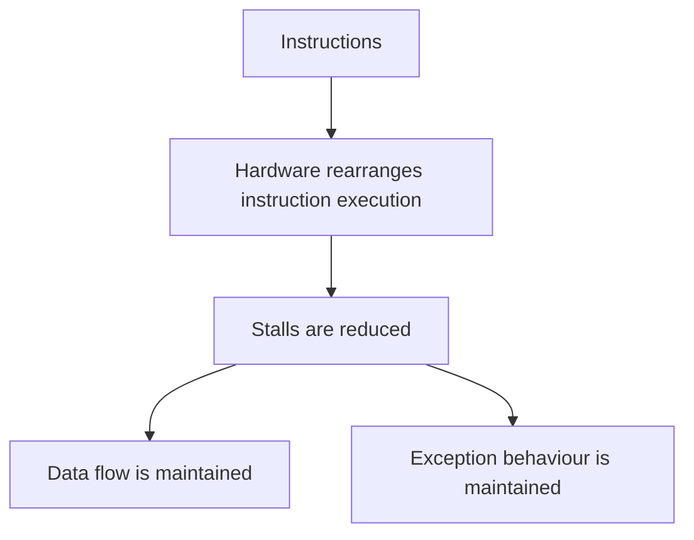
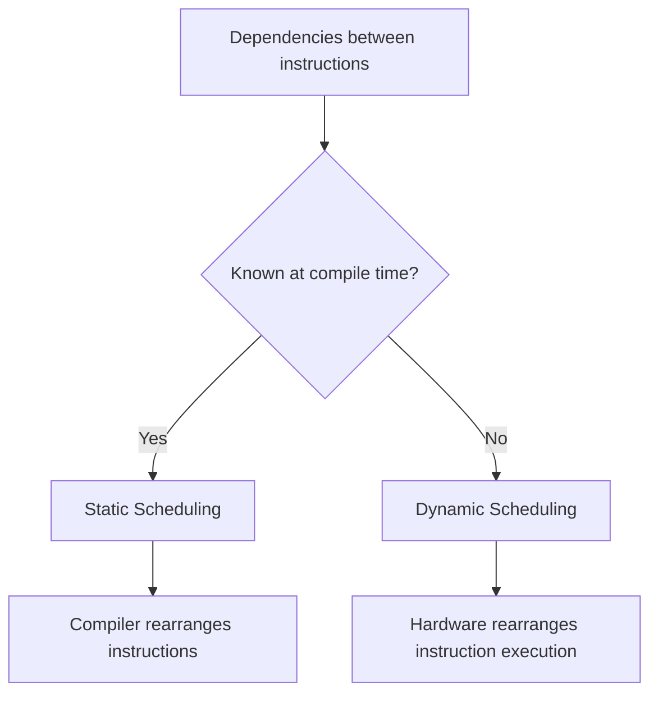
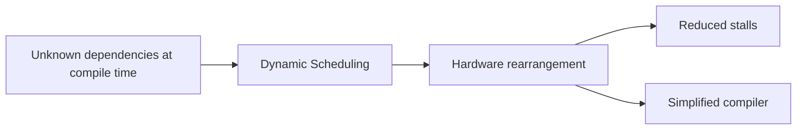
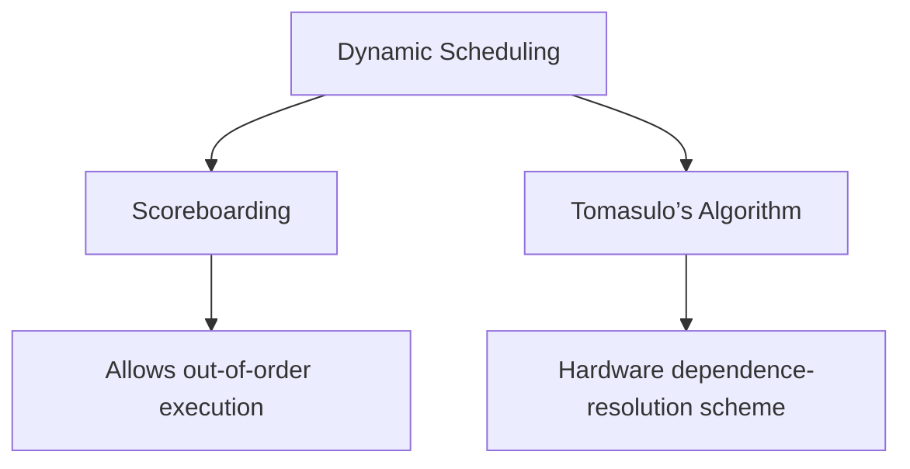
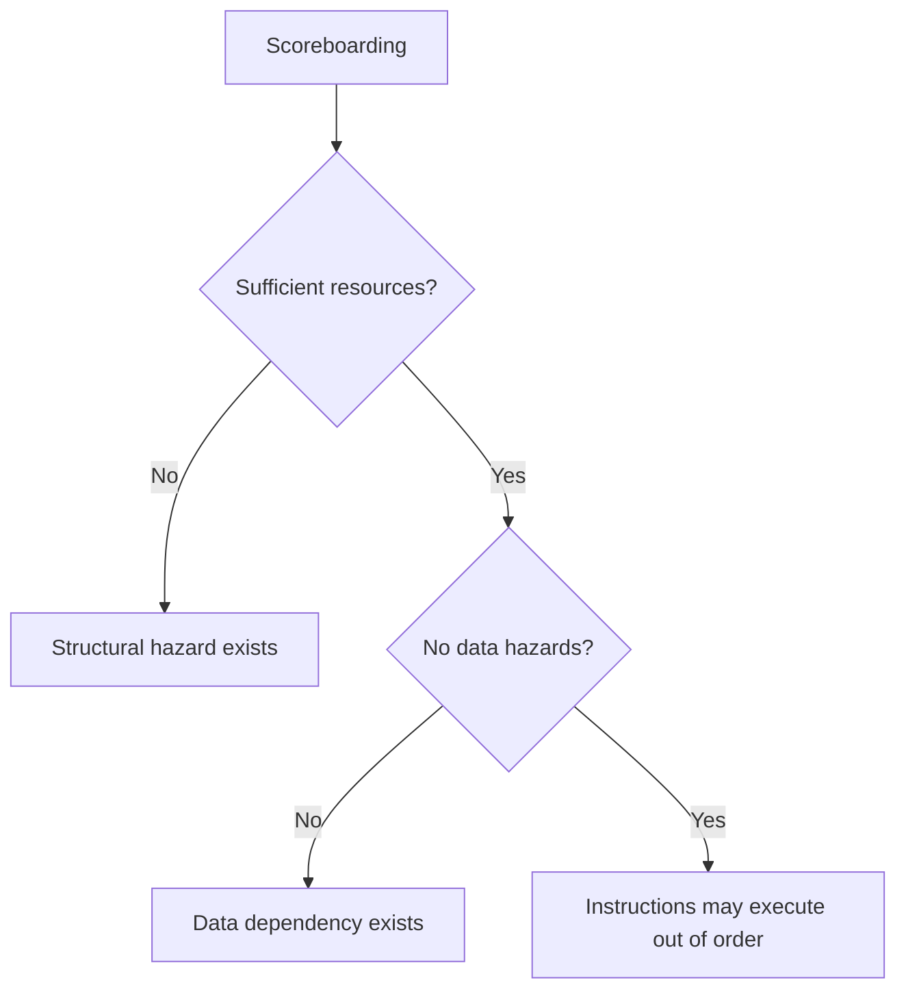

# Dynamic Scheduling

## Lesson Context

Scheduling is one of the techniques used to improve the performance of a pipeline processor. The earlier lesson introduced scheduling and static scheduling. This lesson continues with dynamic scheduling.

The techniques discussed for improving pipeline-processor performance are:

1. Instruction execution phases
2. Mechanisms for instruction pipelining
3. Dynamic instruction scheduling techniques

## What Is Dynamic Scheduling?

Dynamic scheduling is a **hardware-based approach**.

In dynamic scheduling, the hardware rearranges the execution of instructions to reduce stalls while maintaining the data flow and exception behaviour.

> **Dynamic Scheduling:** The hardware rearranges instruction execution to reduce stalls while maintaining data flow and exception behaviour.

## Static Scheduling and Dynamic Scheduling

Static scheduling and dynamic scheduling use different approaches.

| Static Scheduling | Dynamic Scheduling |
|---|---|
| Software-based approach | Hardware-based approach |
| Compiler-based | Hardware-based |
| The compiler schedules or rearranges the instructions | The hardware rearranges instruction execution |
| Used when dependencies are known at compile time | Used when dependencies are not known at compile time |

In static scheduling, compiler techniques are used to schedule or rearrange instructions. The instruction is always scheduled by the compiler.

If dependencies between instructions are known at compile time, there is no need to use a hardware-based approach. The software itself modifies the instructions and minimizes the hazards.

If dependencies are not known at compile time, dynamic scheduling is used.

## Why Is Dynamic Scheduling Used?

Dynamic scheduling is used when the dependencies between instructions are not known at compile time.

The hardware itself rearranges instruction execution:

- To reduce stalls
- To maintain data flow
- To maintain exception behaviour

Dynamic scheduling also simplifies the compiler. This is why dynamic scheduling is preferred over static scheduling in this situation.

## Dynamic Scheduling Schemes

Dynamic scheduling can be implemented using two schemes:

1. **Scoreboarding**
2. **Tomasulo’s Algorithm**

## Scoreboarding

Scoreboarding is a technique that allows instructions to execute **out of order** when there are:

- No structural hazards
- No data dependencies

> **Scoreboarding:** A technique that allows instructions to execute out of order when there are no structural hazards and no data dependencies.

### No Structural Hazards

No structural hazards means that sufficient resources are available.

\[
\text{No Structural Hazards} \Rightarrow \text{Sufficient Resources}
\]

### No Data Dependencies

No data dependencies means that there are no data hazards.

\[
\text{No Data Dependencies} \Rightarrow \text{No Data Hazards}
\]

Therefore, scoreboarding permits out-of-order instruction execution when sufficient resources are available and no data hazards exist.

## Tomasulo’s Algorithm

Tomasulo’s Algorithm is a **hardware dependence-resolution scheme**.

> **Tomasulo’s Algorithm:** A hardware dependence-resolution scheme used for dynamic scheduling.

The detailed explanation and example of Tomasulo’s Algorithm are continued in the next lesson. Scoreboarding and its example are also explained separately.

## Complete Summary

- Dynamic scheduling is used to improve pipeline-processor performance.
- It is a hardware-based approach.
- Static scheduling is a software-based or compiler-based approach.
- Static scheduling is used when dependencies are known at compile time.
- Dynamic scheduling is used when dependencies are not known at compile time.
- In dynamic scheduling, hardware rearranges instruction execution.
- Hardware rearrangement reduces stalls.
- Data flow and exception behaviour are maintained.
- Dynamic scheduling simplifies the compiler.
- Dynamic scheduling can be implemented using Scoreboarding and Tomasulo’s Algorithm.
- Scoreboarding allows instructions to execute out of order when there are no structural hazards and no data dependencies.
- No structural hazards means sufficient resources are available.
- No data dependencies means there are no data hazards.
- Tomasulo’s Algorithm is a hardware dependence-resolution scheme.

